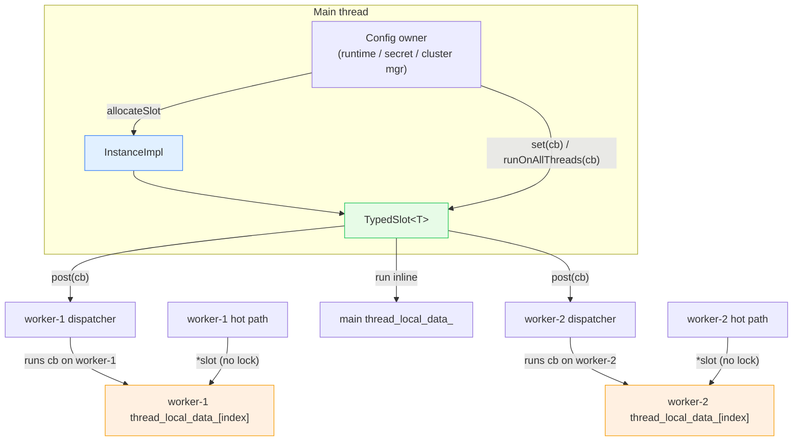

# `source/common/thread_local/` — the thread-local storage (TLS) slot system

This folder implements Envoy's **central concurrency primitive**: a way for the **main thread to publish data to
all worker threads** without locks on the hot path. It is the backbone of Envoy's "main thread writes, workers
read" design. Almost every other documented subsystem — runtime/feature-flags, secrets/SDS, RDS, stats, the
cluster manager — leans on this folder to fan configuration out to workers, but few explain the mechanism. This
does.

> ⚠️ **Disambiguation:** "TLS" in *this* folder means **Thread-Local Storage**, not Transport Layer Security.
> For TLS-the-crypto, see [`../tls/`](../tls/README.md).

> **TL;DR** — this folder owns:
> - `InstanceImpl` — the process-wide allocator/coordinator implementing `ThreadLocal::Instance`,
> - `SlotImpl` — one allocated **slot**: a typed cell that holds a (potentially different) object on every
>   thread,
> - the **post-based update model** — all writes are delivered to workers via their `Event::Dispatcher`, so
>   reads need no synchronization,
> - and the careful **lifetime/shutdown machinery** (`still_alive_guard_`, deferred slot removal, reverse-order
>   teardown) that makes lock-free TLS safe.

---

## The one paragraph mental model

You ask the `Instance` for a **slot** (`allocateSlot()`). A slot is like a numbered mailbox replicated on every
thread. When you call `slot->set(cb)` on the main thread, the framework `post()`s `cb` to every registered
worker's dispatcher; each worker runs `cb` *on itself* and stores the object it returns into its own copy of the
mailbox. Afterwards, any worker can read its own object with zero locking (`*slot` / `slot->get()`), because the
object is owned by that thread alone. Updates are also delivered by `post()` (`runOnAllThreads`), preserving the
"no shared mutable state on the data path" invariant.

---

## Folder map

```
source/common/thread_local/
├── BUILD
└── thread_local_impl.{h,cc}   # InstanceImpl + nested SlotImpl + ThreadLocalData
```

The **interfaces** live under `envoy/thread_local/`:

```
envoy/thread_local/
├── thread_local.h          # Slot, SlotAllocator, TypedSlot<T>, Instance
└── thread_local_object.h   # ThreadLocalObject (base type for all stored objects)
```

---

## Per-topic table

| Topic | Document | Source |
|---|---|---|
| Architecture, the post model, lifetime/shutdown | [`OVERVIEW.md`](OVERVIEW.md) | how & why it works |
| Class hierarchy (UML) | [`CLASS_HIERARCHY.md`](CLASS_HIERARCHY.md) | interfaces + `InstanceImpl`/`SlotImpl` |
| `InstanceImpl` / `SlotImpl` deep dive | [`thread_local_impl.md`](thread_local_impl.md) | `thread_local_impl.{h,cc}` |

---

## Big picture



---

## Why it exists

Envoy's data plane runs N worker threads, each with its own event loop. Configuration (routes, clusters,
secrets, runtime flags) changes at runtime but is read on every request. Taking a lock per request would kill
performance. The TLS slot system solves this by giving each worker its **own copy** (or its own `shared_ptr` to a
shared immutable copy) of the data, updated only via the worker's own event loop. Result: **reads are lock-free
and wait-free**; only the (rare) updates cost anything.

---

## The golden rules (read before using)

1. **Allocate, `set`, and `runOnAllThreads` only on the main thread.** Enforced by `ASSERT_IS_MAIN_OR_TEST_THREAD()`.
2. **Stored objects must derive from `ThreadLocalObject`.** Use `TypedSlot<T>` for type safety.
3. **Never capture the slot or its owner in an update/init callback.** The owner may be destroyed on the main
   thread before the callback runs on a worker. Capture by value the data you need, not `this`.
4. **Reads happen on the owning worker thread only.** `*slot` / `slot->get()` return that thread's object.

See [`OVERVIEW.md`](OVERVIEW.md#the-golden-rules-expanded) for the reasoning behind each.

---

## Reading order

1. This `README.md` — vocabulary and the big picture.
2. [`OVERVIEW.md`](OVERVIEW.md) — the post model, `still_alive_guard_`, shutdown ordering.
3. [`thread_local_impl.md`](thread_local_impl.md) — line-by-line of `InstanceImpl`/`SlotImpl`.
4. [`CLASS_HIERARCHY.md`](CLASS_HIERARCHY.md) — UML map.
