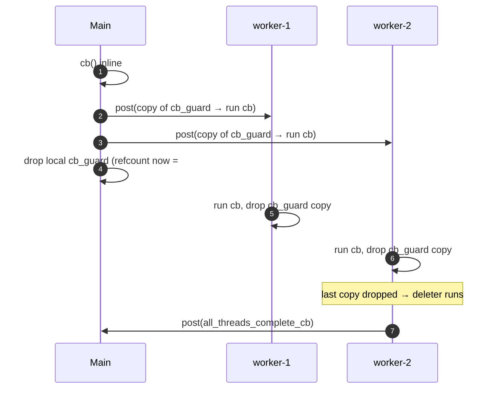

# Deep dive: `InstanceImpl` / `SlotImpl`

Line-by-line walk-through of `thread_local_impl.{h,cc}`. Read [`OVERVIEW.md`](OVERVIEW.md) first for the post
model and lifetime hazards.

---

## The per-thread storage

```cpp
struct ThreadLocalData {
  Event::Dispatcher* dispatcher_{};
  std::vector<ThreadLocalObjectSharedPtr> data_;
};
static thread_local InstanceImpl::ThreadLocalData InstanceImpl::thread_local_data_;
```

One instance **per OS thread** (the `thread_local` keyword). `data_` is indexed by slot number. `dispatcher_`
lets any code grab "the dispatcher for the thread I'm on" via `InstanceImpl::dispatcher()`.

Note it's a single process-wide `static` member shared (as a `thread_local`) across all `InstanceImpl`s — in
practice there is one `InstanceImpl` per process.

---

## Allocation & index recycling

```cpp
SlotPtr InstanceImpl::allocateSlot() {
  ASSERT_IS_MAIN_OR_TEST_THREAD();
  ASSERT(!shutdown_);

  if (free_slot_indexes_.empty()) {
    SlotPtr slot = std::make_unique<SlotImpl>(*this, uint32_t(slots_.size()));
    slots_.push_back(slot.get());
    return slot;
  }
  const uint32_t idx = free_slot_indexes_.back();
  free_slot_indexes_.pop_back();
  SlotPtr slot = std::make_unique<SlotImpl>(*this, idx);
  slots_[idx] = slot.get();
  return slot;
}
```

- No free indices → grow: new index is `slots_.size()`.
- Free index available → reuse the most recently freed one.
- `slots_` holds **raw** `Slot*` (non-owning); the `SlotPtr` (unique_ptr) is owned by the caller. When the caller
  drops it, `~SlotImpl` runs and the index is recycled.

---

## `SlotImpl` construction & the alive-guard

```cpp
InstanceImpl::SlotImpl::SlotImpl(InstanceImpl& parent, uint32_t index)
    : parent_(parent), index_(index),
      still_alive_guard_(std::make_shared<bool>(true)) {}
```

`still_alive_guard_` is the keystone of the lifetime model: a heap `bool` whose `shared_ptr` lives exactly as
long as the slot. Posted callbacks hold a `weak_ptr` to it.

---

## The two callback wrappers

### `wrapCallback` — guard a void callback

```cpp
std::function<void()> InstanceImpl::SlotImpl::wrapCallback(const std::function<void()>& cb) {
  return [still_alive_guard = std::weak_ptr<bool>(still_alive_guard_), cb] {
    if (!still_alive_guard.expired()) {
      cb();
    }
  };
}
```

If the slot was destroyed before this runs on the worker, the guard has expired and `cb` is skipped.

### `dataCallback` — guard + fetch this thread's object

```cpp
std::function<void()> InstanceImpl::SlotImpl::dataCallback(const UpdateCb& cb) {
  return [still_alive_guard = std::weak_ptr<bool>(still_alive_guard_),
          cb = std::move(cb), index = index_]() mutable {
    if (!still_alive_guard.expired()) {
      cb(getWorker(index));     // pass this thread's object at data_[index]
    }
  };
}
```

Note **`index` is captured by value**, not `this`. The comment in the source explains this duplicates
`wrapCallback`'s guard logic on purpose, to avoid a second lambda indirection on a hot-ish path.

---

## Reading a slot

```cpp
bool InstanceImpl::SlotImpl::currentThreadRegisteredWorker(uint32_t index) {
  return thread_local_data_.data_.size() > index;
}
ThreadLocalObjectSharedPtr InstanceImpl::SlotImpl::getWorker(uint32_t index) {
  ASSERT(currentThreadRegisteredWorker(index));
  return thread_local_data_.data_[index];
}
ThreadLocalObjectSharedPtr InstanceImpl::SlotImpl::get() { return getWorker(index_); }
```

Pure thread-local read: no locks, just an index into the current thread's vector. `currentThreadRegistered()`
guards against threads that never had this slot set (vector shorter than index).

---

## `set` — publish to all threads

```cpp
void InstanceImpl::SlotImpl::set(InitializeCb cb) {
  ASSERT_IS_MAIN_OR_TEST_THREAD();
  ASSERT(!parent_.shutdown_);

  for (Event::Dispatcher& dispatcher : parent_.registered_threads_) {
    dispatcher.post(wrapCallback(
        [index = index_, cb, &dispatcher]() -> void {
          setThreadLocal(index, cb(dispatcher));
        }));
  }
  setThreadLocal(index_, cb(*parent_.main_thread_dispatcher_));   // main thread inline
}
```

For each worker: post a guarded callback that runs the user's init `cb` *on that worker* and stores the result.
The main thread runs it inline. `setThreadLocal` grows the per-thread vector as needed:

```cpp
void InstanceImpl::setThreadLocal(uint32_t index, ThreadLocalObjectSharedPtr object) {
  if (thread_local_data_.data_.size() <= index) {
    thread_local_data_.data_.resize(index + 1);
  }
  thread_local_data_.data_[index] = object;
}
```

---

## `runOnAllThreads`

### Basic form

```cpp
void InstanceImpl::runOnAllThreads(std::function<void()> cb) {
  ASSERT_IS_MAIN_OR_TEST_THREAD();
  ASSERT(!shutdown_);
  for (Event::Dispatcher& dispatcher : registered_threads_) {
    dispatcher.post(cb);
  }
  cb();   // main thread
}
```

### `runOnAllThreads` with completion

The overload that fires a `complete_cb` after **all** workers have run uses a `shared_ptr` custom-deleter as a
distributed refcount:

```cpp
void InstanceImpl::runOnAllThreads(std::function<void()> cb,
                                   std::function<void()> all_threads_complete_cb) {
  ASSERT_IS_MAIN_OR_TEST_THREAD();
  cb();   // main thread first

  std::shared_ptr<std::function<void()>> cb_guard(
      new std::function<void()>(cb),
      [this, all_threads_complete_cb](std::function<void()>* cb) {
        main_thread_dispatcher_->post(all_threads_complete_cb);   // runs when last ref drops
        delete cb;
      });

  for (Event::Dispatcher& dispatcher : registered_threads_) {
    dispatcher.post([cb_guard]() -> void { (*cb_guard)(); });
  }
}
```

Each worker's posted lambda captures a copy of `cb_guard`. When the last worker finishes and drops its copy, the
custom deleter runs and posts `all_threads_complete_cb` back to the main thread. Elegant: no counter, no mutex —
the `shared_ptr` refcount *is* the "how many workers are left" counter.



---

## Slot teardown

```cpp
InstanceImpl::SlotImpl::~SlotImpl() {
  if (isShutdownImpl()) return;     // global shutdown will clean everything

  auto* main_thread_dispatcher = parent_.main_thread_dispatcher_;
  if (main_thread_dispatcher == nullptr || main_thread_dispatcher->isThreadSafe()) {
    parent_.removeSlot(index_);     // already on main thread (or pre-init): remove now
  } else {
    main_thread_dispatcher->post([i = index_, &tls = parent_] { tls.removeSlot(i); });
  }
}
```

```cpp
void InstanceImpl::removeSlot(uint32_t slot) {
  ASSERT_IS_MAIN_OR_TEST_THREAD();
  if (shutdown_) return;            // no removals during shutdown

  slots_[slot] = nullptr;
  free_slot_indexes_.push_back(slot);
  runOnAllThreads([slot]() -> void {
    if (slot < thread_local_data_.data_.size()) {
      thread_local_data_.data_[slot] = nullptr;   // free the object on each worker
    }
  });
}
```

Removal nulls the global `slots_[slot]`, recycles the index, and posts a per-thread null-out. Because everything
flows through `post()`, a recycled index can be safely reallocated immediately — new writes are sequenced after
this removal.

---

## Shutdown

```cpp
void InstanceImpl::shutdownGlobalThreading() {
  ASSERT_IS_MAIN_OR_TEST_THREAD();
  ASSERT(!shutdown_);
  shutdown_ = true;     // atomic flag; disables removeSlot posts and new allocations
}

void InstanceImpl::shutdownThread() {
  ASSERT(shutdown_);
  // reverse-order destruction (see OVERVIEW for the cluster-manager dependency rationale)
  for (auto it = thread_local_data_.data_.rbegin(); it != thread_local_data_.data_.rend(); ++it) {
    it->reset();
  }
  thread_local_data_.data_.clear();
}
```

`shutdownGlobalThreading()` is called once on the main thread before workers exit; `shutdownThread()` runs on
each thread as it exits, destroying objects high-index → low-index so dependents die before dependencies.

The destructor asserts the discipline was followed:

```cpp
InstanceImpl::~InstanceImpl() {
  ASSERT_IS_MAIN_OR_TEST_THREAD();
  ASSERT(shutdown_);
  thread_local_data_.data_.clear();
}
```

---

## `dispatcher()`

```cpp
Event::Dispatcher& InstanceImpl::dispatcher() {
  ASSERT(thread_local_data_.dispatcher_ != nullptr);
  return *thread_local_data_.dispatcher_;
}
```

"Give me the dispatcher for the thread I'm currently on." Set during `registerThread`.

---

## Worked example: how runtime uses a slot

```cpp
// (paraphrased from common/runtime) — main thread:
tls_->set([snapshot](Event::Dispatcher&) -> ThreadLocal::ThreadLocalObjectSharedPtr {
  return snapshot;          // SAME immutable snapshot shared to every worker
});

// worker hot path:
const Snapshot& snap = tls_->get()->snapshot();   // lock-free read of this thread's pointer
```

Runtime publishes one immutable `SnapshotImpl` to all threads; on reload it builds a new snapshot and calls
`set` again. Workers always read a consistent snapshot with no locking. See
[`../runtime/loader_and_snapshot.md`](../runtime/loader_and_snapshot.md).

---

## Gotchas

- **Capturing `this`/owner in `set`/`runOnAllThreads` callbacks is a use-after-free risk.** The owner may be
  destroyed on the main thread before the callback runs on a worker. Capture data by value.
- **`operator*` / `operator->` assume the slot is populated.** Use `get().has_value()` if a thread might not have
  had `set()` applied yet.
- **All mutation is main-thread-only.** Calling `set`/`allocateSlot` off the main thread trips
  `ASSERT_IS_MAIN_OR_TEST_THREAD()`.
- **Updates are asynchronous on workers.** Don't assume data is live on workers the instant `set()` returns; use
  the completion callback if ordering matters.
- **Reverse-order teardown is load-bearing.** If you change allocation order of long-lived singletons, be aware
  of the dependency implications called out in `shutdownThread()`.

---

## Cross-references

- [`OVERVIEW.md`](OVERVIEW.md) — design & hazards.
- [`CLASS_HIERARCHY.md`](CLASS_HIERARCHY.md) — UML.
- [`../runtime/loader_and_snapshot.md`](../runtime/loader_and_snapshot.md) — a canonical consumer.
