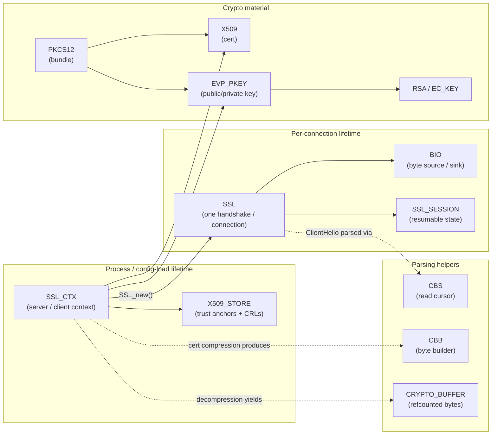
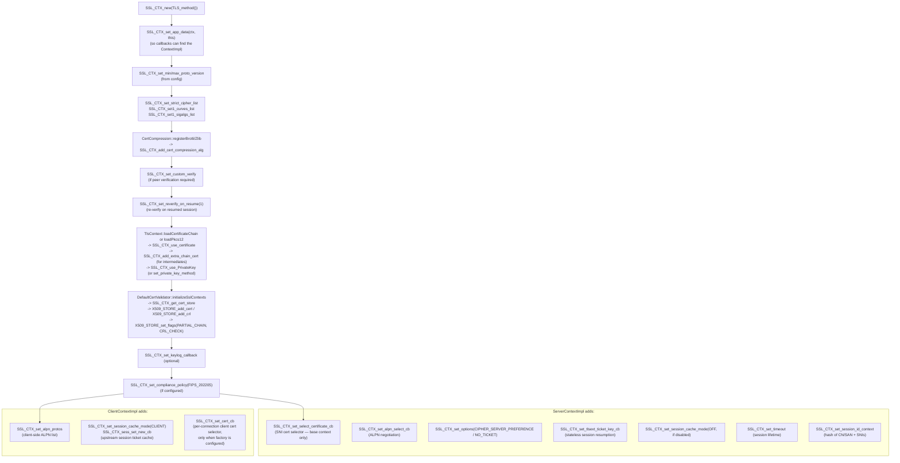
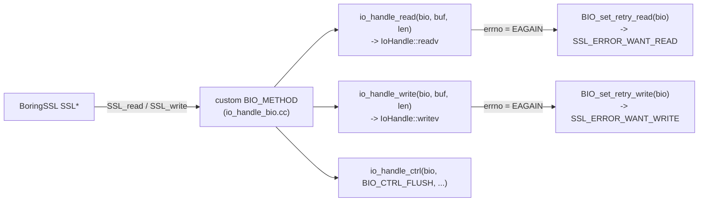
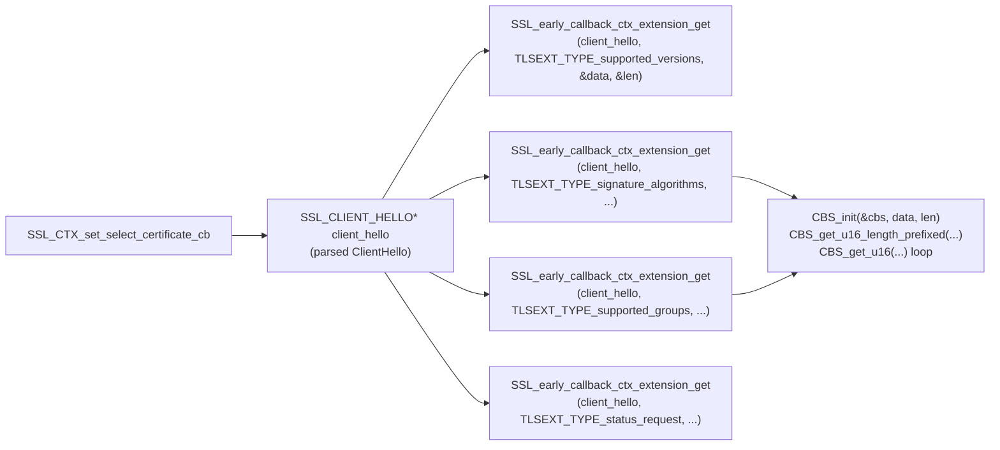
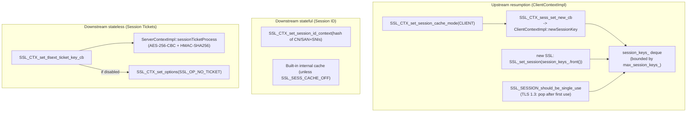
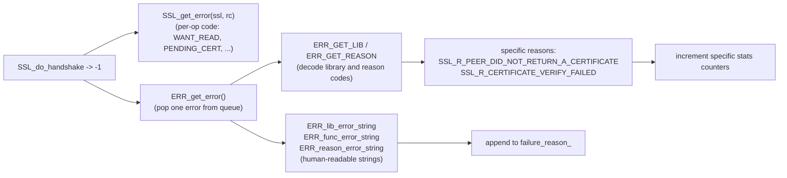
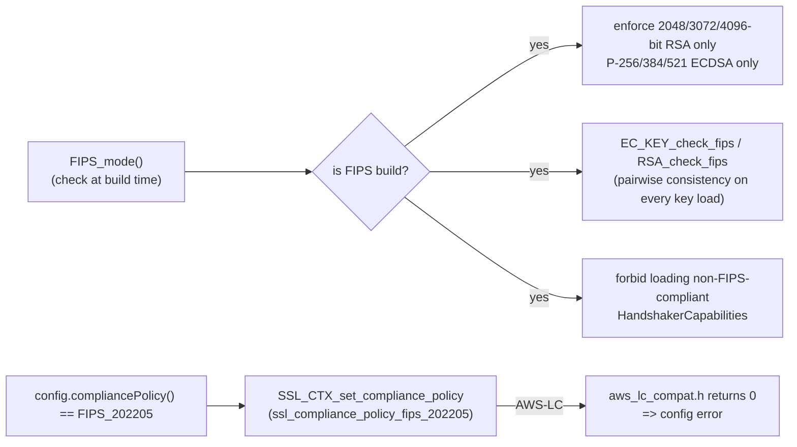

# BoringSSL — the library underneath `source/common/tls/`

Envoy's TLS code is a thin envelope around **BoringSSL** — Google's fork of OpenSSL that powers Chrome, Android, and a long list of Google services. AWS‑LC (Amazon's fork of BoringSSL) is supported as a drop‑in alternative on `ppc64le` via `aws_lc_compat.h`. Vanilla OpenSSL is **not** supported — `context_impl.h` enforces it at compile time:

```35:37:source/common/tls/context_impl.h
#if !defined OPENSSL_IS_BORINGSSL && !defined OPENSSL_IS_AWSLC
#error Envoy requires BoringSSL
#endif
```

This document is a reading guide for the **BoringSSL surface that Envoy actually uses**. It is not a BoringSSL tutorial — the upstream docs at <https://commondatastorage.googleapis.com/chromium-boringssl-docs/headers.html> are the source of truth for individual function semantics. What this file gives you is a map: which BoringSSL types and functions Envoy uses, where they are called, and **why**.

> Reading order: skim §1–§3 to understand the type system and the RAII wrapper, then jump to whichever §4 sub‑section maps to the file you're reading.

---

## Table of contents

1. [Why BoringSSL (and not OpenSSL)](#1-why-boringssl)
2. [The core types Envoy uses](#2-the-core-types-envoy-uses)
3. [Memory management — `bssl::UniquePtr<T>`](#3-memory-management--bsslunique_ptrt)
4. [Function surface by area](#4-function-surface-by-area)
   - 4.1 [Context lifecycle (`SSL_CTX_*`)](#41-context-lifecycle-ssl_ctx_)
   - 4.2 [Connection lifecycle (`SSL_*`)](#42-connection-lifecycle-ssl_)
   - 4.3 [I/O — `BIO` and `SSL_read` / `SSL_write`](#43-io--bio-and-ssl_read--ssl_write)
   - 4.4 [Certificate / key loading (PEM, PKCS12, EVP, X509)](#44-certificate--key-loading-pem-pkcs12-evp-x509)
   - 4.5 [The five Envoy callback hooks](#45-the-five-envoy-callback-hooks)
   - 4.6 [Inspecting the `ClientHello` — `CBS_*` and `SSL_early_callback_ctx_extension_get`](#46-inspecting-the-clienthello--cbs_-and-ssl_early_callback_ctx_extension_get)
   - 4.7 [Async escape codes — `SSL_ERROR_*`, `ssl_verify_*`, `ssl_select_cert_*`](#47-async-escape-codes)
   - 4.8 [Session resumption — `SSL_SESSION`, tickets, IDs](#48-session-resumption--ssl_session-tickets-ids)
   - 4.9 [OCSP stapling — `SSL_set_ocsp_response`](#49-ocsp-stapling--ssl_set_ocsp_response)
   - 4.10 [TLS cert compression — `SSL_CTX_add_cert_compression_alg`](#410-tls-cert-compression--ssl_ctx_add_cert_compression_alg)
   - 4.11 [Extension data — `SSL_get_ex_data` / `SSL_set_ex_data`](#411-extension-data--ssl_get_ex_data--ssl_set_ex_data)
   - 4.12 [Error reporting — `ERR_*` and `SSL_get_error`](#412-error-reporting--err_-and-ssl_get_error)
   - 4.13 [FIPS & compliance policy](#413-fips--compliance-policy)
   - 4.14 [Cipher / version / curve / sigalg introspection](#414-cipher--version--curve--sigalg-introspection)
5. [BoringSSL vs OpenSSL — what's different](#5-boringssl-vs-openssl--what-is-different)
6. [AWS‑LC compatibility](#6-awslc-compatibility)
7. [Where to look next](#7-where-to-look-next)

---

## 1. Why BoringSSL

BoringSSL was carved out of OpenSSL in 2014 with a different design philosophy: **no API/ABI stability**, much smaller surface, more aggressive removal of dead code, and a "what Google needs" feature set. Envoy adopted it because:

- **Async handshake support is first‑class.** BoringSSL exposes the `SSL_ERROR_PENDING_CERTIFICATE`, `SSL_ERROR_WANT_PRIVATE_KEY_OPERATION`, and `SSL_ERROR_WANT_CERTIFICATE_VERIFY` return codes that let Envoy pause `SSL_do_handshake` mid‑flight and resume it from a dispatcher callback. OpenSSL has no equivalent for cert *selection* or *verification*. Without these, the on‑demand cert selector, dynamic‑module validators, and HSM key providers would not exist.
- **`SSL_CTX_set_select_certificate_cb`** fires **before** the cert is chosen, with the parsed `SSL_CLIENT_HELLO` available for inspection — that's how the SNI selector works.
- **`SSL_CTX_set_private_key_method`** decouples the cert from the private key, enabling HSM / KMS providers.
- **`SSL_get_all_*`** introspection helpers (cipher names, curve names, sigalg names, version names) feed Envoy's tagged‑counter stats with no hard‑coded tables.
- **`SSL_CTX_add_cert_compression_alg`** (RFC 8879) lets Envoy register Brotli / Zlib cert‑compression callbacks.
- **API churn is fine for Envoy** because Envoy vendors BoringSSL at a known commit (`bazel/repository_locations.bzl`). The whole "BoringSSL has no stable API" thing is a non‑issue for a project that pins its dependency.

The downside is that **any code that wants to build against vanilla OpenSSL needs porting** — see `aws_lc_compat.h` for the kind of shims required even for AWS‑LC, which is itself a BoringSSL fork.

---

## 2. The core types Envoy uses

Everything BoringSSL exposes is built from a handful of opaque structs. Envoy uses these:



| BoringSSL type | What it is | Envoy file that owns it | Notes |
|---|---|---|---|
| `SSL_CTX` | Server- or client-wide TLS configuration (ciphers, curves, certs, callbacks). Heavy, expensive to build, shared across many connections. | `Ssl::TlsContext::ssl_ctx_` (in `context_impl.h`) | One per cert. Built on main thread, read concurrently by workers. |
| `SSL` | One handshake / one connection. Cheap, holds per-connection state. | `SslHandshakerImpl::ssl_` | Worker-thread-only. Created via `SSL_new(ctx)`. |
| `BIO` | Abstract byte source / sink. Plugs into `SSL` via `SSL_set_bio`. | `io_handle_bio.{h,cc}` defines a custom one | Envoy's `BIO` adapts to `Network::IoHandle` instead of raw fd. |
| `X509` | One DER-encoded cert as an in-memory struct. | `TlsContext::cert_chain_`, plus throwaway uses in `connection_info_impl_base.cc` | Refcounted (`X509_up_ref`). |
| `EVP_PKEY` | Opaque private/public key. Wraps `RSA` / `EC_KEY` / etc. | `TlsContext::loadPrivateKey` builds one, passes to `SSL_CTX_use_PrivateKey` | Released as soon as it's loaded into the context. |
| `SSL_SESSION` | Resumable session state (ticket or session ID). | `ClientContextImpl::session_keys_` (a `std::deque` of them) for upstream session reuse | Server side uses ticket key callback instead of holding sessions. |
| `X509_STORE` | The trust store — root CAs + CRLs. | Configured per `SSL_CTX` via `SSL_CTX_get_cert_store` + `X509_STORE_add_cert` / `X509_STORE_add_crl` | Only the default validator (`cert_validator/default_validator.cc`) touches this. |
| `PKCS12` | DER-encoded `cert + key` bundle. | `TlsContext::loadPkcs12` parses it via `d2i_PKCS12_bio` / `PKCS12_parse` | Used when config provides a `.p12` instead of separate PEM files. |
| `BIO` (over memory) | In‑memory byte buffer wrapped as a `BIO`. | `BIO_new_mem_buf(data, len)` used everywhere PEM is parsed | Lets `PEM_read_bio_*` consume from a `std::string`. |
| `CBS` / `CBB` | Read cursor / byte builder. BoringSSL's safer replacement for raw pointer arithmetic. | `server_context_impl.cc` (ClientHello parsing) and `cert_compression.cc` (compression output) | Bounds-checked. Returns `false` on overflow. |
| `CRYPTO_BUFFER` | Refcounted immutable byte blob. | Cert decompression output (`decompressBrotli` / `decompressZlib`) | Returned to BoringSSL which owns it after the callback returns. |
| `SSL_CLIENT_HELLO` | Parsed ClientHello passed to `SSL_CTX_set_select_certificate_cb`. | `ServerContextImpl::selectTlsContext`, `DefaultTlsCertificateSelector::selectTlsContext` | Gives access to SNI, cipher suites, extensions before any cert is chosen. |
| `SSL_CIPHER` | One cipher suite. | `ConnectionInfoImplBase::ciphersuiteId` / `ciphersuiteString`; `TlsContext::isCipherEnabled` | Inspected via `SSL_CIPHER_get_id` / `SSL_CIPHER_get_name` / `SSL_CIPHER_get_min_version` / `SSL_CIPHER_get_auth_nid`. |
| `SSL_PRIVATE_KEY_METHOD` | Vtable of `sign` / `decrypt` / `complete` callbacks for async key ops. | Provided by `Ssl::PrivateKeyMethodProvider` implementations (HSM, KMS) | Installed via `SSL_CTX_set_private_key_method`. |
| `GENERAL_NAMES` (X.509) | List of `GENERAL_NAME` (SAN entries). | `utility.cc::getSubjectAltNames`, `connection_info_impl_base.cc` SAN accessors | Parsed out of the `subjectAltName` extension via `X509_get_ext_d2i`. |

The trick to navigating this surface is recognizing that **`SSL_CTX` is the heavy thing** (lives for the life of the cluster config) and **`SSL` is the cheap thing** (one per connection). Almost every BoringSSL function name starts with one of those two prefixes, and the prefix tells you the lifetime.

---

## 3. Memory management — `bssl::UniquePtr<T>`

BoringSSL ships a C++ header (`<openssl/base.h>`) that defines `bssl::UniquePtr<T>` — a `std::unique_ptr` whose deleter calls the appropriate `T_free` function. Envoy uses it **everywhere** instead of raw `T*` + manual `T_free`:

```c++
bssl::UniquePtr<SSL_CTX>      ssl_ctx_;       // → SSL_CTX_free
bssl::UniquePtr<SSL>          ssl_;           // → SSL_free
bssl::UniquePtr<X509>         cert_chain_;    // → X509_free
bssl::UniquePtr<EVP_PKEY>     pkey;           // → EVP_PKEY_free
bssl::UniquePtr<BIO>          bio;            // → BIO_free
bssl::UniquePtr<PKCS12>       pkcs12;         // → PKCS12_free
bssl::UniquePtr<SSL_SESSION>  session;        // → SSL_SESSION_free
bssl::UniquePtr<GENERAL_NAMES> san_names;     // → GENERAL_NAMES_free
bssl::UniquePtr<CRYPTO_BUFFER> decompressed_data; // → CRYPTO_BUFFER_free
```

A few non‑obvious rules:

- **Ownership transfer to BoringSSL**: when you pass a cert via `SSL_CTX_add_extra_chain_cert(ctx, cert)`, BoringSSL takes ownership and the caller must `.release()` the `UniquePtr`. Look for `// SSL_CTX_add_extra_chain_cert() takes ownership.` followed by `cert.release();` in `context_impl.cc`.
- **Ownership transfer from BoringSSL**: `SSL_get_peer_certificate` returns a fresh ref — wrap it in `bssl::UniquePtr<X509>`. `SSL_get_certificate` (no `_peer_`) does **not** transfer ownership — do not wrap it.
- **Stack containers**: `STACK_OF(X509)` and friends are owned by whatever returned them. Use `sk_X509_num` / `sk_X509_value` to iterate, `sk_X509_pop` to take ownership of one element. Helpers like `Utility::mapX509Stack` exist in `utility.cc` for the common pattern.

Mixing raw and wrapped pointers is the easiest way to introduce a use‑after‑free in TLS code. The codebase is consistent about wrapping at the BoringSSL boundary — preserve that when you make changes.

---

## 4. Function surface by area

### 4.1 Context lifecycle (`SSL_CTX_*`)

`ContextImpl::ContextImpl` (in `context_impl.cc`) is the one place where almost every `SSL_CTX_*` call lives. The diagram below traces what it does for **each** cert in `tls_certificates`:



**Key calls and what they do** (canonical Envoy site in *italic*):

| Call | Purpose | *Envoy call site* |
|---|---|---|
| `SSL_CTX_new(TLS_method())` | Construct a context for a protocol-version-negotiating socket. Envoy uses `TLS_method` (vs `TLS_server_method` / `TLS_client_method`) and disambiguates via `SSL_set_connect_state` / `SSL_set_accept_state` later. | `context_impl.cc` |
| `SSL_CTX_set_app_data(ctx, this)` | Stash a `ContextImpl*` so static callbacks can recover it via `SSL_CTX_get_app_data`. | `context_impl.cc` |
| `SSL_CTX_set_min_proto_version` / `SSL_CTX_set_max_proto_version` | Clamp the TLS version range (e.g. TLS 1.2 ↔ TLS 1.3). | `context_impl.cc` |
| `SSL_CTX_set_strict_cipher_list` | Set the **TLS 1.2 and earlier** cipher list. `_strict_` means parse failures fail loudly instead of silently keeping the default list. | `context_impl.cc` |
| `SSL_CTX_set1_curves_list` | Set the supported ECDH curves (e.g. `X25519:P-256`). | `context_impl.cc` |
| `SSL_CTX_set1_sigalgs_list` | Set the allowed signature algorithms (e.g. `ecdsa_secp256r1_sha256`). | `context_impl.cc` |
| `SSL_CTX_set_alpn_protos` (client) / `SSL_CTX_set_alpn_select_cb` (server) | Advertise ALPN (client) / negotiate it (server). The server callback delegates to `SSL_select_next_proto`. | `client_context_impl.cc` / `server_context_impl.cc` |
| `SSL_CTX_use_certificate` + `SSL_CTX_add_extra_chain_cert` | Install the leaf cert and any intermediates. | `context_impl.cc` (`TlsContext::loadCertificateChain` / `loadPkcs12`) |
| `SSL_CTX_use_PrivateKey` | Install the private key (PEM path). | `context_impl.cc` |
| `SSL_CTX_set_private_key_method` | Install an **async** signer instead of an in‑memory key. | `context_impl.cc` (only if `private_key_method_provider` is set) |
| `SSL_CTX_set_custom_verify` | Replace BoringSSL's built‑in chain verification with Envoy's `customVerifyCallback`, which delegates to the configured `CertValidator` (and supports `ssl_verify_retry` for async). | `context_impl.cc` |
| `SSL_CTX_set_reverify_on_resume(ctx, 1)` | Re-run `custom_verify` even on session resumption (so a freshly revoked cert isn't grandfathered in). | `context_impl.cc` |
| `SSL_CTX_get_cert_store` | Get the inner `X509_STORE` to add trust anchors and CRLs. | `cert_validator/default_validator.cc` |
| `SSL_CTX_set_select_certificate_cb` | Install the **ClientHello pre-processing** callback that drives SNI-based cert selection. **Server only.** Installed on the base `tls_contexts_[0]`. | `server_context_impl.cc` |
| `SSL_CTX_set_cert_cb` | Per-connection cert callback. Used **client‑side** when a custom `TlsCertificateSelectorFactory` is configured. | `client_context_impl.cc` |
| `SSL_CTX_set_tlsext_ticket_key_cb` | Per-context **session ticket** encrypt/decrypt callback. Envoy implements ticket rotation here. | `server_context_impl.cc` |
| `SSL_CTX_sess_set_new_cb` | Called when BoringSSL has a fresh client-side session — used by `ClientContextImpl` to cache it for the next upstream connection. | `client_context_impl.cc` |
| `SSL_CTX_set_session_cache_mode` | `SSL_SESS_CACHE_CLIENT` (client) / `SSL_SESS_CACHE_OFF` (server, when disabled). | `client_context_impl.cc` / `server_context_impl.cc` |
| `SSL_CTX_set_session_id_context` | Set the session ID context (a hash of cert CN/SAN + SNIs). Prevents sessions from being resumed across unrelated filter chains. | `server_context_impl.cc` |
| `SSL_CTX_set_timeout` | Session lifetime in seconds. | `server_context_impl.cc` |
| `SSL_CTX_set_keylog_callback` | Per-context callback that receives NSS keylog lines for the `SSLKEYLOGFILE` debug feature. | `context_impl.cc` |
| `SSL_CTX_set_compliance_policy(ctx, ssl_compliance_policy_fips_202205)` | Enforces FIPS 202205 (must be applied last). | `context_impl.cc` |
| `SSL_CTX_set_options(ctx, SSL_OP_*)` | Per-context flag bag: `SSL_OP_CIPHER_SERVER_PREFERENCE`, `SSL_OP_NO_TICKET`. | `server_context_impl.cc` |
| `SSL_CTX_add_cert_compression_alg` | Register a Brotli or Zlib cert compression callback (RFC 8879). | `cert_compression.cc` |
| `SSL_CTX_get_app_data` / `SSL_CTX_get_verify_mode` / `SSL_CTX_get0_certificate` / `SSL_CTX_get_ciphers` | Read‑only accessors used inside callbacks and in QUIC. | `context_impl.cc`, `server_context_impl.cc` |

### 4.2 Connection lifecycle (`SSL_*`)

A `SSL` object is created per connection from the context:

```mermaid
sequenceDiagram
    autonumber
    participant CTX as ContextImpl
    participant SSL as bssl::UniquePtr&lt;SSL&gt;
    participant HS as SslHandshakerImpl
    participant BSSL as BoringSSL

    CTX->>SSL: SSL_new(tls_contexts_[0].ssl_ctx_.get())
    CTX->>SSL: SSL_set_app_data(transport_socket_options)
    HS->>SSL: SSL_set_ex_data(sslExtendedSocketInfoIndex, &extended_socket_info_)
    HS->>SSL: SSL_set_bio(io_handle_bio, io_handle_bio)
    HS->>SSL: SSL_set_ex_data(sslSocketIndex, callbacks)
    alt Client
      HS->>SSL: SSL_set_connect_state()
      HS->>SSL: SSL_set_tlsext_host_name(sni)
      HS->>SSL: SSL_set_alpn_protos(...) [optional override]
      HS->>SSL: SSL_set_renegotiate_mode(...) [if allowed]
      HS->>SSL: SSL_set_enforce_rsa_key_usage(bool)
      HS->>SSL: SSL_set_session(cached_session) [if present]
    else Server
      HS->>SSL: SSL_set_accept_state()
    end
    HS->>BSSL: SSL_do_handshake()
    loop until handshake complete
        BSSL->>HS: SSL_ERROR_WANT_READ / WANT_WRITE / PENDING_CERT / WANT_PRIVATE_KEY_OP / WANT_CERT_VERIFY
        HS-->>BSSL: SSL_do_handshake() [resumed from dispatcher]
    end
    BSSL-->>HS: rc == 1 (success)
    HS->>BSSL: SSL_session_reused / SSL_get_cipher / etc. (for stats)
```

| Call | Purpose | *Envoy site* |
|---|---|---|
| `SSL_new(ssl_ctx)` | Construct a per-connection state from a context. | `ContextImpl::newSsl` |
| `SSL_set_connect_state` / `SSL_set_accept_state` | Pick client vs server **after** construction (because both share `TLS_method`). | `ssl_socket.cc::initialize` |
| `SSL_set_bio(ssl, rbio, wbio)` | Plumb in I/O. Envoy passes the **same** `BIO` for read and write (the custom `IoHandleBio`). | `ssl_socket.cc::setTransportSocketCallbacks` |
| `SSL_set_tlsext_host_name(ssl, sni)` | Set the **client-side** SNI. | `client_context_impl.cc::newSsl` |
| `SSL_set_app_data` / `SSL_get_app_data` | One opaque slot per `SSL` for caller use. Envoy stores the `TransportSocketOptionsConstSharedPtr*`. | `client_context_impl.cc`, `context_impl.cc` |
| `SSL_set_ex_data(ssl, index, ptr)` / `SSL_get_ex_data` | The general-purpose extension slots (see §4.11). | `ssl_handshaker.cc`, `ssl_socket.cc` |
| `SSL_set_verify(ssl, mode, cb)` | Per-connection verify mode override — used when `verifySubjectAltNameListOverride` is set. | `client_context_impl.cc::newSsl` |
| `SSL_set_alpn_protos` | Per-connection ALPN list override (client). | `context_impl.cc::parseAndSetAlpn` |
| `SSL_set_renegotiate_mode(ssl, ssl_renegotiate_freely)` | Allow renegotiation. Off by default. | `client_context_impl.cc::newSsl` |
| `SSL_set_enforce_rsa_key_usage(ssl, bool)` | Toggle BoringSSL's strict check that RSA certs have `digitalSignature` in `keyUsage`. | `client_context_impl.cc::newSsl` |
| `SSL_set_session(ssl, sess)` | Attach a cached `SSL_SESSION` for resumption. | `client_context_impl.cc::newSsl` |
| `SSL_set_SSL_CTX(ssl, new_ctx)` | **Swap the context** that an `SSL` is associated with — used after SNI selection to switch to the chosen cert's `SSL_CTX`. | `ssl_handshaker.cc::onCertificateSelectionCompleted` |
| `SSL_set_ocsp_response(ssl, bytes, len)` | Attach a pre-fetched OCSP response for stapling. | `ssl_handshaker.cc::onCertificateSelectionCompleted` |
| `SSL_do_handshake(ssl)` | Drive the handshake state machine one step. Returns `1` on success or `-1` with `SSL_get_error` indicating what's needed next. | `ssl_handshaker.cc::doHandshake` |
| `SSL_read(ssl, buf, n)` / `SSL_write(ssl, buf, n)` | Bulk data. | `ssl_socket.cc::sslReadIntoSlice` / `doWrite` |
| `SSL_shutdown(ssl)` | Send `close_notify` for a graceful close. | `ssl_socket.cc::shutdownSsl` |
| `SSL_get_error(ssl, rc)` | Translate a non-success return into one of the `SSL_ERROR_*` codes. | `ssl_handshaker.cc`, `ssl_socket.cc` |

### 4.3 I/O — `BIO` and `SSL_read` / `SSL_write`

BoringSSL's I/O is abstracted through `BIO` (Basic I/O). Envoy implements a custom one in `io_handle_bio.{h,cc}` so that BoringSSL talks to `Network::IoHandle` instead of a raw file descriptor. That keeps things portable (Windows IOCP, user-space transports, in-memory test sockets) and means BoringSSL never holds an fd directly.



| Call | Purpose | *Envoy site* |
|---|---|---|
| `BIO_meth_new(BIO_TYPE_SOCKET, "io_handle")` | Allocate a new `BIO_METHOD` descriptor. | `io_handle_bio.cc::BIO_s_io_handle` |
| `BIO_meth_set_read` / `BIO_meth_set_write` / `BIO_meth_set_ctrl` | Wire up the per-method function pointers. | `io_handle_bio.cc` |
| `BIO_new(method)` | Allocate a `BIO*` of a given method. | `io_handle_bio.cc::BIO_new_io_handle` |
| `BIO_set_data(bio, ptr)` / `BIO_get_data(bio)` | Stash the `IoHandle*` so the read/write callbacks can find it. | `io_handle_bio.cc` |
| `BIO_set_init(bio, 1)` | Mark the `BIO` as initialised (otherwise BoringSSL won't use it). | `io_handle_bio.cc::BIO_new_io_handle` |
| `BIO_clear_retry_flags` / `BIO_set_retry_read` / `BIO_set_retry_write` | The retry flag handshake — BoringSSL sees the flag and translates it into `SSL_ERROR_WANT_READ/WRITE`. | `io_handle_bio.cc::io_handle_{read,write}` |
| `BIO_new_mem_buf(data, len)` | A throwaway in-memory `BIO` used to feed PEM bytes into `PEM_read_bio_*`. | `context_impl.cc`, `default_validator.cc` |
| `BIO_new(BIO_s_mem())` | A growable memory `BIO` — used to render `X509_NAME_print_ex` output into a string. | `utility.cc::getRFC2253NameFromCertificate` |
| `BIO_mem_contents(bio, &data, &len)` | Grab the bytes the memory `BIO` has accumulated. | `utility.cc`, `connection_info_impl_base.cc` |

The retry flag dance is the **most important** thing to understand here: when a non-blocking socket would block, the BIO returns `-1` *and* sets a retry flag. BoringSSL sees the flag and percolates `SSL_ERROR_WANT_READ` (or `WANT_WRITE`) back up to `SSL_do_handshake` / `SSL_read` / `SSL_write`, which `SslHandshakerImpl::doHandshake` and `SslSocket::doRead` then map to `PostIoAction::KeepOpen`. The libevent dispatcher will re-poll the fd and Envoy will retry.

### 4.4 Certificate / key loading (PEM, PKCS12, EVP, X509)

```mermaid
flowchart TB
    subgraph PEM["PEM path (loadCertificateChain / loadPrivateKey)"]
      P1["BIO_new_mem_buf(pem_data)"] --> P2["PEM_read_bio_X509_AUX<br/>(leaf cert)"]
      P2 --> P3["SSL_CTX_use_certificate(ctx, leaf)"]
      P3 --> P4["loop: PEM_read_bio_X509 -> SSL_CTX_add_extra_chain_cert"]
      P4 --> P5["PEM_read_bio_PrivateKey<br/>(produces EVP_PKEY)"]
      P5 --> P6["SSL_CTX_use_PrivateKey"]
    end

    subgraph P12["PKCS12 path (loadPkcs12)"]
      Q1["BIO_new_mem_buf"] --> Q2["d2i_PKCS12_bio<br/>(parse DER bundle)"]
      Q2 --> Q3["PKCS12_parse(p12, pwd, &pkey, &cert, &ca_stack)"]
      Q3 --> Q4["loop sk_X509_pop(ca_stack) -><br/>SSL_CTX_add_extra_chain_cert"]
      Q3 --> Q5["SSL_CTX_use_certificate(ctx, cert)"]
      Q3 --> Q6["SSL_CTX_use_PrivateKey(ctx, pkey)"]
    end

    subgraph FIPS["checkPrivateKey (FIPS mode)"]
      F1["EVP_PKEY_id(pkey)"] --> F2{type?}
      F2 -- "EC" --> F3["EVP_PKEY_get0_EC_KEY<br/>EC_KEY_check_fips"]
      F2 -- "RSA" --> F4["EVP_PKEY_get0_RSA<br/>RSA_check_fips"]
    end

    subgraph Inspect["Inspection (after load)"]
      I1["X509_get_pubkey -> EVP_PKEY_id"] --> I2{type?}
      I2 -- "EC" --> I3["EVP_PKEY_get0_EC_KEY<br/>EC_KEY_get0_group<br/>EC_GROUP_get_curve_name<br/>(must be P-256/384/521)"]
      I2 -- "RSA" --> I4["EVP_PKEY_get0_RSA<br/>RSA_bits >= 2048"]
    end
```



Files: `context_impl.cc` (the load + inspect path), `default_validator.cc` (CA + CRL load, similar shape using `PEM_X509_INFO_read_bio`).

| Function family | What it does in Envoy |
|---|---|
| `PEM_read_bio_X509_AUX` | Read the **first** cert (`_AUX` means accept the `TRUSTED CERTIFICATE` variant). |
| `PEM_read_bio_X509` | Read subsequent intermediate certs. |
| `PEM_read_bio_PrivateKey` | Parse the private key from PEM. |
| `PEM_X509_INFO_read_bio` | Parse a PEM blob containing **both** certs and CRLs (used by the validator for CA + CRL files). |
| `d2i_PKCS12_bio` + `PKCS12_parse` | Parse a `.p12` bundle into cert + key + CA stack. |
| `X509_get_pubkey` | Pull the `EVP_PKEY` out of a cert. |
| `X509_get_serialNumber`, `X509_get_subject_name`, `X509_get_issuer_name`, `X509_get_ext_d2i`, `X509_get_ext_count`, `X509_NAME_ENTRY_get_data`, `X509_NAME_print_ex`, `X509_digest`, `X509_up_ref`, `X509_NAME_get_index_by_NID` | Read-only accessors all over `utility.cc` / `connection_info_impl_base.cc`. |
| `EVP_PKEY_id` | Tag a key as `EVP_PKEY_RSA` / `EVP_PKEY_EC`. Used to reject unsupported algorithms (e.g. DSA, Ed25519 unless explicitly added). |
| `EVP_PKEY_get0_RSA` / `EVP_PKEY_get0_EC_KEY` | Cast to the underlying type. `_get0_` means "no ownership transfer". |
| `EC_KEY_get0_group` + `EC_GROUP_get_curve_name` | Read the curve OID (e.g. `NID_X9_62_prime256v1`). Used to gate ECDSA certs to P-256/384/521 only. |
| `RSA_bits` | Required for the `>= 2048` minimum. |
| `EC_KEY_check_fips` / `RSA_check_fips` | FIPS pairwise consistency tests (sign‑then‑verify with a known message). Mandatory in FIPS mode. |
| `EVP_sha256` / `EVP_sha1` / `EVP_DigestInit` / `EVP_DigestUpdate` / `EVP_DigestFinal` | Used by `generateHashForSessionContextId` to hash CN+SAN+SNI into a session ID context, and by `utility.cc` for cert fingerprints. |
| `EVP_aes_256_cbc` + `EVP_EncryptInit_ex` / `EVP_DecryptInit_ex` + `HMAC_Init_ex` | Encrypt/decrypt **session tickets** in `sessionTicketProcess`. |
| `RAND_bytes` | Generate the IV for session ticket encryption. |
| `PKCS12_free` | Implicit via `bssl::UniquePtr<PKCS12>`. |

### 4.5 The five Envoy callback hooks

Almost everything that makes Envoy's TLS code "non-trivial" boils down to five BoringSSL callbacks that Envoy installs on `SSL_CTX`:


Each callback follows the **same pattern**:

1. The callback is a `static` C function with a `void* arg` or `SSL*` parameter.
2. It recovers the owning Envoy object via `SSL_CTX_get_app_data` (for the context) or `SSL_get_ex_data` / `SSL_get_app_data` (for per-connection state).
3. It does its work and returns a BoringSSL-defined enum.
4. For async paths (1, 2, 6), the "retry" return value pauses the handshake and a dispatcher post resumes it later.

### 4.6 Inspecting the `ClientHello` — `CBS_*` and `SSL_early_callback_ctx_extension_get`

The cert selector needs to know **what the client offered** before picking a cert — does the client support ECDSA? did it ask for OCSP? Done via:



| API | What for |
|---|---|
| `SSL_get_servername(ssl, TLSEXT_NAMETYPE_host_name)` | Read the SNI **as seen by the server**. Works only after the ClientHello has arrived. |
| `SSL_early_callback_ctx_extension_get(client_hello, ext_id, &data, &len)` | Get the raw bytes of a TLS extension from the ClientHello — used to detect supported sigalgs, supported curves, and `status_request` (OCSP capability). |
| `CBS_init(&cbs, data, len)` | Wrap a raw byte range as a read-only "CRYPTO ByteString" cursor. |
| `CBS_get_u16(&cbs, &out)` | Read a big-endian `uint16_t`, advancing the cursor. |
| `CBS_get_u16_length_prefixed(&outer, &inner)` | Read a length-prefixed sub-range. |
| `CBS_len(&cbs)` | Bytes remaining. |
| `CBB_reserve(out, &buf, n)` / `CBB_did_write(out, n)` | Used the other direction (writing) inside the cert-compression callbacks. |

`CBS` / `CBB` are BoringSSL's "no pointer-arithmetic UB" interface — they replace error-prone manual cursor management with bounds-checked steps. Envoy uses them in `server_context_impl.cc::getClientCurveNIDSupported` to parse the ECDSA capability list out of the ClientHello, and in `cert_compression.cc` to write compressed output.

### 4.7 Async escape codes

BoringSSL's handshake API is synchronous, but exposes special return codes that let Envoy pause and resume:

```mermaid
stateDiagram-v2
    [*] --> Running: SSL_do_handshake()
    Running --> WantIO: SSL_ERROR_WANT_READ / WANT_WRITE<br/>(network not ready)
    Running --> AsyncCert: SSL_ERROR_PENDING_CERTIFICATE<br/>(cert selector returned ssl_select_cert_retry)
    Running --> AsyncVerify: SSL_ERROR_WANT_CERTIFICATE_VERIFY<br/>(custom_verify returned ssl_verify_retry)
    Running --> AsyncKey: SSL_ERROR_WANT_PRIVATE_KEY_OPERATION<br/>(private_key_method returned ssl_private_key_retry)
    Running --> X509: SSL_ERROR_WANT_X509_LOOKUP<br/>(rare, treated like other waits)
    WantIO --> Running: socket readable / writable
    AsyncCert --> Running: SslSocket::onAsynchronousCertificateSelectionComplete
    AsyncVerify --> Running: SslSocket::onAsynchronousCertValidationComplete
    AsyncKey --> Running: SslSocket::onPrivateKeyMethodComplete
    Running --> Success: rc == 1
    Running --> Fatal: anything else -> drainErrorQueue, close
    Success --> [*]
    Fatal --> [*]
```

The three return‑code enums:

| Enum | Values used by Envoy |
|---|---|
| `enum ssl_select_cert_result_t` (returned from `SSL_CTX_set_select_certificate_cb`) | `ssl_select_cert_success`, `ssl_select_cert_retry`, `ssl_select_cert_error` |
| `enum ssl_verify_result_t` (returned from `SSL_CTX_set_custom_verify`) | `ssl_verify_ok`, `ssl_verify_retry`, `ssl_verify_invalid` |
| `enum ssl_private_key_result_t` (returned from `SSL_PRIVATE_KEY_METHOD::{sign,decrypt,complete}`) | `ssl_private_key_success`, `ssl_private_key_retry`, `ssl_private_key_failure` |

See [`README.md`](README.md#async-escape-hatches) for the bigger picture and the suspend/resume contract.

### 4.8 Session resumption — `SSL_SESSION`, tickets, IDs

Two resumption modes, both supported:



| API | Purpose |
|---|---|
| `SSL_CTX_set_session_cache_mode(SSL_SESS_CACHE_CLIENT / SSL_SESS_CACHE_OFF)` | Enable client-side caching / fully disable server-side caching. |
| `SSL_CTX_set_timeout` | Session lifetime (seconds). |
| `SSL_CTX_set_session_id_context(ctx, id, len)` | Bind sessions to a deterministic ID so they cannot be resumed across unrelated configs. Envoy hashes the cert CN/SAN + configured SNIs. |
| `SSL_CTX_sess_set_new_cb(ctx, cb)` | Per-context callback that delivers a fresh `SSL_SESSION*` to the application. `cb` returns 1 to take ownership. |
| `SSL_CTX_set_tlsext_ticket_key_cb(ctx, cb)` | Application-controlled session ticket encryption. Lets Envoy rotate ticket keys at runtime. |
| `SSL_set_session(ssl, sess)` | Attach a cached session before `SSL_do_handshake`. |
| `SSL_get_session(ssl)` | Retrieve the live session (for `sessionId()`). |
| `SSL_SESSION_get_id(sess, &len)` | Get the session ID bytes (hex-encoded as `Ssl::ConnectionInfo::sessionId`). |
| `SSL_SESSION_should_be_single_use(sess)` | TLS 1.3 sessions are single-use — Envoy pops the deque entry after use to prevent replay. |
| `SSL_session_reused(ssl)` | Set after `SSL_do_handshake` completes. Increments the `session_reused` stat. |
| `SSL_OP_NO_TICKET` | Disable stateless resumption entirely (via `SSL_CTX_set_options`). |

### 4.9 OCSP stapling — `SSL_set_ocsp_response`

Envoy doesn't fetch OCSP — operators provide pre-fetched DER bytes per cert. At cert-selection time:

```c++
const std::vector<uint8_t>& resp_bytes = selected_ctx->ocsp_response_->rawBytes();
const int rc = SSL_set_ocsp_response(ssl_handshaker_.ssl(), resp_bytes.data(), resp_bytes.size());
```

The call lives in `ssl_handshaker.cc::onCertificateSelectionCompleted`. `SSL_set_ocsp_response` attaches the response to **this specific `SSL`** (not the context), which is why it has to be called after `SSL_set_SSL_CTX` swaps in the chosen cert's context.

See [`ocsp/README.md`](ocsp/README.md) for the staple action logic.

### 4.10 TLS cert compression — `SSL_CTX_add_cert_compression_alg`

RFC 8879 lets the server compress its cert chain to cut handshake bytes. BoringSSL exposes:

```c
SSL_CTX_add_cert_compression_alg(ssl_ctx,
    TLSEXT_cert_compression_brotli,   // IANA-assigned algorithm ID
    compressBrotli,                    // int (*)(SSL*, CBB* out, const uint8_t* in, size_t in_len)
    decompressBrotli);                 // int (*)(SSL*, CRYPTO_BUFFER** out, size_t expected_len,
                                       //         const uint8_t* in, size_t in_len)
```

Used in `cert_compression.cc`. Brotli + Zlib are registered on every `SSL_CTX` by `ContextImpl` — no config knob (always on; see [`utilities.md`](utilities.md#cert_compressionh--rfc-8879) for the rationale).

The decompress callback **must** produce exactly `expected_len` bytes — that's a defence against decompression bombs. Both Brotli and Zlib implementations in `cert_compression.cc` enforce this and fail otherwise.

### 4.11 Extension data — `SSL_get_ex_data` / `SSL_set_ex_data`

BoringSSL lets you attach arbitrary `void*`s to an `SSL` (or `SSL_CTX`) via indexed slots. Envoy registers two `SSL`-scoped indices:

```c++
int ContextImpl::sslExtendedSocketInfoIndex() {
  CONSTRUCT_ON_FIRST_USE(int, []() -> int {
    return SSL_get_ex_new_index(0, nullptr, nullptr, nullptr, nullptr);
  }());
}

int ContextImpl::sslSocketIndex() {
  CONSTRUCT_ON_FIRST_USE(int, []() -> int {
    return SSL_get_ex_new_index(0, nullptr, nullptr, nullptr, nullptr);
  }());
}
```

What gets stored:

| Slot | Holds | Set by | Read by |
|---|---|---|---|
| `sslExtendedSocketInfoIndex()` | `SslExtendedSocketInfoImpl*` (the async-callback state) | `SslHandshakerImpl` ctor | `customVerifyCallback`, `selectTlsContext`, `drainErrorQueue` |
| `sslSocketIndex()` | `Network::TransportSocketCallbacks*` (gives access to the live connection) | `SslSocket::setTransportSocketCallbacks` | `keylogCallback`, cert validator (for source IP) |

Plus the `SSL_set_app_data` slot holds the `TransportSocketOptionsConstSharedPtr*`, and `SSL_CTX_set_app_data` holds the `ContextImpl*`. The four slots together are how every static C callback recovers its full Envoy context.

### 4.12 Error reporting — `ERR_*` and `SSL_get_error`

BoringSSL maintains a **per-thread error queue**. After a failing call, Envoy drains it for logging:



| API | Where it's used |
|---|---|
| `SSL_get_error(ssl, rc)` | Translate the most recent op result into one of `SSL_ERROR_NONE`, `_WANT_READ`, `_WANT_WRITE`, `_ZERO_RETURN`, `_SYSCALL`, `_PENDING_CERTIFICATE`, `_WANT_PRIVATE_KEY_OPERATION`, `_WANT_CERTIFICATE_VERIFY`, `_WANT_X509_LOOKUP`. |
| `ERR_get_error()` | Pop the oldest error from the per-thread queue. |
| `ERR_peek_last_error()` | Peek without removing — used to detect "this was just EOF" inside cert parsing. |
| `ERR_clear_error()` | Drain remaining errors (e.g. after a benign `PEM_R_NO_START_LINE`). |
| `ERR_put_error(lib, func, reason, file, line)` | Push a synthesised error onto the queue — used by `io_handle_bio.cc` when `readv` / `writev` fails with a non-EAGAIN errno, so the failure surfaces through the same path as TLS errors. |
| `ERR_lib_error_string` / `ERR_func_error_string` / `ERR_reason_error_string` | Render numeric codes as strings. |
| `ERR_GET_LIB(err)` / `ERR_GET_REASON(err)` | Decode the packed error code. Specific reasons (e.g. `SSL_R_PEER_DID_NOT_RETURN_A_CERTIFICATE`, `SSL_R_CERTIFICATE_VERIFY_FAILED`) drive specific stat increments. |
| `SSL_error_description(err)` | Human-readable name for an `SSL_ERROR_*` constant (used in trace logs). |
| `SSL_AD_*` (alert codes) | Application-supplied TLS alert numbers — `customVerifyCallback` can set one when validation fails. |

The two helpers in `utility.cc`:

- `Utility::getLastCryptoError()` — pops one error and formats it. Returns `nullopt` when the queue is empty.
- `Utility::getErrorDescription(err)` — translates an `SSL_get_error` return value to a string.

### 4.13 FIPS & compliance policy



| API | Purpose |
|---|---|
| `FIPS_mode()` | Returns true if the BoringSSL build is FIPS-validated. |
| `EC_KEY_check_fips` | Pairwise consistency test for an EC private key. Mandatory before using the key in FIPS mode. |
| `RSA_check_fips` | Same for RSA. |
| `SSL_CTX_set_compliance_policy(ctx, ssl_compliance_policy_fips_202205)` | Apply a named FIPS / compliance profile (TLS versions, ciphers, sigalgs, curves all restricted at once). Must be applied **last** so it overrides earlier knobs. |

### 4.14 Cipher / version / curve / sigalg introspection

`ContextImpl::logHandshake` reports per-handshake metadata for tagged counters:

| API | Returns | Used for |
|---|---|---|
| `SSL_get_cipher_name(ssl)` | Cipher suite name (e.g. `ECDHE-RSA-AES128-GCM-SHA256`). | `ssl.ciphers.<name>` counter. |
| `SSL_get_version(ssl)` | Version string (e.g. `TLSv1.3`). | `ssl.versions.<name>` counter. |
| `SSL_get_curve_id(ssl)` | Numeric curve ID (post-handshake). | Input to `SSL_get_curve_name`. |
| `SSL_get_curve_name(id)` | Curve name (e.g. `X25519`). | `ssl.curves.<name>` counter. |
| `SSL_get_peer_signature_algorithm(ssl)` | Numeric sigalg ID. | Input to `SSL_get_signature_algorithm_name`. |
| `SSL_get_signature_algorithm_name(id, include_curve)` | Sigalg name (e.g. `ecdsa_secp256r1_sha256`). | `ssl.sigalgs.<name>` counter. |
| `SSL_get_all_cipher_names(out, n)` / `SSL_get_all_curve_names` / `SSL_get_all_signature_algorithm_names` / `SSL_get_all_version_names` | Enumerate the **set of all possible names** the runtime can report. | Pre-register them in the stats symbol table at context construction time so per-cipher counters are cheap to look up. |
| `SSL_get_current_cipher(ssl)` + `SSL_CIPHER_get_id` / `SSL_CIPHER_get_name` / `SSL_CIPHER_get_min_version` / `SSL_CIPHER_get_auth_nid` | Inspect a chosen cipher (used by `TlsContext::isCipherEnabled` to check whether a client-offered cipher is allowed for an ECDSA cert). | Per-context cipher gating logic. |
| `SSL_get0_alpn_selected(ssl, &proto, &len)` | The negotiated ALPN protocol. | `Ssl::ConnectionInfo::alpn`. |
| `SSL_get_group_id(ssl)` / `SSL_get_group_name(id)` | The negotiated TLS group (curves / kyber). | `Ssl::ConnectionInfo::tlsGroup*`. |
| `SSL_was_key_usage_invalid(ssl)` | True if the RSA cert lacked `digitalSignature` in `keyUsage` — informational counter (`was_key_usage_invalid`) when enforcement is disabled. | Stat only. |
| `SSL_get_peer_certificate(ssl)` | Leaf peer cert (refcounted — wrap in `bssl::UniquePtr<X509>`). | `Ssl::ConnectionInfo` (digests, subject, SANs ...). |
| `SSL_get_peer_full_cert_chain(ssl)` | Full peer chain (stack, not owned by caller). | Chain digests, chain PEMs, validator input. |
| `SSL_get0_peer_certificates(ssl)` | Raw `STACK_OF(CRYPTO_BUFFER)` — used to detect whether a peer cert was presented at all. | `peerCertificatePresented`. |
| `SSL_get_servername(ssl, TLSEXT_NAMETYPE_host_name)` | SNI value. | `Ssl::ConnectionInfo::sni`. |

---

## 5. BoringSSL vs OpenSSL — what is different

These are the BoringSSL behaviours Envoy depends on that **differ from OpenSSL**:

| Behaviour | BoringSSL | OpenSSL |
|---|---|---|
| Async cert selection | `SSL_CTX_set_select_certificate_cb` + `ssl_select_cert_retry` + `SSL_ERROR_PENDING_CERTIFICATE`. | No equivalent. |
| Async cert verify | `SSL_CTX_set_custom_verify` + `ssl_verify_retry` + `SSL_ERROR_WANT_CERTIFICATE_VERIFY`. | Closest is `SSL_VERIFY_*` flags + a synchronous callback. |
| Async private key | `SSL_set_private_key_method` + `ssl_private_key_retry` + `SSL_ERROR_WANT_PRIVATE_KEY_OPERATION`. | No native equivalent; relies on engines. |
| Cert compression | `SSL_CTX_add_cert_compression_alg` (RFC 8879). | Added in OpenSSL 3.x but with a different API. |
| `SSL_CTX_set_reverify_on_resume` | Available. | Not available. |
| `SSL_set_enforce_rsa_key_usage` | Available. | Not available. |
| `SSL_was_key_usage_invalid` | Available. | Not available. |
| `SSL_get_all_*_names` introspection helpers | Available. | Not available. |
| Compliance policies (`SSL_CTX_set_compliance_policy`) | Available. | Not available (FIPS mode is global). |
| `BoringSSL` vendoring policy | Bazel-pinned commit. No symbol versioning. | System-wide library, symbol-versioned. |
| Header `<openssl/base.h>` | Provides `bssl::UniquePtr<T>` template specialisations out of the box. | No equivalent. |

This is **why** `context_impl.h` enforces BoringSSL — porting away would require rewriting roughly every async path in the folder.

---

## 6. AWS‑LC compatibility

AWS-LC is a BoringSSL fork maintained by AWS, supported on `ppc64le` only. Envoy keeps support to a 36-line shim:

```10:33:source/common/tls/aws_lc_compat.h
namespace Envoy {

#ifdef OPENSSL_IS_AWSLC
#define sk_X509_NAME_find sk_X509_NAME_find_awslc

// AWS-LC does not support BoringSSL's compliance policy API.
// Define the enum and a stub that returns failure so call sites
// can handle it through normal error paths without #ifdef guards.
enum ssl_compliance_policy_t {
  ssl_compliance_policy_fips_202205 = 1,
};

inline int SSL_CTX_set_compliance_policy(SSL_CTX* /*ctx*/,
                                         enum ssl_compliance_policy_t /*policy*/) {
  return 0;
}

// AWS-LC's X509_NAME_dup takes non-const X509_NAME*, unlike BoringSSL which accepts const.
// Wrap it so call sites stay const-correct for other targets.
inline X509_NAME* X509_NAME_dup(const X509_NAME* name) {
  return ::X509_NAME_dup(const_cast<X509_NAME*>(name));
}
#endif

} // namespace Envoy
```

Three things differ:

- **Stack lookup symbol naming**: `sk_X509_NAME_find_awslc` vs `sk_X509_NAME_find`.
- **No compliance policy API**: the stub returns 0 (failure), and the call site in `context_impl.cc` translates that into a config error ("Failed to apply FIPS_202205 compliance policy").
- **`X509_NAME_dup` is const-incorrect** in AWS-LC; the wrapper restores const-correctness for the call site.

Everything else — including the entire async escape-code surface and cert compression — works unchanged. See [`utilities.md`](utilities.md#aws_lc_compath--alternative-boringssl) for more.

---

## 7. Where to look next

| To understand … | Read |
|---|---|
| how an `SSL_CTX` is built from a proto | [`config.md`](config.md), [`context.md`](context.md), `context_impl.cc` |
| how the per-connection `SSL*` is wired | [`socket_layer.md`](socket_layer.md), `ssl_socket.cc` |
| the `SSL_do_handshake` driving loop | [`handshaker.md`](handshaker.md), `ssl_handshaker.cc` |
| async cert select / verify / sign | [`README.md` § Async escape hatches](README.md#async-escape-hatches), `ssl_handshaker.cc`, [`private_key/README.md`](private_key/README.md) |
| ClientHello parsing + SNI selection | `server_context_impl.cc`, `default_tls_certificate_selector.cc` |
| OCSP stapling | [`ocsp/README.md`](ocsp/README.md) |
| cert validation (CA, CRL, SAN, SPKI, hash) | [`cert_validator/README.md`](cert_validator/README.md) |
| cert compression | [`utilities.md`](utilities.md#cert_compressionh--rfc-8879) |
| X.509 helper functions | [`utilities.md`](utilities.md#utilityh--x509-and-crypto-helpers), `utility.cc` |
| upstream BoringSSL docs | <https://commondatastorage.googleapis.com/chromium-boringssl-docs/headers.html> |

### Mental model in one paragraph

BoringSSL gives you four big things: a configuration container (`SSL_CTX`), a per-connection state machine (`SSL`), a byte-pump abstraction (`BIO`), and a set of callback hooks for the bits that need application logic (cert selection, peer verification, ALPN, session tickets, private-key signing, keylog). Envoy wires the first three onto Envoy's own primitives (`ContextManager`, `TransportSocket`, `IoHandle`) and uses the callback hooks to plug in everything that makes Envoy's TLS *Envoy*: SNI-based on-demand cert selection, async mTLS validation, HSM key providers, session-ticket key rotation, RFC 8879 cert compression. The two BoringSSL features that are absolutely load-bearing — and missing from vanilla OpenSSL — are the **async retry codes** (`ssl_select_cert_retry`, `ssl_verify_retry`, `ssl_private_key_retry`) and the **ClientHello inspection callback** (`SSL_CTX_set_select_certificate_cb`). Take either away and most of `common/tls/` would have to be rewritten.
