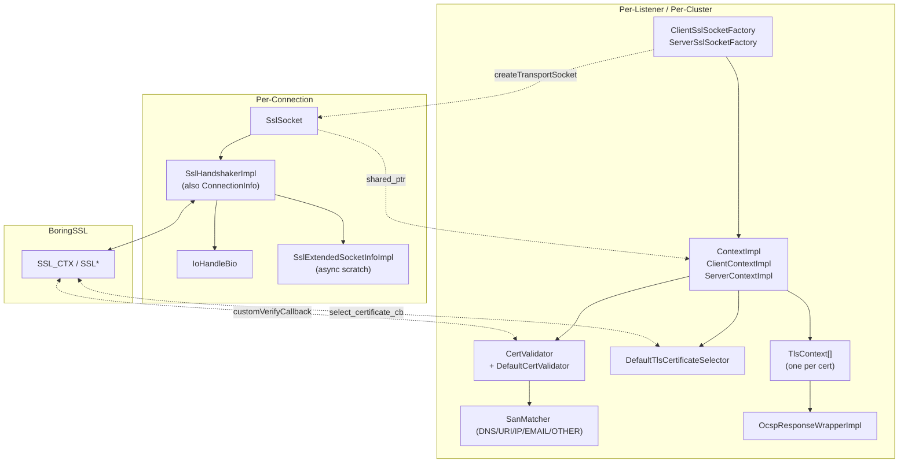
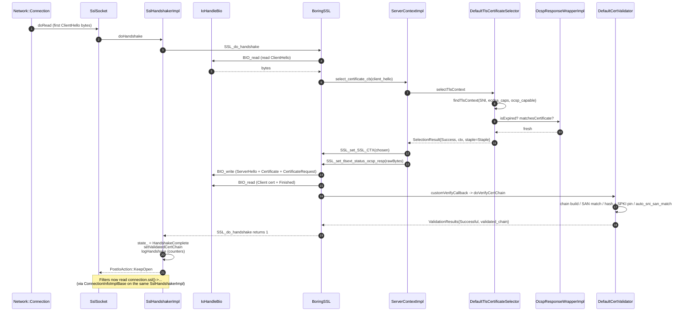

# Key TLS Classes — Handshake, CA Cert Validation, and OCSP

> A focused guide to the most important classes in `source/common/tls/` for three concerns: **driving the TLS handshake**, **validating peer certs / CAs (incl. mTLS)**, and **OCSP stapling**.

For wider architectural context see [`README.md`](README.md), the per-topic deep dives (`socket_layer.md`, `handshaker.md`, `context.md`, `connection_info.md`, `utilities.md`), and the multi-part overview (`OVERVIEW_PART1`...`OVERVIEW_PART2`).

---

## At-a-glance map



| Layer | Lifetime | Key classes |
|---|---|---|
| Socket layer | per connection | `SslSocket`, `IoHandleBio`, `NotReadySslSocket` |
| Handshake driver | per connection | `SslHandshakerImpl`, `SslExtendedSocketInfoImpl`, `ValidateResultCallbackImpl`, `CertificateSelectionCallbackImpl` |
| `SSL_CTX` bundle | per listener / cluster | `ContextImpl`, `ClientContextImpl`, `ServerContextImpl`, `TlsContext`, `DefaultTlsCertificateSelector` |
| Validation | per listener / cluster | `CertValidator`, `DefaultCertValidator`, `SanMatcher` |
| OCSP | per cert | `OcspResponseWrapperImpl`, `Asn1OcspUtility` |
| Filter-facing accessors | per connection (via handshaker) | `ConnectionInfoImplBase` |

---

## 1. TLS Handshake — driving classes

### `SslSocket`
File: `ssl_socket.{h,cc}`

The per-connection `Network::TransportSocket`. Implements **three** interfaces — `Network::TransportSocket` (Envoy calls in: `doRead`, `doWrite`, `onConnected`), `Ssl::PrivateKeyConnectionCallbacks` (HSM calls back when async signing finishes), and `Ssl::HandshakeCallbacks` (handshaker calls back on success / failure / async resume). Holds a `shared_ptr<ContextImpl>` for the heavy `SSL_CTX` bundle and a fresh `SslHandshakerImpl` for per-connection state. Implements the pause/resume contract: when handshake suspends asynchronously, `resumeHandshake()` re-enters `SslHandshakerImpl::doHandshake` once a callback is posted to the worker dispatcher.

### `SslHandshakerImpl`
File: `ssl_handshaker.{h,cc}`

The bridge between BoringSSL's *synchronous-looking* `SSL_do_handshake` API and Envoy's *non-blocking, dispatcher-driven* worker model. Owns the `bssl::UniquePtr<SSL>`. **Doubles as `Ssl::ConnectionInfo`** (inherits `ConnectionInfoImplBase`), so `connection.ssl()` returns the same object that ran the handshake — no copying cert data into a separate "info" struct. Its `doHandshake()` loop inspects `SSL_get_error`: returns `KeepOpen` for `WANT_READ`/`WANT_WRITE` (wait for I/O), stays in `HandshakeInProgress` for the three async escape hatches, and returns `Close` on fatal error.

### `SslExtendedSocketInfoImpl`
File: `ssl_handshaker.{h,cc}`

Per-connection scratch space for the async handshake paths. Reachable from BoringSSL via `SSL_get_ex_data(ssl, sslExtendedSocketInfoIndex())`. Owns the two async callback objects (`ValidateResultCallbackImpl`, `CertificateSelectionCallbackImpl`). Its destructor calls `onSslHandshakeCancelled()` on any in-flight callback, so a connection drop while waiting for SDS / dynamic-modules / HSM doesn't crash — the eventual external completion becomes a no-op.

### `ValidateResultCallbackImpl` / `CertificateSelectionCallbackImpl`
File: `ssl_handshaker.{h,cc}`

The two async resumption callbacks. The validator (or selector) invokes `onCertValidationResult` / `onCertificateSelectionResult` on completion; the callback stores the result on `extended_socket_info_` and posts to the worker `dispatcher_`. The post triggers `SslSocket::onAsynchronous*Complete` -> `resumeHandshake` -> retry of `SSL_do_handshake`.

### `IoHandleBio`
File: `io_handle_bio.{h,cc}`

A custom BoringSSL `BIO` whose method table maps `bread` / `bwrite` to `IoHandle::readv` / `writev`. Translates `EAGAIN` to `BIO_set_retry_read` / `BIO_set_retry_write`. Lets the same `SslSocket` work over kernel TCP, Unix sockets, QUIC packet queues, or test fakes — no `#ifdef`s needed.

### `ContextImpl` / `ClientContextImpl` / `ServerContextImpl`
File: `context_impl.{h,cc}`, `client_context_impl.{h,cc}`, `server_context_impl.{h,cc}`

The per-listener / per-cluster `SSL_CTX` bundle.
- **`ContextImpl`** owns `tls_contexts_` — a vector of `TlsContext` (one per cert, so RSA + ECDSA can coexist), the `cert_validator_`, ALPN, key log, and stats. Its static `customVerifyCallback` is the **single entry point** from BoringSSL into Envoy's chain validation (wired via `SSL_CTX_set_custom_verify`). `logHandshake(ssl)` bumps per-cipher / version / curve / sigalg counters.
- **`ServerContextImpl`** adds the `SSL_CTX_set_select_certificate_cb` hook (calls `selectTlsContext` on each ClientHello), session-ticket key callback, and the session-context-id hash that scopes resumption.
- **`ClientContextImpl`** adds the per-host `SSL_SESSION` cache for upstream resumption (`session_keys_` deque under `session_keys_mu_`), SNI policy (`auto_host_sni`), and `enforce_rsa_key_usage`.

### `TlsContext` (struct)
File: `context_impl.h`

One per certificate. Holds the actual `SSL_CTX*`, parsed leaf cert, ECDSA curve identifier, the `OcspResponseWrapper`, the `PrivateKeyMethodProvider` (HSM), and `is_must_staple_`. Exposes `loadCertificateChain` / `loadPrivateKey` / `loadPkcs12` / `checkPrivateKey` / `isCipherEnabled`.

### `DefaultTlsCertificateSelector`
File: `default_tls_certificate_selector.{h,cc}`

The built-in SNI -> cert picker (server side). Used unless `custom_tls_certificate_selector` is configured (e.g. on-demand SDS). Owns `server_names_map_` (string -> key-type -> `TlsContext&`); wildcards stored as `.example.com`. `selectTlsContext(client_hello, cb)` extracts SNI / ECDSA capabilities / OCSP capability, looks up exact then wildcard, falls back to `tls_contexts_[0]` (or full scan), picks best key type for the client, computes the OCSP staple action, and returns `SelectionResult{Success | Pending | Failed}`.

### `Client`/`ServerSslSocketFactory`
File: `client_ssl_socket.{h,cc}`, `server_ssl_socket.{h,cc}`

Long-lived owners of a `ContextImpl` and SDS subscription handles. Implement `Network::TransportSocketFactory`. On SDS update they rebuild the context under `ssl_ctx_mu_`, swap `ssl_ctx_`, increment `ssl_context_update_by_sds`, and start handing the new context to new connections. **In-flight connections keep the old context** (held alive by `shared_ptr` on `SslSocket`).

---

## 2. CA Cert & Validation — the `cert_validator/` subsystem

### `CertValidator` (interface)
File: `cert_validator/cert_validator.h`

The pluggable validator interface. Three implementations: `DefaultCertValidator` (built in), `SpiffeCertValidator` (extension), `DynamicModuleCertValidator` (async, calls into a dynamic module). Key methods:
- **`addClientValidationContext(SSL_CTX*, require_client_cert)`** — at config time, sets `SSL_VERIFY_PEER` / `SSL_VERIFY_FAIL_IF_NO_PEER_CERT` and populates the CA name list sent to clients.
- **`doVerifyCertChain(chain, callback, transport_options, ssl_ctx, validation_context, is_server, host_name)`** — actual chain validation. Returns `ValidationResults{Pending | Successful | Failed}`; when `Pending`, must call back via `Ssl::ValidateResultCallback`.
- **`initializeSslContexts(contexts, handshaker_provides_certificates, scope)`** — at config time, returns the BoringSSL verify-mode flag for each `SSL_CTX`.
- **`updateDigestForSessionId(...)`** — mixes validator config into the session-context-id hash so changes to trust break old sessions (a critical security property).

### `ValidationResults` (struct)
File: `cert_validator/cert_validator.h`

The standard return shape from a validator. Carries `status` (Pending / Successful / Failed), `detailed_status` (`Ssl::ClientValidationStatus`), an optional `tls_alert` byte (lets the validator pick the alert sent on failure), `error_details`, and the `validated_chain` (leaf + issuers up to anchor) which gets stashed onto `SslHandshakerImpl::validated_chain_` and surfaces via `validatedPeerIssuer()`.

### `DefaultCertValidator`
File: `cert_validator/default_validator.{h,cc}`

The workhorse validator. Built from `Ssl::CertificateValidationContextConfig`. Holds:
- `ca_cert_` — trust anchor loaded into the `SSL_CTX`'s `X509_STORE`.
- `subject_alt_name_matchers_` — typed SAN matchers from `match_typed_subject_alt_names`.
- `verify_certificate_hash_list_` — full-cert SHA-256 pinning (hex).
- `verify_certificate_spki_list_` — SPKI SHA-256 pinning (base64).
- `allow_untrusted_certificate_`, `verify_trusted_ca_`, `auto_sni_san_match_` flags.

Validation order in `verifyCertAndUpdateStatus`:
1. X.509 chain build (skipped if `trust_chain_verification = ACCEPT_UNTRUSTED`).
2. SAN matchers.
3. Cert hash pinning.
4. SPKI hash pinning.
5. `auto_sni_san_match` — verify SAN against actual SNI sent (upstream guard).

Each failure sets a specific `ClientValidationStatus` and bumps a stat (`fail_verify_no_cert`, `fail_verify_error`, `fail_verify_san`, `fail_verify_cert_hash`).

### `SanMatcher`
File: `cert_validator/san_matcher.{h,cc}`

Typed SAN matching. One implementation per SAN type — DNS, URI, IP, EMAIL, OTHER_NAME — each wrapping a `StringMatcher` (exact / prefix / suffix / safe_regex). `DefaultCertValidator::matchSubjectAltName` walks the cert's `GENERAL_NAMES` and runs configured matchers against entries of the same type only.

### `Ssl::CertificateValidationContextConfig` (interface in `envoy/ssl/`)

The config object the validator reads from. Exposes: `caCert()`, `caCertPath()`, `certificateRevocationList()`, `subjectAltNameMatchers()`, `verifyCertificateHashList()`, `verifyCertificateSpkiList()`, `allowExpiredCertificate()`, `trustChainVerification()` (`VERIFY_TRUST_CHAIN` / `ACCEPT_UNTRUSTED`), and `customValidatorConfig()` (typed config for SPIFFE / dynamic_modules).

---

## 3. OCSP — the `ocsp/` subsystem

OCSP is **stapling-only** in Envoy: it does **not** call out to an OCSP responder. It validates a pre-loaded response (inline or via SDS) and serves it during the TLS handshake when the client requests stapling.

### `OcspResponseWrapperImpl`
File: `ocsp/ocsp.{h,cc}`

The runtime wrapper, one per cert that has a configured OCSP response (lives on `TlsContext::ocsp_response_`). Owns the **raw DER bytes** (`raw_bytes_`) so stapling needs no re-serialization at handshake time, plus a parsed `OcspResponse` struct used only for expiry checks and cert matching. Three jobs:
- **`matchesCertificate(X509&)`** — confirms the OCSP serial matches the cert's serial; called at config time so we don't ship a mismatched staple.
- **`isExpired()`** — `now > getNextUpdate()` (or always true if `next_update` is absent).
- **`rawBytes()`** — the DER blob the server stapler hands to BoringSSL.

### `OcspResponse` / `BasicOcspResponse` / `ResponseData` / `SingleResponse` / `CertId`
File: `ocsp/ocsp.h`

The parsed struct hierarchy that mirrors RFC 6960:
```
OcspResponse
  status_      : OcspResponseStatus       successful / malformedRequest / ...
  response_    : ResponsePtr -> BasicOcspResponse
                                  data_: ResponseData
                                           single_responses_: vector<SingleResponse>
                                                                cert_id_:     CertId{serial_number}
                                                                this_update_: SystemTime
                                                                next_update_: optional<SystemTime>
```
Envoy enforces "exactly one cert per response" — `getCertSerialNumber()` indexes `single_responses_[0]` directly.

### `Asn1OcspUtility` / `Asn1Utility`
File: `ocsp/asn1_utility.{h,cc}`, `ocsp/ocsp.{h,cc}`

The DER walkers. `Asn1Utility` is generic (parse INTEGER / OID / OCTET STRING / SEQUENCE / SET / context-specific tags). `Asn1OcspUtility::parseOcspResponse` is the OCSP-specific entry that walks an `OcspResponse` per RFC 6960 Appendix B.2 and builds the parsed struct.

> Important: the header explicitly notes "**this assumes responses are provided from configs or another trusted source and does not perform checks necessary to verify responses coming from an upstream server.**" Envoy trusts the source (your config / SDS); it does not signature-verify the response.

### How OCSP plugs into the handshake — `OcspStapleAction`

`DefaultTlsCertificateSelector::ocspStapleAction(ctx, client_ocsp_capable, policy)` returns one of:

| Action | Meaning | Stat |
|---|---|---|
| `Staple` | Fresh response exists and the client asked -> BoringSSL adds via `SSL_set_tlsext_status_ocsp_resp` | `ocsp_staple_responses` |
| `NoStaple` | Client didn't ask, or response missing/expired with `LENIENT_STAPLING` | `ocsp_staple_omitted` |
| `Fail` | `STRICT_STAPLING`, or `MUST_STAPLE` cert and no usable response | `ocsp_staple_failed`; selector tries another cert |

Three inputs feed the decision:
1. **`OcspStaplePolicy`** from `ServerContextConfig` (`LENIENT_STAPLING` / `STRICT_STAPLING` / `MUST_STAPLE`).
2. **`TlsContext::is_must_staple_`** — set when the cert carries the `1.3.6.1.5.5.7.1.24` extension.
3. **`OcspResponseWrapperImpl::isExpired()`** — fresh vs stale.

`ServerContextImpl::isClientOcspCapable(client_hello)` reads the ClientHello's `status_request` extension to determine if the client even wants a staple.

---

## End-to-end: server-side mTLS handshake with OCSP staple



The async paths simply substitute step 14 (validator returns `Pending` -> `SSL_ERROR_WANT_CERTIFICATE_VERIFY` -> dispatcher post -> `resumeHandshake`) or step 9 (selector returns `Pending` -> `ssl_select_cert_retry` -> `SSL_ERROR_PENDING_CERTIFICATE` -> dispatcher post -> `resumeHandshake`).

---

## Quick "where does X live" lookup

| Question | Class / File |
|---|---|
| Drives `SSL_do_handshake` | `SslHandshakerImpl` (`ssl_handshaker.{h,cc}`) |
| Wraps `SSL*` for `Network::Connection` | `SslSocket` (`ssl_socket.{h,cc}`) |
| Connects BoringSSL `BIO` to `IoHandle` | `IoHandleBio` (`io_handle_bio.{h,cc}`) |
| Owns `SSL_CTX` bundle (vector of certs) | `ContextImpl` / `ServerContextImpl` / `ClientContextImpl` |
| One `SSL_CTX` + cert + OCSP | `TlsContext` struct (`context_impl.h`) |
| SNI -> cert decision | `DefaultTlsCertificateSelector` (`default_tls_certificate_selector.{h,cc}`) |
| Validator interface (pluggable) | `CertValidator` (`cert_validator/cert_validator.h`) |
| Built-in validator (CA, SAN, pinning) | `DefaultCertValidator` (`cert_validator/default_validator.{h,cc}`) |
| Typed SAN matchers | `SanMatcher` (`cert_validator/san_matcher.{h,cc}`) |
| Filter-facing accessor surface (post-handshake) | `ConnectionInfoImplBase` (`connection_info_impl_base.{h,cc}`) |
| Async-handshake scratch space | `SslExtendedSocketInfoImpl` (`ssl_handshaker.{h,cc}`) |
| Async cert-validation resume | `ValidateResultCallbackImpl` |
| Async cert-selection resume | `CertificateSelectionCallbackImpl` |
| OCSP response wrapper (per cert) | `OcspResponseWrapperImpl` (`ocsp/ocsp.{h,cc}`) |
| OCSP DER parser (RFC 6960) | `Asn1OcspUtility` (+ `Asn1Utility`) |
| Decides whether to staple OCSP | `DefaultTlsCertificateSelector::ocspStapleAction` |

---

## Class summary table (one-line each)

### Handshake / socket layer
| Class | One-line role |
|---|---|
| `SslSocket` | Per-connection `Network::TransportSocket`; routes Envoy's `doRead`/`doWrite` through BoringSSL |
| `NotReadySslSocket` | Stand-in returned by factory while SDS hasn't delivered yet |
| `Client/ServerSslSocketFactory` | Per-listener / per-cluster owner of a `ContextImpl` plus SDS swap logic |
| `IoHandleBio` | Custom BoringSSL `BIO` whose `bread`/`bwrite` call into `IoHandle::readv`/`writev` |
| `SslHandshakerImpl` | Drives `SSL_do_handshake`; also serves as `Ssl::ConnectionInfo` for filters |
| `SslExtendedSocketInfoImpl` | Per-connection scratch space for async cert-select / cert-verify; safe cancellation |
| `ValidateResultCallbackImpl` | Async cert-verification resume; posts result to worker dispatcher |
| `CertificateSelectionCallbackImpl` | Async cert-selection resume; posts result to worker dispatcher |
| `HandshakerFactoryImpl` | Registers the default `envoy.default_tls_handshaker` |

### Context / config / selection
| Class | One-line role |
|---|---|
| `ContextImpl` | Abstract base; owns `tls_contexts_`, validator, ALPN, key log, customVerify wiring |
| `ClientContextImpl` | Upstream context: per-host session cache, SNI policy, RSA key-usage enforcement |
| `ServerContextImpl` | Downstream context: cert selector hook, session-ticket keys, session-context-id hash |
| `TlsContext` | One per certificate: `SSL_CTX*`, leaf, OCSP wrapper, ECDSA curve, key provider |
| `DefaultTlsCertificateSelector` | Built-in SNI -> cert picker; handles wildcards, ECDSA-vs-RSA preference, OCSP action |
| `ContextManagerImpl` | Per-process owner of every live `ContextImpl`; aggregate `daysUntilFirstCertExpires` |
| `ContextConfigImpl` / `ClientContextConfigImpl` / `ServerContextConfigImpl` | Translate proto into typed internal config for the manager |

### Validation
| Class | One-line role |
|---|---|
| `CertValidator` | Pluggable peer-cert validator interface |
| `DefaultCertValidator` | Built-in: chain build + SAN matchers + cert-hash + SPKI-hash + auto_sni_san_match |
| `ValidationResults` | Standard return shape: status, detailed_status, alert byte, error, validated chain |
| `SanMatcher` (DNS/URI/IP/EMAIL/OTHER) | Typed SAN matchers backed by `StringMatcher` |
| `Ssl::CertificateValidationContextConfig` | Config object the validator reads (CA, CRL, matchers, pinning, flags) |

### OCSP
| Class | One-line role |
|---|---|
| `OcspResponseWrapperImpl` | Per-cert wrapper: holds DER bytes, validates serial match, reports expiry |
| `OcspResponse` / `BasicOcspResponse` | Parsed RFC 6960 structures used for expiry / serial checks |
| `SingleResponse` / `CertId` / `ResponseData` | Field-level RFC 6960 reflections |
| `Asn1OcspUtility` | OCSP-specific DER walkers (entry point: `parseOcspResponse`) |
| `Asn1Utility` | Generic DER walkers (INTEGER / OID / SEQUENCE / context-specific tags) |

### Connection info (post-handshake)
| Class | One-line role |
|---|---|
| `ConnectionInfoImplBase` | Implements `Ssl::ConnectionInfo` (~30 accessors, lazily cached); inherited by `SslHandshakerImpl` |
| `CachedValueTag` | Enum keying the per-accessor lazy cache (`Sni`, `Alpn`, `Sha256PeerCertificateDigest`, ...) |

---

## Reading order (focused on these three concerns)

1. **`README.md`** — the layered overview and 30-second connection sketch.
2. **`socket_layer.md`** — `SslSocket`, `IoHandleBio`, factories.
3. **`handshaker.md`** — state machine and three async escape hatches.
4. **`context.md`** — `ContextImpl` family + the cert selector.
5. **`cert_validator/README.md`** — `CertValidator` interface, default impl, SAN matchers.
6. **`ocsp/README.md`** — OCSP parsing model and stapling integration.
7. **`CASES.md`** — verify intuition against concrete scenarios.
