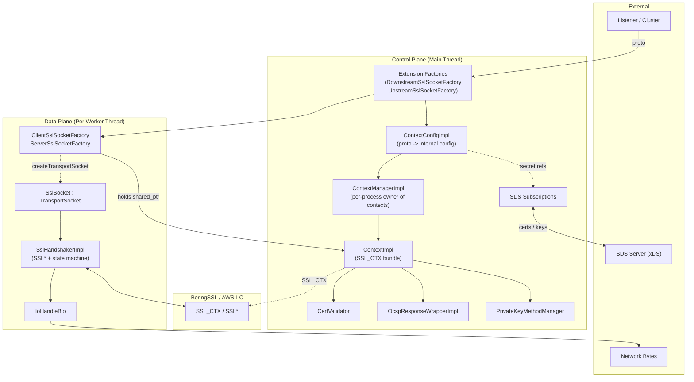
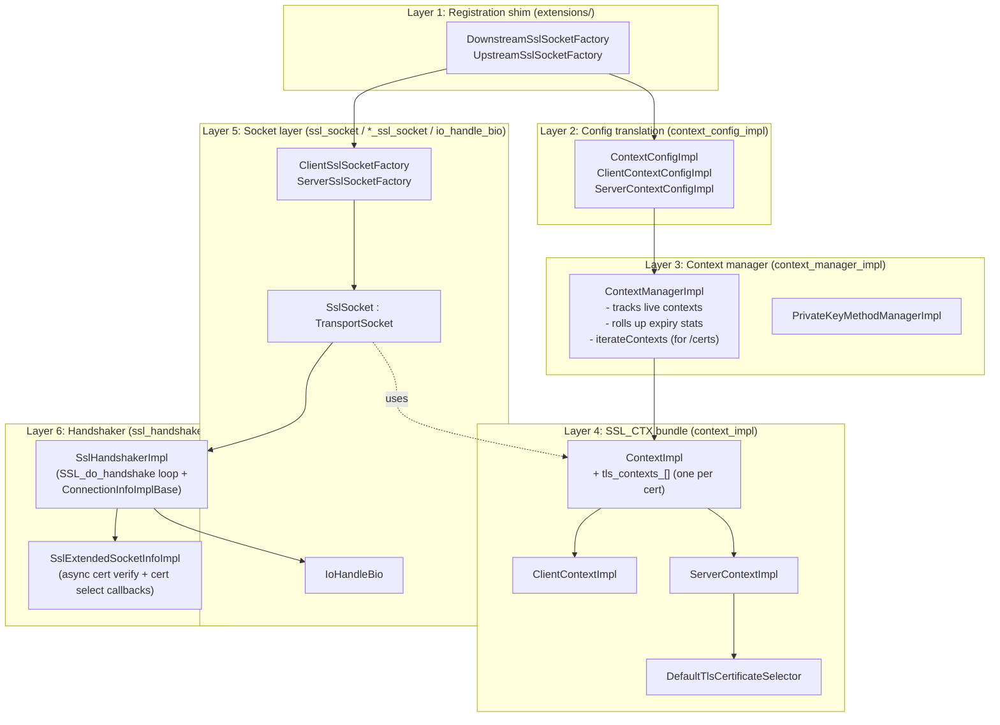
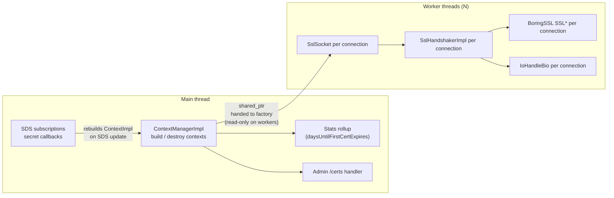
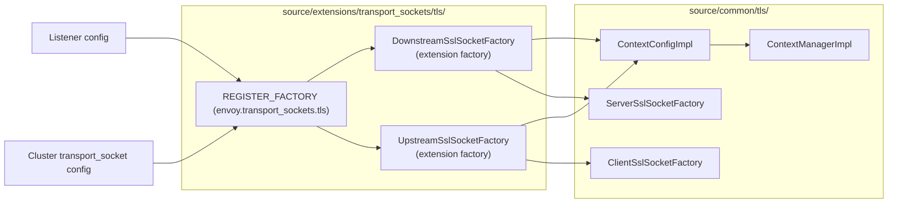
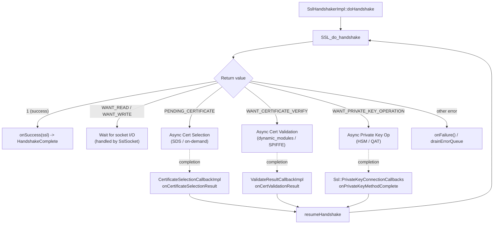
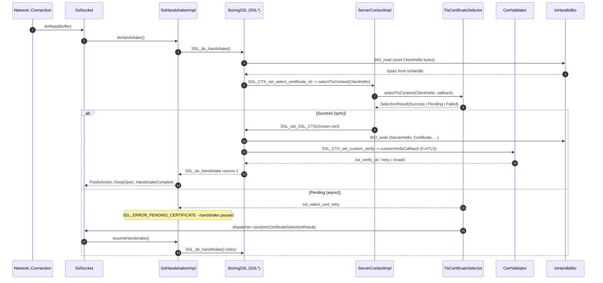
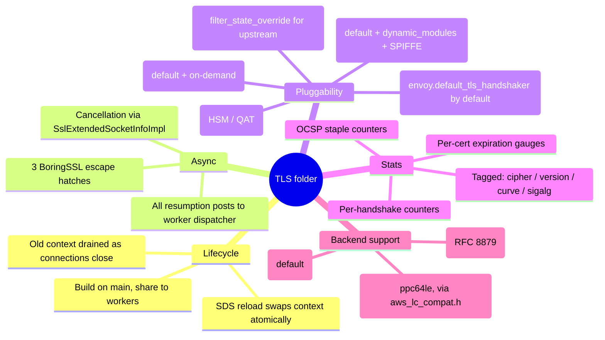

# TLS Overview — Part 1: Architecture & Layering

## High-Level Architecture

The `source/common/tls/` directory implements Envoy's TLS transport socket — the heavy-lifting half that owns `SSL_CTX` lifecycle, the BoringSSL-driven handshake state machine, peer cert validation, OCSP stapling, and per-connection accessors exposed to filters. The thin extension shim that *registers* the transport socket lives in `source/extensions/transport_sockets/tls/`; almost every line of meaningful code lives here.

## File Map

| File | Purpose | Key Classes |
|------|---------|-------------|
| `ssl_socket.{h,cc}` | `Network::TransportSocket` for both client and server | `SslSocket`, `NotReadySslSocket` |
| `client_ssl_socket.{h,cc}` | Upstream socket factory | `ClientSslSocketFactory` |
| `server_ssl_socket.{h,cc}` | Downstream socket factory | `ServerSslSocketFactory` |
| `io_handle_bio.{h,cc}` | Custom BoringSSL `BIO` over `Network::IoHandle` | `IoHandleBio` |
| `ssl_handshaker.{h,cc}` | Handshake state machine + async escape hatches | `SslHandshakerImpl`, `SslExtendedSocketInfoImpl`, `ValidateResultCallbackImpl`, `CertificateSelectionCallbackImpl`, `HandshakerFactoryImpl` |
| `context_impl.{h,cc}` | `SSL_CTX` build, ALPN, key log, custom verify, OCSP integration | `ContextImpl`, `TlsContext` |
| `client_context_impl.{h,cc}` | Upstream `SSL_CTX` build, session ticket cache | `ClientContextImpl` |
| `server_context_impl.{h,cc}` | Downstream `SSL_CTX` build, cert selector hook, session ticket keys | `ServerContextImpl` |
| `default_tls_certificate_selector.{h,cc}` | Built-in SNI -> cert selector | `DefaultTlsCertificateSelector` |
| `context_config_impl.{h,cc}` | proto `CommonTlsContext` -> internal config | `ContextConfigImpl`, `ClientContextConfigImpl`, `ServerContextConfigImpl` |
| `context_manager_impl.{h,cc}` | Per-process owner of every live `ContextImpl` | `ContextManagerImpl` |
| `connection_info_impl_base.{h,cc}` | `Ssl::ConnectionInfo` accessor surface | `ConnectionInfoImplBase` |
| `stats.{h,cc}` | `SslStats` counters + per-cert expiration gauge | `SslStats`, `generateStats` |
| `utility.{h,cc}` | X.509 helpers (SAN extraction, fingerprints, expiry, RFC 6125 matching) | `Utility` namespace |
| `cert_compression.{h,cc}` | RFC 8879 TLS cert compression (Brotli + Zlib) | `registerBrotli`, `registerZlib` |
| `aws_lc_compat.h` | API translation shims for AWS-LC builds (ppc64le) | macros |
| `cert_validator/` | `CertValidator` interface, default impl, SAN matchers | see Part 4 |
| `ocsp/` | OCSP response parsing for stapling | see Part 4 |
| `private_key/` | Pluggable async private key providers (HSM) | see Part 4 |

## The Six Conceptual Layers

Reading top-down:

1. **Config arrives** as `Downstream/UpstreamTlsContext` proto -> `ContextConfigImpl` translates it to internal types (cert/key paths or SDS providers, cipher list, validation rules).
2. **`ContextManagerImpl`** is the per-process owner of every live `ContextImpl`; it iterates them for expiration stats and tears them down on reload.
3. **`ContextImpl` builds one `SSL_CTX` per cert** (so the same `CommonTlsContext` can have RSA + ECDSA certs simultaneously). `ServerContextImpl` adds the SNI selector hook (`SSL_CTX_set_select_certificate_cb`); `ClientContextImpl` adds session-ticket caching for upstream resumption.
4. **`ClientSslSocketFactory` / `ServerSslSocketFactory`** wrap a context + watch its SDS providers for hot reload.
5. **`SslSocket`** is the per-connection `TransportSocket` Envoy hands to a `Network::Connection`. It owns an `SslHandshakerImpl` (which wraps a BoringSSL `SSL*`) and routes data through an `IoHandleBio`.
6. **`SslHandshakerImpl`** runs `SSL_do_handshake` and yields to the worker dispatcher whenever BoringSSL returns `SSL_ERROR_WANT_*`. It also extends `ConnectionInfoImplBase`, so the same object is both the handshake state machine and the `Ssl::ConnectionInfo` interface exposed to filters.

The unusual move here is **putting the SNI selector logic inside `ServerContextImpl`** rather than in the socket. That decision is what lets the same context serve thousands of certs while keeping per-connection state tiny — every connection just gets an `SSL*` pointing at one chosen `SSL_CTX`, with no per-connection cert storage of its own.

## Threading Model

Envoy's worker model is "one I/O thread per CPU core, no locks on the hot path". The TLS code respects that: contexts (heavy, shared) are built and torn down on **main**, and per-connection objects (`SslSocket`, `SslHandshakerImpl`, `SSL*`) live entirely on **one worker thread**.

| Object | Built where | Used where | Sync model |
|--------|-------------|-----------|------------|
| `ContextManagerImpl` | main | main + workers (read-only mostly) | global mutex on `contexts_` set |
| `ContextImpl` / `SSL_CTX` | main | shared across workers | `shared_ptr`; thread-safe for read ops Envoy uses |
| `ClientSslSocketFactory` / `ServerSslSocketFactory` | main | workers (createTransportSocket) | `ssl_ctx_mu_` for SDS-driven swaps |
| `SslSocket` | worker (per connection) | one worker | none - thread affine |
| `SslHandshakerImpl` | worker (per connection) | one worker | none - thread affine |
| `SSL*` | worker (per connection) | one worker | never crosses threads |
| SDS provider callbacks | main | main | dispatcher.post |

Key contracts:

- **`ContextImpl` / `SSL_CTX` are built on main and shared (read-only-ish) across workers.** `SSL_CTX` itself is thread-safe for the operations Envoy needs.
- **Each connection's `SSL*` is owned by exactly one worker** - never crosses thread boundaries.
- **On SDS update**, a new `ContextImpl` is built on main and swapped into the factory under a mutex; existing connections keep their old context until they close.
- **`ContextManagerImpl::removeContext`** can be called from any thread; the manager takes a global lock because context creation/free is infrequent.

## Registration Shim — The `extensions/transport_sockets/tls/` Layer

The split is **registration vs. implementation**:

- The extension folder only contains the factory glue that registers `envoy.transport_sockets.tls` with Envoy's extension registry — a thin shim that builds a `ContextConfigImpl` from proto and asks the manager for a context.
- Every meaningful line of code (the `SSL_CTX` lifecycle, the handshake state machine, the validator, OCSP, key providers) lives in `common/`.

Splitting this way means **non-extension code in Envoy can depend on `common/tls/` without pulling in extension wiring**, which matters for the QUIC transport socket and for unit tests.

## Async Escape Hatches

BoringSSL's handshake API is *synchronous* by design — `SSL_do_handshake` either completes or returns `WANT_READ` / `WANT_WRITE`. To plug *external* asynchrony into that synchronous API, BoringSSL provides three special return codes that Envoy uses as suspension points.

The contract is identical for all three:

1. **BoringSSL returns the special code** -> `SslHandshakerImpl` returns `PostIoAction::KeepOpen` to the socket.
2. **Envoy stops driving the state machine** -> `state_` stays `HandshakeInProgress`.
3. **An external callback fires later on the worker dispatcher** -> the corresponding callback's `onSslHandshakeCancelled` flag is checked first.
4. **Envoy re-enters `SSL_do_handshake` from where it left off** via `resumeHandshake`.

| Suspension Point | BoringSSL Code | Resumed Via | Used For |
|------------------|----------------|-------------|----------|
| Cert selection | `SSL_ERROR_PENDING_CERTIFICATE` | `CertificateSelectionCallbackImpl::onCertificateSelectionResult` | On-demand cert selector (SDS lookup by SNI) |
| Cert verification | `SSL_ERROR_WANT_CERTIFICATE_VERIFY` | `ValidateResultCallbackImpl::onCertValidationResult` | Dynamic-module / SPIFFE async validators |
| Private key op | `SSL_ERROR_WANT_PRIVATE_KEY_OPERATION` | `Ssl::PrivateKeyConnectionCallbacks::onPrivateKeyMethodComplete` | HSM / QAT async signers |

**Cancellation** is just as important: if the connection dies while waiting, the destructor of `SslExtendedSocketInfoImpl` calls `onSslHandshakeCancelled` on whichever callback is in flight, which flips a flag so the eventual external completion becomes a no-op instead of touching freed memory.

## A Connection in 30 Seconds (Downstream / Server)

The sequence below captures the whole life of an incoming TLS handshake. The interesting bits are (1) **the certificate isn't chosen until the ClientHello arrives** — the selector hook fires from inside BoringSSL during early handshake processing — and (2) **the handshake can suspend and resume** when the selector returns `Pending` (because the cert is being fetched from SDS), when the validator returns `Pending` (async mTLS validation), or when an HSM is signing.

Same picture, mirrored, runs upstream — except the cert mapper / selector applies to the *client* cert presented to the upstream server, ALPN is *requested* rather than *selected*, and `ClientContextImpl` adds a per-host session-ticket cache via `SSL_CTX_sess_set_new_cb`.

## Cross-Cutting Concerns

## Mental Model

Envoy's TLS code is a thin envelope around BoringSSL. The envelope's job is **glue**: turn proto into `SSL_CTX`, plug Envoy's `IoHandle` into BoringSSL's `BIO`, drive `SSL_do_handshake` from libevent, and give filter chains a typed view of the live session. Everything that *isn't* glue is either:

- A pluggable extension point (cert selectors, cert mappers, validators, key providers), or
- A workaround for BoringSSL not being natively async (the three suspension-and-resume escape hatches).

Once you internalise that split, the file layout reads itself: `context*` builds `SSL_CTX`, `socket*` wraps `SSL*`, `handshaker` drives the state machine, and everything under a subfolder is "something pluggable hanging off the side".

## Reading Order

| Want to understand... | Read |
|----------------------|------|
| The whole forest | This part (you're here) + `README.md` |
| How proto becomes an `SSL_CTX` | **Part 2** + `config.md` + `context.md` |
| What happens during a handshake | **Part 3** + `socket_layer.md` + `handshaker.md` |
| mTLS / OCSP / HSM / SPIFFE | **Part 4** + `cert_validator/README.md`, `ocsp/README.md`, `private_key/README.md` |
| Specific failure modes | `CASES.md` |

---

Continue with **[Part 2: Configuration & Contexts](OVERVIEW_PART2_config_and_contexts.md)** for how protobuf becomes one or more live `SSL_CTX` bundles.
