# TLS Overview — Part 2: Configuration & Contexts

> **Previous:** [Part 1 — Architecture & Layering](OVERVIEW_PART1_architecture_and_layering.md)

## From Protobuf to Live `SSL_CTX`

This part covers the **build pipeline**: how a `Downstream/UpstreamTlsContext` proto is translated into an internal config, owned by a per-process manager, and turned into a bundle of `SSL_CTX` objects ready to serve handshakes.

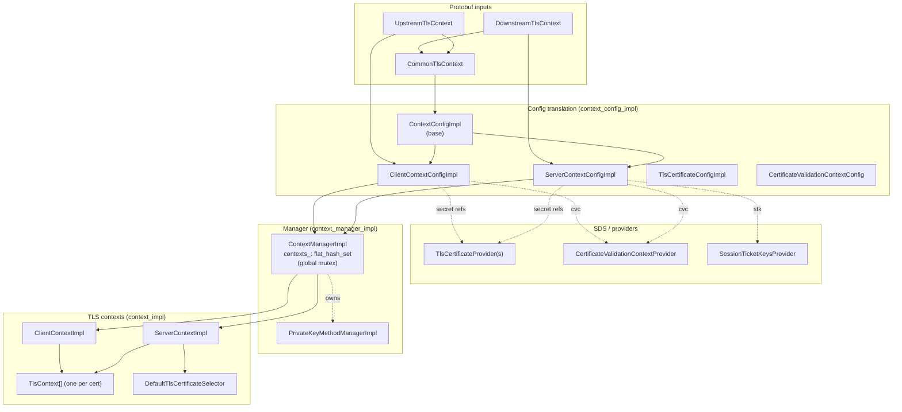

The five layers are deliberately kept **unidirectional** — proto flows into config, config flows into context, context flows into manager. Nothing flows back the other way. A misconfigured cipher in proto only ever affects the matching `SSL_CTX`, never the manager or the wider Envoy state.

## File Map for Part 2

| File | Role | Key Classes |
|------|------|-------------|
| `context_config_impl.{h,cc}` | proto -> internal config | `ContextConfigImpl`, `ClientContextConfigImpl`, `TlsCertificateConfigImpl` |
| `server_context_config_impl.{h,cc}` | downstream-only config additions | `ServerContextConfigImpl` |
| `context_manager_impl.{h,cc}` | per-process context registry | `ContextManagerImpl` |
| `context_impl.{h,cc}` | base `SSL_CTX` build, ALPN, key log, custom verify | `ContextImpl`, `TlsContext` |
| `client_context_impl.{h,cc}` | upstream context (session cache, SNI policy) | `ClientContextImpl` |
| `server_context_impl.{h,cc}` | downstream context (cert selector, session ticket keys) | `ServerContextImpl` |
| `default_tls_certificate_selector.{h,cc}` | built-in SNI -> cert selector | `DefaultTlsCertificateSelector` |

## `ContextConfigImpl` — Proto to Internal Config

`ContextConfigImpl` translates `CommonTlsContext` (and its `Downstream`/`Upstream` wrappers) into the strongly-typed internal config that `ContextImpl` consumes.

### Why split translation from build?

Translation is **expensive and synchronous** (PEM parsing, SDS fetching, validator factory instantiation). Build is **also expensive** (cipher list compilation, CA store population, OCSP response parsing). Splitting them buys two things:

1. The translated config can be **inspected and tested** without touching BoringSSL.
2. The manager can dedupe identical contexts by hashing the translated config, so two listeners with the same TLS settings share one `SSL_CTX`.

### Construction Pipeline

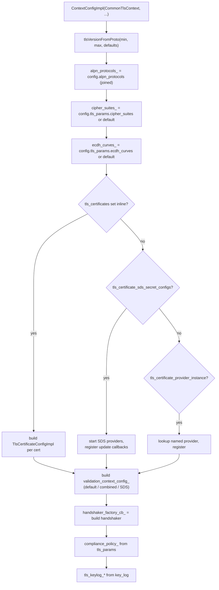

### `isReady()` — The Critical Predicate

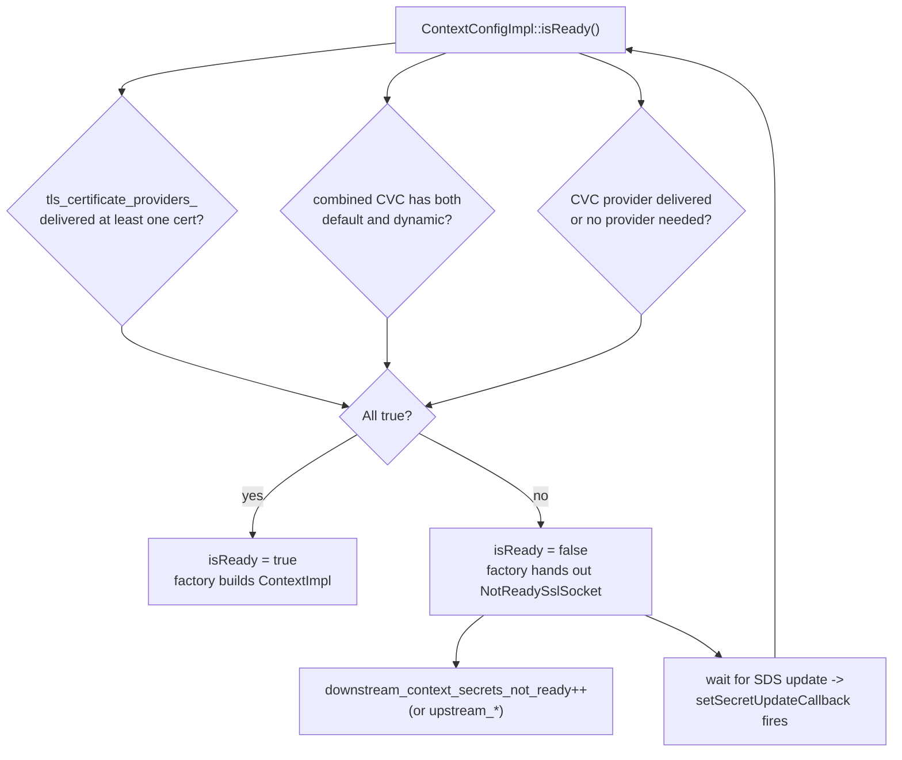

If `isReady()` returns false, `ServerSslSocketFactory::createDownstreamTransportSocket()` hands out a `NotReadySslSocket` instead — the connection accepts TCP but immediately fails TLS with `"secret not ready"`.

### `getCombinedValidationContextConfig`

The merge model is "**SDS adds, never replaces**" for repeated fields and "**SDS overrides**" for scalars. Practically: a static config carrying CA roots can be augmented with dynamic SAN matchers from SDS without a config push — a key pattern for mTLS with rotating identity authorities (SPIFFE, IAM workload identities, etc.).

### Client vs. Server Subclass Differences

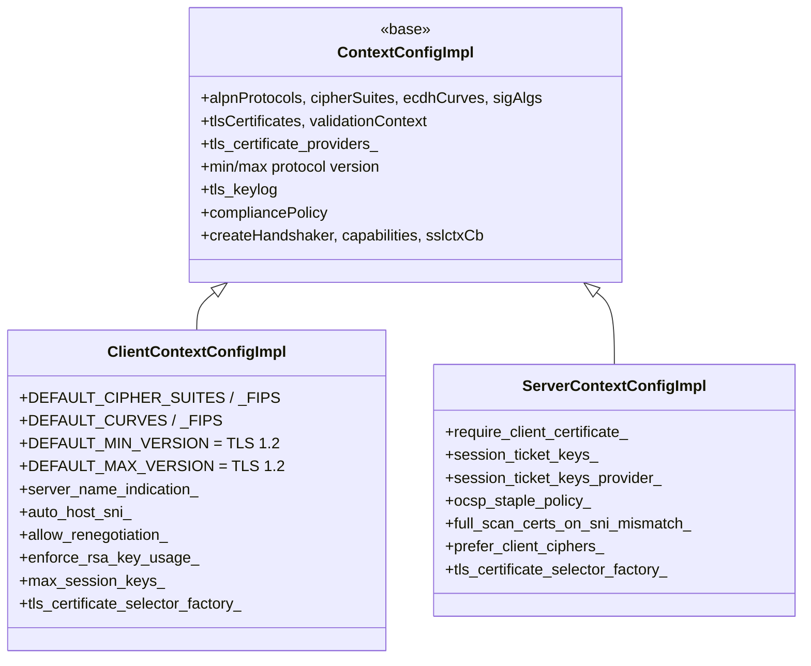

## `ContextManagerImpl` — Per-Process Owner

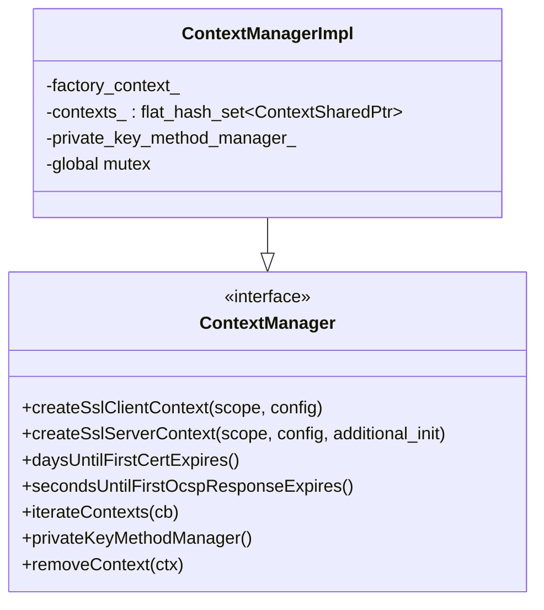

### Threading Contract

> Contexts can be allocated on the **main thread**. They can be released from **any thread** (and in practice are, since cluster information can be released from any thread). Context allocation/free is uncommon, so a global lock protects all of it.

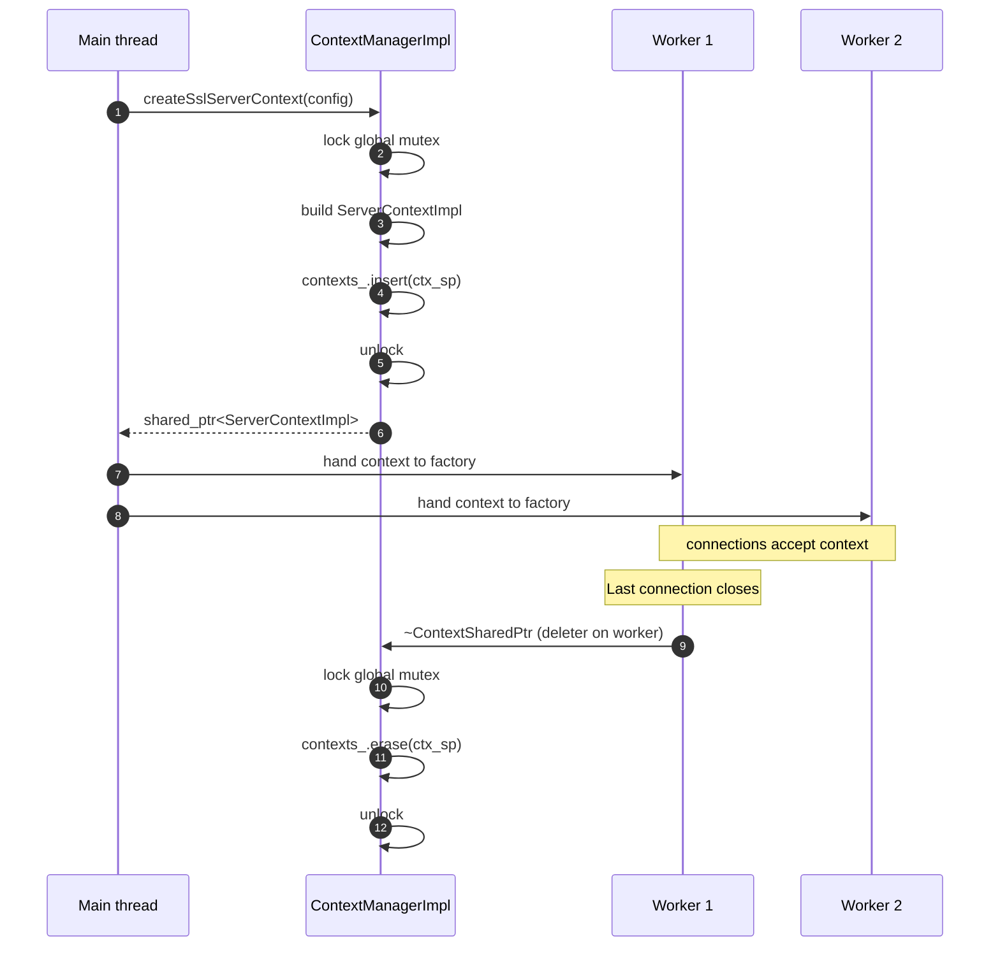

### Aggregate Stats

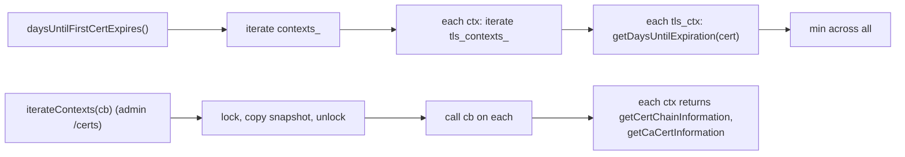

## `TlsContext` — One Per Certificate

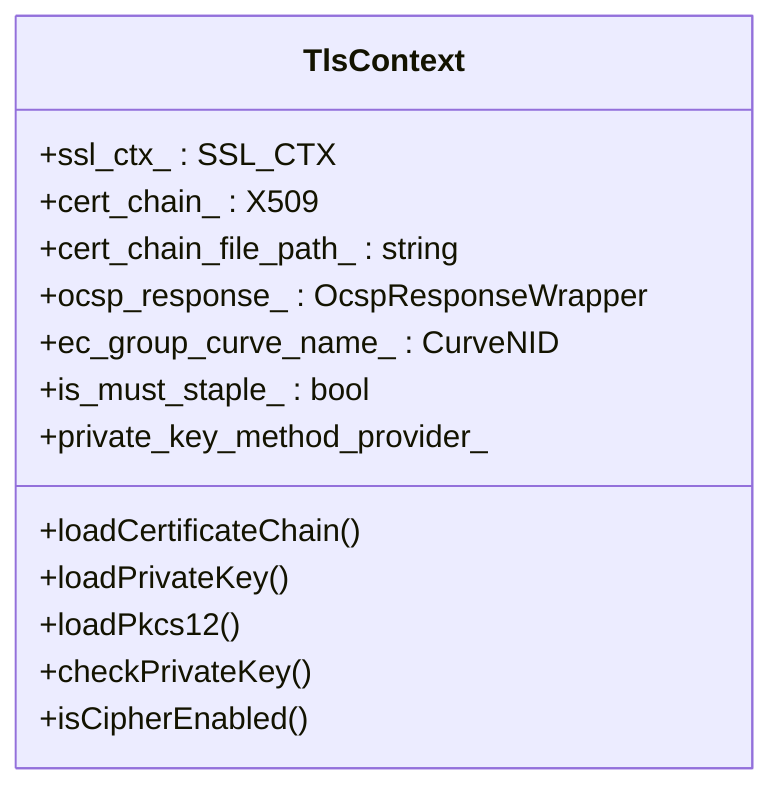

| Field | Why |
|-------|-----|
| `ssl_ctx_` | The actual BoringSSL handle |
| `cert_chain_` + `cert_chain_file_path_` | Parsed leaf cert and source path (for /certs admin) |
| `ocsp_response_` | Cached OCSP response, if any |
| `ec_group_curve_name_` | ECDSA curve identifier; lets selector quickly match client's signature_algorithms (`EC_CURVE_INVALID_NID = -1` means "not ECDSA") |
| `is_must_staple_` | Derived from the `1.3.6.1.5.5.7.1.24` extension; controls whether OCSP staple is mandatory |
| `private_key_method_provider_` | HSM / async signer (see Part 4) |

## `ContextImpl` — Abstract Base

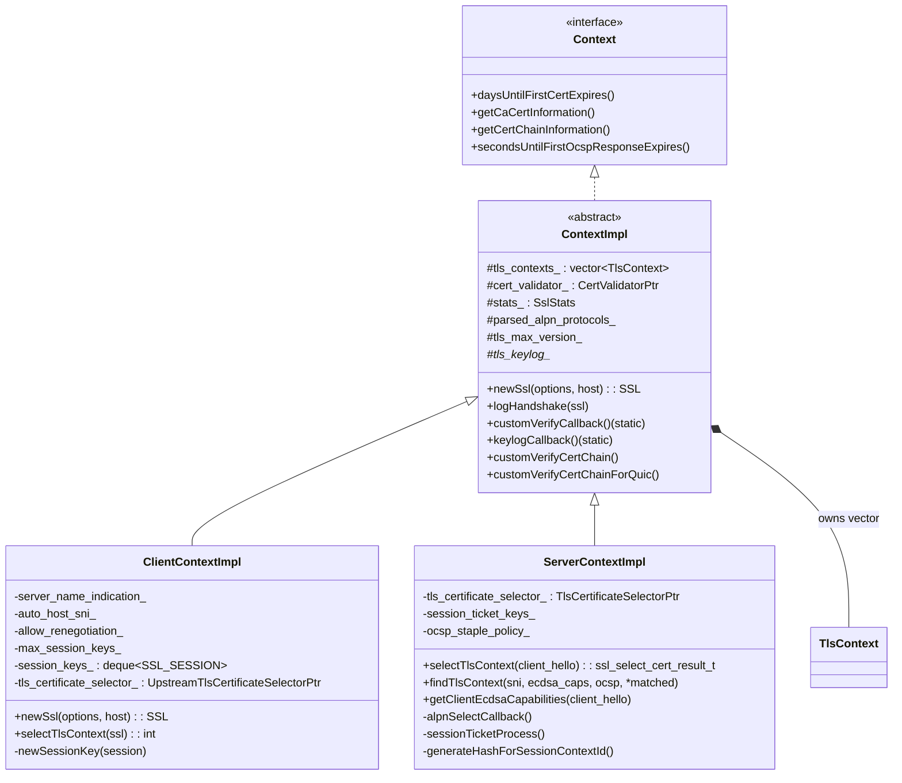

### What `ContextImpl` Does

| Function | Purpose |
|----------|---------|
| `newSsl(options, host)` | Allocate a new `SSL*` from `tls_contexts_[0].ssl_ctx_`. The `SSL_CTX` may be swapped later via `selectTlsContext`. Sets transport socket options (verify_san list, SNI override). |
| `logHandshake(ssl)` | After `SSL_do_handshake` succeeds, increments per-cipher / per-version / per-curve / per-sigalg counters via `incCounter`. Called from `SslHandshakerImpl::onSuccess`. |
| `customVerifyCallback` (static) | Wired into every `SSL_CTX` via `SSL_CTX_set_custom_verify`. Looks up `ContextImpl*` from `SSL_CTX_get_app_data`, fetches the validator, delegates to `customVerifyCertChain`. This is the path async cert validation flows through. |
| `customVerifyCertChainForQuic` | Same idea but used by QUIC's proof source path, where the chain is presented as `STACK_OF(X509)*` directly. |
| `keylogCallback` | Wired via `SSL_CTX_set_keylog_callback` when `key_log` is configured. Writes one line per session, filtered by `tls_keylog_local_` / `tls_keylog_remote_`. |

### Ex-Data Indices

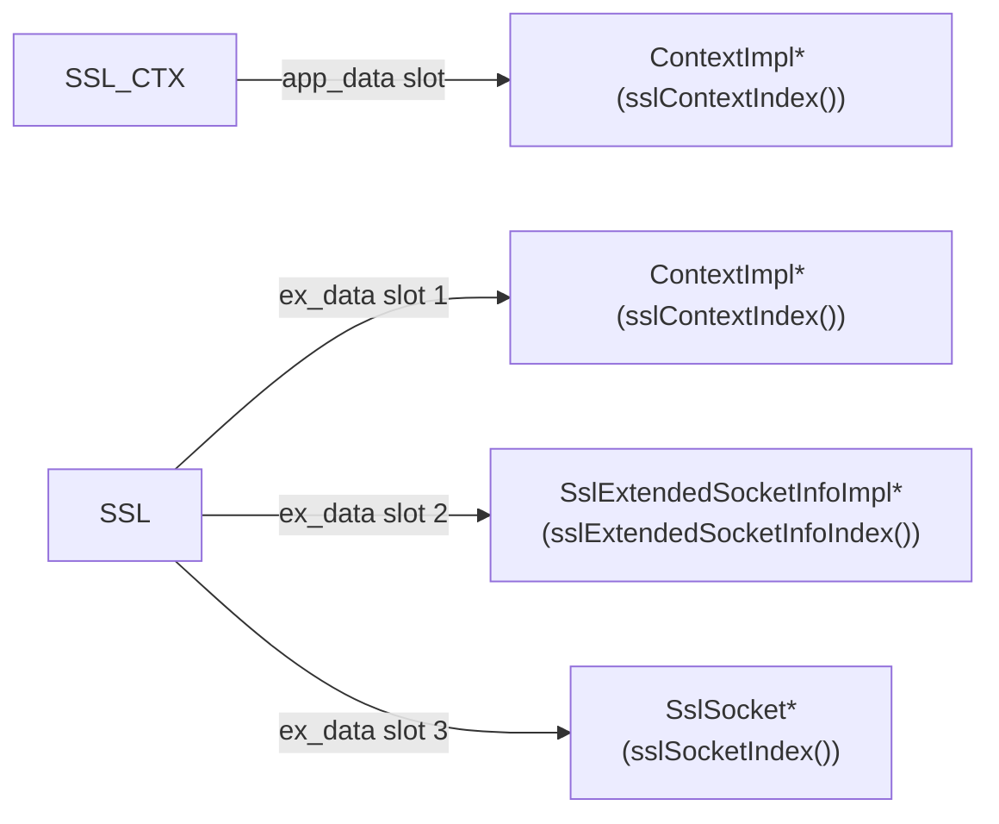

All three indices are allocated once per process via `SSL_get_ex_new_index`. They give static callback functions a way to recover the C++ objects from a raw `SSL*`.

## `ServerContextImpl` — Downstream Side

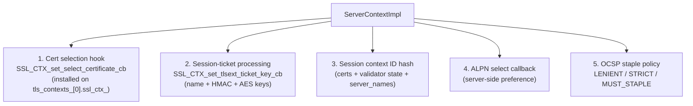

### Cert Selection Hook

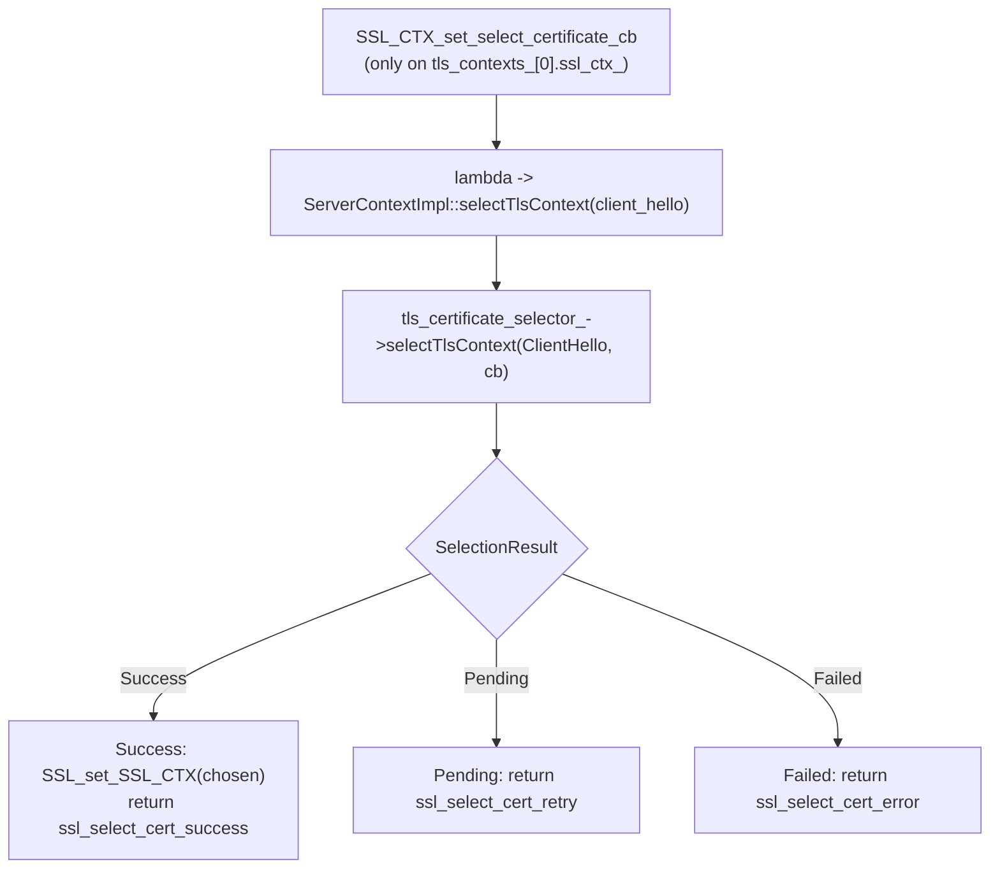

The factory hooks the callback only on the **first** `tls_contexts_[0].ssl_ctx_`. When BoringSSL processes the ClientHello, it invokes the callback there; the callback resolves the per-process `ServerContextImpl*` via `SSL_CTX_get_app_data` and dispatches to the selector.

### Session Context ID — Subtle Security Boundary

`generateHashForSessionContextId(server_names)` produces a stable 32-byte digest that BoringSSL uses to scope session resumption. It includes:

- Every cert's SHA-256.
- The validator's `updateDigestForSessionId` contribution (so changes in CA / SAN matchers break old sessions).
- The list of `server_names` from the listener filter chain.

If two listeners shared a session-ticket key but had different cert/CA configurations, a client that handshook against one could resume against the other and skip validation entirely. The digest closes that hole: BoringSSL rejects resumption when the digest doesn't match.

## `ClientContextImpl` — Upstream Side

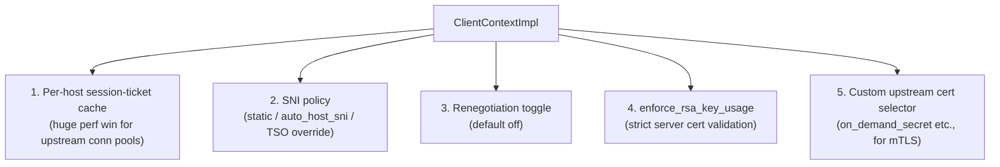

### Session Ticket Cache

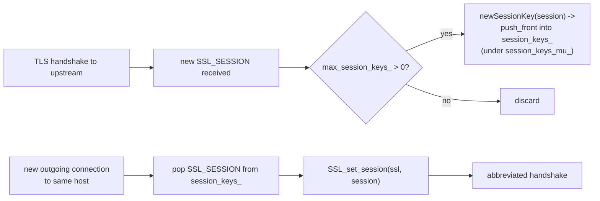

Without resumption, every new upstream connection pays a full handshake — RSA signing or ECDSA + DH which is the single most expensive thing per connection. With resumption, the handshake is a single round trip with no asymmetric crypto.

## `DefaultTlsCertificateSelector` — SNI Matcher

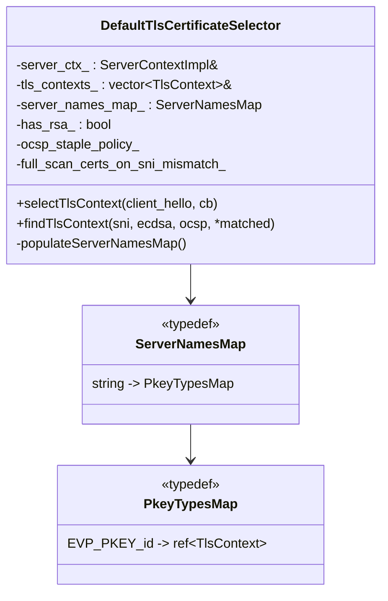

The map keys both **exact** server names and **wildcard** patterns. Wildcards are prefixed with `.` (so `*.example.com` is stored as `.example.com`) to distinguish them from exact entries. Each entry is then sub-keyed by key type (`EVP_PKEY_RSA` vs `EVP_PKEY_EC`) so RSA + ECDSA certs for the same SNI can coexist.

### Selection Algorithm

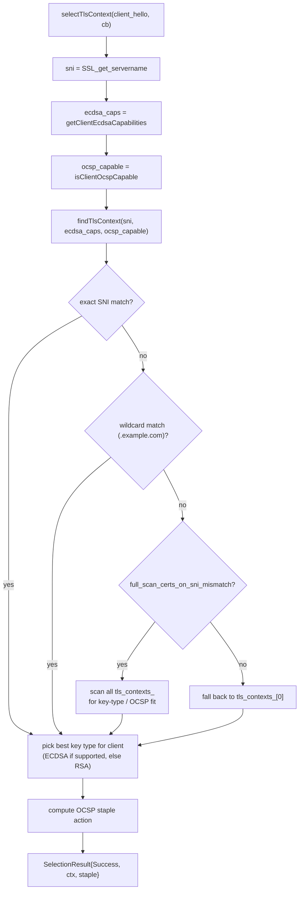

The "best key type for client" decision is **performance and compatibility** rolled together. Modern clients almost always advertise ECDSA support, in which case ECDSA wins — the signatures are smaller and faster. Old clients (and some embedded devices) only support RSA; the selector falls back transparently. The fact that this happens inside the selector rather than via separate listeners is what lets one Envoy listener serve both populations on the same port without configuration gymnastics.

## OCSP Staple Action — Decision Table

| Client `status_request` | Configured `ocsp_response` | Response fresh? | Cert `must_staple`? | Policy | Action |
|------------------------|--------------------------|-----------------|--------------------|----|--------|
| No | — | — | No | any | NoStaple |
| No | — | — | Yes | any | Fail (cert can't be used) |
| Yes | None | — | No | LENIENT_STAPLING | NoStaple |
| Yes | None | — | No | STRICT_STAPLING | Fail |
| Yes | Yes | Yes | any | any | Staple |
| Yes | Yes | No (expired) | any | LENIENT_STAPLING | NoStaple (`ocsp_staple_omitted++`) |
| Yes | Yes | No (expired) | any | STRICT_STAPLING | Fail (`ocsp_staple_failed++`) |

## Server-Side Handshake Start — Putting It Together

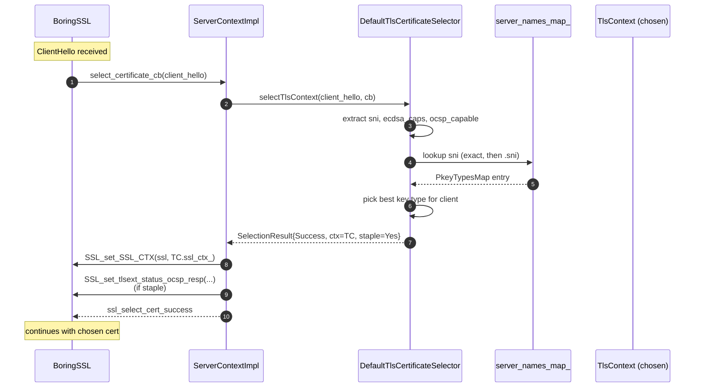

## Lookup & Decision Cheat Sheet

| Question | Answer |
|----------|--------|
| Why is `tls_contexts_` a vector? | One `SSL_CTX` per configured cert; selector picks per handshake |
| Where does cert selection actually swap the cert? | `selectTlsContext` -> `SSL_set_SSL_CTX(ssl, chosen.ssl_ctx_)` |
| What about non-SNI clients? | `findTlsContext` falls back to `tls_contexts_[0]` (or full scan if enabled) |
| Where is the cert-chain validator called? | `ContextImpl::customVerifyCallback` (static), wired in by `SSL_CTX_set_custom_verify` |
| Where do session tickets get encrypted? | `ServerContextImpl::sessionTicketProcess` |
| Where is ALPN selected? | `ServerContextImpl::alpnSelectCallback` (downstream); `SSL_set_alpn_protos` on client (upstream) |
| Where does the cipher / version stats counter increment? | `ContextImpl::logHandshake` -> `incCounter`, called from `SslHandshakerImpl::onSuccess` |
| What's the upstream equivalent of the cert selector? | `ClientContextImpl::tls_certificate_selector_` — only used by upstream `on_demand_secret` etc. |
| When is `isReady()` false? | Any SDS provider hasn't delivered yet -> `NotReadySslSocket` for new connections |
| How does session resumption stay safe across config reloads? | `generateHashForSessionContextId` mixes cert + validator state into the digest |

---

Continue with **[Part 3: Sockets, Handshaker & Data Path](OVERVIEW_PART3_sockets_handshaker_and_data_path.md)** for what happens once a context is built and a connection arrives.
