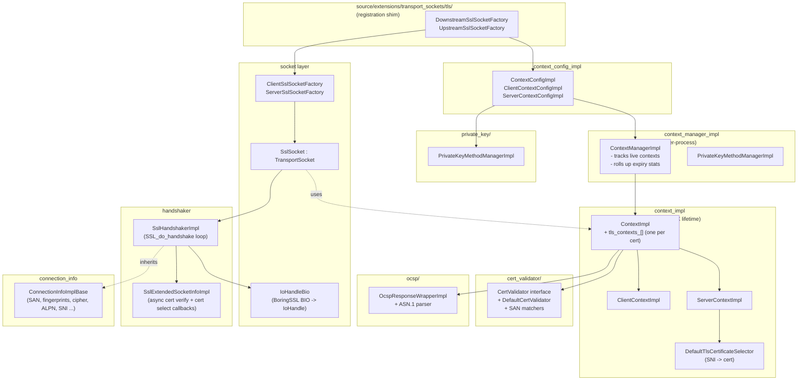
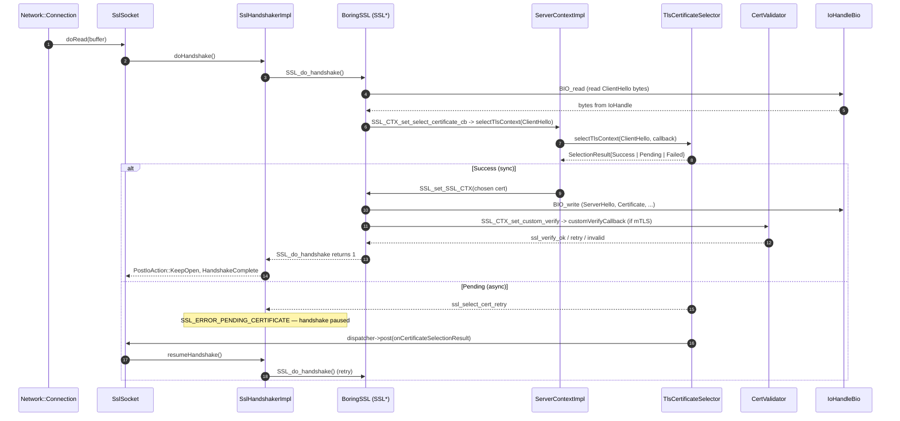
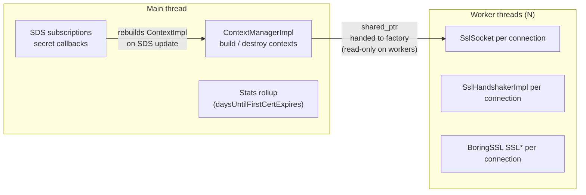

# `source/common/tls` — Envoy's TLS implementation

This folder is the heavy‑lifting half of Envoy's TLS transport socket. The thin shim that registers the transport socket extension lives in `source/extensions/transport_sockets/tls/`; this folder owns:

- `SSL_CTX` building, configuration translation, and lifecycle.
- The `Network::TransportSocket` implementations that wrap a BoringSSL `SSL*`.
- The handshake state machine (`SSL_do_handshake`, async cert selection, async cert verification).
- Peer cert validation (default + pluggable validators).
- OCSP response parsing for stapling.
- Private‑key provider plumbing for HSM / async key operations.
- Per‑connection accessors (`Ssl::ConnectionInfo`).

Backed by BoringSSL by default; AWS‑LC is supported via `aws_lc_compat.h` (currently only on `ppc64le`).

### Why split between `source/common/tls/` and `source/extensions/transport_sockets/tls/`?

The split is **registration vs. implementation**. The extension folder only contains the factory glue that registers `envoy.transport_sockets.tls` with Envoy's extension registry — a thin shim that builds a `ContextConfigImpl` from proto and asks the manager for a context. Every meaningful line of code (the `SSL_CTX` lifecycle, the handshake state machine, the validator, OCSP, key providers) lives here in `common/`. Splitting this way means non‑extension code in Envoy can depend on `common/tls/` without pulling in extension wiring, which matters for the QUIC transport socket and for unit tests.

### What this folder is *not*

It is not the QUIC TLS implementation (that lives in `source/common/quic/`, although it reuses pieces of `ContextImpl` for proof source / cert chains). It is not the `Ssl::*` interface definitions (those live in `envoy/ssl/`). And it is not the *plug‑in implementations* for SAN matchers, SPIFFE validation, or HSM key providers — those are in `source/extensions/`, and this folder only defines the interfaces they implement.

## Per‑topic deep dives

| Topic | File | Covers |
|---|---|---|
| Socket layer | [`socket_layer.md`](socket_layer.md) | `ssl_socket.{h,cc}`, `client_ssl_socket.{h,cc}`, `server_ssl_socket.{h,cc}`, `io_handle_bio.{h,cc}` |
| Handshaker | [`handshaker.md`](handshaker.md) | `ssl_handshaker.{h,cc}` |
| TLS contexts | [`context.md`](context.md) | `context_impl.{h,cc}`, `client_context_impl.{h,cc}`, `server_context_impl.{h,cc}`, `default_tls_certificate_selector.{h,cc}` |
| Config translation | [`config.md`](config.md) | `context_config_impl.{h,cc}`, `context_manager_impl.{h,cc}` |
| Connection info | [`connection_info.md`](connection_info.md) | `connection_info_impl_base.{h,cc}` |
| Utilities | [`utilities.md`](utilities.md) | `utility.{h,cc}`, `cert_compression.{h,cc}`, `stats.{h,cc}`, `aws_lc_compat.h` |
| Cert validation | [`cert_validator/README.md`](cert_validator/README.md) | `cert_validator/` subfolder |
| OCSP | [`ocsp/README.md`](ocsp/README.md) | `ocsp/` subfolder |
| Private keys | [`private_key/README.md`](private_key/README.md) | `private_key/` subfolder |
| BoringSSL surface | [`BORINGSSL_API.md`](BORINGSSL_API.md) | The BoringSSL types, functions, and callbacks Envoy actually uses |
| Cases & scenarios | [`CASES.md`](CASES.md) | Bullet‑point answers to "what happens when X" |

---

## Landscape — how the layers fit together

The TLS implementation has six conceptual layers stacked on top of each other. From outside‑in: the **registration shim** that listeners and clusters consume, the **config translator** that converts protobuf into typed C++, the **context manager** that owns every live context for the process, the **`SSL_CTX` bundle** that holds the actual BoringSSL state, the **socket layer** that adapts the bundle to per‑connection use, and the **handshaker** that drives BoringSSL's state machine through Envoy's event loop. Reading the diagram top‑down is the natural way to follow a TLS configuration from a listener YAML all the way to bytes on the wire.

Reading top‑down:

1. **Config arrives** as `Downstream/UpstreamTlsContext` proto → `ContextConfigImpl` translates it to internal types (cert/key paths or SDS providers, cipher list, validation rules, etc.).
2. **`ContextManagerImpl`** is the per‑process owner of every live `ContextImpl`; it iterates them for expiration stats and tears them down on reload.
3. **`ContextImpl` builds one `SSL_CTX` per cert** (so the same `CommonTlsContext` can have RSA + ECDSA certs simultaneously). `ServerContextImpl` adds the SNI selector hook (`SSL_CTX_set_select_certificate_cb`); `ClientContextImpl` adds session‑ticket caching for upstream resumption.
4. **`ClientSslSocketFactory` / `ServerSslSocketFactory`** wrap a context + watch its SDS providers for hot reload.
5. **`SslSocket`** is the per‑connection `TransportSocket` Envoy hands to a `Network::Connection`. It owns an `SslHandshakerImpl` (which wraps a BoringSSL `SSL*`) and routes data through an `IoHandleBio` (custom BIO that bridges BoringSSL's BIO API to Envoy's `IoHandle`).
6. **`SslHandshakerImpl`** runs `SSL_do_handshake` and yields to the worker dispatcher whenever BoringSSL returns `SSL_ERROR_WANT_*`. It also extends `ConnectionInfoImplBase`, so the same object is both the handshake state machine and the `Ssl::ConnectionInfo` interface exposed to filters.
7. **`CertValidator`** is called by BoringSSL through `SSL_CTX_set_custom_verify` to verify the peer's cert chain — supports async validation via `ValidateResultCallback`.

The unusual move here is **putting the SNI selector logic inside `ServerContextImpl`** rather than in the socket. That decision is what lets the same context serve thousands of certs while keeping per‑connection state tiny — every connection just gets an `SSL*` pointing at one chosen `SSL_CTX`, with no per‑connection cert storage of its own.

---

## A connection in 30 seconds (downstream / server)

The sequence below captures the whole life of an incoming TLS handshake. The interesting bits are (1) **the certificate isn't chosen until the ClientHello arrives** — the selector hook fires from inside BoringSSL during early handshake processing, and (2) **the handshake can suspend and resume** when the selector returns `Pending` (because the cert is being fetched from SDS), when the validator returns `Pending` (async mTLS validation), or when an HSM is signing. The sync and async paths both end at the same place: `SSL_do_handshake` returns `1` and `onSuccess` fires.

Same picture, mirrored, runs upstream — except the cert mapper / selector applies to the *client* cert presented to the upstream server, ALPN is *requested* rather than *selected*, and `ClientContextImpl` adds a per‑host session‑ticket cache via `SSL_CTX_sess_set_new_cb`.

---

## Threading model

Envoy's worker model is "one I/O thread per CPU core, no locks on the hot path". The TLS code respects that: contexts (heavy, shared) are built and torn down on **main**, and per‑connection objects (`SslSocket`, `SslHandshakerImpl`, `SSL*`) live entirely on **one worker thread**. The only cross‑thread synchronisation point is `ContextManagerImpl`'s global mutex, which is acceptable because context construction is rare (config load and SDS refresh).

- `ContextImpl` / `SSL_CTX` are **built on main thread**, **shared (read‑only‑ish) across workers**. `SSL_CTX` itself is thread‑safe for the operations Envoy needs.
- Each connection's `SSL*` is owned by exactly one worker — never crosses thread boundaries.
- On SDS update, a new `ContextImpl` is built on main and swapped into the factory under a mutex; existing connections keep their old context until they close.
- `ContextManagerImpl::removeContext` can be called from any thread; the manager takes a global lock because context creation/free is infrequent.

---

## Async escape hatches

BoringSSL's handshake API is *synchronous* by design — `SSL_do_handshake` either completes or returns `WANT_READ`/`WANT_WRITE`. To plug *external* asynchrony (an SDS round trip, a remote validator, an HSM signing op) into that synchronous API, BoringSSL provides three special return codes that Envoy uses as suspension points. The contract is identical for all three: BoringSSL returns the special code, Envoy stops driving the state machine, an *external callback* fires later on the worker dispatcher, and Envoy then re‑enters `SSL_do_handshake` from where it left off. This is what makes the on‑demand cert selector, dynamic‑module validators, and HSM key providers possible without blocking the worker.

There are two places where the BoringSSL state machine can be suspended and resumed asynchronously. Both go through `SslExtendedSocketInfoImpl` in `ssl_handshaker.h`:

1. **Async cert selection** — `SSL_ERROR_PENDING_CERTIFICATE`. Used by the on‑demand cert selector. Resumed via `CertificateSelectionCallbackImpl::onCertificateSelectionResult`.
2. **Async cert verification** — `SSL_ERROR_WANT_CERTIFICATE_VERIFY`. Used when a `CertValidator` (typically a dynamic module) returns `ValidationStatus::Pending`. Resumed via `ValidateResultCallbackImpl::onCertValidationResult`.

A third quasi‑async path is **async private‑key operations** (`SSL_ERROR_WANT_PRIVATE_KEY_OPERATION`), routed through `Ssl::PrivateKeyConnectionCallbacks::onPrivateKeyMethodComplete` on the `SslSocket`. See [`private_key/README.md`](private_key/README.md).

The cancellation path is just as important. If the connection dies while waiting, the destructor of `SslExtendedSocketInfoImpl` calls `onSslHandshakeCancelled` on whichever callback is in flight, which flips a flag so the eventual external completion becomes a no‑op instead of touching freed memory.

---

## File map at a glance

| File | Role |
|---|---|
| `ssl_socket.{h,cc}` | `Network::TransportSocket` impl shared by client & server |
| `client_ssl_socket.{h,cc}` | Upstream factory wrapping a `ClientContextImpl` |
| `server_ssl_socket.{h,cc}` | Downstream factory wrapping a `ServerContextImpl` |
| `io_handle_bio.{h,cc}` | Custom BoringSSL `BIO` over `Network::IoHandle` (no raw fd dependency) |
| `ssl_handshaker.{h,cc}` | `SslHandshakerImpl` + async callbacks + extended socket info |
| `context_impl.{h,cc}` | `ContextImpl` base — `SSL_CTX` build, ALPN, key log, custom verify |
| `client_context_impl.{h,cc}` | Upstream `SSL_CTX` build, session ticket cache, SNI on egress |
| `server_context_impl.{h,cc}` | Downstream `SSL_CTX` build, cert selector hook, session ticket keys |
| `default_tls_certificate_selector.{h,cc}` | Built‑in SNI selector — used unless `custom_tls_certificate_selector` is set |
| `context_config_impl.{h,cc}` | proto `CommonTlsContext` → internal config (CA, certs, ciphers, ALPN ...) |
| `context_manager_impl.{h,cc}` | Per‑process owner of every live `ContextImpl` |
| `connection_info_impl_base.{h,cc}` | `Ssl::ConnectionInfo` accessors (SAN, fingerprint, cipher, version ...) |
| `stats.{h,cc}` | `SslStats` counter struct and daily expiry gauge factory |
| `utility.{h,cc}` | X.509 helpers (SAN extraction, fingerprints, expiry, error formatting) |
| `cert_compression.{h,cc}` | RFC 8879 TLS cert compression (Brotli + Zlib) for BoringSSL |
| `aws_lc_compat.h` | API translation shims for building with AWS‑LC instead of BoringSSL |
| `cert_validator/` | `CertValidator` interface + default impl + SAN matchers |
| `ocsp/` | OCSP response parsing for stapling |
| `private_key/` | Pluggable private‑key providers (HSM / async key ops) |

---

## Stats (from `stats.h`)

Counters under `<prefix>.ssl.`:
`connection_error`, `handshake`, `session_reused`, `no_certificate`, `fail_verify_no_cert`, `fail_verify_error`, `fail_verify_san`, `fail_verify_cert_hash`, `ocsp_staple_failed`, `ocsp_staple_omitted`, `ocsp_staple_requests`, `ocsp_staple_responses`, `was_key_usage_invalid`.

Tagged counters: per cipher, per version, per curve, per signature algorithm.

Gauges: `days_until_first_cert_expiring` (per cert name) via `createCertificateExpirationGauge`.

---

## Quick reading order for a new engineer

1. `socket_layer.md` — what does a TLS connection look like from the outside?
2. `handshaker.md` — how does the state machine work?
3. `context.md` — what is an `SSL_CTX` here, and why is there a vector of them?
4. `config.md` — how does a proto become an `SSL_CTX`?
5. `cert_validator/README.md` — what plugs in here for mTLS?
6. `BORINGSSL_API.md` — what BoringSSL types / functions / callbacks are actually in use, and where?
7. `CASES.md` — verify intuition against concrete scenarios.

### Mental model in one paragraph

Envoy's TLS code is a thin envelope around BoringSSL. The envelope's job is **glue**: turn proto into `SSL_CTX`, plug Envoy's `IoHandle` into BoringSSL's `BIO`, drive `SSL_do_handshake` from libevent, and give filter chains a typed view of the live session. Everything that *isn't* glue is either a pluggable extension point (cert selectors, cert mappers, validators, key providers) or a workaround for BoringSSL not being natively async (the three suspension‑and‑resume escape hatches). Once you internalise that split, the file layout reads itself: `context*` builds `SSL_CTX`, `socket*` wraps `SSL*`, `handshaker` drives the state machine, and everything under a subfolder is "something pluggable hanging off the side".
