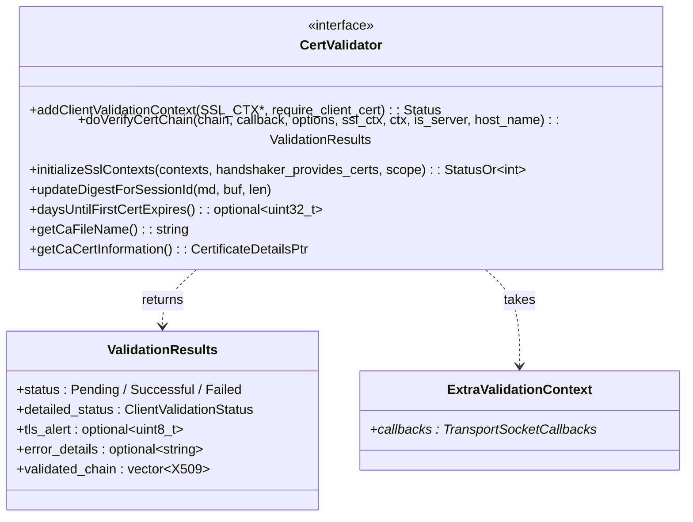
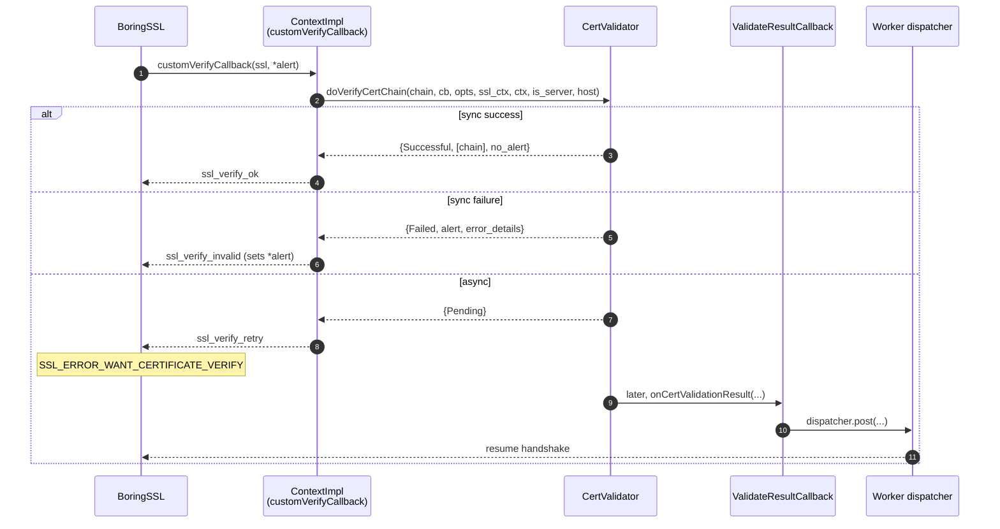
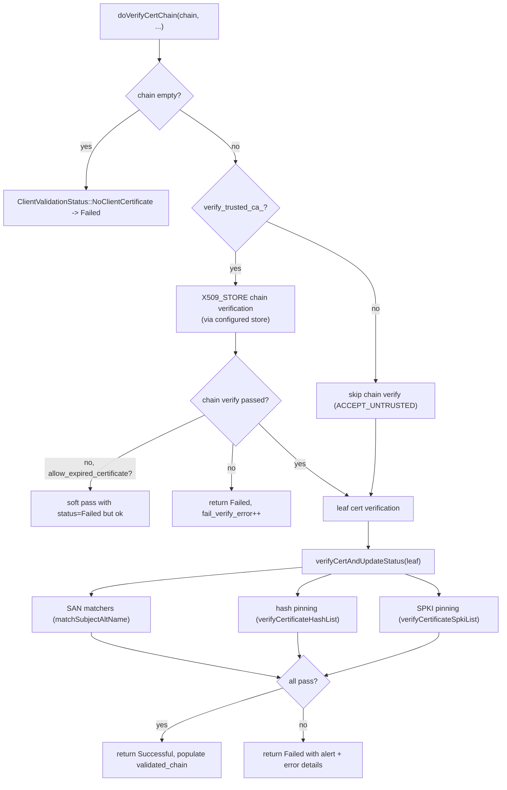
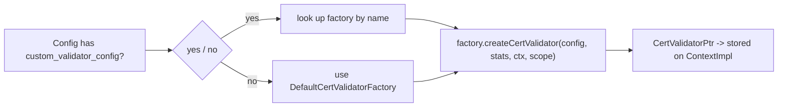
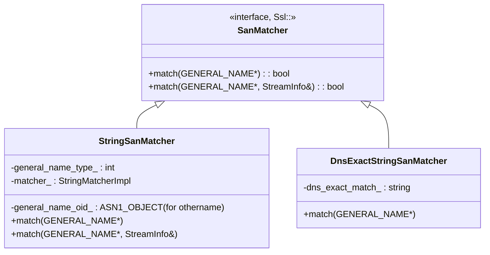
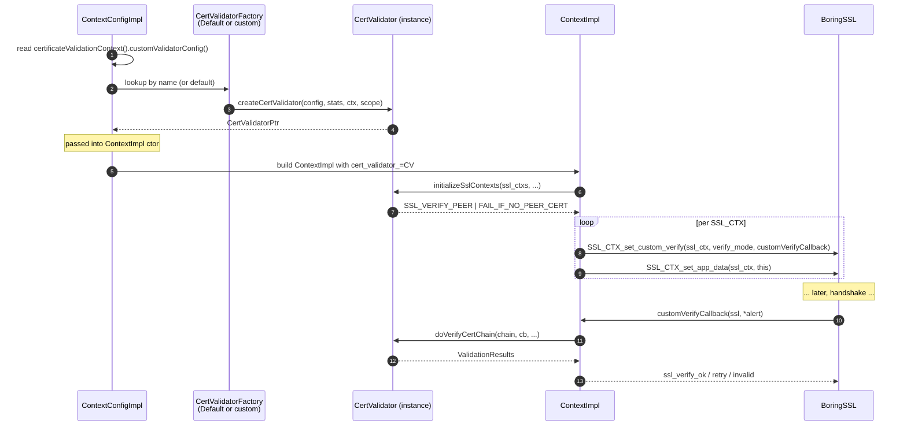
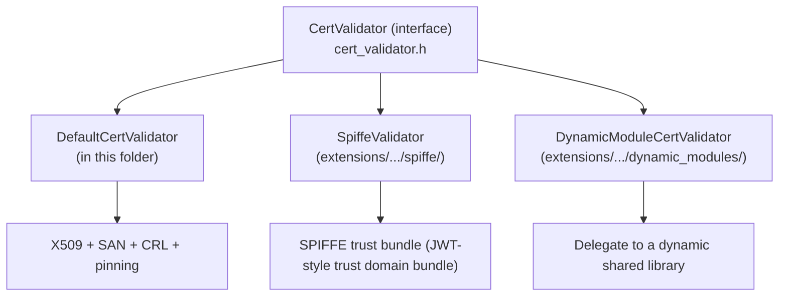

# Cert validator — `source/common/tls/cert_validator/`

> Files: `cert_validator.h`, `default_validator.{h,cc}`, `factory.{h,cc}`, `san_matcher.{h,cc}`

The peer certificate validation layer. Sits between BoringSSL's `SSL_CTX_set_custom_verify` callback and the actual policy decisions ("is this cert trusted, does its SAN match, is the hash on my pinning list, is the CRL OK"). Pluggable via `CommonTlsContext.validation_context.custom_validator_config`.

### Why bypass BoringSSL's built‑in verifier?

BoringSSL's default verifier (`X509_verify_cert` via `X509_STORE_CTX`) is fine for "trust this CA bundle", but Envoy needs more: SAN matchers (allow only specific peer identities), hash pinning, SPKI pinning, CRL checks, and — critically — **asynchronous** validation (handing the chain off to an external policy engine). The interface here is what makes those extensions possible without surgery on BoringSSL.

This folder has the abstract interface (`CertValidator`), the **default** implementation (`DefaultCertValidator`), the **factory base** (`CertValidatorFactory`), and the **SAN matcher** type system (`san_matcher.{h,cc}`).

Other validators live elsewhere — they all implement `CertValidator` from here:
- `source/extensions/transport_sockets/tls/cert_validator/spiffe/` — SPIFFE trust bundle validator.
- `source/extensions/transport_sockets/tls/cert_validator/dynamic_modules/` — delegates validation to a dynamic shared library (see [`/api/.../cert_validator/dynamic_modules/`](../../../../api/envoy/extensions/transport_sockets/tls/cert_validator/dynamic_modules/v3/dynamic_modules.proto)).

---

## Architecture overview

```mermaid
flowchart TB
    subgraph Interface["This folder"]
      CV["CertValidator (interface)"]
      Fac["CertValidatorFactory (base)"]
      DV["DefaultCertValidator"]
      SAN["SanMatcher / StringSanMatcher / DnsExactStringSanMatcher"]
    end

    subgraph Plugins["Other folders"]
      SPIFFE["spiffe validator<br/>(extensions/.../spiffe/)"]
      DYN["dynamic_modules validator<br/>(extensions/.../dynamic_modules/)"]
    end

    subgraph Caller["Caller surface"]
      CTX["ContextImpl<br/>+ ServerContextImpl<br/>+ ClientContextImpl"]
      BSSL["BoringSSL"]
    end

    DV --|> CV
    SPIFFE --|> CV
    DYN --|> CV
    Fac -- "creates" --> DV
    Fac -- "creates" --> SPIFFE
    Fac -- "creates" --> DYN

    CTX --> CV : via cert_validator_
    BSSL --> CTX : SSL_CTX_set_custom_verify -><br/>ContextImpl::customVerifyCallback
    CTX --> CV : doVerifyCertChain
    DV --> SAN : matchSubjectAltName
```

---

## `CertValidator` — the interface

`cert_validator.h:50‑114`.



### Method roles

| Method | Called when | Returns |
|---|---|---|
| `initializeSslContexts(contexts, ...)` | Once per context at build time | The `SSL_VERIFY_*` mode to install (`SSL_VERIFY_NONE` / `_PEER` / `_FAIL_IF_NO_PEER_CERT`) |
| `addClientValidationContext(ssl_ctx, require_client_cert)` | Server‑side config of one `SSL_CTX` | Status. Default impl also populates client CA names |
| `doVerifyCertChain(chain, callback, ...)` | Per handshake from BoringSSL custom_verify | `ValidationResults` — sync or async |
| `updateDigestForSessionId(md, buf, len)` | Server‑side, computing session context ID | Updates `md` to bind sessions to validator config |
| `daysUntilFirstCertExpires` / `getCaFileName` / `getCaCertInformation` | Admin / stats rollup | CA‑cert introspection |

### `doVerifyCertChain` async return path



The handshaker side of this is in [`handshaker.md`](../handshaker.md). The validator side is just: return `Pending` and remember the callback for later.

The "return `Pending`" contract is the most important thing about this interface. It's how Envoy plugs **arbitrary** async work into a synchronous BoringSSL primitive without ever blocking a worker thread. A SPIFFE federated trust check could spend 50ms on an RPC; a dynamic‑module validator could do PKI policy evaluation. Both look identical to BoringSSL: return `Pending`, callback fires later, handshake resumes.

---

## `DefaultCertValidator` — the default implementation

`default_validator.h:35‑127`. This is what's used when `custom_validator_config` is **not** set on `CertificateValidationContext`. It supports the standard X.509 + SAN + CRL + pinning verification.

### Inputs (config)

From `CertificateValidationContextConfig`:

| Field | Used for |
|---|---|
| `trusted_ca` | Built into an `X509_STORE` for chain validation |
| `crl` | Added to the store as `X509_CRL`s |
| `match_typed_subject_alt_names` | Matchers in `subject_alt_name_matchers_` |
| `verify_certificate_hash` | `verify_certificate_hash_list_` (SHA‑256 of DER cert) |
| `verify_certificate_spki` | `verify_certificate_spki_list_` (SHA‑256 of SPKI) |
| `allow_expired_certificate` | Toggles whether `X509_V_ERR_CERT_HAS_EXPIRED` is treated as a soft pass |
| `trust_chain_verification` | `VERIFY_TRUST_CHAIN` vs `ACCEPT_UNTRUSTED` |
| `auto_sni_san_match` | If true and no SAN matchers configured, validates SNI against peer SANs |

### `doVerifyCertChain` flow



### Helper functions

`default_validator.h:62‑106` exposes some helpers that are also reused elsewhere:

- `verifyCertificate(cert, verify_san_list, matchers, stream_info, *error, *alert)` — single‑cert verification, used by SPIFFE validator too.
- `verifyCertificateHashList(cert, expected_hashes)` — static. SHA‑256 of the DER cert (binary‑encoded pin).
- `verifyCertificateSpkiList(cert, expected_hashes)` — static. SHA‑256 of the SPKI (key‑only pin, survives cert reissuance).
- `verifySubjectAltName(cert, names)` — static. Legacy string‑equality SAN matching.
- `matchSubjectAltName(cert, stream_info, matchers)` — static. Full `SanMatcher` based matching.

### `addClientValidationContext`

Server‑side only. Installs the CA name list that's sent to the client in the `CertificateRequest` message (so the client knows which CA's cert it should present). Also sets `SSL_VERIFY_PEER | SSL_VERIFY_FAIL_IF_NO_PEER_CERT` if `require_client_cert` is true.

### `updateDigestForSessionId`

Hashes every part of the config into the session context ID. **Critical**: if you reconfigure `trusted_ca` or `match_typed_subject_alt_names`, old TLS sessions cannot resume — they'd be validated under stale rules.

---

## `CertValidatorFactory` — the plug‑in registry

`factory.h:13‑33`. Registered factories all live under category `envoy.tls.cert_validator`. `getCertValidatorName(config)` reads the validator name from the config (defaults to the built‑in `envoy.tls.cert_validator.default` when not set).



The default factory (`DefaultCertValidatorFactory`) is declared via `DECLARE_FACTORY` in `default_validator.h:129` and constructs `DefaultCertValidator`.

---

## `SanMatcher` — SAN matching machinery

`san_matcher.h:23‑89`. Two concrete types:



### Why two types?

Because **DNS SAN equality is not regular string equality** — it's RFC 6125 (case‑insensitive, label‑aware). Other SAN types (URI, email, IP, othername, otherName) use the regular `StringMatcher` (exact/prefix/suffix/regex/contains).

`StringSanMatcher` has a runtime assertion that `general_name_type != GEN_DNS || match_pattern_case != Exact` — exact DNS matchers must use `DnsExactStringSanMatcher` instead, which calls `Utility::dnsNameMatch` for RFC 6125 semantics.

This is a "**defensive type system**" choice. If exact DNS matching used `StringSanMatcher` with case‑sensitive `==`, a peer presenting `EXAMPLE.com` would fail when `example.com` was configured, and a peer presenting `foo.example.com` would also fail when `*.example.com` was configured. Both are real interoperability problems. By making the type system enforce "DNS exact must use the RFC 6125 matcher", the bug becomes a compile/assert error instead of a silent connectivity issue.

### `createStringSanMatcher`

`san_matcher.h:87` — factory entry point. Translates a `SubjectAltNameMatcher` proto into the right concrete matcher. Used by `ContextConfigImpl` when parsing `match_typed_subject_alt_names`.

### The two‑arg `match`

The variant that takes `StreamInfo&` is used when the matcher's `StringMatcher` references **stream context** (e.g. compare against a downstream header). Default impl ignores `stream_info` and delegates to the single‑arg version.

---

## How `DefaultCertValidator` is wired in



---

## Plug‑in landscape

The validator is the **biggest extension surface** in `common/tls/`. Three production validators exist today and each one represents a fundamentally different trust model: built‑in PKI (X.509 + SAN), SPIFFE federated workload identity, and bring‑your‑own policy via dynamic modules. New validators just implement `CertValidator` from this folder; nothing else changes.



Which validator runs at handshake time is decided **once at config time** in `ContextConfigImpl`, based on `CertificateValidationContextConfig::customValidatorConfig()` (proto field `custom_validator_config` on `CertificateValidationContext`).

---

## Cheat sheet

| Question | Answer |
|---|---|
| Where is peer cert validation called? | `ContextImpl::customVerifyCallback` → `cert_validator_->doVerifyCertChain` |
| What's the default behaviour? | `DefaultCertValidator` — full X.509 chain validation + SAN match + pinning |
| How do I add an async validator? | Implement `CertValidator`, return `ValidationStatus::Pending` and remember the callback |
| Where do SAN matchers live? | `san_matcher.{h,cc}` — `StringSanMatcher` for non‑DNS, `DnsExactStringSanMatcher` for exact DNS |
| Where is RFC 6125 DNS matching? | `Utility::dnsNameMatch`, called from `DnsExactStringSanMatcher` |
| Where is hash pinning? | `DefaultCertValidator::verifyCertificateHashList` (cert DER hash) and `verifyCertificateSpkiList` (SPKI hash) |
| Why hash session context ID against validator config? | So config changes invalidate cached sessions |
| Can I disable chain verification? | Yes — set `trust_chain_verification = ACCEPT_UNTRUSTED` on the CVC |
