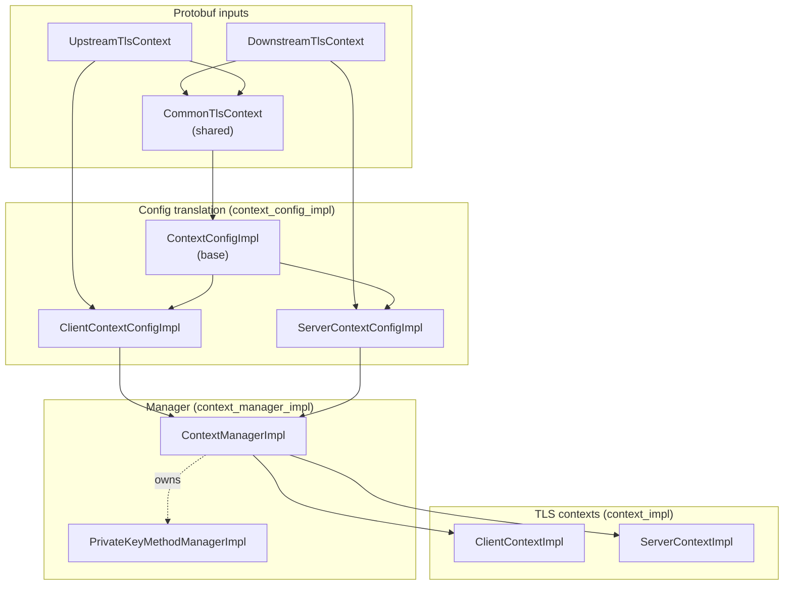
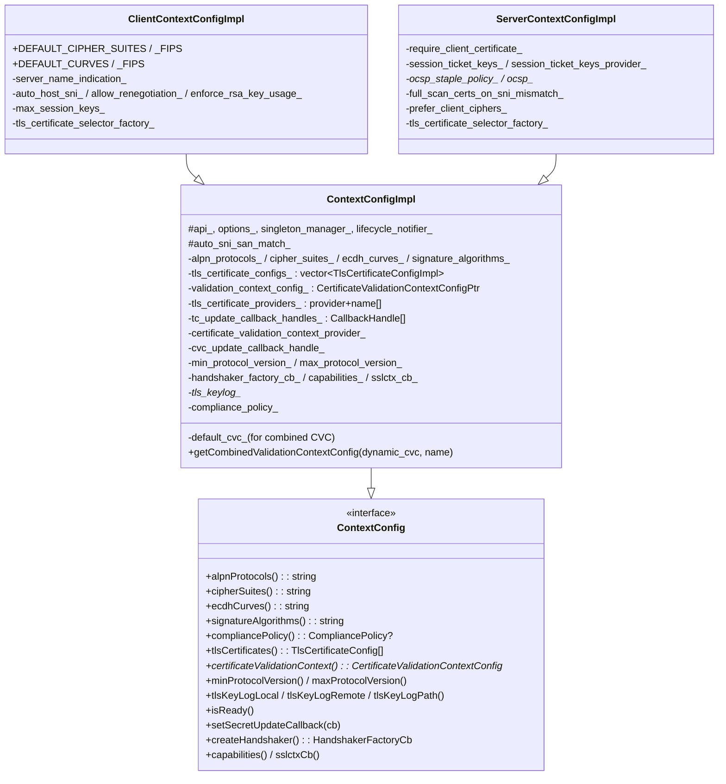
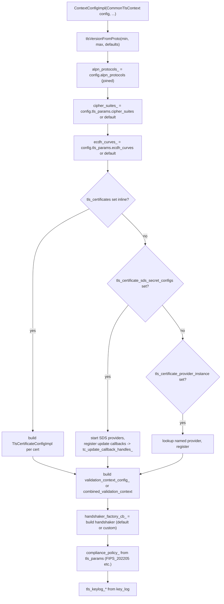
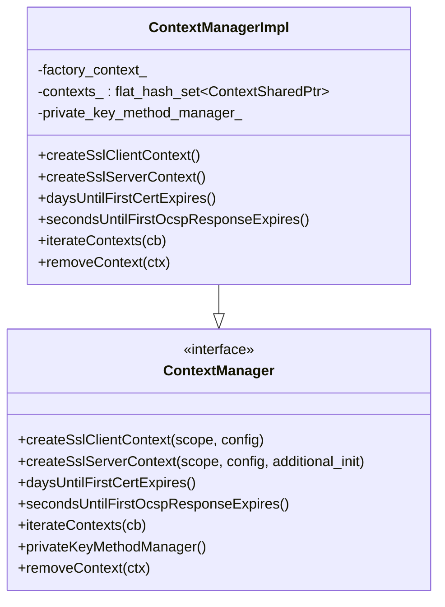
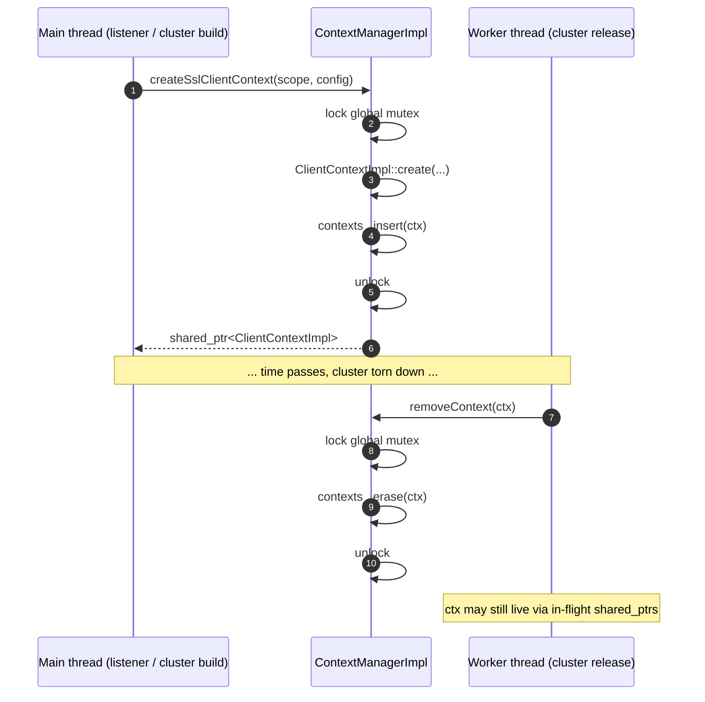
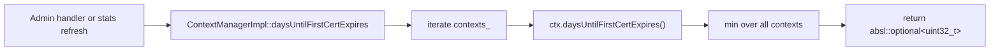
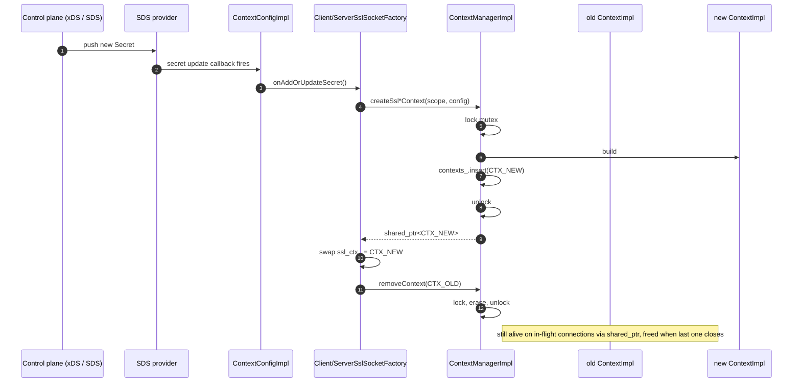

# Config translation & context management

> Files: `context_config_impl.{h,cc}`, `context_manager_impl.{h,cc}`

These two together form the **bridge between protobuf and `SSL_CTX`**. `ContextConfigImpl` translates `CommonTlsContext` (and its server / client wrappers) into the strongly‑typed internal config that `ContextImpl` consumes. `ContextManagerImpl` is the per‑process owner of every live `ContextImpl`.

### Why the split?

Translation is **expensive and synchronous** (PEM parsing, SDS fetching, validator factory instantiation). It happens once per listener/cluster at config load (or on SDS update) on the main thread. Building the actual `SSL_CTX` is *also* expensive (cipher list compilation, CA store population, OCSP response parsing). Splitting "translate proto" from "build context" buys two things: (1) the translated config can be **inspected and tested** without touching BoringSSL, and (2) the manager can dedupe identical contexts by hashing the translated config, so two listeners with the same TLS settings share one `SSL_CTX`.

### Lifecycle in one sentence

xDS pushes proto → `ContextConfigImpl::create` translates it → manager builds a `Client`/`ServerContextImpl` → factory caches a `shared_ptr` → workers see it on next `createTransportSocket`.

---

## Layered view



Translation is one‑shot at config time; the manager keeps a `flat_hash_set` of contexts for the life of the process.

The five layers are deliberately kept *unidirectional* — proto flows into config, config flows into context, context flows into manager. Nothing flows back the other way. That makes the wiring easy to reason about: a misconfigured cipher in proto only ever affects the matching `SSL_CTX`, never the manager or the wider Envoy state.

---

## `ContextConfigImpl` — proto → internal config

`context_config_impl.h:33‑139`. Implements `Ssl::ContextConfig`. The exposed interface (what `ContextImpl` reads):



(`ServerContextConfigImpl` is declared in `server_context_config_impl.h` — same layout pattern, omitted here for brevity.)

### What `ContextConfigImpl` does at construction (high level)



### `isReady()`

The critical predicate used by the socket factory. Three sub‑conditions:

```cpp
bool tls_is_ready =
    (tls_certificate_providers_.empty() || !tls_certificate_configs_.empty());
bool combined_cvc_is_ready =
    (default_cvc_ == nullptr || validation_context_config_ != nullptr);
bool cvc_is_ready = (certificate_validation_context_provider_.provider_ == nullptr ||
                     default_cvc_ != nullptr || validation_context_config_ != nullptr);
return tls_is_ready && combined_cvc_is_ready && cvc_is_ready;
```

i.e. **"all the SDS providers I'm waiting on have delivered at least one secret."** If false, `ServerSslSocketFactory::createDownstreamTransportSocket()` hands out a `NotReadySslSocket` instead.

This is one of the most user‑visible parts of TLS configuration: a listener that boots before its SDS server has responded will accept TCP connections but immediately fail TLS with `"secret not ready"`. The fix is almost always to make SDS reach a deliverable state — wait for the control plane, fix a typo in the secret name, or pre‑load a fallback inline cert. The counter `downstream_context_secrets_not_ready` lights up exactly this scenario.

### `setSecretUpdateCallback`

The factory registers itself; on any SDS secret update, the registered callback fires and rebuilds the context. The handles in `tc_update_callback_handles_` and `cvc_update_callback_handle_` keep the subscriptions alive.

### `getCombinedValidationContextConfig`

Used when `CommonTlsContext.combined_validation_context` is set: dynamic SDS‑delivered CVC is *merged* (`Message::MergeFrom`) into `default_cvc_` before being turned into a config. This is what lets the static config say "trust this CA" and SDS push "also trust this SAN matcher".

The merge model is "**SDS adds, never replaces**" for repeated fields and "**SDS overrides**" for scalars. Practically: a static config carrying CA roots can be augmented with dynamic SAN matchers from SDS without a config push, which is a key pattern for mTLS with rotating identity authorities (SPIFFE, IAM workload identities, etc.).

### `ClientContextConfigImpl` specifics

Lines 141‑182. Adds:

- **`DEFAULT_CIPHER_SUITES` / `DEFAULT_CIPHER_SUITES_FIPS`** — static defaults defined in the `.cc`. Used when `tls_params.cipher_suites` is empty.
- **`DEFAULT_CURVES` / `DEFAULT_CURVES_FIPS`** — same for ECDH curves.
- **`DEFAULT_MIN_VERSION` / `DEFAULT_MAX_VERSION`** — TLS 1.2 .. 1.2 for clients (intentionally narrower than the server default).
- **`tls_certificate_selector_factory_`** — built from `CommonTlsContext.custom_tls_certificate_selector` if present; otherwise null and the default selector kicks in.
- Bit‑field bools to keep the struct small: `auto_host_sni_ : 1`, etc.

`ServerContextConfigImpl` adds session ticket key handling (inline or via SDS), `require_client_certificate`, OCSP staple policy, `prefer_client_ciphers`, etc.

---

## `ContextManagerImpl` — per‑process owner

`context_manager_impl.h:26‑50`. Implements `Ssl::ContextManager`.



### Threading model (verbatim from the header)

> Contexts can be allocated on the main thread. They can be released from any thread (and in practice are since cluster information can be released from any thread). Context allocation/free is a very uncommon thing so we just do a global lock to protect it all.

The "any thread can release" caveat is what motivates the `flat_hash_set<ContextSharedPtr>` design. A worker that drops the last `shared_ptr` to a context (because its connection finally closed long after an SDS rotation) will execute the deleter on the worker thread; that deleter touches `contexts_` and must take the manager's mutex. The set membership is `shared_ptr`‑keyed precisely so a context can be removed atomically from any thread without coordinating with main.



### What it owns

- **`contexts_`** — every `ContextImpl` ever created and still referenced. Lets stats rollups (`daysUntilFirstCertExpires`, `secondsUntilFirstOcspResponseExpires`) iterate.
- **`private_key_method_manager_`** — singleton-per-process owner of `PrivateKeyMethodProvider` factories. Created lazily.
- **`factory_context_`** — passed to every context build, gives access to `serverFactoryContext().accessLogManager()`, dispatchers, etc.

### `iterateContexts` and stats rollup



Same shape for `secondsUntilFirstOcspResponseExpires`. This is what populates the per‑cert `days_until_first_cert_expiring` gauge.

---

## Hot reload — end‑to‑end



The "build" step inside `MGR->CTX_NEW` is non‑trivial — it reads cert/key bytes, sets ciphers and ALPN on every `SSL_CTX`, computes the session context ID hash, registers OCSP staples, etc. All under the manager's mutex. The mutex is acceptable because reloads are rare (seconds, not microseconds).

---

## Cheat sheet

| Question | Answer |
|---|---|
| Where does proto → C++ happen? | `ContextConfigImpl` constructor |
| How do I know if SDS has delivered yet? | `ContextConfigImpl::isReady()` |
| Who builds the actual `ContextImpl`? | `ContextManagerImpl::createSsl{Client,Server}Context` |
| Where do I add a new field to the TLS config? | (1) proto, (2) `ContextConfig` interface, (3) `ContextConfigImpl` (parse + store + accessor), (4) `Client`/`ServerContextConfigImpl` if it's side‑specific, (5) `ContextImpl` consumes via the accessor |
| What protects `contexts_` from concurrent access? | A single global mutex in `ContextManagerImpl` |
| What lifetime guarantees does a context have? | Lives as long as any `shared_ptr` holds it — typically the factory plus all in‑flight connections |
| Where are the default cipher suites? | Static members of `ClientContextConfigImpl` (FIPS and non‑FIPS variants) |
| Where do SDS update handles live? | `tc_update_callback_handles_` and `cvc_update_callback_handle_` on `ContextConfigImpl` |
