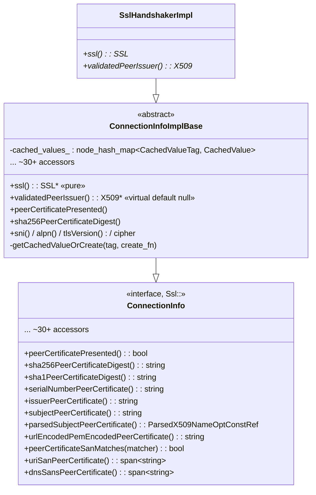
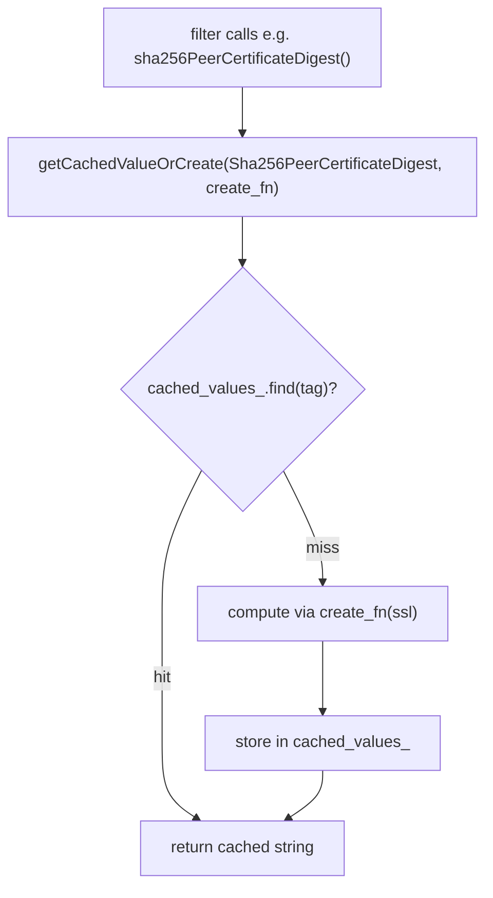
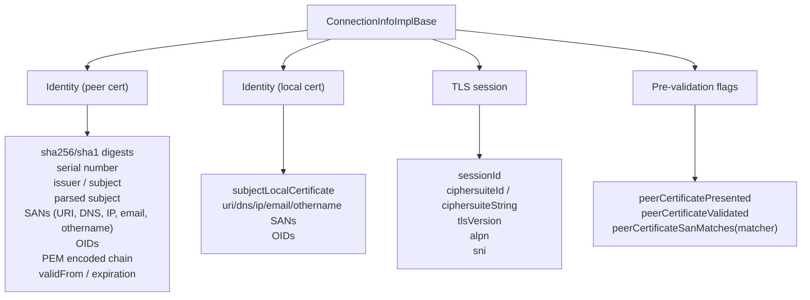
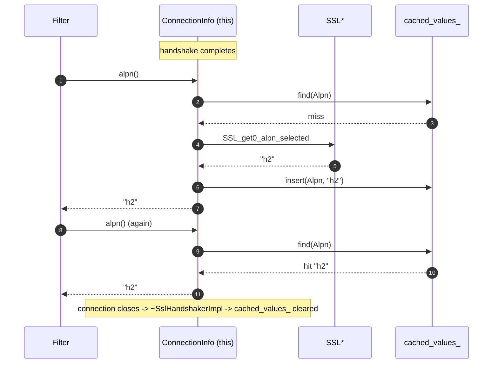

# Connection info — `ConnectionInfoImplBase`

> Files: `connection_info_impl_base.{h,cc}`

`ConnectionInfoImplBase` is the **`Ssl::ConnectionInfo` implementation** that filters, access loggers, and stream info consume. It's the answer to "give me the SAN of the peer cert", "what cipher is this connection using", "what's the ALPN", etc.

It's a base class because the same accessors are used in two places that have different lifetimes:
- **`SslHandshakerImpl`** inherits it directly, so the handshaker *is* the connection‑info object.
- The QUIC TLS code defines its own subclass for the QUIC `SSL*` ownership model.

The only thing subclasses must provide is `SSL* ssl() const` (and optionally `validatedPeerIssuer()`).

### Why this matters

Every access log, every filter that reads cert details, every header‑injection rule that copies the SAN — they all reach in through this surface. The class is the **stable contract** between Envoy's TLS innards and the rest of the proxy. Anything that reads "SSL stuff" from a request goes through here. That's why the API is wide (~30 accessors) and the implementation prioritises both correctness and avoiding repeated work.

---

## Class layout

The interface in `envoy/ssl/connection.h` has ~30 accessors. The base class implements every one of them in terms of `ssl()` plus the cached values map.

---

## Why a cache?

Each accessor pulls something out of the underlying `X509*` / `SSL*` and turns it into a string (or list of strings). That's expensive: ASN.1 walks, allocations, UTF‑8 conversions. But filters tend to call the same accessor many times per request, and access loggers may emit the same field per request too.

`cached_values_` is a per‑connection lazy cache indexed by `CachedValueTag` (an enum listing every accessor that benefits from caching).

In practice the access log alone will call e.g. `sha256PeerCertificateDigest()` once per log line, plus filter chains may read it again, plus header‑injection rules may copy it into a header. Multiplied across many requests on one persistent connection, the cache saves a noticeable amount of work per long‑lived mTLS connection (especially for the SAN list accessors which are O(n) ASN.1 walks).

### Why `node_hash_map`?

The header comment (line 110‑112) explains it: returned references must remain valid even when new entries are added. `node_hash_map` does not invalidate node pointers on insert, so each cached value's address is stable. Returning `const std::string&` from a `flat_hash_map` would be unsound.

This is a subtle but important correctness property. An accessor like `sni()` returns `const std::string&`. If a filter holds onto that reference and then *another* accessor (`alpn()`, say) triggers an insert that rehashes the map, a `flat_hash_map` would invalidate the reference and the filter would read freed memory. `node_hash_map` allocates each value on the heap, so insertions never move existing nodes.

### `CachedValueTag`

A flat enum (lines 70‑102) listing every cacheable accessor. The convention is "name of the function, capitalised":

| Tag | Returned by |
|---|---|
| `Sni` | `sni()` |
| `Alpn` | `alpn()` |
| `TlsVersion` | `tlsVersion()` |
| `SessionId` | `sessionId()` |
| `Sha256PeerCertificateDigest` | `sha256PeerCertificateDigest()` |
| `UriSanPeerCertificate` | `uriSanPeerCertificate()` (returns vector of strings) |
| `ParsedSubjectPeerCertificate` | `parsedSubjectPeerCertificate()` (returns parsed X.509 name) |
| ... | (~30 total) |

The `CachedValue` variant (line 113) holds whatever shape that accessor returns — `string`, `vector<string>`, `ParsedX509NamePtr`, or `bssl::UniquePtr<GENERAL_NAMES>` for the SAN matcher path.

---

## Accessor categories

Some accessors return `absl::Span<const std::string>` (lists) and some return `const std::string&` (singletons). Lists are cached as `std::vector<std::string>` inside the variant.

### `peerCertificateSanMatches`

Special case: takes a `Ssl::SanMatcher` argument, so the result isn't keyed by tag alone — it's recomputed against the matcher every call. However, the underlying `GENERAL_NAMES*` is cached so the per‑call work is just running the matcher.

### `parsedSubjectPeerCertificate`

Returns a parsed structure that splits the X.509 subject into well‑known attributes (CN, O, OU, etc.). Used by formatters that want one field rather than the full subject string.

---

## Lifetime contract

The cache lives as long as the underlying handshaker (and therefore the `SSL*`). The references returned by accessors are valid for the lifetime of the connection. **Callers must not keep them past close**.

---

## `validatedPeerIssuer()`

Default implementation returns `nullptr`. `SslHandshakerImpl` overrides it to return `validated_chain_[1].get()` (the direct issuer in the chain built by the validator). Used by access log formatters that want to log the *issuer of the issuer* — e.g. for trust‑bundle audit logging.

Subclasses that don't store the validated chain just leave it null.

---

## Implementation notes

- All accessors are `const`. Mutability of the cache is via `mutable absl::node_hash_map`.
- Thread safety: not guaranteed across threads — but in practice each connection lives on exactly one worker, so concurrent access doesn't happen.
- The cache map is dense in API surface but **sparse in practice** for any given connection — most connections only ever read a handful of fields. That's why `node_hash_map` (which doesn't preallocate) was chosen over a fixed array.
- The variant for `CachedValue` is `absl::variant`, not `std::variant`, because absl provides additional debugging tools and consistent behaviour across compilers.

---

## Cheat sheet

| Question | Answer |
|---|---|
| Where does a filter get the peer SHA‑256 fingerprint? | `connection().ssl()->sha256PeerCertificateDigest()` → `ConnectionInfoImplBase::sha256PeerCertificateDigest` |
| Is this expensive? | First call yes (DER hash + hex encode), subsequent calls cached |
| Why are some accessors strings and others spans? | Singleton fields return `const std::string&`; list fields (SANs, OIDs) return `absl::Span<const std::string>` |
| Where does the SNI string come from? | `SSL_get_servername(ssl, TLSEXT_NAMETYPE_host_name)` — cached as `Sni` |
| Where does ALPN come from? | `SSL_get0_alpn_selected(ssl, ...)` — cached as `Alpn` |
| What does `peerCertificatePresented` do? | Wraps `SSL_get_peer_certificate(ssl) != nullptr` — does NOT mean the cert was validated |
| Difference between presented and validated? | `peerCertificatePresented` = "they sent one"; `peerCertificateValidated` = "the validator accepted it" |
| Why `node_hash_map`? | Returned `const T&` must stay valid across inserts |
| Why a single base class for both TCP and QUIC? | They share the accessor surface; only `ssl()` differs |
