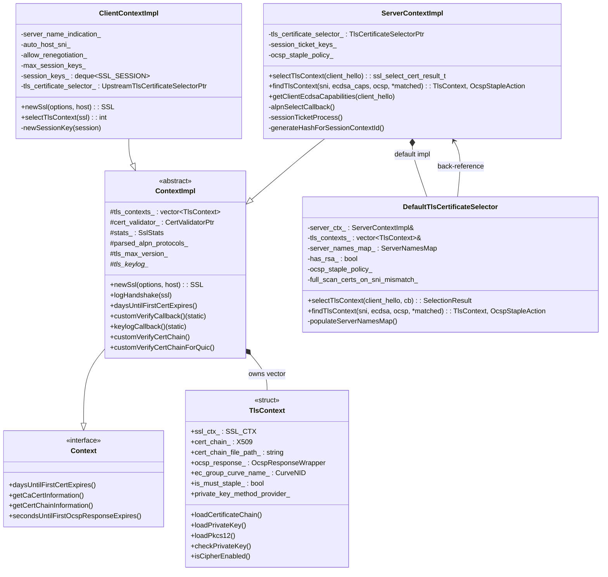
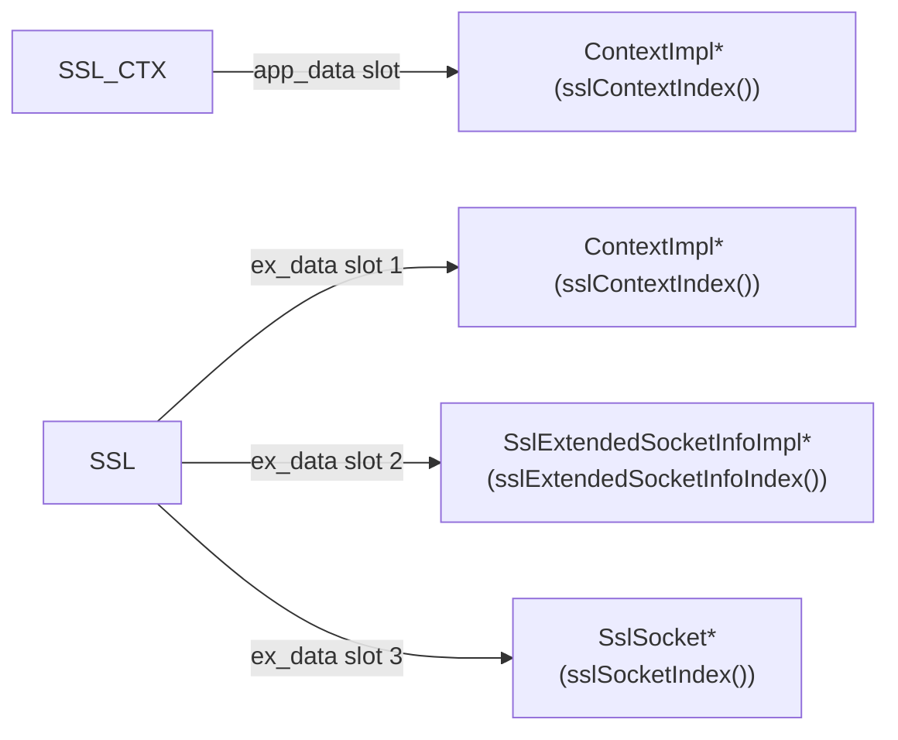
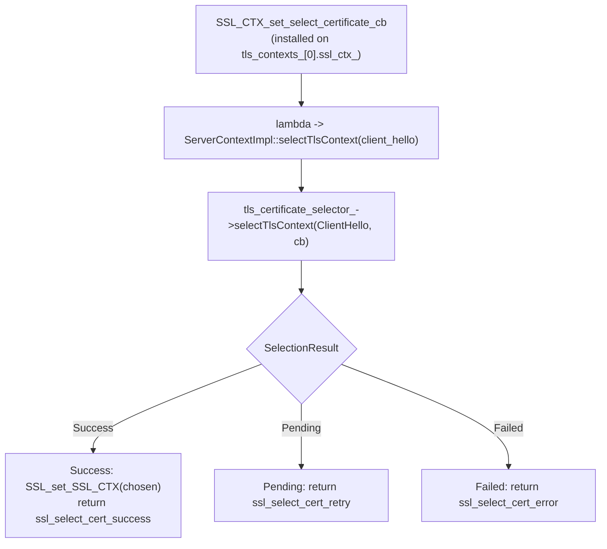
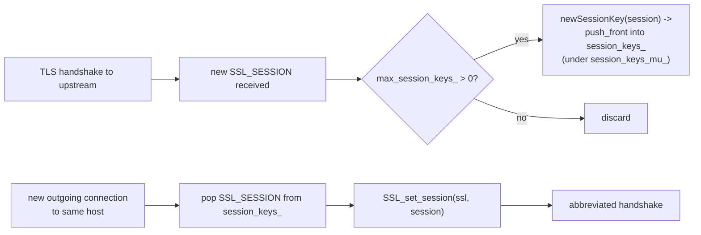
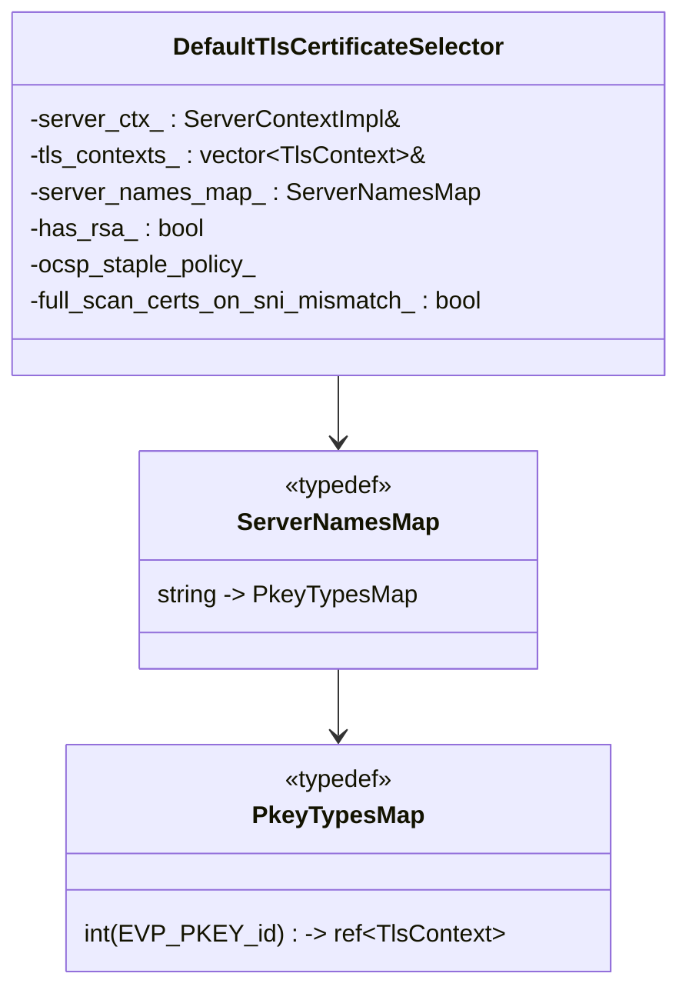
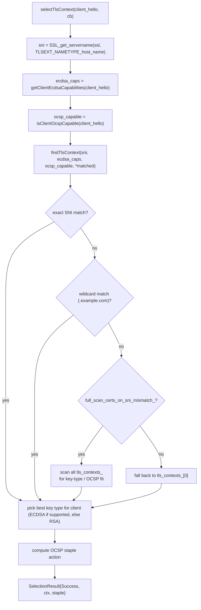
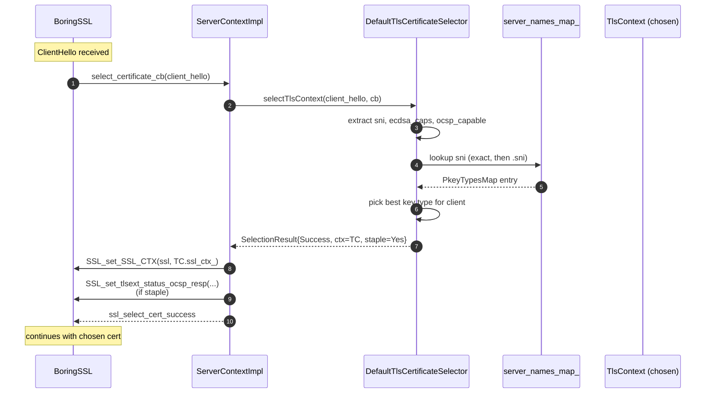

# TLS contexts — `ContextImpl`, `Client`/`ServerContextImpl`, default selector

> Files: `context_impl.{h,cc}`, `client_context_impl.{h,cc}`, `server_context_impl.{h,cc}`, `default_tls_certificate_selector.{h,cc}`

A "context" in this codebase is **a bundle of `SSL_CTX` objects** (one per certificate), plus the cert chain, OCSP response, private key provider, validator, and stats — everything that's *configurable* about TLS but isn't per‑connection. This is what `Ssl::ContextManager::createSsl{Client,Server}Context` returns to the socket factory.

The bundle exists because a single Envoy `CommonTlsContext` can serve, e.g., an RSA cert and an ECDSA cert at the same time. BoringSSL associates a cert with an `SSL_CTX`, so each cert needs its own. At ClientHello time `SSL_set_SSL_CTX` swaps in the chosen one.

### Why a vector of contexts?

BoringSSL ties a certificate to an `SSL_CTX`. So if you want to serve **multiple** certs from one TLS endpoint — common in real deployments (RSA fallback for legacy clients + ECDSA for modern clients, or one cert per SNI), you must hold multiple `SSL_CTX`s and pick at handshake time. Envoy models this as a `std::vector<TlsContext>` inside `ContextImpl`, with a *selector* on top of it that decides which one to use for an incoming `ClientHello`. The vector is small (usually 1, 2, or 3 entries), so a linear scan during selection is fine.

### Mental model

Think of `ContextImpl` as **the parts of the TLS config that are too expensive to recompute per connection**: parsed cert chains, parsed private keys, compiled cipher lists, allocated session ticket key rotation, OCSP responses, validators. Anything *per connection* (the `SSL*`, the chosen `SSL_CTX`, the validated chain, ALPN negotiated value, peer cert, session id) lives on the handshaker, not here.

---

## Class layout

---

## `TlsContext` — one per certificate

`context_impl.h:43‑75`. Hosts:

- The actual `SSL_CTX` (BoringSSL handle).
- The parsed leaf cert (`cert_chain_`) plus the chain file path.
- The cached OCSP response, if any (`ocsp_response_`, see [`ocsp/README.md`](ocsp/README.md)).
- ECDSA curve identifier (`ec_group_curve_name_`) so the selector can quickly check if this cert can sign for a given client's signature algorithms. `EC_CURVE_INVALID_NID` (= -1) is the sentinel "not an ECDSA cert".
- The `PrivateKeyMethodProvider` if a `PrivateKeyProvider` was configured (HSM / async signer; see [`private_key/README.md`](private_key/README.md)).
- `is_must_staple_` — derived from the cert's `1.3.6.1.5.5.7.1.24` extension; controls whether OCSP staple is mandatory.
- `loadCertificateChain` / `loadPrivateKey` / `loadPkcs12` / `checkPrivateKey` — PEM/PKCS12 ingest + FIPS sanity checks.

`isCipherEnabled(cipher_id, client_version)` is used during selection to filter out ciphers the cert can't satisfy (e.g. an RSA cipher list against an ECDSA‑only context).

---

## `ContextImpl` — the abstract base

`context_impl.h:82‑179`. The class is **abstract by convention** (you only ever construct `Client` or `Server` subclasses), even though it's not marked PURE.

What it owns:

| Field | Purpose |
|---|---|
| `tls_contexts_` | The cert bundle |
| `cert_validator_` | Polymorphic peer‑cert validator (default, dynamic_modules, spiffe, ...) |
| `stats_` | `SslStats` counter bundle (handshake, verify failures, OCSP, etc.) |
| `parsed_alpn_protocols_` | wire‑format ALPN list (length‑prefixed) |
| `tls_max_version_` | enforces the configured cap on TLS version |
| `tls_keylog_*` | NSS‑format key log filter / file for debugging |
| `stat_name_set_` + `unknown_*` / `ssl_*` | Symbol‑table StatNames used to emit tagged counters per cipher / version / curve / sigalg |
| `factory_context_` | for SDS / dispatcher / lifecycle notifier access |

What it does:

1. **`newSsl(options, host)`** — allocate a new `SSL*` from `tls_contexts_[0].ssl_ctx_`. The actual `SSL_CTX` may be swapped later via `selectTlsContext`. Sets transport socket options (verify_san list, SNI override, etc.).
2. **`logHandshake(ssl)`** — after `SSL_do_handshake` succeeds, increments per‑cipher / per‑version / per‑curve / per‑sigalg counters via `incCounter`. Called from `SslHandshakerImpl` via `onSuccess`.
3. **`customVerifyCallback`** — static — wired into every `SSL_CTX` via `SSL_CTX_set_custom_verify`. It looks up the `ContextImpl*` from `SSL_CTX_get_app_data`, fetches the validator, and delegates to `customVerifyCertChain`. This is the path async cert validation flows through.
4. **`customVerifyCertChainForQuic`** — same idea but used by QUIC's proof source code path, where the chain is presented as `STACK_OF(X509)*` directly without going through `SSL_CTX_set_custom_verify`.
5. **`keylogCallback`** — wired via `SSL_CTX_set_keylog_callback` when `key_log` is configured. Writes one line per session, filtered by `tls_keylog_local_` / `tls_keylog_remote_`.

### Ex‑data indices

All three indices are allocated once per process via `SSL_get_ex_new_index` and the static accessors are `sslContextIndex()`, `sslExtendedSocketInfoIndex()`, `sslSocketIndex()` (lines 101‑103, 134). They give static callback functions a way to recover the C++ objects from a raw `SSL*`.

---

## `ServerContextImpl` — downstream side

`server_context_impl.h:47‑96`. Adds three things on top of `ContextImpl`:

### 1. Cert selection hook

The factory hooks the callback only on the **first** `tls_contexts_[0].ssl_ctx_`. When BoringSSL processes the ClientHello, it invokes the callback there; the callback resolves the per‑process `ServerContextImpl*` via `SSL_CTX_get_app_data` and dispatches to the selector. The selector then calls `SSL_set_SSL_CTX(ssl, chosen.ssl_ctx_)` so the rest of the handshake uses the right cert.

### 2. Session‑ticket processing

`sessionTicketProcess` is installed via `SSL_CTX_set_tlsext_ticket_key_cb` (when `session_ticket_keys` is configured). It encrypts ticket payloads on encode and decrypts on decode using the configured `SessionTicketKey` material (16‑byte name + 32‑byte HMAC key + 32‑byte AES key).

### 3. Session context ID hash

`generateHashForSessionContextId(server_names)` produces a stable 32‑byte digest that BoringSSL uses to scope session resumption. It includes:

- Every cert's SHA‑256.
- The validator's `updateDigestForSessionId` contribution (so changes in CA / SAN matchers break old sessions).
- The list of `server_names` from the listener filter chain.

This guarantees that if you reload a context with different certs or trust, old session IDs won't resume against the new context.

This is the **subtle security boundary** in TLS resumption. If two listeners share a session‑ticket key but have different cert/CA configurations, a client that handshook against one could resume against the other and skip validation entirely. The digest closes that hole: BoringSSL rejects resumption when the digest doesn't match. The hash also covers the SAN matchers from the validator, so changing trust policy (e.g. removing a previously‑trusted root) immediately invalidates outstanding resumption tickets.

### `ocsp_staple_policy_`

Inherited from `ServerContextConfig`. Drives whether the server staples OCSP (`LENIENT_STAPLING`, `STRICT_STAPLING`, `MUST_STAPLE`).

---

## `ClientContextImpl` — upstream side

`client_context_impl.h:40‑76`. Adds:

### 1. Per‑host session‑ticket cache

The upstream side benefits *enormously* from session resumption because Envoy often opens many connections to the same upstream host (a connection pool keeps them around, but they expire). Without resumption, every new connection pays a full handshake — RSA signing or ECDSA + DH which is the single most expensive thing per‑connection. With resumption, the handshake is a single round trip with no asymmetric crypto.

The deque is bounded by `max_session_keys_` (from `UpstreamTlsContext.max_session_keys`). `session_keys_single_use_` toggles between "consume the ticket once" and "reuse forever".

### 2. SNI policy

- `server_name_indication_` — default SNI from config.
- `auto_host_sni_` — if true, replace with the upstream host's DNS name on `newSsl`.
- `allow_renegotiation_` — toggles BoringSSL renegotiation support (default off).
- `enforce_rsa_key_usage_` — if the upstream cert is RSA, validate that its `keyUsage` extension actually permits digitalSignature.

### 3. Custom cert selector (upstream)

`tls_certificate_selector_` is a `UpstreamTlsCertificateSelectorPtr` — used by the `on_demand_secret` upstream variant or any future upstream selector. If set, `selectTlsContext(ssl)` runs it before the client cert is chosen (mTLS).

---

## `DefaultTlsCertificateSelector` — the SNI matcher

`default_tls_certificate_selector.h:23‑75`. This is what's used when `CommonTlsContext.custom_tls_certificate_selector` is **not** set. It's downstream‑only; the upstream path doesn't need a selector unless mTLS is in play.

### Data structures

The map keys both **exact** server names and **wildcard** patterns. Wildcards are prefixed with `.` (so `*.example.com` is stored as `.example.com`) to distinguish them from exact entries. Each entry is then sub‑keyed by key type (`EVP_PKEY_RSA` vs `EVP_PKEY_EC`) so RSA + ECDSA certs for the same SNI can coexist.

### Selection algorithm

`findTlsContext` is also called directly by `ServerContextImpl::findTlsContext` from QUIC code paths where the BoringSSL state machine isn't running.

The "best key type for client" decision is **performance and compatibility** rolled together. Modern clients almost always advertise ECDSA support, in which case ECDSA wins — the signatures are smaller and faster. Old clients (and some embedded devices) only support RSA; the selector falls back transparently. The fact that this happens inside the selector rather than via separate listeners is what lets one Envoy listener serve both populations on the same port without configuration gymnastics.

### `full_scan_certs_on_sni_mismatch` (from `DownstreamTlsContext.full_scan_certs_on_sni_mismatch`)

- **false (default):** use `tls_contexts_[0]` (the first configured cert) on SNI mismatch. Fast.
- **true:** walk every cert and pick the first one whose key type matches the client's preferences. Slower but more permissive.

### `populateServerNamesMap(ctx, pkey_id)`

Indexes one `TlsContext` into `server_names_map_`. Pulls the DNS SAN list (and CN, deprecated) out of the cert and inserts an entry per name. Wildcards in SANs become `.example.com` entries.

---

## Putting it together — server‑side handshake start

---

## Cheat sheet

| Question | Answer |
|---|---|
| Why is `tls_contexts_` a vector? | One `SSL_CTX` per configured cert; selector picks per handshake |
| Where does cert selection actually swap the cert? | `selectTlsContext` -> `SSL_set_SSL_CTX(ssl, chosen.ssl_ctx_)` |
| What about non‑SNI clients? | `findTlsContext` falls back to `tls_contexts_[0]` (or full scan if enabled) |
| Where is the cert‑chain validator called? | `ContextImpl::customVerifyCallback` (static), wired in by `SSL_CTX_set_custom_verify` |
| Where do session tickets get encrypted? | `ServerContextImpl::sessionTicketProcess` |
| Where is ALPN selected? | `ServerContextImpl::alpnSelectCallback` (downstream); `SSL_set_alpn_protos` on client (upstream) |
| Where does the cipher / version stats counter increment? | `ContextImpl::logHandshake` -> `incCounter`, called from `SslHandshakerImpl::onSuccess` |
| What's the upstream equivalent of the cert selector? | `ClientContextImpl::tls_certificate_selector_` — only used by upstream `on_demand_secret` etc. |
