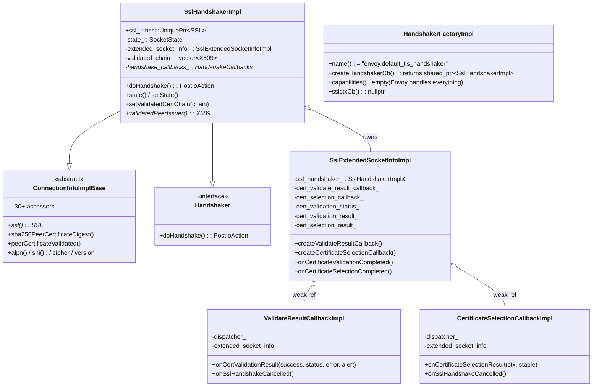
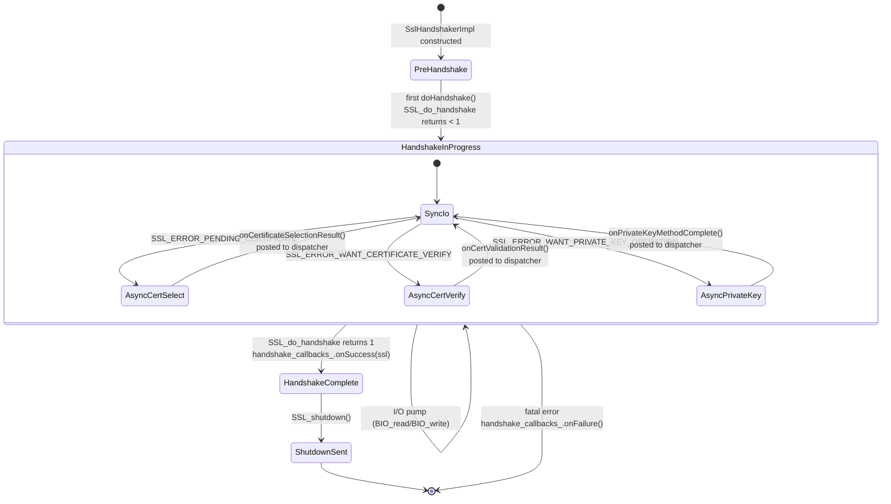
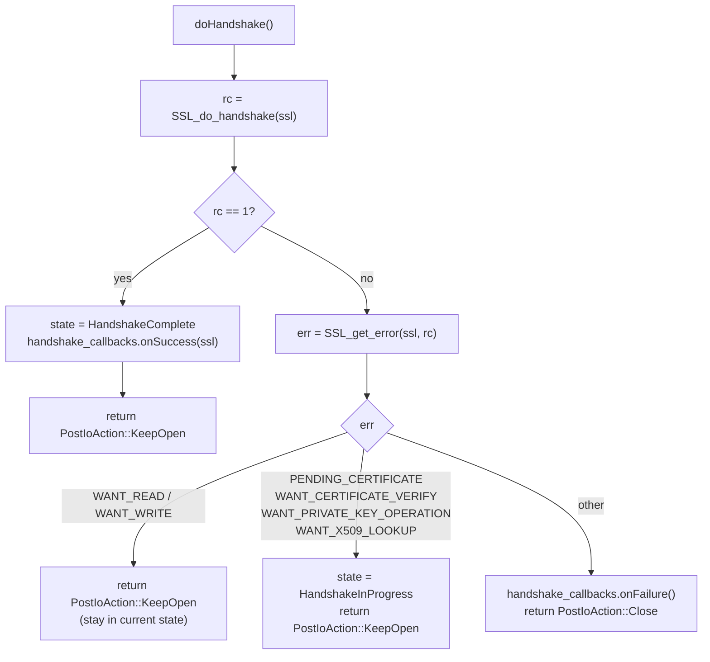
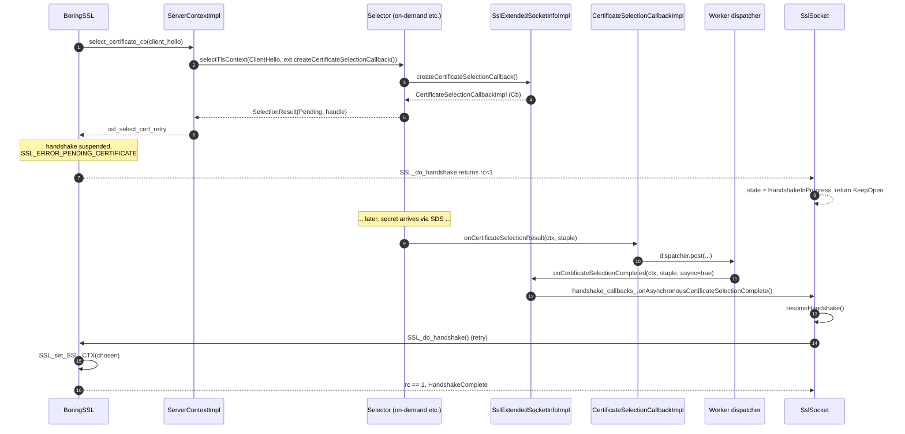
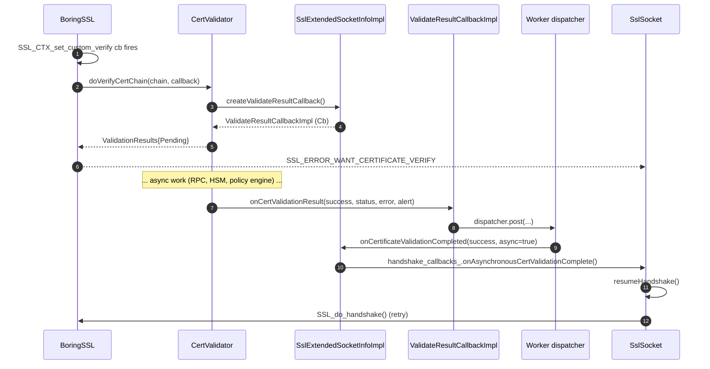
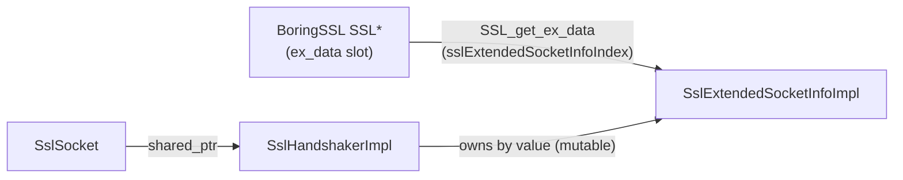

# Handshaker — `SslHandshakerImpl`

> Files: `ssl_handshaker.{h,cc}`

`SslHandshakerImpl` is the bridge between BoringSSL's blocking‑looking handshake API (`SSL_do_handshake`) and Envoy's non‑blocking, single‑threaded‑per‑worker dispatcher. It also doubles as the `Ssl::ConnectionInfo` impl exposed to filters (inherits `ConnectionInfoImplBase`), so the handshaker and the post‑handshake info object are literally the same C++ object.

### Why one object for both handshake driving and connection info?

Filter chains routinely call `connection.ssl()->peerCertificatePresented()`, `connection.ssl()->ciphersuiteString()`, etc. — and they do this **during** request processing, possibly long after the handshake finished. Allocating a separate "info" object after the handshake would mean copying everything out of the `SSL*`, which is wasteful when the `SSL*` already has it. So Envoy makes the handshaker live for the entire connection lifetime and exposes its accessor surface directly. This also gives filters a stable identity to compare against (same `Ssl::ConnectionInfo*` across the whole request).

The header also defines the **async escape hatches**:
- `ValidateResultCallbackImpl` — resumes after async cert validation.
- `CertificateSelectionCallbackImpl` — resumes after async cert selection.
- `SslExtendedSocketInfoImpl` — per‑connection scratch space that owns those callbacks.

Plus the **factory plumbing**: `HandshakerFactoryImpl` registers the default handshaker under the name `envoy.default_tls_handshaker`. Other handshakers can be registered via `CommonTlsContext.custom_handshaker`.

---

## Class layout

Notice that `SslHandshakerImpl` extends **both** `ConnectionInfoImplBase` (for filter‑facing accessors) and `Ssl::Handshaker` (for the state machine). That's why filters that ask `connection.ssl()` get back the same object that's running the handshake.

`SslExtendedSocketInfoImpl` is the per‑connection **scratch space** that holds whichever async callback is currently in flight. Its key job is making cancellation safe: when the connection dies, its destructor calls `onSslHandshakeCancelled()` on the live callback, which flips a flag inside that callback so the eventual external completion (from SDS, the dynamic module, or the HSM) becomes a no‑op instead of trying to call back into a freed handshaker. Without this contract Envoy would crash on any connection that closes during an async TLS step — which is a fairly common case during traffic spikes.

---

## State machine

`state_` is an `Ssl::SocketState` enum (defined in `envoy/ssl/ssl_socket_state.h`). The set of states above is what's reachable from `SslHandshakerImpl`.

---

## `doHandshake()` — the main loop

From `ssl_handshaker.cc:116‑140` (paraphrased):

The "stay in current state" branch is the trick: when BoringSSL says `WANT_READ`/`WANT_WRITE`, the worker's event loop will fire `doRead`/`doWrite` again later (when more bytes arrive or the write buffer drains), and that re‑enters `doHandshake` to try again.

The "async" branches return the same `PostIoAction::KeepOpen` but transition state to `HandshakeInProgress` *if not already there*. The actual resume signal comes later, from one of the three callbacks.

The signature is `PostIoAction` and not `bool`/`StatusOr` because the handshaker has to tell the **transport socket layer** (its caller) what to do with the underlying connection after each step — either keep it open and wait for more I/O, or close it. `KeepOpen` is returned for both "still working" and "done successfully" — the actual state change is communicated by `state()` returning `HandshakeComplete`, which `SslSocket::doHandshake` checks immediately after the call returns.

---

## Async cert selection — full flow

This is the path taken by the `on_demand_secret` cert selector (and any future async selector).

Key detail: **the callback is posted to the worker's dispatcher**, not invoked directly. That's `CertificateSelectionCallbackImpl::onCertificateSelectionResult` in `ssl_handshaker.h:56` — it stores the result on `extended_socket_info_` and then posts to `dispatcher_`. This is what makes the selector safe to invoke from the main thread (the on‑demand secret manager lives on main).

The diagram has two distinct horizontal sections separated by the `Note over Sel: ... later, secret arrives via SDS ...` divider. Everything above the divider happens **synchronously** inside one `SSL_do_handshake` call — BoringSSL hits the `select_certificate_cb`, that callback dispatches to the selector, the selector returns `Pending`, BoringSSL bubbles `SSL_ERROR_PENDING_CERTIFICATE` back up to `SslHandshakerImpl`, which returns `KeepOpen` and lets the worker get on with other connections. Everything below the divider may happen **milliseconds, seconds, or never** — that's the point of decoupling. The result of "never" is handled by the cancellation path: when the connection idles out or the client gives up, `SslExtendedSocketInfoImpl`'s destructor cancels the in‑flight callback before it can fire.

`SslExtendedSocketInfoImpl::~SslExtendedSocketInfoImpl()` calls `onSslHandshakeCancelled` on any pending callback — if the connection is dropped while waiting for a cert, the in‑flight callback is told to do nothing instead of touching freed memory.

---

## Async cert verification — full flow

Same idea, different callback. Used when a `CertValidator` returns `ValidationStatus::Pending` — typically the dynamic‑modules validator calling out to an external policy engine.

The validated chain (if the validator returned one) is also handed back through `setValidatedCertChain`. `SslHandshakerImpl::validatedPeerIssuer()` then returns `chain[1]` — the direct issuer — which is used in some access‑log formatters.

The reason the validator returns the chain and Envoy stores it is **trust transitivity**. After validation, downstream filters often want to introspect not just the leaf cert (the peer) but also the issuer (e.g. for spiffe trust domain checks). BoringSSL's default `X509_STORE_CTX` would have this info, but Envoy bypasses it with `SSL_CTX_set_custom_verify`, so the validator becomes the authoritative source of "what cert chain was actually validated".

---

## `SslExtendedSocketInfoImpl` — per‑connection scratch space

This is the object BoringSSL can reach via `SSL_get_ex_data(ssl, ContextImpl::sslExtendedSocketInfoIndex())`. It carries:

| Field | What it holds |
|---|---|
| `certificate_validation_status_` | Validation status reported to filters |
| `cert_validation_result_` | `NotStarted` / `Pending` / `Completed` / `Failed` |
| `cert_validation_alert_` | TLS alert to emit on validation failure |
| `cert_validate_result_callback_` | Latched ref to the live async callback, nullopt otherwise |
| `cert_selection_result_` | `NotStarted` / `Pending` / `Successful` / `Failed` |
| `cert_selection_callback_` | Latched ref to the live async callback |
| `cert_selection_handle_` | Opaque handle the selector uses to identify this connection |
| `cert_validation_error_` | Detailed error string (surfaces in access logs / failure reason) |

The `ContextImpl::sslExtendedSocketInfoIndex()` index is allocated once per process via `SSL_get_ex_new_index` at static‑init time, so cross‑library plug‑ins can pull the same pointer back out of any `SSL*`.

This ex‑data trick is the **glue** between BoringSSL callbacks (which take only the `SSL*`) and Envoy's object graph (which lives outside BoringSSL). Whenever Envoy installs a BoringSSL callback — cert selection, ALPN selection, custom verify, session‑ticket key cb, key‑log cb — the callback's first job is `SSL_get_ex_data(ssl, index)` to pull back its own `SslHandshakerImpl` or `ContextImpl` pointer. Without it the callbacks would have to be C‑style globals with no per‑connection state.

---

## `HandshakerFactoryImpl` — the default registration

`ssl_handshaker.h:169‑194` registers the **default** handshaker under name `envoy.default_tls_handshaker`. Three things to note about the default:

1. **`createHandshakerCb`** returns a callable that just constructs `SslHandshakerImpl` with the `SSL*` and the ex‑data index.
2. **`capabilities()`** returns an empty `Ssl::HandshakerCapabilities{}` — meaning "Envoy itself handles certificate selection, validation, ALPN, etc.". Custom handshakers can declare more capabilities to take over some of those steps.
3. **`sslctxCb()`** returns `nullptr` — the default doesn't post‑process `SSL_CTX`. A custom handshaker can return a callback to e.g. wire BoringSSL extensions before any handshake runs.

A `custom_handshaker` (configured via `CommonTlsContext.custom_handshaker`) would replace this factory with one that produces its own `Ssl::Handshaker`. The `HandshakerFactoryContextImpl` (lines 149‑167) hands the custom factory the things it needs to bootstrap: API, lifecycle notifier, ALPN string, singleton manager.

---

## Common pitfalls

- **Lifetime of `SslHandshakerImpl`.** It's owned via `shared_ptr` by both `SslSocket` and BoringSSL's `ex_data` slot. If you nuke `SslSocket` while a handshake is in flight, the callbacks need to detect that — that's exactly what `onSslHandshakeCancelled` (lines 43, 58) is for.
- **Don't invoke the callback from main thread directly.** Always go through `dispatcher_.post(...)`. Otherwise you'd be touching `SslHandshakerImpl` from main while a worker is running on it.
- **`SSL_ERROR_WANT_X509_LOOKUP` also pauses.** It's in the async branch alongside the cert‑select / cert‑verify errors. This was added for the future where a sync verifier might decide it actually needs an async lookup mid‑validation.
- **Async cert verification skips the "store context" path.** Default BoringSSL validation uses `X509_STORE_CTX`. Envoy installs `SSL_CTX_set_custom_verify` and routes through `CertValidator`, which is why the `X509_STORE` configured on the `SSL_CTX` is largely ignored for the verify step.
- **Validation status vs. selection status.** Two completely separate state machines (`cert_validation_result_` and `cert_selection_result_`). A connection can be `Pending` on selection but `NotStarted` on validation if mTLS isn't enabled.
