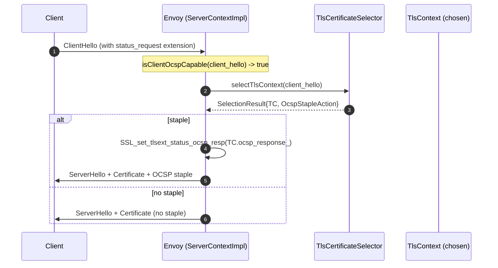
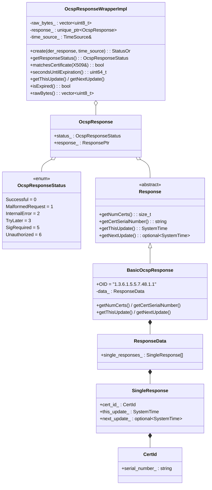
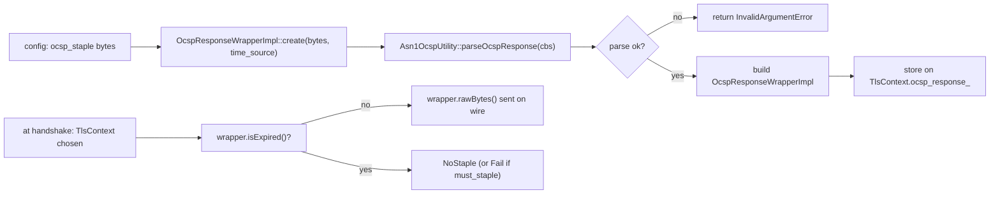
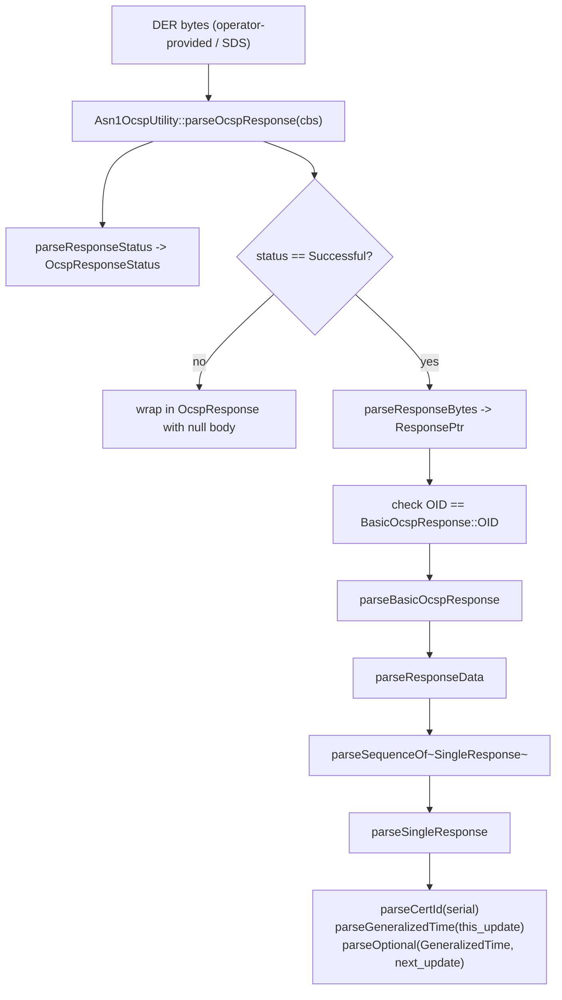
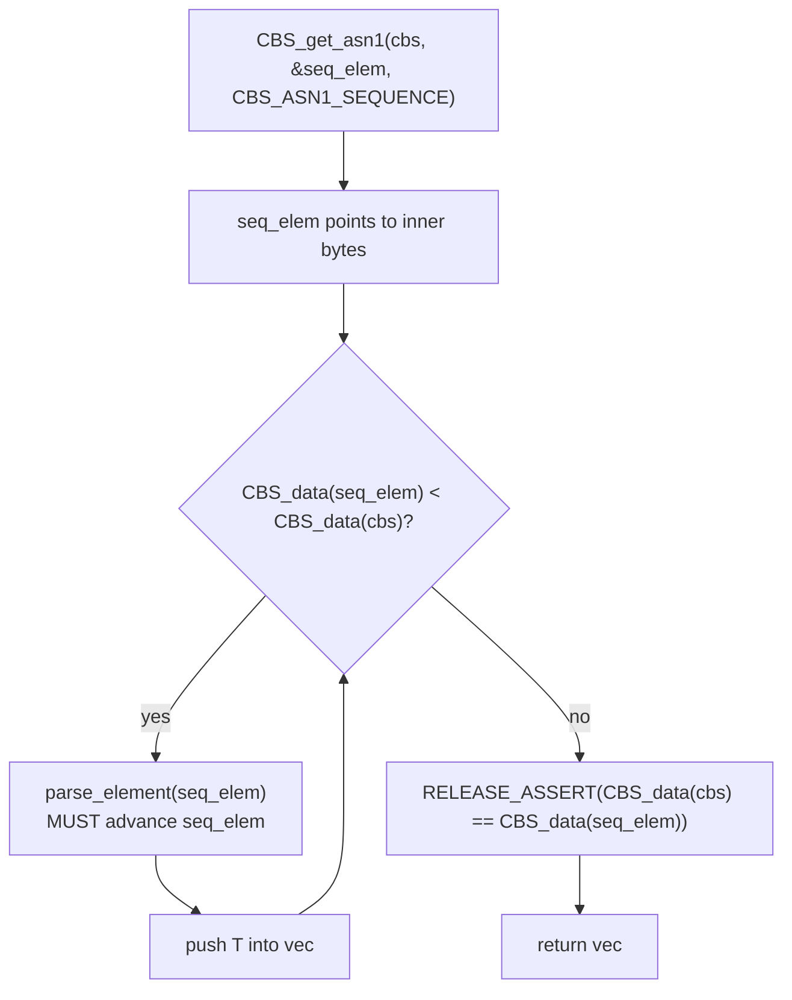
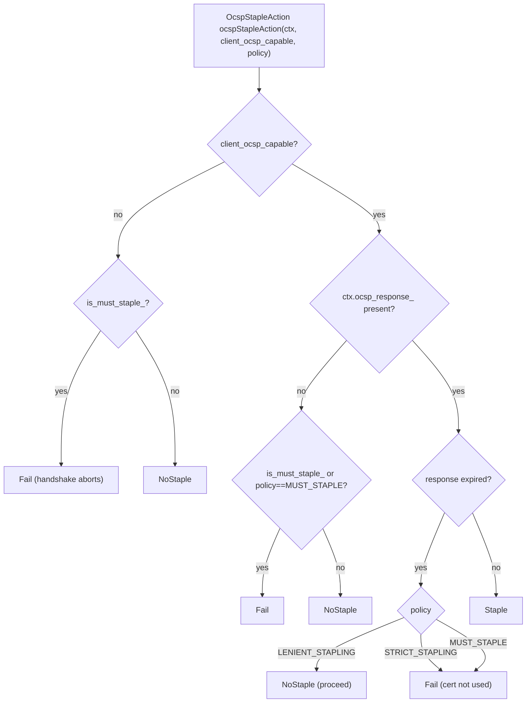
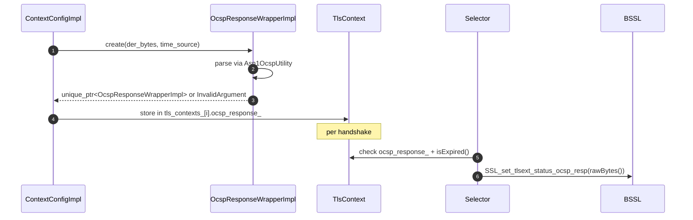

# OCSP — `source/common/tls/ocsp/`

> Files: `ocsp.{h,cc}`, `asn1_utility.{h,cc}`

OCSP (Online Certificate Status Protocol) support for **TLS stapling**. Envoy doesn't run OCSP requests itself — operators provide a **pre‑fetched, DER‑encoded OCSP response** alongside each cert, and Envoy staples it into the ServerHello to save the client a round‑trip to the CA's OCSP responder.

This folder parses those DER blobs (`ocsp.cc`), keeps them per `TlsContext`, and computes whether to staple at handshake time.

> ⚠️ This module **does not validate signatures on OCSP responses**. The header comment is explicit: it assumes responses come from a trusted source (operator's config / SDS). It only checks they are well‑formed and not expired.

### Why "pre‑fetched"?

A live OCSP fetch from inside the handshake would add a synchronous network round‑trip — completely negating the latency benefit of stapling. The standard pattern (and what Envoy assumes) is a separate background job: a sidecar or cron that calls the CA's OCSP responder every few hours, drops the DER bytes into a file or pushes them through SDS, and Envoy hot‑reloads. This is also why signature validation is delegated: the responder authentication happened in the sidecar, the operator vouches for the bytes by configuring them, and Envoy treats the blob as authoritative.

### What stapling actually buys you

Without stapling, every client that checks revocation does an extra DNS lookup + TLS handshake + HTTP request to the CA's responder, **per connection**. For a public endpoint with millions of clients this is enormous. With stapling, the server includes a current OCSP response in the handshake; the client validates it inline. Some clients (Firefox, recent Chrome) refuse to handshake at all without a staple for must‑staple certs — so getting this right is sometimes a hard availability requirement, not just a perf optimisation.

---

## Where stapling fits in the handshake

`ocspStapleAction` (declared in `default_tls_certificate_selector.h:19‑21`, implemented in `default_tls_certificate_selector.cc`) decides one of: `Staple`, `NoStaple`, `Fail` based on:

- The cert's `must_staple` extension (`TlsContext::is_must_staple_`).
- The configured `ocsp_staple_policy` on the server config.
- Whether the client signalled OCSP capability in the ClientHello.
- Whether the OCSP response is present and not expired.

---

## Data model (`ocsp.h`)

### Important constraint

`BasicOcspResponse::getNumCerts` is used as a sanity check: Envoy enforces that **each OCSP response covers exactly one certificate**. The cert this is for is identified by serial number (`CertId.serial_number_`).

The "one cert per response" rule is stricter than OCSP itself allows (the spec permits multiple `SingleResponse` entries for batch queries), but in practice CAs always return one response per cert and Envoy's per‑cert model lines up with that. If a response carrying multiple entries ever arrived, the constraint check would reject it at config‑load time rather than fail mysteriously at handshake time.

### `OcspResponseWrapperImpl`

The lifetime object owned by `TlsContext.ocsp_response_`. Holds:

- The raw DER bytes (`raw_bytes_`) — sent verbatim on the wire.
- The parsed `OcspResponse` (`response_`).
- A `TimeSource&` so `isExpired` and `secondsUntilExpiration` are computable.

`matchesCertificate(cert)` verifies that the OCSP response's serial number matches the leaf cert's serial — protects against accidentally configuring an OCSP response for the wrong cert.

This serial‑number check has caught real misconfigurations during cert rotation. When the cert rotates but the operator forgets to also rotate the OCSP response, the new cert's serial won't match the stale staple and Envoy will refuse to staple it (or fail closed for must‑staple certs). The alternative — sending a mismatched staple — would cause clients to fail the handshake instead, which is much worse for debuggability.

---

## DER parsing pipeline

Every parsing function takes a `CBS&` (BoringSSL "crypto byte string" cursor) and advances it past the element it consumed. This matches BoringSSL's recommended ASN.1 parsing pattern (the alternative is `d2i_*` functions, which have a different memory ownership model).

---

## `Asn1Utility` — the ASN.1 toolkit

`asn1_utility.h:51‑158`. Generic ASN.1 DER parsing helpers, factored out of OCSP because they're useful for parsing any ASN.1.

| Function | Purpose |
|---|---|
| `cbsToString(cbs)` | Get the remaining bytes as a `string_view` |
| `parseSequenceOf<T>(cbs, parse_elem)` | Generic `SEQUENCE OF` parser (template) |
| `parseOptional<T>(cbs, parse, tag)` | Explicitly tagged optional element |
| `getOptional(cbs, tag)` | "Is this tag present?" with optional CBS payload |
| `parseOid(cbs)` | OBJECT IDENTIFIER → dotted‑number string |
| `parseGeneralizedTime(cbs)` | GENERALIZEDTIME → `SystemTime` |
| `parseInteger(cbs)` | Arbitrary‑precision INTEGER → hex string |
| `parseOctetString(cbs)` | OCTET STRING → `vector<uint8_t>` |
| `skipOptional(cbs, tag)` / `skip(cbs, tag)` | Advance past a value without parsing it |

The two template functions (`parseSequenceOf`, `parseOptional`) are defined inline in the header so callers can instantiate them for any element type.

### `parseSequenceOf` invariant

The assertion (`asn1_utility.h:180`) catches the case where `parse_element` misbehaves and leaves bytes unconsumed — that would indicate a malformed input or a bug in the element parser.

---

## Staple decision

(Exact logic lives in `default_tls_certificate_selector.cc`; this is the policy summary.)

The three OCSP stats from `SslStats` fire at:

- `ocsp_staple_requests` — client sent `status_request`.
- `ocsp_staple_responses` — Envoy actually stapled.
- `ocsp_staple_omitted` — Envoy could have stapled but chose not to (`LENIENT_STAPLING` + expired).
- `ocsp_staple_failed` — `Fail` outcome above.

---

## Lifecycle

---

## What's *not* in this folder

- **Live OCSP fetching.** Envoy doesn't run an OCSP client. If you want fresh responses, an external process must refresh them and push them in via SDS or config reload.
- **OCSP request building.** Envoy never builds an OCSP request — it only ingests responses.
- **OCSP signature validation.** As called out in the header, this module assumes the responses come from a trusted source.

These omissions are by design — fetching OCSP responses at handshake time would add latency and reliability issues; pre‑fetched stapling is the modern best practice.

---

## Cheat sheet

| Question | Answer |
|---|---|
| Does Envoy run OCSP requests? | No — operator pre‑fetches and configures responses |
| Where is the staple decision made? | `ocspStapleAction` in `default_tls_certificate_selector.cc` |
| How is the response stored? | `TlsContext::ocsp_response_` (per cert) |
| How is it sent on the wire? | `SSL_set_tlsext_status_ocsp_resp(ssl, raw_bytes, len)` |
| What happens if expired? | Depends on `ocsp_staple_policy` (LENIENT/STRICT/MUST_STAPLE) and the cert's `must_staple` extension |
| Are signatures on OCSP responses validated? | No — module trusts the source |
| Where is the ASN.1 parser? | `asn1_utility.{h,cc}` — generic helpers, OCSP‑specific uses in `ocsp.cc` |
| Where are the OCSP stats? | `SslStats::ocsp_staple_{requests,responses,omitted,failed}` |
