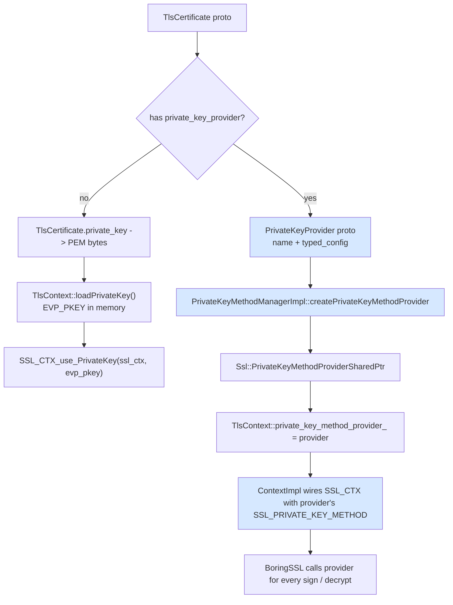
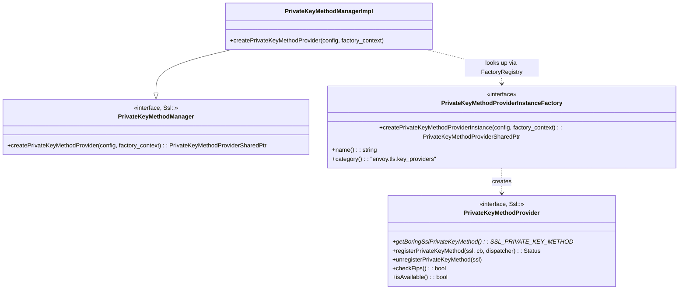
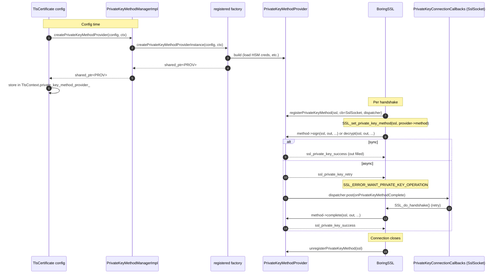
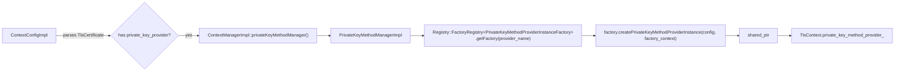
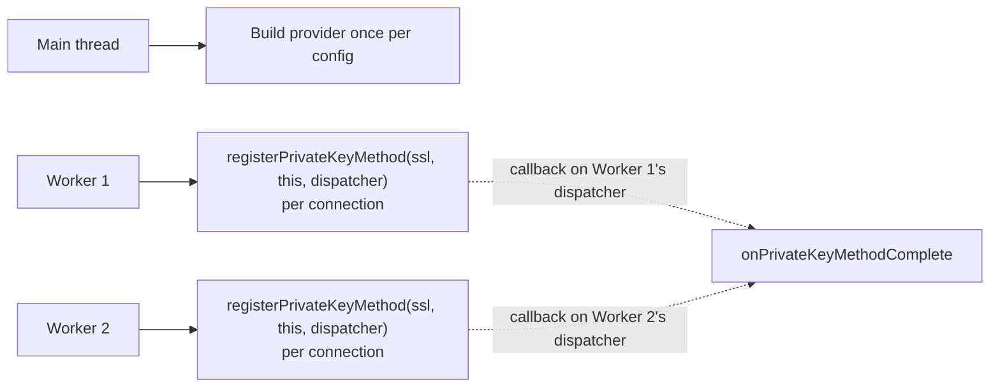

# Private Key — `source/common/tls/private_key/`

> Files: `private_key_manager_impl.{h,cc}`

This folder is small but enables a powerful feature: **the TLS private key need not be a PEM file in memory**. It can be an asynchronous service — an HSM, a remote signing service, a cloud KMS — anything that can produce signatures on demand. BoringSSL has a "private key method" hook (`SSL_set_private_key_method`) that lets you intercept the sign operation; Envoy exposes that via the `PrivateKeyProvider` extension category.

The manager in this folder is just the **factory registry** — it maps a `PrivateKeyProvider` config to a registered `Ssl::PrivateKeyMethodProvider` implementation. The actual provider implementations are external extensions.

### Why does this matter?

Storing a TLS private key in PEM on disk has known downsides: anyone who can read the file owns the key. Compliance regimes (FIPS 140‑3, PCI, government CAs) often *forbid* private keys ever leaving an HSM or KMS. The private key method hook lets Envoy hold a **cert** without holding the corresponding **key** — the key stays in the HSM, and Envoy makes a remote call every time it needs a signature. That's the difference between "key file gets stolen on the next breach" and "key material is provably never exfiltrated".

### Performance reality check

A naïve HSM call is slow (milliseconds), and an RSA TLS handshake needs **one** signature per handshake. Modern HSMs can do tens of thousands of RSA signatures per second per cluster, which is enough for most workloads if you batch and pipeline. Asynchronous mode (the `Pending` path) is essential: a synchronous HSM call blocking the worker would tank Envoy's connection rate. With async, the worker keeps handling other connections while a single handshake is paused waiting for the signature.

---

## Where private keys live in the cert path

The "PEM in memory" path is the default; the "provider" path is what this folder enables.

---

## Class layout

The manager is **one line of real code**: look up the registered factory by `config.provider_name()`, return whatever it builds. The work is done by the providers and the factory.

The thinness of the manager is deliberate. The interesting policy — how to talk to the HSM, how to authenticate, how to rotate, how to fail over — belongs in the provider. The manager exists only so `ContextConfigImpl` doesn't have to know about every provider type and so a custom provider can be registered without touching `common/tls/`.

---

## Provider lifecycle at handshake time

The async path (`ssl_private_key_retry` → `SSL_ERROR_WANT_PRIVATE_KEY_OPERATION`) is what makes HSM / remote KMS signing work without blocking the worker thread. The `SslSocket` implements `Ssl::PrivateKeyConnectionCallbacks::onPrivateKeyMethodComplete` (see [`socket_layer.md`](../socket_layer.md)) and routes the resume through its normal handshake state machine.

---

## How `PrivateKeyMethodManagerImpl` connects pieces

There's one `PrivateKeyMethodManagerImpl` per process (owned by `ContextManagerImpl`). It's effectively a thin facade over Envoy's global `FactoryRegistry` — just enforcing the right interface and a known category name.

---

## Known providers (registered elsewhere)

| Provider | Source location | Use case |
|---|---|---|
| `qat` | `source/extensions/private_key_providers/qat/` | Intel QuickAssist hardware acceleration |
| `cryptomb` | `source/extensions/private_key_providers/cryptomb/` | Multi‑buffer crypto on Intel CPUs |

Each provider registers a `PrivateKeyMethodProviderInstanceFactory` under category `envoy.tls.key_providers`. `PrivateKeyMethodManagerImpl` picks them up automatically via the global factory registry.

---

## Threading

The provider object is shared across workers, but each connection's `registerPrivateKeyMethod` gets its own dispatcher. Providers are expected to be thread‑safe: state per‑connection lives in BoringSSL's `ex_data`, not in the shared provider.

---

## What's *not* in this folder

- **Any provider implementations.** Just the registry. QAT, CryptoMB, etc. live under `source/extensions/private_key_providers/`.
- **The BoringSSL private‑key method shim.** `SSL_PRIVATE_KEY_METHOD` is defined by BoringSSL; providers fill in their own function pointers.
- **The `SslSocket` callback.** That's `Ssl::PrivateKeyConnectionCallbacks::onPrivateKeyMethodComplete` implemented by `SslSocket` — see [`socket_layer.md`](../socket_layer.md).

---

## Cheat sheet

| Question | Answer |
|---|---|
| What does this folder do? | Looks up a registered `PrivateKeyMethodProvider` factory by name and returns an instance |
| Why would I use a private key provider? | HSM, remote KMS, hardware acceleration, async signers |
| Where are provider implementations? | `source/extensions/private_key_providers/` |
| What's the BoringSSL hook? | `SSL_PRIVATE_KEY_METHOD` (sign / decrypt / complete) — set via `SSL_set_private_key_method` |
| What's the async error code? | `SSL_ERROR_WANT_PRIVATE_KEY_OPERATION` |
| Where does the SslSocket get notified? | `PrivateKeyConnectionCallbacks::onPrivateKeyMethodComplete` on `SslSocket` |
| Is the provider shared across workers? | Yes — registered shared_ptr; per‑connection state lives in BoringSSL `ex_data` |
| How does the manager find a provider? | Global `FactoryRegistry<PrivateKeyMethodProviderInstanceFactory>` lookup by name |
| What category do providers register under? | `envoy.tls.key_providers` |
