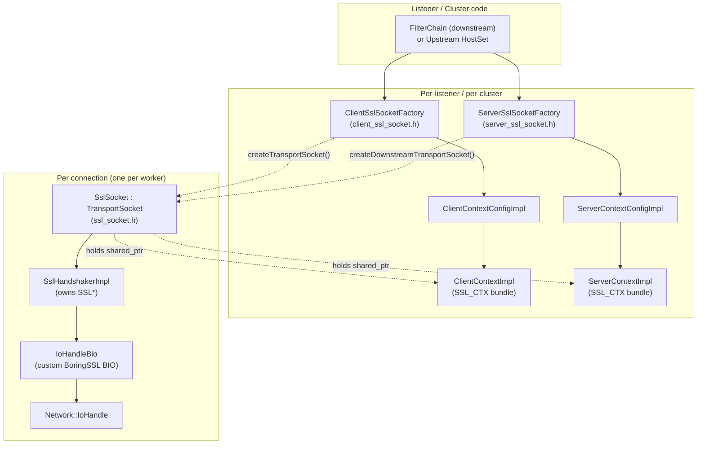
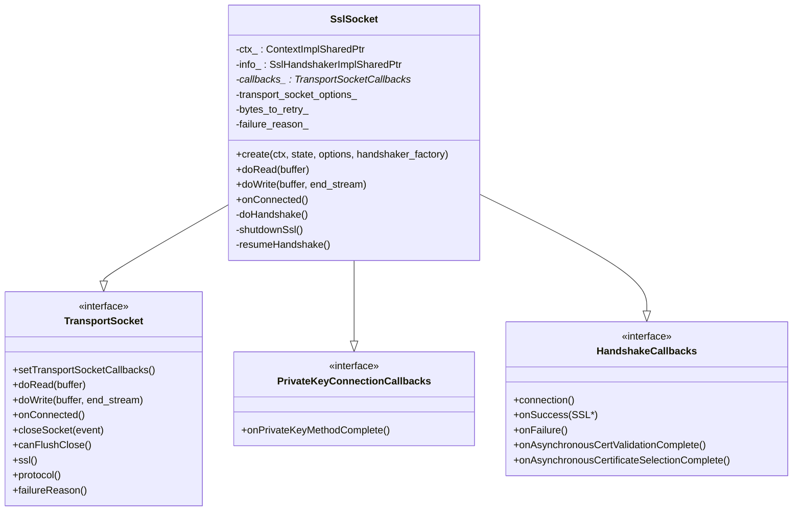
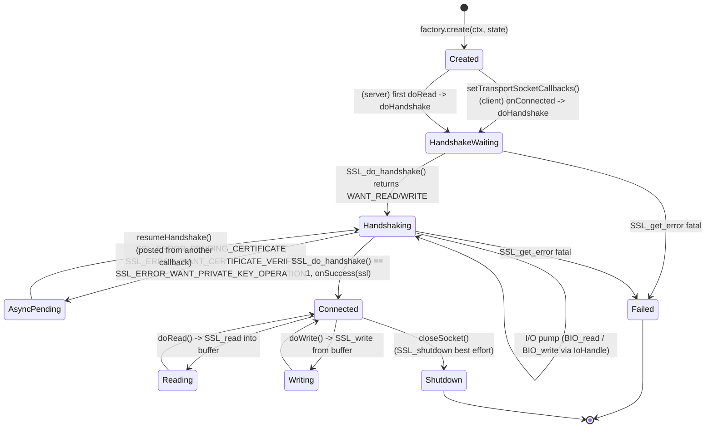
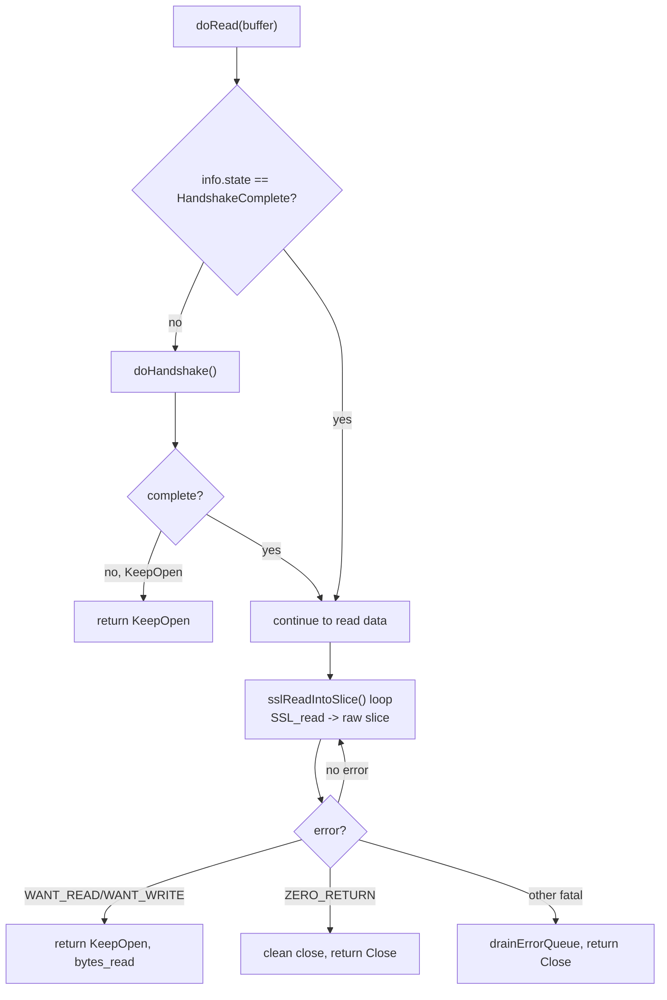
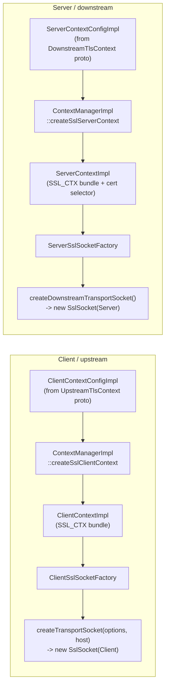
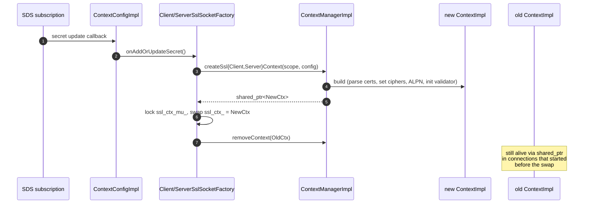
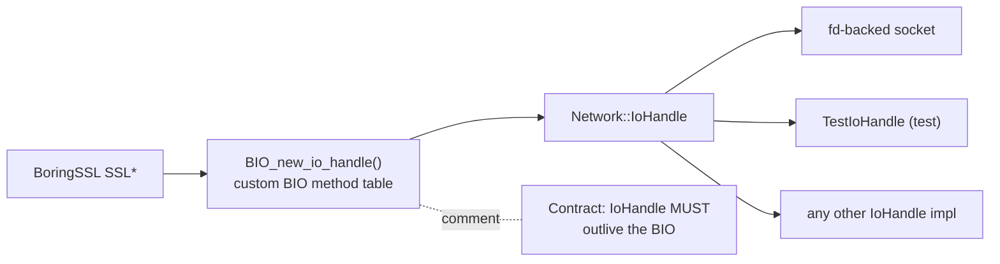

# Socket layer — `SslSocket` and friends

> Files: `ssl_socket.{h,cc}`, `client_ssl_socket.{h,cc}`, `server_ssl_socket.{h,cc}`, `io_handle_bio.{h,cc}`

This is the layer Envoy's networking code talks to. `SslSocket` is the `Network::TransportSocket` implementation; the two factories (`Client` / `Server`) own a `ContextImpl` and hand out fresh `SslSocket`s per connection; `IoHandleBio` is the bridge that lets BoringSSL drive an `IoHandle` instead of a raw file descriptor.

### Why three classes and not one?

Envoy keeps **lifetime boundaries** crisp by splitting responsibilities. The *factory* lives as long as the listener or cluster and owns the expensive `SSL_CTX`. The *socket* lives only for the duration of one connection and holds no TLS state of its own — every piece of state hangs off the `SslHandshakerImpl`, which is allocated fresh per connection so a destructor cleans everything up automatically when the connection dies. The *BIO* is a tiny shim that exists only to satisfy BoringSSL's I/O abstraction. This three‑layer split also makes the code unit‑testable: you can fake the handshaker without standing up an `SSL_CTX`, and fake the BIO without standing up a socket.

---

## Block diagram

The block diagram below shows two clearly separated lifetimes. Everything in the **`Fac`** group is built once on the main thread when a listener or cluster is configured, and is then shared (immutably from the worker's point of view) across every worker thread for the lifetime of that listener/cluster. Everything in the **`PerConn`** group is built fresh by `createTransportSocket()` for each accepted/initiated connection and is destroyed when the connection closes. The arrow from `SOCK` back to `CCTX/SCTX` is a `shared_ptr` so a context can outlive its listener if connections are still active during a hot restart.

Two important facts encoded here:

- **The factory is per‑listener / per‑cluster.** It owns the heavy `ContextImpl` (which owns the `SSL_CTX` bundle and the SDS subscriptions). Workers never mutate it.
- **The `SslSocket` is per‑connection.** It holds a `shared_ptr<ContextImpl>` and a freshly constructed `SslHandshakerImpl` that wraps one `SSL*` and one `IoHandleBio`.

---

## `SslSocket` — the `Network::TransportSocket`

The full surface in `ssl_socket.h` (lines 46‑109):

The class diagram shows `SslSocket` implementing **three** interfaces — that's not over‑engineering, it's because BoringSSL calls back into the socket from three different code paths: the regular `TransportSocket` interface (Envoy calling in), `PrivateKeyConnectionCallbacks` (the HSM/async key provider calling back), and `HandshakeCallbacks` (the handshaker calling back when state changes). Multiple inheritance is the cheapest way to expose three lifecycles‑equal callback surfaces on one object that has a single, well‑defined lifetime.

### Lifecycle of one connection

The state machine has one branch worth pointing out: `HandshakeWaiting → Handshaking` happens for **different reasons on client vs. server**. On the client, the handshake starts in `onConnected()` because the TCP connect just succeeded and the client is the one sending ClientHello. On the server, the handshake must wait for the *first* `doRead()` because that's when the ClientHello actually arrives — kicking off `SSL_do_handshake` earlier would just spin on `WANT_READ`. The state machine also shows three distinct `AsyncPending` re‑entries; they look identical from `SslSocket`'s perspective even though the external systems behind them (SDS, validator, HSM) are totally different.

### `doRead` flow

### Key implementation details

- **`SslSocket::create(ctx, state, options, handshaker_factory)`** is the only way to make one — it returns `absl::StatusOr` so factories can fail cleanly.
- **`canFlushClose()`** returns true only after handshake completes, so the `close_notify` is actually sent during a graceful close.
- **`onConnected()`** kicks off the handshake on the upstream/client side. The downstream/server side defers until the first `doRead` so the ClientHello has actually arrived.
- **`info_`** is a `SslHandshakerImplSharedPtr` — `SslSocket` co‑owns the handshaker with BoringSSL's `ex_data` slot (see `ssl_handshaker.md`).
- **`bytes_to_retry_`** is the "left‑over bytes from the last failed `SSL_write`" — BoringSSL requires you call `SSL_write` again with the *same* pointer and length, so the socket has to remember the partial write.

The `bytes_to_retry_` quirk is worth highlighting because it has caused multiple production bugs in projects that wrapped BoringSSL naively. BoringSSL's `SSL_write` is **not** like POSIX `write`: if it returns `WANT_WRITE`, the caller must call back with the *same* buffer pointer and length, not "the remaining unwritten suffix". `SslSocket` enforces this by saving the original slice and refusing to mix it with subsequent writes until the retry succeeds. If you ever see a "bad write retry" error from BoringSSL in production, this field is the first place to look.

### `SslSocket` variants

`ssl_socket.h:111‑147` defines three "non‑working" subclasses used when the real one can't be constructed:

| Class | Returned when | Behaviour |
|---|---|---|
| `InvalidSslSocket` | base for the others | All ops are no‑ops or `Close` |
| `NotReadySslSocket` | SDS secret hasn't arrived yet | `failureReason()` says "secret not ready" — increments `upstream_context_secrets_not_ready` / `downstream_context_secrets_not_ready` |
| `ErrorSslSocket` | a permanent config‑time error | Carries a stored error string into `failureReason()` |

---

## `ClientSslSocketFactory` / `ServerSslSocketFactory`

These are the long‑lived owners. They expose the `Network::TransportSocketFactory` interface that listeners and clusters consume.

Both factories implement `Secret::SecretCallbacks::onAddOrUpdateSecret`: when SDS pushes a new cert or validation context, the factory rebuilds the `ContextImpl` under `ssl_ctx_mu_`, increments `ssl_context_update_by_sds`, and starts handing out the new context for future connections. **In‑flight connections keep the old context** (because they hold a `shared_ptr`).

This swap‑under‑a‑mutex pattern is the *only* lock in the data path. Per‑connection operations (`doRead`, `doWrite`, `doHandshake`) never touch the factory or the mutex — they read `ctx_` once at construction and from then on operate on a stable `shared_ptr`. That's why TLS doesn't show up as a contention hotspot on profiles even for listeners with extremely high handshake rates.

### Factory stats (`ssl_socket.h:32‑42`)

- `ssl_context_update_by_sds` — SDS rebuilt the context.
- `upstream_context_secrets_not_ready` — a connection asked for a TLS socket before SDS had delivered.
- `downstream_context_secrets_not_ready` — same, server side.

### Useful accessors

- `defaultServerNameIndication()` (client only) — what SNI to send when nothing overrides it.
- `supportsAlpn()` (client only) — returns `true`; ALPN strings come from `parsed_alpn_protocols_` on the context.
- `sslCtx()` (client only) — exposes the live `ClientContextImpl` so cluster code can pool connections by context identity.

---

## `IoHandleBio` — the BIO/IoHandle bridge

`io_handle_bio.h` is one function: `BIO* BIO_new_io_handle(Envoy::Network::IoHandle*)`.

BoringSSL drives I/O through its `BIO` abstraction (`BIO_read`, `BIO_write`). Normally a socket BIO does `read(2)` / `write(2)` on a raw fd. Envoy uses a custom BIO so the same code path works regardless of whether the underlying handle is a kernel fd, a userspace socket, an `IoHandle` for QUIC, a TestIoHandle in unit tests, etc.

The decision to wrap `IoHandle` instead of using BoringSSL's built‑in fd BIO is what lets the **same** `SslSocket` code serve TCP, Unix domain sockets, QUIC (where the "I/O" is really packet queues), and unit‑test fakes — without `#ifdef`s. The BIO is intentionally dumb: it forwards every read/write to the handle and lets the handle worry about platform differences and async semantics.

The BIO method table in `io_handle_bio.cc` (not shown here) maps:

| BoringSSL BIO callback | Implementation |
|---|---|
| `bread` (read) | `IoHandle::readv` with a single slice; translates `EAGAIN` to `BIO_set_retry_read` |
| `bwrite` (write) | `IoHandle::writev`; translates `EAGAIN` to `BIO_set_retry_write` |
| `ctrl(BIO_CTRL_FLUSH)` | no‑op (returns 1) |
| `ctrl(BIO_CTRL_EOF)` | reads remote close state from `IoHandle` |
| `bcreate` / `bdestroy` | attach / detach the `IoHandle*` |

This is also what makes the `SslSocket` independent of POSIX fds — useful for QUIC where the "socket" is a packet queue, and for unit tests that don't want a real network.

---

## Cheat sheet

| Question | Answer |
|---|---|
| Where is the per‑connection state? | `SslSocket` + `SslHandshakerImpl` (owned together, lifetime tied) |
| Where is the per‑listener / per‑cluster state? | `Client/ServerSslSocketFactory` + `Client/ServerContextImpl` |
| Who decides when to kick off the handshake? | `onConnected()` (client) or first `doRead()` (server) |
| Who calls `SSL_do_handshake`? | `SslHandshakerImpl::doHandshake()`, invoked from `SslSocket::doHandshake` |
| How does data get from `IoHandle` into BoringSSL? | Through `IoHandleBio` — a custom `BIO` that calls `IoHandle::readv`/`writev` |
| What happens when SDS pushes a new cert? | Factory rebuilds the context and swaps under a mutex; old context lives on for in‑flight connections |
| What happens when SDS hasn't pushed yet? | Factory returns a `NotReadySslSocket` that fails the connection cleanly |
| Where does ALPN selection happen? | In `ContextImpl::parseAndSetAlpn` server‑side, and on the client by `SSL_set_alpn_protos` |
