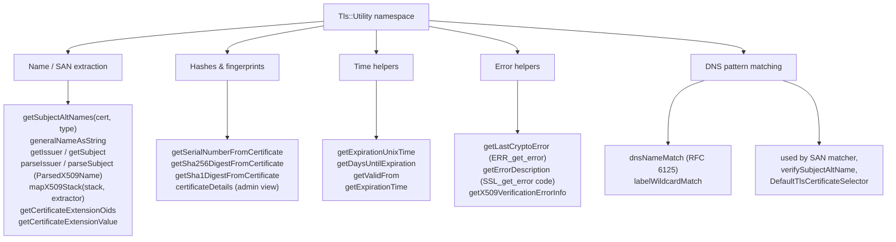
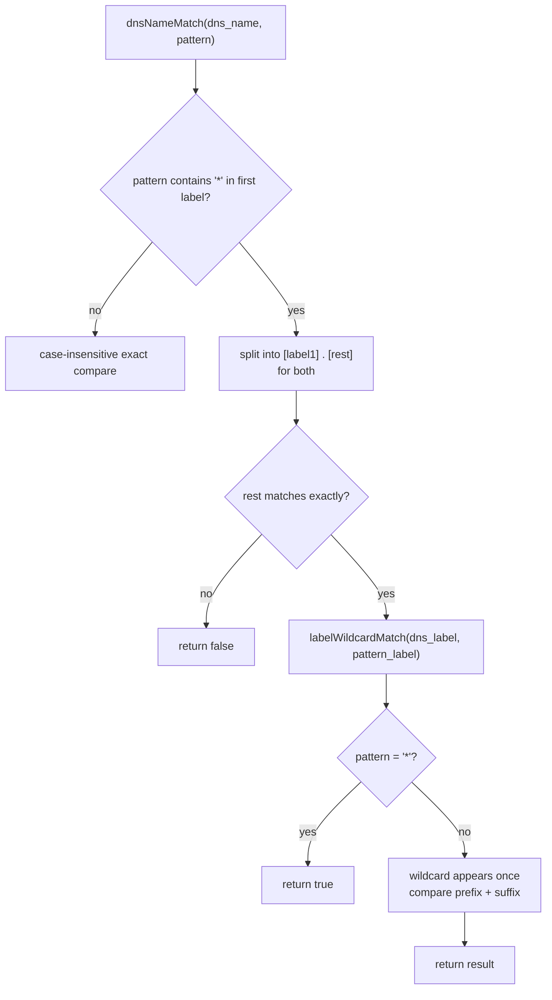
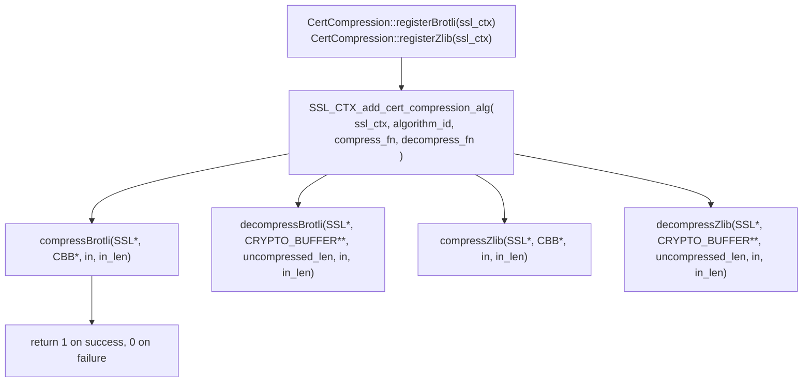
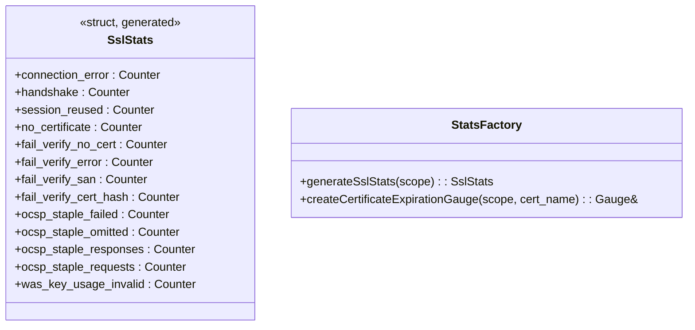
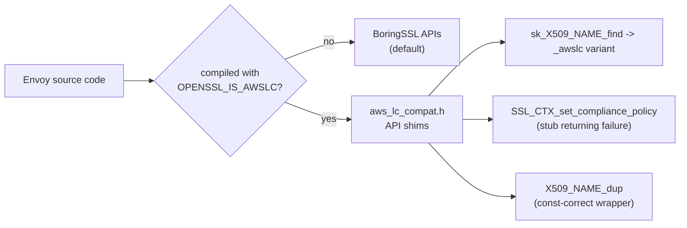
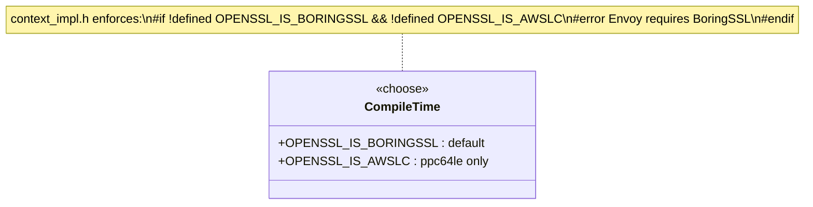
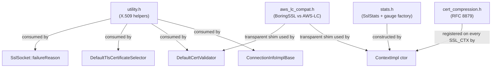

# Utilities

> Files: `utility.{h,cc}`, `cert_compression.{h,cc}`, `stats.{h,cc}`, `aws_lc_compat.h`

The grab‑bag of helpers used by the rest of the folder. Four mostly independent pieces:

1. **`utility.{h,cc}`** — X.509 helpers (SAN extraction, fingerprints, expiry math, error formatting, DNS wildcard matching).
2. **`cert_compression.{h,cc}`** — RFC 8879 TLS certificate compression with Brotli / Zlib.
3. **`stats.{h,cc}`** — counter struct + per‑cert expiration gauge factory.
4. **`aws_lc_compat.h`** — translates BoringSSL‑only calls into AWS‑LC equivalents on `ppc64le`.

Each file is independent of the others — `utility.h` doesn't depend on `cert_compression.h`, etc. They're grouped together because none of them justifies its own subfolder and each is just a thin shim over BoringSSL primitives.

---

## `utility.h` — X.509 and crypto helpers

### Key functions worth knowing

| Function | Used by |
|---|---|
| `dnsNameMatch(dns_name, pattern)` | SNI matcher; cert validator's SAN check |
| `labelWildcardMatch(label, pattern)` | Inner wildcard match within one DNS label (`b*z`) |
| `getSubjectAltNames(cert, type)` | `ConnectionInfoImplBase::*SansPeerCertificate` |
| `getSha256DigestFromCertificate` | Cert pinning, `sha256PeerCertificateDigest` |
| `certificateDetails(cert, path, time_source)` | Admin endpoint `/certs` output |
| `getDaysUntilExpiration(cert, time_source)` | `daysUntilFirstCertExpires` rollup |
| `getLastCryptoError` | `SslSocket::failureReason()` formatting |
| `getErrorDescription(err)` | Trace logs in handshaker |

### `dnsNameMatch` — the small but critical RFC 6125 implementation

Used by the default cert selector when matching the ClientHello SNI against cert SANs, and by `DefaultCertValidator::verifySubjectAltName` when matching peer cert SANs against configured allow‑lists.

RFC 6125 is the rulebook for what a TLS hostname match means, and it has two non‑obvious rules baked in: (1) a wildcard `*` is only allowed in the **leftmost label** (so `*.example.com` is fine but `foo.*.com` is not), and (2) a wildcard matches **exactly one label** and not multiple (so `*.example.com` matches `a.example.com` but **not** `a.b.example.com`). `dnsNameMatch` implements both rules. Getting either rule wrong silently is a real CVE category — a 2014 BIND advisory and several browser CVEs were exactly this bug. Envoy gets it right because it goes through this single helper.

### `certificateDetails`

Builds the admin‑plane `CertificateDetailsPtr` — what you see at `/certs` on the admin port. Contains path, SANs, issuance and expiration times, days until expiry, the chain length, and (for the CA) the days until the CA itself expires.

### Error formatting

`getLastCryptoError()` calls `ERR_get_error()` and `ERR_error_string_n` to produce a human‑readable string from BoringSSL's per‑thread error queue. `getErrorDescription(err)` translates `SSL_ERROR_*` constants into strings.

Used by `SslSocket::drainErrorQueue` and `failureReason()` so connection logs / stats include the actual TLS failure reason.

---

## `cert_compression.h` — RFC 8879

**What this is for:** TLS 1.3 lets the server compress its certificate chain (the largest single message in the handshake). RFC 8879 defines IANA‑assigned algorithm IDs; BoringSSL exposes `SSL_CTX_add_cert_compression_alg` to register them.

**When it's enabled:** `ContextImpl` calls `registerBrotli` and `registerZlib` on every freshly built `SSL_CTX` (in `context_impl.cc`). No config knob — always on if BoringSSL was built with the dependencies.

**Trade‑off:** roughly 30‑50% reduction in cert chain bytes on the wire, ~µs of CPU per handshake. Cheap.

The "always on" choice is intentional. For mTLS chains carrying multiple intermediates, the cert chain message can be several KB; on slow client networks (mobile, satellite) the saved bytes meaningfully reduce handshake latency. The CPU cost is negligible compared to the public‑key operations that dominate the handshake. Disabling it would be a regression for almost every deployment, so there's no knob.

The `SUCCESS = 1` / `FAILURE = 0` constants follow BoringSSL's return‑value conventions for these callbacks.

---

## `stats.h` — counter and gauge factory

The struct is generated from `ALL_SSL_STATS(COUNTER, GAUGE, HISTOGRAM)`. **No gauges or histograms** are actually defined in the macro — only counters. The per‑cert expiration gauge is created on‑demand via `createCertificateExpirationGauge` because gauge names include the cert name (so they can't be statically generated).

### When each counter fires

| Counter | Where |
|---|---|
| `handshake` | `ContextImpl::logHandshake` on success |
| `session_reused` | same, if `SSL_session_reused(ssl)` |
| `connection_error` | `SslSocket::drainErrorQueue` on fatal SSL error |
| `no_certificate` | Server saw no client cert when one wasn't required |
| `fail_verify_no_cert` | Client cert required but absent |
| `fail_verify_error` | Validator returned error (chain build, CA mismatch, etc.) |
| `fail_verify_san` | SAN matcher didn't match |
| `fail_verify_cert_hash` | Cert pinning failure (hash list / SPKI list mismatch) |
| `ocsp_staple_*` | OCSP staple path (see [`ocsp/README.md`](ocsp/README.md)) |
| `was_key_usage_invalid` | RSA cert lacked `digitalSignature` in `keyUsage` (with enforcement enabled) |

### Tagged counters

Beyond `SslStats`, `ContextImpl::incCounter` emits **tagged counters** for cipher, version, curve, and signature algorithm: e.g. `ssl.versions.TLSv1.3`, `ssl.ciphers.ECDHE-RSA-AES128-GCM-SHA256`. The "unknown" fallbacks (`unknown_ssl_*`) are used when BoringSSL returns a value the symbol table doesn't recognise.

Tagged counters are surprisingly useful in production. When a TLS regression rolls out, the **shape** of cipher/version usage changes — e.g. clients suddenly stop using TLS 1.3 because of a misconfigured cipher list, or an outdated client population shows up as a spike in `ssl.versions.TLSv1.2`. Setting alerts on the ratios of these tagged counters catches issues that the aggregate `handshake` counter would miss.

---

## `aws_lc_compat.h` — alternative BoringSSL

Used when Envoy is compiled against AWS‑LC instead of BoringSSL — **currently only on `ppc64le`**. The file deliberately keeps the surface area tiny:

- **`sk_X509_NAME_find_awslc`** — AWS‑LC ships an `_awslc` suffixed variant; the `#define` makes existing call sites compile unchanged.
- **`SSL_CTX_set_compliance_policy`** — AWS‑LC doesn't have BoringSSL's compliance policy API. The stub returns 0 so the normal error path in `ContextConfigImpl` reports "compliance policy not supported" instead of failing to link.
- **`X509_NAME_dup`** — BoringSSL accepts `const X509_NAME*`; AWS‑LC requires non‑const. A `const_cast` wrapper at the include site keeps the rest of the codebase const‑correct.

If someone tries to compile against vanilla OpenSSL, the `#error` in `context_impl.h:35‑37` stops the build.

---

## How these four pieces relate

---

## Cheat sheet

| Question | Answer |
|---|---|
| How do I check if a DNS name matches a wildcard pattern? | `Utility::dnsNameMatch(name, pattern)` |
| How do I get the SHA‑256 of a cert? | `Utility::getSha256DigestFromCertificate(cert)` |
| How do I get a human‑readable BoringSSL error? | `Utility::getLastCryptoError()` |
| Where does the `days_until_first_cert_expiring` gauge come from? | `createCertificateExpirationGauge(scope, cert_name)` |
| Is cert compression on by default? | Yes, both Brotli and Zlib are registered on every `SSL_CTX` |
| Can I disable cert compression? | Not from config; it's wired in unconditionally in `ContextImpl` |
| How do I add a new counter? | Extend `ALL_SSL_STATS` macro in `stats.h`; `generateSslStats` picks it up automatically |
| Does Envoy support vanilla OpenSSL? | No — `context_impl.h` enforces BoringSSL or AWS‑LC at compile time |
| Where are the BoringSSL/AWS‑LC differences? | `aws_lc_compat.h` — currently three small shims, only used on `ppc64le` |
