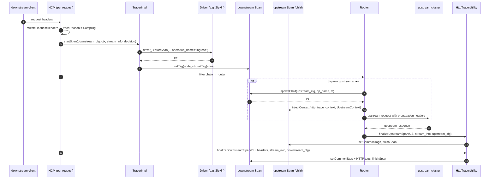

# Tracing — Overview

`source/common/tracing/` is the **protocol-neutral core** for distributed tracing. Drivers
(Zipkin/OpenTelemetry/etc.) hang off the `Tracing::Driver` interface and live elsewhere; this folder hosts the
runtime that holds them, decides what to trace, builds spans, and decorates them with tags Envoy operators
expect.

For class-level detail see [`tracer_impl.md`](tracer_impl.md), [`tracer_manager.md`](tracer_manager.md),
[`http_tracer.md`](http_tracer.md), [`custom_tags.md`](custom_tags.md).

---

## The five roles

### 1. `TracerManagerImpl` — the singleton driver cache

One per server. Indexed by `MessageUtil::hash(Tracing.Http)` proto. When HCM or another listener-scoped
component asks for a `TracerSharedPtr`, the manager:

1. Hashes the config proto.
2. Looks the hash up in `tracers_` (a `flat_hash_map<size_t, weak_ptr<Tracer>>`).
3. If found and the weak_ptr is still alive → return.
4. Otherwise → garbage-collect expired weak_ptrs, call the registered `TracerFactory::createTracerDriver`, wrap
   it in a `TracerImpl`, cache, return.

The cache key is the **proto hash**, so two listeners pointing at identical Zipkin config share the same
`Driver` and therefore the same HTTP/gRPC connection pool back to the collector — a huge win at scale.

### 2. `TracerImpl` / `NullTracer` — protocol-agnostic dispatch

`TracerImpl` is a thin wrapper that owns a `DriverSharedPtr` and a `LocalInfo&`. Its `startSpan` builds an
operation-name string ("ingress" / "egress &lt;host&gt;"), calls into `driver_->startSpan(...)`, then decorates the
returned span with two universal tags: `node_id` and `zone`.

`NullTracer` is the no-op tracer — returned by `TracerManagerImpl::getOrCreateTracer(nullptr)`. Its `startSpan`
returns a `NullSpan` which silently absorbs all subsequent calls. This is the path for "tracing disabled for this
listener".

### 3. Sampling — `TracerUtility::shouldTraceRequest`

Returns `(Reason, bool sample)`. Logic (in priority order):

1. **Health-check** request → `(HealthCheck, false)`. Never traced.
2. `stream_info.traceReason()` is `ClientForced` (x-client-trace-id header) → `(ClientForced, true)`.
3. `ServiceForced` (Envoy-internal force) → `(ServiceForced, true)`.
4. `Sampling` (random/runtime-based decision earlier in the pipeline) → `(Sampling, true)`.
5. Otherwise → `(<reason>, false)`.

The actual *sampling rate* is applied earlier — by `Http::ConnectionManagerUtility::mutateRequestHeaders` which
consults `client_sampling`, `random_sampling`, and `overall_sampling` from `ConnectionManagerTracingConfig` and
sets `traceReason()` accordingly. By the time `shouldTraceRequest` runs, the decision is already encoded.

### 4. Tag population — `TracerUtility::finalizeSpan` / `HttpTracerUtility::*`

The "what tags get attached to every span" lives in two places:

- **`TracerUtility::finalizeSpan`** (protocol-neutral) — `component=proxy`, `response_flags`, `peer.address`,
  `upstream_cluster*`, `upstream_address`, plus verbose `log()` annotations if `tracing_config.verbose()` is on,
  then `tracing_config.modifySpan(span, upstream_span)`, then `span.finishSpan()`.

- **`HttpTracerUtility::finalizeDownstreamSpan`** — adds the HTTP-specific tags on the *downstream* span before
  delegating to `setCommonTags` (the HTTP-aware twin of `TracerUtility::finalizeSpan`):
  - `guid:x-request-id`, `guid:x-client-trace-id` (if present)
  - `http.url`, `http.method`, `http.protocol`
  - `user_agent`, `downstream_cluster`
  - `peer.address` (downstream remote)
  - gRPC tags (`grpc.path`, `grpc.authority`, `grpc.content_type`, `grpc.timeout`) if gRPC
  - `request_size`, `response_size`
  - `http.status_code` + the `error=true` flag for 5xx
  - gRPC status tags + error flag for non-OK well-known statuses
  - Verbose `log()` annotations for each `TimingUtility` event
  - `tracing_config.modifySpan(span, false)`
  - `span.finishSpan()`

- **`HttpTracerUtility::finalizeUpstreamSpan`** — same but for the upstream child span: `http.protocol`,
  `upstream_address`, `peer.address` (upstream remote), `setCommonTags(span, _, true)`, `finishSpan()`.

The canonical tag/log names all come from `common_values.h` (`Tags::get()` / `Logs::get()` const singletons) so a
typo can't slip through.

### 5. Context propagation — `Span::injectContext` + `HttpTraceContext`

Every driver implements `Span::injectContext(TraceContext&, UpstreamContext)` which writes its propagation
headers (`x-b3-traceid`, `traceparent`, `uber-trace-id`, …) into the supplied `TraceContext`.

`HttpTraceContext` is the **adapter** that lets a driver inject into any `Http::RequestHeaderMap`. Constructed
on the upstream request just before send, it forwards `set`/`get`/`remove`/`forEach` to the underlying header
map and exposes `requestHeaders()` so a driver can iterate cookies or any other meta directly. The read-only
sibling `ReadOnlyHttpTraceContext` is used for custom-tag extraction where no headers should be mutated.

---

## The two-span model

Two important behaviours:

- **Upstream span is optional.** Controlled by `ConnectionManagerTracingConfig::spawnUpstreamSpan()`. Off by
  default for compatibility — when off, retries and round-trip details only show up as tags / logs on the
  downstream span.
- **Header injection happens on the *upstream* span when present, otherwise on the downstream span.** This is
  invisible to drivers (they just get a `TraceContext`).

---

## Recreate-stream / internal redirect

Tracing is not aware of recreate-stream. When HCM recreates the stream:

- The downstream `StreamInfo` is re-created and the previous `traceReason()` is **not** carried forward.
- HCM re-evaluates sampling for the redirected request — typically this means the redirected hop is *not*
  traced unless it independently samples in.
- This is intentional: a redirect can be sensitive (the route was unknown before) and we don't want to leak
  trace IDs across an internal redirect's authorization boundary.

If you need a continuous trace across internal redirect, put a tracing-aware filter in the chain that promotes
`x-request-id` from the previous filter-state at `Lifespan::Request`.

---

## Custom tags

Custom tags let operators attach arbitrary values to every span without code changes. Five flavours, all
implemented in this folder:

| Flavour       | Source of value                                            | Class                       |
|---------------|------------------------------------------------------------|-----------------------------|
| Literal       | A constant string from config                              | `LiteralCustomTag`          |
| Environment   | An env var (with default), captured **once** at startup    | `EnvironmentCustomTag`      |
| Request header| The first matching request header (with default)           | `RequestHeaderCustomTag`    |
| Metadata      | Route/cluster/host/connection metadata (`MetadataKind`)    | `MetadataCustomTag`         |
| Formatter     | A substitution-formatter string (`%REQ(...)%`, `%CEL(...)%`, …) | `FormatterCustomTag`   |

`CustomTagUtility::createCustomTag(proto, command_parsers)` is the single factory.

All of them implement two paths: **`applySpan(Span&, CustomTagContext&)`** (write into the tracing span) and
**`applyLog(AccessLogCommon&, CustomTagContext&)`** (write into a gRPC access-log entry). The same configured
tag can therefore be reused for tracing and access-log emission with consistent semantics.

---

## Verbose mode

When `tracing_config.verbose()` is true, `HttpTracerUtility::setCommonTags` (and the protocol-neutral twin
`TracerUtility::finalizeSpan`) call `annotateVerbose(span, stream_info)`. This emits one **structured log
event** per timing milestone:

- `last_downstream_rx_byte_received`
- `first_upstream_tx_byte_sent` / `last_upstream_tx_byte_sent`
- `first_upstream_rx_byte_received` / `last_upstream_rx_byte_received`
- `first_downstream_tx_byte_sent` / `last_downstream_tx_byte_sent`

Each log event carries its absolute `SystemTime` (`start_time_ + monotonic_offset`), so drivers can render them
as point-in-time annotations on the span timeline.

Use sparingly — it can roughly double the per-span payload size.

---

## What this folder explicitly does **not** do

- **No protocol-specific span wire format.** Zipkin/B3/OTel/etc. all live in `source/extensions/tracers/*`.
- **No transport.** Drivers own their own HTTP/gRPC clients to the collector.
- **No sampling primitives.** The math (`FractionalPercent` rolls) lives in `Http::ConnectionManagerUtility`;
  by the time we touch the request, `traceReason()` is already set.
- **No CEL evaluation.** Formatter custom tag delegates to `source/common/formatter/`.
- **No xDS.** Tracer config is part of HCM, refreshed on listener update; there is no separate "tracer
  discovery service".

---

See also:

- [`tracer_impl.md`](tracer_impl.md) — `TracerImpl::startSpan` and `NullTracer`/`NullSpan`.
- [`tracer_manager.md`](tracer_manager.md) — singleton, dedup, factory wiring.
- [`http_tracer.md`](http_tracer.md) — HTTP adapter + canonical tag population.
- [`custom_tags.md`](custom_tags.md) — five custom-tag flavours.
- [`CLASS_HIERARCHY.md`](CLASS_HIERARCHY.md) — visual UML.
