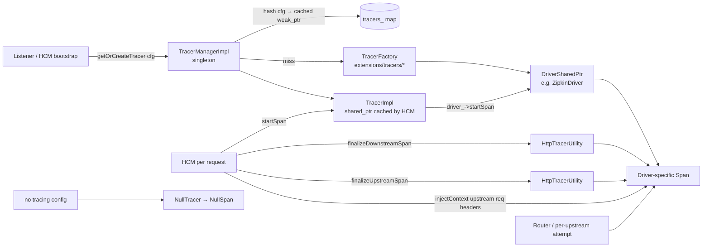

# `source/common/tracing/` — Distributed tracing core

This folder is the **driver-agnostic tracing core**. It defines how Envoy:

- decides whether a request should be sampled,
- starts a span for the downstream request,
- spawns child spans for upstream attempts,
- decorates spans with standardised and user-configured tags,
- propagates the span context into upstream request headers,
- caches tracer driver instances across listeners.

Concrete tracer drivers (Zipkin, OpenTelemetry, Datadog, SkyWalking, …) live under
`source/extensions/tracers/*` and implement the `Tracing::Driver` interface that this folder consumes.

> **TL;DR** — this folder owns:
> - **`TracerImpl`** + **`NullTracer`** — protocol-agnostic `Tracer` implementations.
> - **`TracerManagerImpl`** — singleton that hands out `TracerSharedPtr` by config hash (dedupe).
> - **`HttpTracerUtility`** + **`HttpTraceContext`** — HTTP-specific helpers: tag population, span finalization,
>   `Http::RequestHeaderMap` adapter for `Tracing::TraceContext`.
> - **`TracerUtility`** — `shouldTraceRequest` (sampling decision wrapper), common-tag setter, verbose timing
>   annotations.
> - **`ConnectionManagerTracingConfig`** + **`TracerFactoryContextImpl`** — typed config for HCM's tracing block.
> - **`CustomTag*Impl`** family — implementations of literal / environment / header / metadata / formatter
>   custom-tag flavours.
> - **`TraceContextHandler`** — fast key/value accessor for `TraceContext` (inline-header optimised when backed
>   by an HTTP header map).
> - **`NullSpan`** — no-op span used when tracing is disabled / not configured.
> - **`Tags` / `Logs`** (`common_values.h`) — canonical tag names and log-event names.

---

## Folder map

```
source/common/tracing/
├── BUILD
├── common_values.h           # Tags / Logs canonical name singletons
├── null_span_impl.h          # NullSpan (no-op Tracing::Span)
├── tracer_impl.{h,cc}        # TracerImpl + NullTracer + EgressConfigImpl + TracerUtility
├── tracer_manager_impl.{h,cc}# TracerManagerImpl — config-hash dedup singleton
├── tracer_config_impl.{h,cc} # TracerFactoryContextImpl + ConnectionManagerTracingConfig
├── http_tracer_impl.{h,cc}   # HttpTraceContext(HTTP <-> TraceContext) + HttpTracerUtility
├── trace_context_impl.{h,cc} # TraceContextHandler (fast get/set with inline-header)
├── custom_tag_impl.{h,cc}    # 5 CustomTag flavours + factory
└── tracing_validation.{h,cc} # tracing_proto validation visitor hookup
```

All interfaces (`Tracer`, `Span`, `Driver`, `TraceContext`, `CustomTag`, `Config`, `TracerManager`) live under
`envoy/tracing/`; this folder is the only first-party implementation.

---

## Per-topic table

| Topic                                  | Document                                                     | Source                                                |
|----------------------------------------|--------------------------------------------------------------|-------------------------------------------------------|
| Architecture & layering                | [`OVERVIEW.md`](OVERVIEW.md)                                 | How tracer manager / tracer / driver / span compose   |
| Class hierarchy (UML)                  | [`CLASS_HIERARCHY.md`](CLASS_HIERARCHY.md)                   | Every class in this folder                            |
| `TracerImpl` + `TracerUtility`         | [`tracer_impl.md`](tracer_impl.md)                           | `tracer_impl.{h,cc}`, `null_span_impl.h`              |
| `TracerManagerImpl` (singleton, dedup) | [`tracer_manager.md`](tracer_manager.md)                     | `tracer_manager_impl.{h,cc}`, `tracer_config_impl.{h,cc}` |
| HTTP wiring & tag population           | [`http_tracer.md`](http_tracer.md)                           | `http_tracer_impl.{h,cc}`, `trace_context_impl.{h,cc}`|
| Custom tags                            | [`custom_tags.md`](custom_tags.md)                           | `custom_tag_impl.{h,cc}`                              |

---

## Big picture



### Lifecycle in one paragraph

HCM/listener bootstrap asks the **`TracerManagerImpl`** singleton for a `TracerSharedPtr` keyed by the hash of the
tracer Http config. If a live one exists it's returned; otherwise the manager looks up the registered
**`TracerFactory`**, builds a **`Driver`**, wraps it in a **`TracerImpl`**, and caches a weak_ptr. When a request
arrives, HCM constructs an **`HttpTraceContext`** over the request headers, asks `TracerUtility::shouldTraceRequest`
for the sampling decision, then calls `TracerImpl::startSpan(...)` which delegates to the driver. As the request
proceeds, HCM and the router call `HttpTracerUtility::finalizeDownstreamSpan` / `finalizeUpstreamSpan` to add
standard tags and finally `span->finishSpan()` to ship.

---

## Relationships with the rest of Envoy

| Depends on                              | Why                                                      |
|-----------------------------------------|----------------------------------------------------------|
| `envoy/tracing/*`                       | the PURE interfaces this folder implements               |
| `envoy/http/header_map.h`               | `HttpTraceContext` adapts `Http::RequestHeaderMap`       |
| `envoy/stream_info/stream_info.h`       | almost all tag values come from here                     |
| `envoy/formatter/substitution_formatter`| custom tag flavour `Formatter` + operation-name formatter|
| `envoy/server/tracer_config.h`          | `TracerFactory` / `TracerFactoryContext` interfaces      |
| `source/common/stream_info/utility.h`   | `ResponseFlagUtils::toShortString`, `TimingUtility`      |
| `source/common/grpc/common.h`           | gRPC-status-aware tag population                         |
| `source/common/singleton/`              | `ConstSingleton`, `SINGLETON_MANAGER_REGISTRATION`       |

| Used by                                                   | What it pulls                                                  |
|-----------------------------------------------------------|----------------------------------------------------------------|
| `source/common/http/conn_manager_impl.cc`                 | builds tracing config; starts/finishes downstream span         |
| `source/common/router/router.cc`                          | spawns upstream child span; injects context into upstream req  |
| `source/extensions/tracers/*`                             | implement `Tracing::Driver` consumed by `TracerImpl`           |
| `source/common/grpc/async_client_impl.cc`                 | uses `EgressConfig` for async-gRPC tracing                     |
| `source/common/access_log/*`                              | custom tags can be reused for access-log emission              |

---

## Quick reading order

1. **[`OVERVIEW.md`](OVERVIEW.md)** — sampling decision, span tree, propagation, tracer caching.
2. **[`tracer_impl.md`](tracer_impl.md)** — what `TracerImpl::startSpan` does and how `NullSpan` is used.
3. **[`tracer_manager.md`](tracer_manager.md)** — config-hash dedupe, factory wiring, config protos.
4. **[`http_tracer.md`](http_tracer.md)** — HTTP adapter + standard tag population.
5. **[`custom_tags.md`](custom_tags.md)** — literal / env / header / metadata / formatter tags.
6. **[`CLASS_HIERARCHY.md`](CLASS_HIERARCHY.md)** — visual checkpoint.
