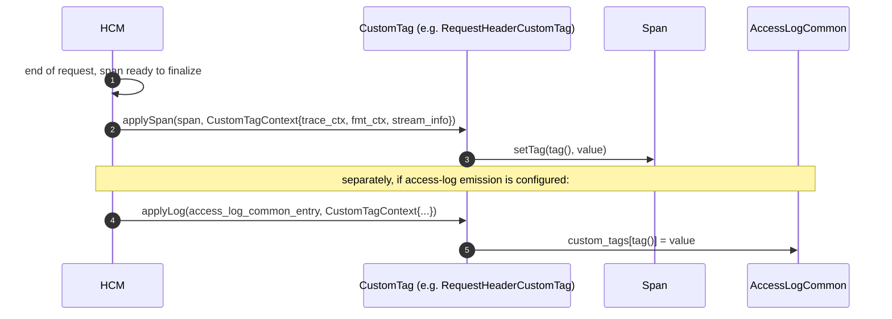

# `custom_tag_impl.{h,cc}` — Custom tracing tags

Custom tags let operators attach arbitrary keys to every span (and parallel access-log entries) without
writing code. The folder ships **five flavours** of custom tag and a single factory.

| Flavour          | Proto oneof case        | Source class               | Cost           |
|------------------|-------------------------|----------------------------|----------------|
| Literal          | `literal`               | `LiteralCustomTag`         | $O(1)$         |
| Environment      | `environment`           | `EnvironmentCustomTag`     | $O(1)$ (cached at ctor) |
| Request header   | `request_header`        | `RequestHeaderCustomTag`   | $O(1)$ inline-header lookup |
| Metadata         | `metadata`              | `MetadataCustomTag`        | $O(\text{metadata path depth})$ |
| Formatter        | `value`                 | `FormatterCustomTag`       | depends on commands used (`%REQ%`, `%CEL%`, …) |

All concrete tags either derive from `CustomTagBase` (the first four) or implement the `CustomTag` interface
directly (`FormatterCustomTag`).

---

## Shared shape

```cpp
class CustomTag {
public:
  virtual absl::string_view tag() const = 0;
  virtual void applySpan(Span& span, const CustomTagContext& ctx) const = 0;
  virtual void applyLog(envoy::data::accesslog::v3::AccessLogCommon& entry,
                        const CustomTagContext& ctx) const = 0;
};
```

`CustomTagContext` (from `envoy/tracing/custom_tag.h`) packs the per-request inputs:

```cpp
struct CustomTagContext {
  const TraceContext& trace_context;
  const Formatter::HttpFormatterContext& formatter_context;
  const StreamInfo::StreamInfo& stream_info;
};
```

### `CustomTagBase` — the default skeleton for the first four flavours

```cpp
class CustomTagBase : public CustomTag {
  std::string tag_;
public:
  absl::string_view tag() const override { return tag_; }
  void applySpan(Span& span, const CustomTagContext& ctx) const override {
    auto v = value(ctx);
    if (!v.empty()) span.setTag(tag(), v);
  }
  void applyLog(AccessLogCommon& entry, const CustomTagContext& ctx) const override {
    auto v = value(ctx);
    if (!v.empty()) (*entry.mutable_custom_tags())[std::string(tag())] = std::string(v);
  }
  virtual absl::string_view value(const CustomTagContext&) const PURE;
};
```

So subclasses only override `value(ctx)`; both span and access-log application share the empty-value skipping
behaviour. **`FormatterCustomTag`** can't fit this template because its computation returns `std::string`
(formatter output) rather than `absl::string_view`, so it overrides `applySpan` / `applyLog` directly.

---

## `LiteralCustomTag`

```cpp
class LiteralCustomTag : public CustomTagBase {
  std::string value_;
public:
  LiteralCustomTag(const std::string& tag, const Literal& literal)
      : CustomTagBase(tag), value_(literal.value()) {}
  absl::string_view value(const CustomTagContext&) const override { return value_; }
};
```

The simplest case. Useful for static deployment metadata (`region=us-east1`, `cluster_role=backend`).

---

## `EnvironmentCustomTag`

```cpp
EnvironmentCustomTag::EnvironmentCustomTag(const std::string& tag, const Environment& env)
    : CustomTagBase(tag), name_(env.name()), default_value_(env.default_value()) {
  const char* e = std::getenv(name_.data());
  final_value_ = e ? e : default_value_;
}
absl::string_view value(...) const override { return final_value_; }
```

`std::getenv` is evaluated **once at ctor** — typically server-start time. Mutating the environment at runtime
will NOT change the tag value; that matches Envoy's general "config is captured" philosophy and avoids a
`getenv` (not-thread-safe in general) on every request.

Common uses: `pod_name=$HOSTNAME`, `commit_sha=$GIT_COMMIT`, `build_id=$CI_BUILD_ID`.

---

## `RequestHeaderCustomTag`

```cpp
RequestHeaderCustomTag::RequestHeaderCustomTag(const std::string& tag,
                                               const Header& h)
    : CustomTagBase(tag),
      name_(LowerCaseString(h.name())),      // TraceContextHandler
      header_name_(h.name()),                // LowerCaseString cached for HTTP-direct path
      default_value_(h.default_value()) {}
```

`value()` has two implementations gated by a runtime feature flag:

```cpp
absl::string_view value(const CustomTagContext& ctx) const {
  if (!runtimeFeatureEnabled("envoy.reloadable_features.get_header_tag_from_header_map")) {
    // Legacy path: go through TraceContextHandler (works for any TraceContext)
    return name_.get(ctx.trace_context).value_or(default_value_);
  }
  // New path: go through the formatter context's request header map directly
  if (auto headers = ctx.formatter_context.requestHeaders(); headers.has_value()) {
    auto values = headers->get(header_name_);
    if (!values.empty()) return values[0]->value().getStringView();
  }
  return default_value_;
}
```

The new path bypasses the `TraceContext` adapter when a `Http::RequestHeaderMap` is available directly,
shaving an indirection. Both paths only read the **first** header value when duplicates exist (see the
`TODO(#13454)` referenced in source).

---

## `MetadataCustomTag`

```cpp
class MetadataCustomTag : public CustomTagBase {
  MetadataKind::KindCase kind_;             // Request | Route | Cluster | Host
  Config::MetadataKey metadata_key_;        // filter namespace + nested path
  std::string default_value_;
};
```

### `metadata(ctx)` — choose the source

```cpp
switch (kind_) {
  case kRequest:  return &stream_info.dynamicMetadata();
  case kRoute:    return stream_info.route() ? &stream_info.route()->metadata() : nullptr;
  case kCluster:  return stream_info.upstreamInfo().has_value() && upstreamHost
                       ? &upstreamHost->cluster().metadata() : nullptr;
  case kHost:     return upstreamHost ? upstreamHost->metadata().get() : nullptr;
  default:        IS_ENVOY_BUG("Unknown config"); return nullptr;
}
```

### `metadataToString(meta)` — render the resolved `Protobuf::Value`

```cpp
const Protobuf::Value& v = Config::Metadata::metadataValue(metadata, metadata_key_);
switch (v.kind_case()) {
  case kBoolValue:    return v.bool_value() ? "true" : "false";
  case kNumberValue:  return absl::StrCat(v.number_value());
  case kStringValue:  return v.string_value();
  case kListValue:    return JSON-of(v.list_value());      // requires ENVOY_ENABLE_YAML
  case kStructValue:  return JSON-of(v.struct_value());
  default:            return absl::nullopt;
}
```

If the kind isn't representable (null value, missing key, JSON build disabled and value is list/struct),
returns `nullopt`; then `applySpan`/`applyLog` fall back to `default_value_` if provided, else skip.

**Why overrides `applySpan` / `applyLog`?** Because it needs to handle the
`absl::nullopt` → `default_value_` branch, which the `CustomTagBase` default `value()`-based path can't express.

Common use cases:

- `route_id` — read from route metadata `envoy.lb` filter namespace.
- `tenant_id` — read from request dynamic metadata populated by an earlier filter.
- `cluster_owner` — read from cluster metadata at config time.

---

## `FormatterCustomTag`

```cpp
class FormatterCustomTag : public CustomTag {
  std::string tag_;
  Formatter::FormatterPtr formatter_;
public:
  FormatterCustomTag(absl::string_view tag, absl::string_view value,
                     const Formatter::CommandParserPtrVector& parsers = {}) {
    auto f = Formatter::FormatterImpl::create(value, /*omit_empty_values=*/true, parsers);
    THROW_IF_NOT_OK_REF(f.status());
    formatter_ = std::move(f.value());
  }
  // applySpan / applyLog call formatter_->format(ctx.formatter_context, ctx.stream_info)
  // and write the result if non-empty.
};
```

The most powerful flavour — any substitution-format string works:

- `%REQ(:METHOD)%/%REQ(:PATH)%`
- `%RESPONSE_CODE%`
- `%CEL(request.headers["x-tenant"])%` (with CEL command parser)
- `%FILTER_STATE(envoy.filters.http.ext_authz.id):PLAIN%`
- `%STREAM_INFO_REQ(%upstream_cluster%)%`

`omit_empty_values=true` mirrors the empty-value behaviour of the other flavours: if the formatter returns an
empty string, no tag is written.

---

## `CustomTagUtility::createCustomTag` — the factory

```cpp
CustomTagConstSharedPtr CustomTagUtility::createCustomTag(
    const envoy::type::tracing::v3::CustomTag& tag,
    const Formatter::CommandParserPtrVector& command_parsers) {
  switch (tag.type_case()) {
    case kLiteral:        return make_shared<const LiteralCustomTag>(tag.tag(), tag.literal());
    case kEnvironment:    return make_shared<const EnvironmentCustomTag>(tag.tag(), tag.environment());
    case kRequestHeader:  return make_shared<const RequestHeaderCustomTag>(tag.tag(), tag.request_header());
    case kMetadata:       return make_shared<const MetadataCustomTag>(tag.tag(), tag.metadata());
    case kValue:          return make_shared<const FormatterCustomTag>(tag.tag(), tag.value(), command_parsers);
    case TYPE_NOT_SET:    PANIC_DUE_TO_CORRUPT_ENUM;
  }
}
```

HCM calls this exactly once per `<CustomTag>` entry in the proto, at config build time. The returned
`shared_ptr<const CustomTag>` lives in `ConnectionManagerTracingConfig::custom_tags_` for the life of the
listener.

---

## Apply lifecycle



Both calls happen serially on the same thread (the request's worker thread) so no synchronisation is needed.

---

## Gotchas

1. **`EnvironmentCustomTag` is captured at startup.** Operators sometimes assume `$POD_NAME` will follow a
   pod restart. It will — because the *process* restarts and the new process re-`getenv`s.
2. **Header reads return only the first value.** Multi-valued headers (`x-forwarded-for`) lose history. The
   `TODO(#13454)` tracks fixing this.
3. **`MetadataCustomTag` returns JSON for `ListValue`/`StructValue`** only when `ENVOY_ENABLE_YAML` is on.
   Without YAML support, complex metadata silently falls back to `default_value_` (or the tag is skipped).
4. **`FormatterCustomTag` parsing happens at config time** — bad format strings throw during HCM filter chain
   factory construction, not per request.
5. **All flavours skip empty values.** If you want a literal "(empty)" placeholder, configure
   `default_value_` explicitly.
6. **`CustomTag` objects are `const`** after creation and shared by every worker; never mutate state from
   `value()`/`applySpan`/`applyLog`.
