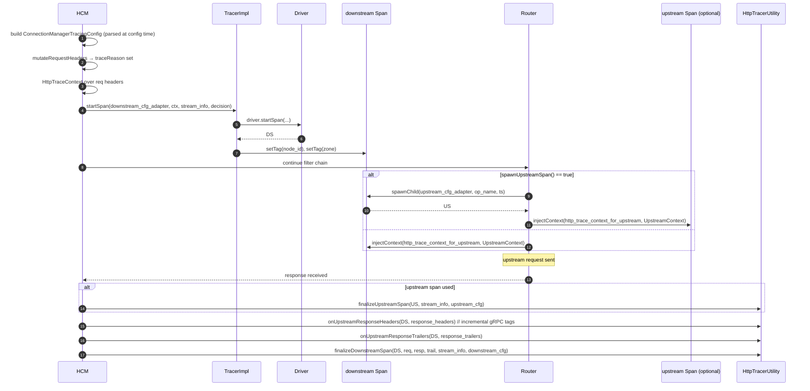

# `http_tracer_impl.{h,cc}` + `trace_context_impl.{h,cc}` + `common_values.h`

These files implement the **HTTP-specific tracing wiring**:

- **`HttpTraceContextBase<T>`** + **`HttpTraceContext`** + **`ReadOnlyHttpTraceContext`** — adapters that make
  an `Http::RequestHeaderMap` look like a `Tracing::TraceContext` for drivers (so they can read/write
  propagation headers without knowing about HTTP).
- **`HttpTracerUtility`** — static helpers HCM/router call to:
  - Decorate the downstream span with HTTP request/response tags before finishing it.
  - Decorate an upstream child span and finish it.
  - Inject incremental upstream-response tags on response headers/trailers.
- **`TraceContextHandler`** — fast keyed accessor over any `TraceContext`, optimised for HTTP via
  `CustomInlineHeaderRegistry`.
- **`Tags` / `Logs`** const-singletons (`common_values.h`) — the canonical tag/key names used everywhere.

---

## `HttpTraceContext` — adapt `Http::RequestHeaderMap` to `TraceContext`

The `TraceContext` interface (defined in `envoy/tracing/trace_context.h`) is intentionally protocol-agnostic so
that the same `Driver` can serve HTTP, MQTT, Thrift, etc. For HTTP we adapt thus:

```cpp
template <class T> // T must be (const) Http::RequestHeaderMap
class HttpTraceContextBase : public TraceContext {
  T& request_headers_;
public:
  absl::string_view protocol() const override { return request_headers_.getProtocolValue(); }
  absl::string_view host()     const override { return request_headers_.getHostValue(); }
  absl::string_view path()     const override { return request_headers_.getPathValue(); }
  absl::string_view method()   const override { return request_headers_.getMethodValue(); }

  void forEach(IterateCallback cb) const override { … iterate headers … }

  absl::optional<absl::string_view> get(absl::string_view key) const override {
    auto entry = request_headers_.get(LowerCaseString(std::string(key)));
    if (!entry.empty()) return entry[0]->value().getStringView();
    return absl::nullopt;
  }

  // Default: no-op set/remove (overridden by HttpTraceContext below).
  void set(absl::string_view, absl::string_view) override {}
  void remove(absl::string_view) override {}
};
```

Two concrete instantiations:

- **`HttpTraceContext`** — `T = Http::RequestHeaderMap`. Overrides `set` to call `setCopy` and `remove` to call
  `headers.remove`. This is what's passed to driver `injectContext` on the outbound request.
- **`ReadOnlyHttpTraceContext`** — `T = const Http::RequestHeaderMap`. Used for *extraction* paths (custom-tag
  evaluation, trace-context custom tag lookups) where mutations must not be possible — `set`/`remove` are the
  base class no-ops.

Both expose `requestHeaders()` so drivers can fall through to header-map-aware code paths if they want
(e.g., reading cookies). The `OptRef` shapes the lifetime contract clearly.

---

## `TraceContextHandler` — fast keyed access

When a driver / custom tag needs to repeatedly read or write the *same* key on a `TraceContext`, allocating a
`LowerCaseString(std::string(key))` on every call would be wasteful. `TraceContextHandler` precomputes the
lowercased key once and, **when the underlying `TraceContext` is HTTP-backed**, also captures an
`InlineHandle` so the lookup is a pointer comparison rather than a hash-map probe.

```cpp
TraceContextHandler h{"x-request-id"};
auto v = h.get(trace_context);           // optional<string_view>
h.set(trace_context, "abc-123");          // setCopy
h.remove(trace_context);
auto all = h.getAll(trace_context);       // InlinedVector — multi-value
h.setRefKey(ctx, value);                  // key has longer lifetime than stream
h.setRef(ctx, value);                     // BOTH key and value outlive the stream
```

- `set`, `setRefKey`, `setRef` differ in **reference semantics** to avoid string copies in the header map.
  `setRef` is the cheapest but the unsafest — only use when both key and value are static strings.
- `getAll` returns every header instance with the same key (HTTP allows duplicates); `get` is the cheap "first
  value" shortcut.

`TraceContextHandler` is what powers `RequestHeaderCustomTag` (cache the header name handler in the tag
object's ctor; repeat lookups on every request are O(1)).

---

## `Tags` and `Logs` — canonical names

`common_values.h` defines two `ConstSingleton`s with every canonical string:

| Group  | Examples                                                                                          |
|--------|---------------------------------------------------------------------------------------------------|
| `Tags` | `Component=component`, `HttpMethod=http.method`, `HttpStatusCode=http.status_code`, `HttpUrl=http.url`, `PeerAddress=peer.address`, `UpstreamCluster=upstream_cluster`, `ResponseFlags=response_flags`, `RetryCount=retry.count`, `NodeId=node_id`, `Zone=zone`, `GuidXRequestId=guid:x-request-id`, … |
| `Logs` | `LastDownstreamRxByteReceived=last_downstream_rx_byte_received`, `FirstUpstreamTxByteSent=first_upstream_tx_byte_sent`, … (one per `TimingUtility` event) |

The `OpenTracing` standard tag names (`db.statement`, `peer.ipv4`, …) are pre-listed even when not currently
emitted, so an extension adding DB tracing doesn't invent a competing string.

---

## `HttpTracerUtility` — the tag-population workhorse

### `finalizeDownstreamSpan`

Called by HCM at end-of-stream for the downstream span. Pseudocode:

```cpp
if (!span.exportedSpan()) { span.finishSpan(); return; }   // early-exit when NullSpan etc.

// Request tags
if (request_headers) {
  if (RequestId)    setTag("guid:x-request-id", request_id_value);
  setTag("http.url",     buildOriginalUri(headers, maxPathTagLength));
  setTag("http.method",  method_value);
  setTag("downstream_cluster", EnvoyDownstreamServiceCluster or "-");
  setTag("user_agent",         UserAgent or "-");
  setTag("http.protocol",      protocolToStringOrDefault(stream_info.protocol()));
  setTag("peer.address",       direct_remote_ip_or_logical_name);
  if (ClientTraceId) setTag("guid:x-client-trace-id", client_trace_id_value);
  if (isGrpcRequest) addGrpcRequestTags(span, headers);   // grpc.path/authority/content_type/timeout
}

// Sizes
setTag("request_size",  bytesReceived);
setTag("response_size", bytesSent);

// Common (component/proxy, upstream cluster, status_code, response_flags, error=true on 5xx, verbose)
setCommonTags(span, stream_info, tracing_config, /*upstream=*/false);

// Incremental upstream response tags (gRPC status etc.)
onUpstreamResponseHeaders(span, response_headers);
onUpstreamResponseTrailers(span, response_trailers);

span.finishSpan();
```

### `finalizeUpstreamSpan`

Called by router when `spawnUpstreamSpan()` is true and an upstream attempt finishes:

```cpp
setTag("http.protocol", protocol_str);
if (upstream_host) {
  setTag("upstream_address", upstream_host->address());
  setTag("peer.address",     upstream_host->address());   // for upstream span peer is the upstream
}
setCommonTags(span, stream_info, tracing_config, /*upstream=*/true);
span.finishSpan();
```

### `setCommonTags`

The shared tail of both finalize functions:

```cpp
setTag("component", "proxy");
if (upstream_cluster_info) {
  setTag("upstream_cluster",       cluster_info->name());
  setTag("upstream_cluster.name",  cluster_info->observabilityName());
}
setSpanHttpStatusCode(span, stream_info);                 // "200" / "0" / dynamic
setTag("response_flags", ResponseFlagUtils::toShortString(stream_info));
if (verbose) annotateVerbose(span, stream_info);
if (!response_code || is5xx(*response_code)) setTag("error", "true");
tracing_config.modifySpan(span, upstream_span);           // last hook for HCM/extensions
```

### `onUpstreamResponseHeaders` / `onUpstreamResponseTrailers`

Incremental — they only touch gRPC tags. If `GrpcStatus` is present, `addGrpcResponseTags` writes
`grpc.status_code` + `grpc.message`, and stamps `error=true` for upstream-error well-known codes
(`Unknown`, `DeadlineExceeded`, `Internal`, `Unavailable`, …). Client-side gRPC errors (`Canceled`,
`InvalidArgument`, `NotFound`, …) are *not* tagged as errors, matching gRPC core conventions.

### `setSpanHttpStatusCode` micro-optimization

Hot path optimization noted in the source: when `response_code == 200`, set the tag to a `constexpr "200"`
string view instead of calling `std::to_string`. Status `0` (no response received) is similarly precomputed.
Other codes fall through to `std::to_string(code)`.

### `annotateVerbose`

Adds one `span.log(ts, event_name)` per available timing milestone:

```mermaid
gantt
    title verbose timing logs on a typical span
    dateFormat  X
    axisFormat %L
    section downstream
    last_downstream_rx_byte_received : 0, 5
    first_downstream_tx_byte_sent    : 18, 19
    last_downstream_tx_byte_sent     : 25, 26
    section upstream
    first_upstream_tx_byte_sent      : 6, 7
    last_upstream_tx_byte_sent       : 12, 13
    first_upstream_rx_byte_received  : 14, 15
    last_upstream_rx_byte_received   : 17, 18
```



Each log carries an absolute `SystemTime` (`start_time + monotonic_offset`) so drivers can render them as
point-in-time annotations on the span timeline.

---

## Full HCM-side flow



---

## Gotchas

1. **`exportedSpan()` is the kill switch.** When a driver returns a span that says it's not exported,
   `finalizeDownstreamSpan` immediately `finishSpan`s and returns — no tags are computed, no
   `ResponseFlagUtils::toShortString` work is done. Drivers should return a span with `exportedSpan()=false`
   when they decided not to export, instead of returning `nullptr` (which would also work but is less ergonomic
   downstream).
2. **`%REQ(...)%` in tracing operation name is computed once per request.** The `Formatter::FormatterPtr` lives
   in `ConnectionManagerTracingConfig` and is invoked by HCM with the request headers + stream info before
   `startSpan` runs.
3. **`peer.address` swaps meaning** between downstream and upstream spans. Downstream span → downstream
   `directRemoteAddress`. Upstream span → upstream host address. Be careful when querying mixed traces.
4. **gRPC `Canceled` is *not* `error=true`.** This caught users by surprise enough that there's a code comment
   explicitly pointing to issue #18877.
5. **`http.url`** is built with `Http::Utility::buildOriginalUri(headers, max_len)` which truncates the path at
   `max_path_tag_length` — a tracing-config knob defaulting to a few hundred chars. Long query strings can be
   silently trimmed in your traces; bump the knob if you care.
