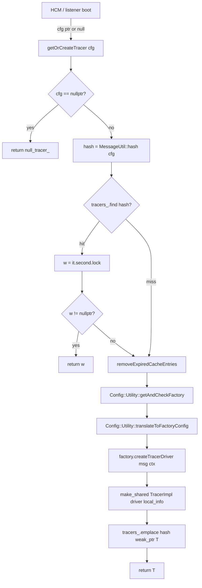

# `tracer_manager_impl.{h,cc}` + `tracer_config_impl.{h,cc}`

These files together implement the **driver caching layer** and the **typed config plumbing** for HCM's
tracing block.

- **`TracerManagerImpl`** — singleton, hashes the tracer Http config, dedupes `TracerImpl` instances across all
  listeners.
- **`TracerFactoryContextImpl`** — the `TracerFactoryContext` injected into `TracerFactory::createTracerDriver`.
- **`ConnectionManagerTracingConfig`** — the parsed, validated tracing block of HCM config (sampling rates,
  custom tags, operation-name formatters, verbose, etc.) that becomes a `Tracing::Config` for each request.

---

## `TracerManagerImpl` — the singleton cache

### What it owns

```cpp
class TracerManagerImpl : public TracerManager, public Singleton::Instance {
  TracerFactoryContextPtr factory_context_;
  const TracerSharedPtr null_tracer_{std::make_shared<NullTracer>()};
  absl::flat_hash_map<std::size_t, std::weak_ptr<Tracer>> tracers_;
};
```

- One per server (`SINGLETON_MANAGER_REGISTRATION(tracer_manager)`).
- Constructed via `TracerManagerImpl::singleton(FactoryContext&)` — `Singleton::Manager::getTyped` makes sure
  exactly one instance exists.
- Holds an "always available" `null_tracer_` so the no-config case never has to construct anything.
- Holds a `weak_ptr` cache keyed by `MessageUtil::hash(*tracing_http_config)` — the cache **does not** keep
  drivers alive; once every listener that used a tracing config goes away, the driver is destructed (closing
  collector connections etc.).

### `getOrCreateTracer` flow



Three subtle behaviours:

1. **`removeExpiredCacheEntries` is called only on a miss.** The rationale (per inline comment): a `Tracer` is
   obtained at most once per listener lifecycle, every listener usually picks the same config, so weak-ptr
   churn is low; adding an external GC sweeper would cost more than it saves.

2. **The cache is keyed by *config hash*, not by tracer name.** Two listeners pointing at "Zipkin to
   `collector-a`" vs "Zipkin to `collector-b`" get *two* `TracerImpl` instances (different configs → different
   hashes), and thus two `Driver`s with two HTTP pools to the two collectors. Identical configs across listeners
   collapse to one.

3. **The factory is looked up by `TypedConfig` (typeUrl)** inside `Config::Utility::getAndCheckFactory<TracerFactory>(*cfg)`. The tracer extension
   name in the proto (`config->name()` — e.g. `envoy.tracers.zipkin`) is only informational once typed config is
   used. The log line `instantiating a new tracer: {}` prints this name for operator clarity.

### Singleton bootstrap

```cpp
std::shared_ptr<TracerManager>
TracerManagerImpl::singleton(Server::Configuration::FactoryContext& context) {
  return context.serverFactoryContext().singletonManager().getTyped<TracerManagerImpl>(
      SINGLETON_MANAGER_REGISTERED_NAME(tracer_manager), [&context] {
        return std::make_shared<TracerManagerImpl>(
            std::make_unique<TracerFactoryContextImpl>(
                context.serverFactoryContext(), context.messageValidationVisitor()));
      });
}
```

HCM and the gRPC async-client call `TracerManagerImpl::singleton(ctx)` whenever they need a tracer. The
`factory_context_` captured here is *the first one to ever ask*. That's safe because:

- `serverFactoryContext()` is a process-global reference (server lifetime).
- `messageValidationVisitor()` is taken once and reused for every subsequent `getOrCreateTracer` call —
  per-listener visitors don't matter at this level because the proto has already been validated by the time
  it reaches the tracer factory.

---

## `TracerFactoryContextImpl`

```cpp
class TracerFactoryContextImpl : public Server::Configuration::TracerFactoryContext {
  Server::Configuration::ServerFactoryContext& server_factory_context_;
  ProtobufMessage::ValidationVisitor& validation_visitor_;
public:
  ServerFactoryContext& serverFactoryContext() override { return server_factory_context_; }
  ValidationVisitor& messageValidationVisitor() override { return validation_visitor_; }
};
```

The minimum surface a `TracerFactory::createTracerDriver(message, context)` needs:

- `serverFactoryContext()` — gives the driver `dispatcher()`, `clusterManager()`, `runtime()`, `singletonManager()`,
  `scope()`, `localInfo()`, `api()`, etc. (Drivers typically need at least cluster manager + scope for the
  collector client.)
- `messageValidationVisitor()` — used when the driver further unpacks nested typed configs.

This is just a thin **passthrough struct**; it does not own state of its own.

---

## `ConnectionManagerTracingConfig` — the parsed HCM tracing block

This is the concrete `Tracing::Config` instance HCM passes to `TracerImpl::startSpan(...)` for every request.
It is **not** a `Tracing::Config` subclass per se (HCM wraps it in a per-request adapter that owns it), but it
holds every knob HCM needs:

```cpp
class ConnectionManagerTracingConfig {
public:
  // Long ctor that parses from the HCM proto + traffic direction:
  ConnectionManagerTracingConfig(
      envoy::config::core::v3::TrafficDirection traffic_direction,
      const HttpConnectionManager_Tracing& tracing_config,
      const Formatter::CommandParserPtrVector& command_parsers = {});

  // Pre-parsed convenience ctor used by tests.
  ConnectionManagerTracingConfig(OperationName op, CustomTagMap tags,
                                 FractionalPercent client, FractionalPercent random,
                                 FractionalPercent overall,
                                 FormatterPtr op_formatter, FormatterPtr upstream_op_formatter,
                                 uint32_t max_path_tag_length, bool verbose,
                                 bool no_context_propagation = false);

  // Accessors used by HCM / connections_per_request:
  const FractionalPercent& getClientSampling()   const;
  const FractionalPercent& getRandomSampling()   const;
  const FractionalPercent& getOverallSampling()  const;
  const CustomTagMap&      getCustomTags()       const;
  OperationName            operationName()       const;
  bool                     verbose()             const;
  uint32_t                 maxPathTagLength()    const;
  bool                     spawnUpstreamSpan()   const;
  bool                     noContextPropagation()const;

  // (Fields kept public for HCM convenience — TODO in the source to make private.)
  OperationName operation_name_{};
  CustomTagMap  custom_tags_;
  FractionalPercent client_sampling_;
  FractionalPercent random_sampling_;
  FractionalPercent overall_sampling_;
  FormatterPtr operation_;
  FormatterPtr upstream_operation_;
  uint32_t max_path_tag_length_{};
  bool verbose_{};
  bool spawn_upstream_span_{};
  bool no_context_propagation_{};
};
```

### Sampling math (where it actually lives)

`client_sampling_` / `random_sampling_` / `overall_sampling_` are **`FractionalPercent`** values; the actual
roll-the-dice happens in `Http::ConnectionManagerUtility::mutateRequestHeaders` per request:

```pseudo
if x-client-trace-id present → ClientForced
else if force-trace runtime/header → ServiceForced
else if rand < client_sampling AND rand < random_sampling AND rand < overall_sampling
                                  → Sampling
else                              → NotTraceable
```

Stored into `stream_info.setTraceReason(...)` then read later by
`TracerUtility::shouldTraceRequest(stream_info)`.

### Operation name formatters

`operation_` and `upstream_operation_` are `Formatter::FormatterPtr` that produce the **span name** at runtime.
The HCM proto allows e.g. `{"operation_name": "ingress", "operation": "%REQ(:METHOD)% %REQ(:PATH)%"}` so the
span name reflects per-request data.

By default these are empty and HCM falls back to `TracerUtility::toString(operationName())` ("ingress" /
"egress &lt;host&gt;").

### `spawn_upstream_span_`

When true, the router creates a **separate child span** for each upstream attempt (retries each get their own
span). When false (the historical default), upstream timing/info ends up as tags/logs on the downstream span.
Most operators leave this off for backward compatibility; OTel operators turn it on to match conventional span
trees.

### `no_context_propagation_`

When true, the driver's `injectContext` is suppressed — outbound requests carry no trace headers. Useful for
sandbox / staging routes where you specifically don't want to taint downstream services with traffic from a
test corner of the deployment.

### `custom_tags_`

`CustomTagMap` is `absl::flat_hash_map<string, CustomTagConstSharedPtr>`. Built by walking each
`envoy.type.tracing.v3.CustomTag` in the HCM tracing config through
`CustomTagUtility::createCustomTag(proto, command_parsers)`. HCM then calls each tag's
`applySpan(span, ctx)` after sampling decision is made.

---

## Lifetime cheat sheet

| Thing                                  | Lifetime                                                   |
|----------------------------------------|------------------------------------------------------------|
| `TracerManagerImpl`                    | server                                                     |
| `null_tracer_`                         | server                                                     |
| `TracerImpl` (cached entry)            | as long as ≥1 listener holds the shared_ptr returned       |
| `Driver` (owned by `TracerImpl`)       | with the `TracerImpl`                                      |
| `ConnectionManagerTracingConfig`       | with the HCM filter chain factory (listener)               |
| Per-request `Tracing::Config` adapter  | one per HTTP stream, freed at end of stream                |
| `Span`                                 | created per stream/attempt, owned by HCM/router            |

---

## Cross-references

- `Tracer` / `Driver` interfaces: `envoy/tracing/tracer.h`, `envoy/tracing/trace_driver.h`.
- `TracerFactory`: `envoy/server/tracer_config.h`.
- HCM tracing config proto:
  `envoy/extensions/filters/network/http_connection_manager/v3/http_connection_manager.proto` → `Tracing`.
- The sampling math that consumes the `FractionalPercent` fields: `source/common/http/conn_manager_utility.cc`.
- The HCM wiring that hands `ConnectionManagerTracingConfig` to `TracerImpl::startSpan`:
  `source/common/http/conn_manager_impl.cc::traceRequest()` / `startSpan()`.
