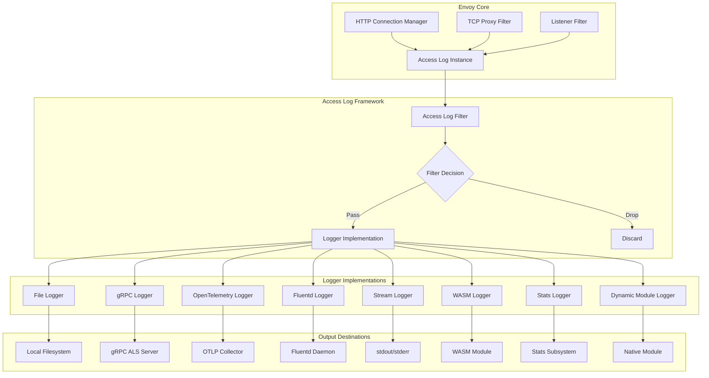
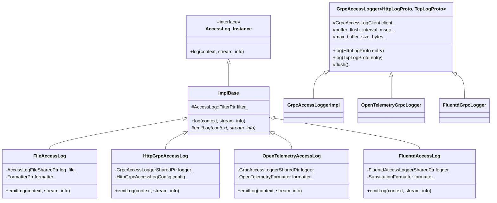
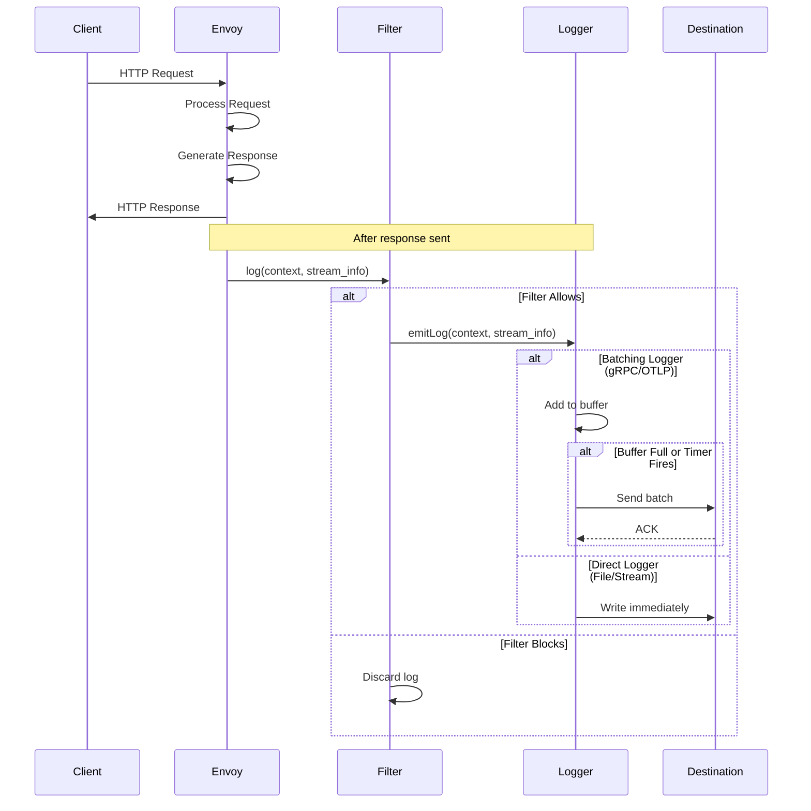
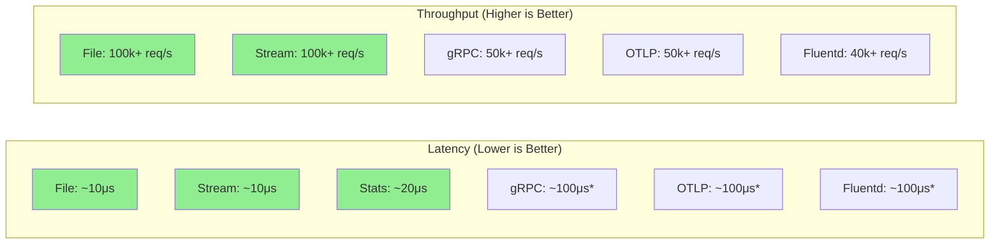
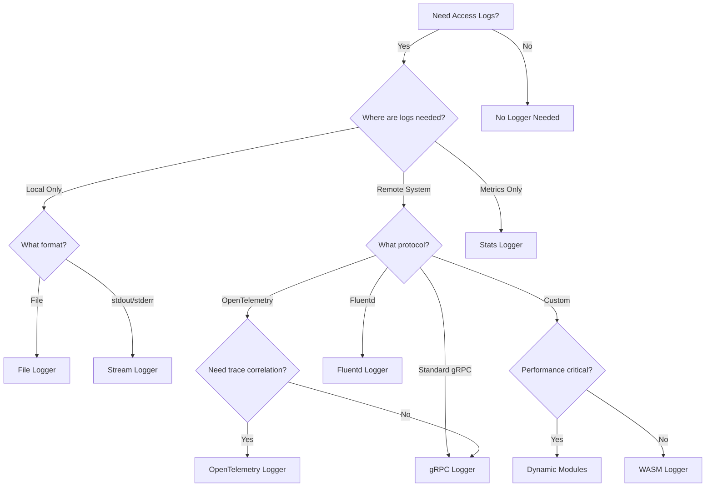

# Envoy Access Loggers Extension - Complete Overview

## Table of Contents
1. [Introduction](#introduction)
2. [Architecture Overview](#architecture-overview)
3. [Available Access Logger Types](#available-access-logger-types)
4. [Comparison Matrix](#comparison-matrix)
5. [Common Framework](#common-framework)
6. [Selection Guide](#selection-guide)
7. [Performance Considerations](#performance-considerations)
8. [Best Practices](#best-practices)

## Introduction

The Envoy Access Loggers extension provides a flexible and extensible framework for recording request and connection information. Access logs are critical for observability, debugging, compliance, and security monitoring. Envoy supports multiple output destinations and formats to accommodate diverse operational requirements.

### What Are Access Logs?

Access logs capture detailed information about each request (HTTP/gRPC) or connection (TCP) that passes through Envoy. This includes:
- Request/response headers and metadata
- Timing information (latency, duration)
- Response codes and status
- Connection properties
- Dynamic metadata and filter state
- Upstream cluster information

### Directory Structure

```
source/extensions/access_loggers/
├── common/                    # Shared base classes and utilities
├── file/                      # File-based logging
├── grpc/                      # gRPC Access Log Service (ALS)
├── open_telemetry/            # OpenTelemetry Protocol (OTLP)
├── fluentd/                   # Fluentd integration
├── stream/                    # stdout/stderr logging
├── stats/                     # Stats generation from logs
├── wasm/                      # WebAssembly custom loggers
├── dynamic_modules/           # Dynamic module integration
└── filters/                   # Access log filters
    ├── cel/                   # Common Expression Language filters
    └── process_ratelimit/     # Rate limiting for log output
```

## Architecture Overview

### High-Level Architecture



### Class Hierarchy



### Request Flow



## Available Access Logger Types

### 1. File Access Logger

**Location**: `source/extensions/access_loggers/file/`

**Purpose**: Write access logs to local files with configurable formats.

**Key Features**:
- Custom format strings with substitution variables
- File rotation support
- Low latency writes
- JSON and text formats

**Use Cases**:
- Local development and debugging
- Simple deployments without centralized logging
- High-performance scenarios where network overhead is unacceptable
- Log aggregation via file tailing (e.g., Filebeat)

**Documentation**: [FILE_ACCESS_LOGGER.md](file/FILE_ACCESS_LOGGER.md)

---

### 2. gRPC Access Logger (ALS)

**Location**: `source/extensions/access_loggers/grpc/`

**Purpose**: Stream access logs to a remote gRPC Access Log Service.

**Key Features**:
- HTTP and TCP protocol support
- Batching and buffering
- Backpressure handling
- Structured protobuf messages
- Automatic reconnection

**Use Cases**:
- Centralized log aggregation
- Real-time log analysis
- Multi-cluster deployments
- Custom log processing pipelines

**Complexity**: High (16 source files)

**Documentation**: [GRPC_ACCESS_LOGGER.md](grpc/GRPC_ACCESS_LOGGER.md)

---

### 3. OpenTelemetry Access Logger

**Location**: `source/extensions/access_loggers/open_telemetry/`

**Purpose**: Export access logs using OpenTelemetry Protocol (OTLP).

**Key Features**:
- OTLP log format (standard)
- Trace/span correlation
- Resource attributes
- Flexible attribute mapping
- Batch export

**Use Cases**:
- Modern observability platforms (Datadog, Honeycomb, etc.)
- Correlation with distributed traces
- OpenTelemetry-native environments
- Multi-signal correlation (logs, metrics, traces)

**Complexity**: High (14 source files)

**Documentation**: [OPENTELEMETRY_ACCESS_LOGGER.md](open_telemetry/OPENTELEMETRY_ACCESS_LOGGER.md)

---

### 4. Fluentd Access Logger

**Location**: `source/extensions/access_loggers/fluentd/`

**Purpose**: Send logs to Fluentd using Forward protocol.

**Key Features**:
- Fluentd Forward protocol
- Tag-based routing
- MessagePack encoding
- Buffer management

**Use Cases**:
- Existing Fluentd infrastructure
- Tag-based log routing
- Integration with Fluentd plugins

**Documentation**: [FLUENTD_ACCESS_LOGGER.md](fluentd/FLUENTD_ACCESS_LOGGER.md)

---

### 5. Stream Access Logger

**Location**: `source/extensions/access_loggers/stream/`

**Purpose**: Write logs to stdout or stderr.

**Key Features**:
- Simple stdout/stderr output
- No file I/O overhead
- Container-friendly

**Use Cases**:
- Container environments (Docker, Kubernetes)
- Cloud-native deployments with log aggregation
- Debugging and development
- 12-factor app compliance

**Documentation**: [STREAM_ACCESS_LOGGER.md](stream/STREAM_ACCESS_LOGGER.md)

---

### 6. Stats Access Logger

**Location**: `source/extensions/access_loggers/stats/`

**Purpose**: Generate custom statistics from access log data.

**Key Features**:
- Convert log data to metrics
- Custom stat definitions
- Histogram and counter support

**Use Cases**:
- Custom metrics generation
- Application-specific monitoring
- Metric-based alerting

**Documentation**: [STATS_ACCESS_LOGGER.md](stats/STATS_ACCESS_LOGGER.md)

---

### 7. WASM Access Logger

**Location**: `source/extensions/access_loggers/wasm/`

**Purpose**: Implement custom logging logic in WebAssembly.

**Key Features**:
- Custom log processing
- Language-agnostic (Rust, C++, Go, etc.)
- Sandboxed execution
- Dynamic loading

**Use Cases**:
- Custom log enrichment
- Proprietary log formats
- Business logic in logging
- Security-sensitive transformations

**Documentation**: [WASM_ACCESS_LOGGER.md](wasm/WASM_ACCESS_LOGGER.md)

---

### 8. Dynamic Modules Access Logger

**Location**: `source/extensions/access_loggers/dynamic_modules/`

**Purpose**: Load native code modules for custom logging.

**Key Features**:
- Native code performance
- ABI-based integration
- Dynamic loading

**Use Cases**:
- High-performance custom logging
- Legacy system integration
- Proprietary protocols

**Documentation**: [DYNAMIC_MODULES_ACCESS_LOGGER.md](dynamic_modules/DYNAMIC_MODULES_ACCESS_LOGGER.md)

---

## Comparison Matrix

| Feature | File | gRPC | OpenTelemetry | Fluentd | Stream | WASM | Stats | Dynamic |
|---------|------|------|---------------|---------|--------|------|-------|---------|
| **Destination** | Local Files | Remote gRPC | OTLP Collector | Fluentd | stdout/stderr | Custom | Stats | Custom |
| **Protocol** | N/A | gRPC | gRPC/HTTP | TCP | N/A | Custom | N/A | Custom |
| **Format** | Text/JSON | Protobuf | OTLP | MessagePack | Text/JSON | Custom | N/A | Custom |
| **Batching** | No | Yes | Yes | Yes | No | Varies | No | Varies |
| **Latency** | Very Low | Low-Medium | Low-Medium | Low-Medium | Very Low | Varies | Very Low | Varies |
| **CPU Overhead** | Very Low | Medium | Medium | Medium | Very Low | Varies | Low | Varies |
| **Memory Overhead** | Very Low | Medium | Medium | Medium | Very Low | Varies | Low | Varies |
| **Network I/O** | No | Yes | Yes | Yes | No | Varies | No | Varies |
| **Reliability** | High | Medium | Medium | Medium | High | Varies | High | Varies |
| **Backpressure** | Local FS | Yes | Yes | Yes | OS Buffering | Varies | N/A | Varies |
| **Filtering** | Yes | Yes | Yes | Yes | Yes | Yes | Yes | Yes |
| **Trace Correlation** | Manual | No | Yes | No | Manual | Varies | No | Varies |
| **Complexity** | Low | High | High | Medium | Low | High | Medium | High |
| **Setup Effort** | Low | Medium | Medium | Medium | Low | High | Low | High |
| **Extensibility** | Low | Low | Low | Low | Low | High | Medium | High |

### Performance Characteristics



*Note: Network-based loggers have variable latency based on batching settings*

### Cost Analysis

| Logger Type | CPU Cost | Memory Cost | Network Cost | Storage Cost | Operational Cost |
|-------------|----------|-------------|--------------|--------------|------------------|
| **File** | Very Low | Very Low | None | High (local) | Low |
| **gRPC** | Medium | Medium | High | Low (remote) | Medium |
| **OpenTelemetry** | Medium | Medium | High | Low (remote) | Medium |
| **Fluentd** | Medium | Medium | High | Low (remote) | Medium |
| **Stream** | Very Low | Very Low | None* | Low (ephemeral) | Low |
| **WASM** | Varies | Varies | Varies | Varies | High |
| **Stats** | Low | Low | None | Very Low | Low |
| **Dynamic** | Varies | Varies | Varies | Varies | High |

*Stream logs typically forwarded by container runtime to log aggregators*

## Common Framework

All access loggers inherit from a common framework located in `source/extensions/access_loggers/common/`.

### Base Classes

#### ImplBase

The `ImplBase` class provides the foundation for all access logger implementations:

```cpp
class ImplBase : public AccessLog::Instance {
public:
  ImplBase(AccessLog::FilterPtr filter);
  
  // Called for each request/connection
  void log(const Formatter::Context& log_context,
           const StreamInfo::StreamInfo& stream_info) override;

private:
  // Must be implemented by derived classes
  virtual void emitLog(const Formatter::Context& context,
                       const StreamInfo::StreamInfo& stream_info) PURE;
  
  AccessLog::FilterPtr filter_;
};
```

**Responsibilities**:
- Filter evaluation (should this request be logged?)
- Delegation to specific logger implementation
- Common error handling

#### GrpcAccessLogger

Template base class for all gRPC-based loggers (gRPC ALS, OpenTelemetry, Fluentd):

```cpp
template <typename HttpLogProto, typename TcpLogProto, 
          typename LogRequest, typename LogResponse>
class GrpcAccessLogger {
public:
  void log(HttpLogProto&& entry);
  void log(TcpLogProto&& entry);

protected:
  void flush();
  bool canLogMore();
  
  std::unique_ptr<GrpcAccessLogClient<LogRequest, LogResponse>> client_;
  LogRequest message_;
  uint64_t approximate_message_size_bytes_;
  uint64_t max_buffer_size_bytes_;
  std::chrono::milliseconds buffer_flush_interval_msec_;
};
```

**Responsibilities**:
- Batching log entries
- Buffer size management
- Periodic flushing
- Backpressure handling
- Stats tracking (logs_written, logs_dropped)

### Logger Cache

gRPC-based loggers use a thread-local cache to share connections:

```cpp
template <typename GrpcAccessLogger, typename ConfigProto>
class GrpcAccessLoggerCache : public Singleton::Instance {
public:
  typename GrpcAccessLogger::SharedPtr 
  getOrCreateLogger(const ConfigProto& config, 
                    GrpcAccessLoggerType logger_type);

private:
  struct ThreadLocalCache {
    Event::Dispatcher& dispatcher_;
    absl::flat_hash_map<CacheKey, LoggerSharedPtr> access_loggers_;
  };
  
  ThreadLocal::SlotPtr tls_slot_;
};
```

**Benefits**:
- Connection sharing across access log instances with same config
- Thread safety via thread-local storage
- Automatic cleanup and lifecycle management
- Reduced connection overhead

### Access Log Filters

Filters determine which requests should be logged. Located in `source/extensions/access_loggers/filters/`.

#### CEL Filter

Uses Common Expression Language for powerful filtering:

```yaml
filter:
  extension_filter:
    name: envoy.access_loggers.extension_filters.cel
    typed_config:
      "@type": type.googleapis.com/envoy.extensions.access_loggers.filters.cel.v3.ExpressionFilter
      expression: "response.code >= 400"  # Only log errors
```

**Documentation**: [ACCESS_LOG_FILTERS.md](filters/ACCESS_LOG_FILTERS.md)

#### Process Rate Limit Filter

Rate limits log output to reduce volume:

```yaml
filter:
  process_ratelimit_filter:
    sample_rate: 100  # 1 out of every 100 requests
```

## Selection Guide

### Decision Tree



### Use Case Recommendations

#### Development and Debugging
- **Primary**: Stream Logger (stdout)
- **Alternative**: File Logger
- **Rationale**: Low overhead, easy to view, no configuration

#### Production - Small Scale
- **Primary**: File Logger + Log Shipper (Filebeat, Fluentd)
- **Alternative**: Stream Logger + Container log collection
- **Rationale**: Simple, reliable, well-understood

#### Production - Large Scale
- **Primary**: OpenTelemetry Logger
- **Alternative**: gRPC Logger
- **Rationale**: Centralized, scalable, standards-based

#### Kubernetes/Cloud Native
- **Primary**: Stream Logger (stdout)
- **Alternative**: OpenTelemetry Logger
- **Rationale**: Cloud-native pattern, works with log aggregators

#### Legacy Infrastructure
- **Primary**: Fluentd Logger
- **Alternative**: File Logger
- **Rationale**: Integration with existing Fluentd deployments

#### Custom Requirements
- **Primary**: WASM Logger
- **Alternative**: Dynamic Modules Logger
- **Rationale**: Maximum flexibility, custom processing

#### Metrics Generation
- **Primary**: Stats Logger
- **Alternative**: OpenTelemetry Logger (with metrics correlation)
- **Rationale**: Direct metric generation from access patterns

### Configuration Examples

#### Multiple Loggers (Common Pattern)

```yaml
access_log:
  # Local debugging
  - name: envoy.access_loggers.stream
    typed_config:
      "@type": type.googleapis.com/envoy.extensions.access_loggers.stream.v3.StdoutAccessLog
      log_format:
        text_format_source:
          inline_string: "[%START_TIME%] %REQ(:METHOD)% %REQ(X-ENVOY-ORIGINAL-PATH?:PATH)% %PROTOCOL%\n"
    filter:
      status_code_filter:
        comparison:
          op: GE
          value:
            default_value: 400
            runtime_key: access_log_filter_http_code
  
  # Production monitoring (all requests)
  - name: envoy.access_loggers.open_telemetry
    typed_config:
      "@type": type.googleapis.com/envoy.extensions.access_loggers.open_telemetry.v3.OpenTelemetryAccessLogConfig
      common_config:
        log_name: "http_access_log"
        transport_api_version: V3
        grpc_service:
          envoy_grpc:
            cluster_name: otel_collector
        buffer_flush_interval: 1s
        buffer_size_bytes: 16384
```

## Performance Considerations

### Latency Impact

Access logging occurs **after** the response is sent to the client, so it doesn't directly impact request latency. However:

1. **Resource Contention**: Heavy logging can consume CPU/memory needed for request processing
2. **Backpressure**: Slow log destinations can cause buffering and eventual blocking
3. **Lock Contention**: Shared resources (files, connections) may introduce contention

### Optimization Strategies

#### 1. Use Filters Aggressively

Only log what you need:

```yaml
filter:
  and_filter:
    filters:
      # Only errors
      - status_code_filter:
          comparison:
            op: GE
            value:
              default_value: 400
      # Sample remaining at 10%
      - runtime_filter:
          percent_sampled:
            numerator: 10
```

#### 2. Tune Buffer Settings

For gRPC-based loggers:

```yaml
common_config:
  buffer_size_bytes: 32768      # Larger buffer = fewer flushes
  buffer_flush_interval: 5s      # Longer interval = better batching
```

**Trade-offs**:
- Larger buffers = lower overhead but higher memory usage
- Longer intervals = better batching but longer delay before logs visible

#### 3. Choose Appropriate Format

- **JSON**: Structured but verbose
- **Text**: Compact but harder to parse
- **Protobuf**: Most efficient for wire transmission

#### 4. Consider Sampling

For very high traffic:

```yaml
filter:
  runtime_filter:
    runtime_key: access_log_sampling_rate
    percent_sampled:
      numerator: 1  # 1% sampling
```

#### 5. Use Multiple Loggers with Different Filters

```yaml
access_log:
  # All errors (no sampling)
  - name: envoy.access_loggers.open_telemetry
    filter:
      status_code_filter:
        comparison:
          op: GE
          value:
            default_value: 400
    typed_config:
      # ... config ...
  
  # Sample success logs at 0.1%
  - name: envoy.access_loggers.open_telemetry
    filter:
      and_filter:
        filters:
          - status_code_filter:
              comparison:
                op: LT
                value:
                  default_value: 400
          - runtime_filter:
              percent_sampled:
                numerator: 1  # 0.1%
                denominator: THOUSAND
    typed_config:
      # ... config ...
```

### Resource Usage Guidelines

| Requests/sec | Recommended Logger | Buffer Size | Flush Interval | Expected Overhead |
|--------------|-------------------|-------------|----------------|-------------------|
| < 1,000 | Any | Default (16KB) | 1s | < 1% CPU |
| 1,000 - 10,000 | File/Stream/gRPC | 32KB | 2s | 1-3% CPU |
| 10,000 - 50,000 | Stream/gRPC/OTLP | 64KB | 5s | 3-5% CPU |
| 50,000+ | Stream + Filtering | 128KB | 10s | 5-10% CPU |

## Best Practices

### 1. Always Use Filters

Never log everything in production:

```yaml
# BAD: No filter, logs everything
access_log:
  - name: envoy.access_loggers.file
    typed_config:
      path: /var/log/envoy/access.log

# GOOD: Filter applied
access_log:
  - name: envoy.access_loggers.file
    filter:
      or_filter:
        filters:
          - status_code_filter:
              comparison:
                op: GE
                value: 400
          - duration_filter:
              comparison:
                op: GE
                value:
                  default_value: 1000  # > 1s
    typed_config:
      path: /var/log/envoy/access.log
```

### 2. Monitor Logger Stats

gRPC-based loggers expose stats:

- `access_logs.<logger_name>.logs_written` - Total logs sent
- `access_logs.<logger_name>.logs_dropped` - Logs dropped due to backpressure

Alert on `logs_dropped` > 0 or growing.

### 3. Plan for Log Volume

**Estimate log volume**:
```
Log Volume (MB/day) = 
  (Requests/sec) × 
  (Avg Log Size in bytes) × 
  (% Logged after filtering) × 
  86400 / 1,048,576
```

**Example**:
- 10,000 req/s
- 500 bytes/log
- 10% filtering (log 10%)
- = 10,000 × 500 × 0.1 × 86400 / 1,048,576 = ~41 GB/day

### 4. Use Structured Logging

Prefer JSON or protobuf over plain text:

```yaml
# GOOD: Structured JSON
log_format:
  json_format:
    timestamp: "%START_TIME%"
    method: "%REQ(:METHOD)%"
    path: "%REQ(X-ENVOY-ORIGINAL-PATH?:PATH)%"
    status: "%RESPONSE_CODE%"
    duration_ms: "%DURATION%"
    upstream: "%UPSTREAM_CLUSTER%"

# Avoid: Unstructured text (hard to parse)
log_format:
  text_format_source:
    inline_string: "[%START_TIME%] %REQ(:METHOD)% %REQ(X-ENVOY-ORIGINAL-PATH?:PATH)%"
```

### 5. Separate Concerns

Use different loggers for different purposes:

```yaml
access_log:
  # Debugging (errors only, local)
  - name: envoy.access_loggers.stream
    filter:
      status_code_filter:
        comparison:
          op: GE
          value: 500
    typed_config:
      "@type": type.googleapis.com/envoy.extensions.access_loggers.stream.v3.StderrAccessLog
  
  # Compliance (all requests, durable)
  - name: envoy.access_loggers.file
    typed_config:
      "@type": type.googleapis.com/envoy.extensions.access_loggers.file.v3.FileAccessLog
      path: /var/log/envoy/audit.log
  
  # Observability (sampled, remote)
  - name: envoy.access_loggers.open_telemetry
    filter:
      runtime_filter:
        percent_sampled:
          numerator: 5
    typed_config:
      "@type": type.googleapis.com/envoy.extensions.access_loggers.open_telemetry.v3.OpenTelemetryAccessLogConfig
      # ... config ...
```

### 6. Test Backpressure Handling

In non-production environments, intentionally slow down or stop log destinations to verify:
- Logs are buffered appropriately
- System remains stable under backpressure
- Stats correctly track dropped logs
- Recovery works after destination returns

### 7. Version Configuration

Access log configuration can change over time. Use version control and gradual rollout:

```yaml
# Use runtime flags for dynamic control
filter:
  runtime_filter:
    runtime_key: access_log.sampling_rate  # Can be changed without restart
    percent_sampled:
      numerator: 10
```

### 8. Secure Sensitive Data

Avoid logging sensitive information:

```yaml
log_format:
  json_format:
    # GOOD: Log headers selectively
    user_agent: "%REQ(USER-AGENT)%"
    
    # BAD: Don't log auth tokens
    # authorization: "%REQ(AUTHORIZATION)%"  # Never log this!
    
    # BAD: Don't log full request body
    # body: "%REQ_BODY%"  # Privacy/security risk
```

Consider using filters to exclude sensitive paths:

```yaml
filter:
  not_health_check_filter: {}  # Exclude /healthcheck
```

### 9. Document Your Configuration

```yaml
# Document why each logger exists and what it's for
access_log:
  # Purpose: Production observability via OpenTelemetry
  # Owner: SRE Team
  # Retention: 30 days in OTLP backend
  - name: envoy.access_loggers.open_telemetry
    # Sample at 1% to reduce cost while maintaining visibility
    filter:
      runtime_filter:
        percent_sampled:
          numerator: 1
    typed_config:
      # ... config ...
```

### 10. Plan for Failure Scenarios

What happens when the log destination is unavailable?

- **File Logger**: Disk full → Envoy may block or drop logs
- **gRPC Logger**: Server down → Logs buffered, eventually dropped
- **Stream Logger**: stdout blocked → OS buffers, may block Envoy

**Mitigation strategies**:
- Monitor disk space for file loggers
- Configure appropriate buffer sizes for gRPC loggers
- Use multiple loggers with different destinations (redundancy)
- Alert on logger health stats

## Cross-References

- **gRPC Access Logger**: [GRPC_ACCESS_LOGGER.md](grpc/GRPC_ACCESS_LOGGER.md)
- **OpenTelemetry Logger**: [OPENTELEMETRY_ACCESS_LOGGER.md](open_telemetry/OPENTELEMETRY_ACCESS_LOGGER.md)
- **File Logger**: [FILE_ACCESS_LOGGER.md](file/FILE_ACCESS_LOGGER.md)
- **Fluentd Logger**: [FLUENTD_ACCESS_LOGGER.md](fluentd/FLUENTD_ACCESS_LOGGER.md)
- **Stream Logger**: [STREAM_ACCESS_LOGGER.md](stream/STREAM_ACCESS_LOGGER.md)
- **WASM Logger**: [WASM_ACCESS_LOGGER.md](wasm/WASM_ACCESS_LOGGER.md)
- **Stats Logger**: [STATS_ACCESS_LOGGER.md](stats/STATS_ACCESS_LOGGER.md)
- **Dynamic Modules Logger**: [DYNAMIC_MODULES_ACCESS_LOGGER.md](dynamic_modules/DYNAMIC_MODULES_ACCESS_LOGGER.md)
- **Access Log Filters**: [ACCESS_LOG_FILTERS.md](filters/ACCESS_LOG_FILTERS.md)
- **Common Framework**: [ACCESS_LOGGER_COMMON.md](common/ACCESS_LOGGER_COMMON.md)

## Summary

Envoy's access logger extension provides a comprehensive, flexible framework for request and connection logging. Key takeaways:

1. **Multiple Options**: Eight different logger types for various use cases
2. **Common Framework**: Shared base classes reduce duplication
3. **Performance**: Designed for high throughput with batching and buffering
4. **Filtering**: Reduce log volume with powerful filter expressions
5. **Extensibility**: WASM and dynamic modules for custom requirements
6. **Standards-Based**: OpenTelemetry support for modern observability
7. **Production-Ready**: Backpressure handling and reliability features

Choose your logger based on:
- **Destination**: Local vs remote
- **Performance**: Latency and throughput requirements
- **Integration**: Existing infrastructure and tools
- **Features**: Batching, filtering, correlation needs
- **Operational**: Complexity, maintenance, cost
