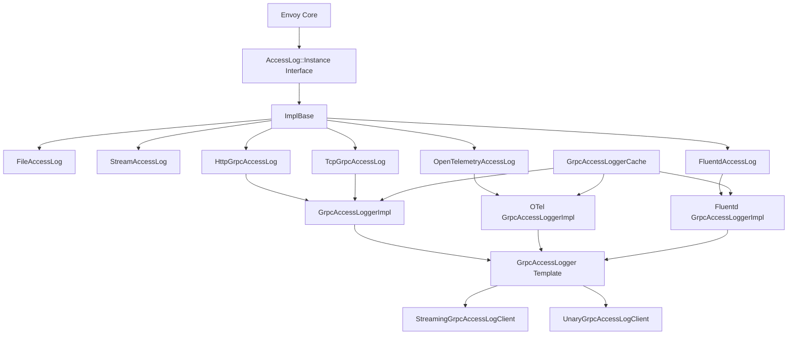

# Access Logger Common Framework

## Introduction

This document describes the common framework shared by all access logger implementations in Envoy. Understanding this framework is essential for implementing custom loggers or understanding how existing loggers work.

**Location**: `source/extensions/access_loggers/common/`

## Core Components

### 1. ImplBase - Base Access Log Class

**File**: `access_log_base.h/cc`

All access loggers inherit from `ImplBase`, which provides:
- Filter evaluation
- Common lifecycle management
- Delegation to specific logger implementation

```cpp
class ImplBase : public AccessLog::Instance {
public:
  ImplBase(AccessLog::FilterPtr filter) : filter_(std::move(filter)) {}
  
  // Called for each request
  void log(const Formatter::Context& log_context,
           const StreamInfo::StreamInfo& stream_info) override {
    // Evaluate filter
    if (filter_ && !filter_->evaluate(log_context, stream_info)) {
      return;  // Filter blocked, don't log
    }
    
    // Delegate to specific implementation
    emitLog(log_context, stream_info);
  }

private:
  // Must be implemented by derived classes
  virtual void emitLog(const Formatter::Context& context,
                       const StreamInfo::StreamInfo& stream_info) PURE;
  
  AccessLog::FilterPtr filter_;
};
```

**Usage**:
```cpp
class MyAccessLog : public Common::ImplBase {
public:
  MyAccessLog(AccessLog::FilterPtr&& filter, /* ... */)
      : ImplBase(std::move(filter)) {}

private:
  void emitLog(const Formatter::Context& context,
               const StreamInfo::StreamInfo& stream_info) override {
    // Your logging logic here
  }
};
```

---

### 2. GrpcAccessLogger - Base for gRPC Loggers

**File**: `grpc_access_logger.h`

Template base class for all gRPC-based loggers (gRPC ALS, OpenTelemetry, Fluentd).

```cpp
template <typename HttpLogProto, typename TcpLogProto, 
          typename LogRequest, typename LogResponse>
class GrpcAccessLogger {
public:
  // Log HTTP entry
  void log(HttpLogProto&& entry) {
    if (!canLogMore()) {
      return;  // Backpressure
    }
    approximate_message_size_bytes_ += entry.ByteSizeLong();
    addEntry(std::move(entry));
    if (approximate_message_size_bytes_ >= max_buffer_size_bytes_) {
      flush();  // Buffer full
    }
  }
  
  // Log TCP entry
  void log(TcpLogProto&& entry);

protected:
  // Must be implemented by derived classes
  virtual bool isEmpty() PURE;
  virtual void initMessage() PURE;
  virtual void addEntry(HttpLogProto&& entry) PURE;
  virtual void addEntry(TcpLogProto&& entry) PURE;
  virtual void clearMessage() { message_.Clear(); }
  
  // Flush buffer to gRPC client
  void flush() {
    if (isEmpty()) return;
    if (!client_->isConnected()) {
      initMessage();  // Initialize with node info
    }
    if (client_->log(message_)) {
      approximate_message_size_bytes_ = 0;
      clearMessage();
    }
  }
  
  // Check if we can log more (backpressure handling)
  bool canLogMore() {
    if (approximate_message_size_bytes_ < max_buffer_size_bytes_) {
      incLogsWrittenStats();
      return true;
    }
    flush();
    if (approximate_message_size_bytes_ < max_buffer_size_bytes_) {
      incLogsWrittenStats();
      return true;
    }
    incLogsDroppedStats();
    return false;
  }

  std::unique_ptr<GrpcAccessLogClient<LogRequest, LogResponse>> client_;
  LogRequest message_;
  uint64_t approximate_message_size_bytes_ = 0;
  const uint64_t max_buffer_size_bytes_;
  const std::chrono::milliseconds buffer_flush_interval_msec_;
  const Event::TimerPtr flush_timer_;
  std::unique_ptr<GrpcAccessLoggerStats> stats_;
};
```

**Key Features**:
- **Batching**: Accumulate multiple entries before sending
- **Buffering**: Size-based and time-based flushing
- **Backpressure**: Drop logs when buffer persistently full
- **Stats**: Track logs_written and logs_dropped

---

### 3. GrpcAccessLoggerCache - Logger Sharing

**File**: `grpc_access_logger.h`

Thread-local cache for sharing logger instances.

```cpp
template <typename GrpcAccessLogger, typename ConfigProto>
class GrpcAccessLoggerCache : public Singleton::Instance {
public:
  typename GrpcAccessLogger::SharedPtr
  getOrCreateLogger(const ConfigProto& config, GrpcAccessLoggerType logger_type) {
    auto& cache = tls_slot_->getTyped<ThreadLocalCache>();
    const auto cache_key = std::make_pair(MessageUtil::hash(config), logger_type);
    
    // Return existing logger if cached
    const auto it = cache.access_loggers_.find(cache_key);
    if (it != cache.access_loggers_.end()) {
      return it->second;
    }
    
    // Create and cache new logger
    const auto logger = createLogger(config, cache.dispatcher_);
    cache.access_loggers_.emplace(cache_key, logger);
    return logger;
  }

protected:
  virtual typename GrpcAccessLogger::SharedPtr 
  createLogger(const ConfigProto& config, Event::Dispatcher& dispatcher) PURE;

private:
  struct ThreadLocalCache : public ThreadLocal::ThreadLocalObject {
    Event::Dispatcher& dispatcher_;
    absl::flat_hash_map<
        std::pair<std::size_t, GrpcAccessLoggerType>,
        typename GrpcAccessLogger::SharedPtr> access_loggers_;
  };
  
  ThreadLocal::SlotPtr tls_slot_;
};
```

**Why Thread-Local?**
- Each worker thread needs independent gRPC streams
- Eliminates lock contention
- Safe concurrent access
- Efficient connection sharing within thread

---

### 4. GrpcAccessLogClient - gRPC Client Wrapper

**File**: `grpc_access_logger_clients.h`

Wrapper around Envoy's gRPC async client.

#### StreamingGrpcAccessLogClient (for streaming)

```cpp
template <typename LogRequest, typename LogResponse>
class StreamingGrpcAccessLogClient {
public:
  bool isConnected() {
    return stream_ != nullptr && stream_->stream_ != nullptr;
  }
  
  bool log(const LogRequest& request) {
    // Create stream if needed
    if (!stream_) {
      stream_ = std::make_unique<LocalStream>(*this);
    }
    
    // Start gRPC stream if not connected
    if (stream_->stream_ == nullptr) {
      stream_->stream_ = client_->start(service_method_, *stream_, opts_);
    }
    
    // Check backpressure
    if (stream_->stream_ != nullptr) {
      if (stream_->stream_->isAboveWriteBufferHighWatermark()) {
        return false;  // Backpressure
      }
      stream_->stream_->sendMessage(request, false);
    } else {
      stream_.reset();  // Creation failed
    }
    return true;
  }

private:
  struct LocalStream : public Grpc::AsyncStreamCallbacks<LogResponse> {
    void onRemoteClose(Grpc::Status::GrpcStatus, const std::string&) override {
      parent_.stream_.reset();  // Clean up on close
    }
    StreamingGrpcAccessLogClient& parent_;
    Grpc::AsyncStream<LogRequest> stream_{};
  };
  
  std::unique_ptr<LocalStream> stream_;
};
```

#### UnaryGrpcAccessLogClient (for unary RPCs)

```cpp
template <typename LogRequest, typename LogResponse>
class UnaryGrpcAccessLogClient {
public:
  bool isConnected() { return false; }  // No persistent connection
  
  bool log(const LogRequest& request) {
    client_->send(
        service_method_,
        request,
        callbacks_factory_(),  // New callback per request
        Tracing::NullSpan::instance(),
        opts_);
    return true;
  }

private:
  AsyncRequestCallbacksFactory callbacks_factory_;
};
```

---

### 5. GrpcAccessLoggerStats

**File**: `grpc_access_logger.h`

Stats tracked by gRPC loggers:

```cpp
#define ALL_GRPC_ACCESS_LOGGER_STATS(COUNTER) \
  COUNTER(logs_written)                       \
  COUNTER(logs_dropped)

struct GrpcAccessLoggerStats {
  ALL_GRPC_ACCESS_LOGGER_STATS(GENERATE_COUNTER_STRUCT)
};

// Usage:
stats_ = std::make_unique<GrpcAccessLoggerStats>(GrpcAccessLoggerStats{
    ALL_GRPC_ACCESS_LOGGER_STATS(
        POOL_COUNTER_PREFIX(scope, access_log_prefix))});

// Increment:
stats_->logs_written_.inc();
stats_->logs_dropped_.inc();
```

**Monitoring**:
```
access_logs.<prefix>.logs_written  # Total logs successfully buffered
access_logs.<prefix>.logs_dropped  # Logs dropped due to backpressure
```

---

### 6. FileAccessLogImpl

**File**: `file_access_log_impl.h/cc`

Common file access log implementation.

```cpp
class FileAccessLog : public ImplBase {
public:
  FileAccessLog(const Filesystem::FilePathAndType& file_info,
                AccessLog::FilterPtr&& filter,
                Formatter::FormatterPtr&& formatter,
                AccessLog::AccessLogManager& log_manager)
      : ImplBase(std::move(filter)),
        formatter_(std::move(formatter)) {
    log_file_ = log_manager.createAccessLog(file_info);
  }

private:
  void emitLog(const Formatter::Context& context,
               const StreamInfo::StreamInfo& stream_info) override {
    log_file_->write(formatter_->format(context, stream_info));
  }
  
  Formatter::FormatterPtr formatter_;
  AccessLog::AccessLogFileSharedPtr log_file_;
};
```

---

### 7. StreamAccessLogCommonImpl

**File**: `stream_access_log_common_impl.h`

Common implementation for stream-based loggers (stdout/stderr).

```cpp
class StreamAccessLog : public ImplBase {
public:
  StreamAccessLog(AccessLog::FilterPtr&& filter,
                  Formatter::FormatterPtr&& formatter,
                  AccessLog::AccessLogManager& log_manager,
                  Filesystem::FilePathAndType file_info)
      : ImplBase(std::move(filter)),
        formatter_(std::move(formatter)) {
    log_file_ = log_manager.createAccessLog(file_info);
  }

private:
  void emitLog(const Formatter::Context& context,
               const StreamInfo::StreamInfo& stream_info) override {
    log_file_->write(formatter_->format(context, stream_info));
  }
  
  Formatter::FormatterPtr formatter_;
  AccessLog::AccessLogFileSharedPtr log_file_;
};
```

## Common Patterns

### Pattern 1: Implementing a Custom Logger

```cpp
// Step 1: Inherit from ImplBase
class MyAccessLog : public Common::ImplBase {
public:
  MyAccessLog(AccessLog::FilterPtr&& filter, MyConfig config)
      : ImplBase(std::move(filter)), config_(std::move(config)) {}

private:
  // Step 2: Implement emitLog
  void emitLog(const Formatter::Context& context,
               const StreamInfo::StreamInfo& stream_info) override {
    // Extract data from stream_info
    const auto method = 
        context.requestHeaders()->getMethodValue();
    const auto path = 
        context.requestHeaders()->getPathValue();
    const auto status = stream_info.responseCode();
    
    // Write to your destination
    myCustomWriter_->write(method, path, status);
  }
  
  MyConfig config_;
  std::unique_ptr<MyCustomWriter> myCustomWriter_;
};

// Step 3: Create factory
class MyAccessLogFactory : public AccessLog::AccessLogInstanceFactory {
public:
  AccessLog::InstanceSharedPtr createAccessLogInstance(
      const Protobuf::Message& config,
      AccessLog::FilterPtr&& filter,
      Server::Configuration::GenericFactoryContext& context) override {
    const auto& my_config = 
        MessageUtil::downcastAndValidate<const MyConfigProto&>(config);
    return std::make_shared<MyAccessLog>(std::move(filter), my_config);
  }
  
  ProtobufTypes::MessagePtr createEmptyConfigProto() override {
    return std::make_unique<MyConfigProto>();
  }
  
  std::string name() const override { return "envoy.access_loggers.my_logger"; }
};

// Step 4: Register factory
REGISTER_FACTORY(MyAccessLogFactory, AccessLog::AccessLogInstanceFactory);
```

### Pattern 2: Implementing a gRPC Logger

```cpp
// Step 1: Define logger using template base
class MyGrpcLogger : public Common::GrpcAccessLogger<
    MyHttpLogEntry, MyTcpLogEntry, MyLogRequest, MyLogResponse> {
public:
  MyGrpcLogger(/* ... */) : GrpcAccessLogger(/* ... */) {}

private:
  // Implement required methods
  void addEntry(MyHttpLogEntry&& entry) override {
    message_.mutable_http_logs()->Add(std::move(entry));
  }
  
  void addEntry(MyTcpLogEntry&& entry) override {
    message_.mutable_tcp_logs()->Add(std::move(entry));
  }
  
  bool isEmpty() override {
    return message_.http_logs().empty() && message_.tcp_logs().empty();
  }
  
  void initMessage() override {
    auto* identifier = message_.mutable_identifier();
    // Set node identity, log name, etc.
  }
};

// Step 2: Define cache
class MyGrpcLoggerCache : public Common::GrpcAccessLoggerCache<
    MyGrpcLogger, MyConfigProto> {
public:
  MyGrpcLoggerCache(/* ... */) : GrpcAccessLoggerCache(/* ... */) {}

private:
  MyGrpcLogger::SharedPtr createLogger(
      const MyConfigProto& config,
      Event::Dispatcher& dispatcher) override {
    // Create gRPC client
    auto client = createGrpcClient(config);
    return std::make_shared<MyGrpcLogger>(client, config, dispatcher);
  }
};

// Step 3: Define access log instance
class MyGrpcAccessLog : public Common::ImplBase {
public:
  MyGrpcAccessLog(/* ... */) : ImplBase(std::move(filter)) {
    // Get logger from cache
    logger_ = cache_->getOrCreateLogger(config, logger_type);
  }

private:
  void emitLog(const Formatter::Context& context,
               const StreamInfo::StreamInfo& stream_info) override {
    MyHttpLogEntry entry;
    // Build entry from context and stream_info
    // ...
    logger_->log(std::move(entry));
  }
  
  MyGrpcLogger::SharedPtr logger_;
};
```

### Pattern 3: Using Formatters

```cpp
// Create formatter from config
Formatter::FormatterPtr formatter;
if (config.has_json_format()) {
  formatter = Formatter::SubstitutionFormatStringUtils::createJsonFormatter(
      config.json_format(), false, command_parsers);
} else if (config.has_text_format()) {
  formatter = Formatter::SubstitutionFormatStringUtils::createTextFormatter(
      config.text_format(), command_parsers);
}

// Use formatter in emitLog
void emitLog(const Formatter::Context& context,
             const StreamInfo::StreamInfo& stream_info) override {
  std::string formatted = formatter_->format(context, stream_info);
  file_->write(formatted);
}
```

## Architecture Diagram



## Best Practices

### 1. Always Inherit from ImplBase

Don't implement AccessLog::Instance directly:

```cpp
// GOOD
class MyLogger : public Common::ImplBase {
  // ...
};

// BAD
class MyLogger : public AccessLog::Instance {
  // Missing filter handling, etc.
};
```

### 2. Use GrpcAccessLogger for gRPC-Based Loggers

Reuse batching, buffering, and backpressure logic:

```cpp
// GOOD
class MyGrpcLogger : public Common::GrpcAccessLogger<...> {
  // Inherit batching, buffering, stats
};

// BAD
class MyGrpcLogger {
  // Reimplementing batching logic
};
```

### 3. Use Logger Cache for gRPC Loggers

Share connections efficiently:

```cpp
// In factory:
auto cache = context.singletonManager().getTyped<MyGrpcLoggerCache>(
    SINGLETON_MANAGER_REGISTERED_NAME(my_grpc_logger_cache),
    [&] { return std::make_shared<MyGrpcLoggerCache>(/* ... */); });

// In access log instance:
logger_ = cache->getOrCreateLogger(config, logger_type);
```

### 4. Implement Stats

Track important metrics:

```cpp
struct MyLoggerStats {
  Counter logs_written_;
  Counter logs_dropped_;
  Counter logs_failed_;
};

// Increment appropriately
stats_->logs_written_.inc();
```

### 5. Handle Errors Gracefully

Don't throw exceptions in emitLog:

```cpp
void emitLog(const Formatter::Context& context,
             const StreamInfo::StreamInfo& stream_info) override {
  try {
    // Logging logic
  } catch (const std::exception& e) {
    ENVOY_LOG(error, "Failed to emit log: {}", e.what());
    stats_->logs_failed_.inc();
    // Don't propagate exception
  }
}
```

## Related Documentation

- [ACCESS_LOGGERS_OVERVIEW.md](ACCESS_LOGGERS_OVERVIEW.md)
- [GRPC_ACCESS_LOGGER.md](grpc/GRPC_ACCESS_LOGGER.md)
- [OPENTELEMETRY_ACCESS_LOGGER.md](open_telemetry/OPENTELEMETRY_ACCESS_LOGGER.md)

## Summary

The common framework provides:
- **ImplBase**: Filter handling and lifecycle
- **GrpcAccessLogger**: Batching and buffering for gRPC loggers
- **GrpcAccessLoggerCache**: Connection sharing and thread safety
- **GrpcAccessLogClient**: gRPC client wrappers (streaming and unary)
- **Stats**: Monitoring and observability
- **Patterns**: Reusable patterns for custom loggers

Understanding this framework is key to:
- Implementing custom access loggers
- Understanding existing logger behavior
- Debugging access log issues
- Contributing to Envoy
