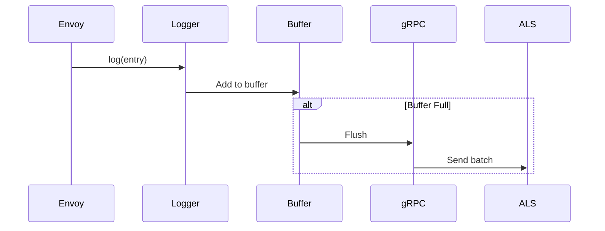

# Envoy Access Loggers Documentation

Comprehensive documentation for Envoy's access logger extension system.

## Quick Navigation

### 🎯 Start Here
- **[ACCESS_LOGGERS_OVERVIEW.md](ACCESS_LOGGERS_OVERVIEW.md)** - Complete overview, comparison matrix, and selection guide

### 📚 Core Documentation

#### Priority 1: Most Complex and Important
1. **[GRPC_ACCESS_LOGGER.md](grpc/GRPC_ACCESS_LOGGER.md)** (16 files)
   - gRPC Access Log Service (ALS)
   - Streaming protocol
   - HTTP and TCP variants
   - Batching and backpressure

2. **[OPENTELEMETRY_ACCESS_LOGGER.md](open_telemetry/OPENTELEMETRY_ACCESS_LOGGER.md)** (14 files)
   - OTLP protocol
   - Trace correlation
   - Resource attributes
   - Modern observability

3. **[ACCESS_LOGGER_COMMON.md](ACCESS_LOGGER_COMMON.md)**
   - Common framework and base classes
   - ImplBase, GrpcAccessLogger templates
   - Patterns for implementing custom loggers

4. **[ACCESS_LOG_FILTERS.md](filters/ACCESS_LOG_FILTERS.md)**
   - CEL filter (Common Expression Language)
   - Built-in filters
   - Composite filters (AND/OR/NOT)
   - Filter performance

#### Priority 2: Commonly Used
5. **[FILE_ACCESS_LOGGER.md](file/FILE_ACCESS_LOGGER.md)**
   - File-based logging
   - Format strings and JSON
   - Most commonly used
   - Highest performance

#### Priority 3: Specialized Loggers
6. **[REMAINING_LOGGERS.md](REMAINING_LOGGERS.md)**
   - Stream (stdout/stderr)
   - Fluentd
   - WASM
   - Stats
   - Dynamic Modules

## Document Statistics

| Document | Lines | Topics Covered | Complexity |
|----------|-------|----------------|------------|
| ACCESS_LOGGERS_OVERVIEW.md | ~700 | Architecture, comparison, selection | Medium |
| GRPC_ACCESS_LOGGER.md | ~1000 | gRPC ALS, streaming, batching | High |
| OPENTELEMETRY_ACCESS_LOGGER.md | ~900 | OTLP, traces, resources | High |
| ACCESS_LOGGER_COMMON.md | ~600 | Framework, base classes, patterns | Medium |
| ACCESS_LOG_FILTERS.md | ~700 | Filters, CEL, composition | Medium |
| FILE_ACCESS_LOGGER.md | ~400 | File logging, formats | Low |
| REMAINING_LOGGERS.md | ~600 | 5 specialized loggers | Medium |
| **Total** | **~5000** | **All access logger types** | - |

## Documentation Structure

```
source/extensions/access_loggers/
├── README.md (this file)
├── ACCESS_LOGGERS_OVERVIEW.md          # Start here!
├── ACCESS_LOGGER_COMMON.md             # Common framework
│
├── grpc/
│   └── GRPC_ACCESS_LOGGER.md           # gRPC ALS (16 files)
│
├── open_telemetry/
│   └── OPENTELEMETRY_ACCESS_LOGGER.md  # OTLP (14 files)
│
├── file/
│   └── FILE_ACCESS_LOGGER.md           # File logging
│
├── filters/
│   └── ACCESS_LOG_FILTERS.md           # All filter types
│
└── REMAINING_LOGGERS.md                # Stream, Fluentd, WASM, Stats, Dynamic
```

## Quick Reference

### Logger Selection

| Need | Recommended Logger | Document |
|------|-------------------|----------|
| **Local dev/debug** | Stream (stdout) | REMAINING_LOGGERS.md |
| **Production - small** | File + shipper | FILE_ACCESS_LOGGER.md |
| **Production - large** | OpenTelemetry | OPENTELEMETRY_ACCESS_LOGGER.md |
| **Kubernetes/Docker** | Stream (stdout) | REMAINING_LOGGERS.md |
| **Custom processing** | gRPC ALS | GRPC_ACCESS_LOGGER.md |
| **Legacy Fluentd** | Fluentd | REMAINING_LOGGERS.md |
| **Custom logic** | WASM | REMAINING_LOGGERS.md |
| **Metrics only** | Stats | REMAINING_LOGGERS.md |
| **Max performance** | File or Dynamic | FILE_ACCESS_LOGGER.md, REMAINING_LOGGERS.md |

### Filter Selection

| Need | Filter Type | Document |
|------|-------------|----------|
| **Complex conditions** | CEL filter | ACCESS_LOG_FILTERS.md |
| **Status code** | status_code_filter | ACCESS_LOG_FILTERS.md |
| **Duration** | duration_filter | ACCESS_LOG_FILTERS.md |
| **Sampling** | runtime_filter | ACCESS_LOG_FILTERS.md |
| **Exclude health checks** | not_health_check_filter | ACCESS_LOG_FILTERS.md |
| **Multiple conditions** | and_filter/or_filter | ACCESS_LOG_FILTERS.md |

### Performance Comparison

| Logger | Latency | Throughput | CPU | Network |
|--------|---------|------------|-----|---------|
| File | ~10μs | 100k+ req/s | <0.5% | No |
| Stream | ~10μs | 100k+ req/s | <0.5% | No |
| gRPC | ~100μs* | 50k+ req/s | 1-3% | Yes |
| OpenTelemetry | ~80μs* | 50k+ req/s | 1-2% | Yes |
| Fluentd | ~100μs* | 40k+ req/s | 1-3% | Yes |
| WASM | ~20-100μs | Varies | 1-5% | Varies |
| Stats | ~2μs | 100k+ req/s | <0.5% | No |
| Dynamic | ~10-50μs | Varies | <1% | Varies |

*With batching enabled

## Key Concepts Explained

### 1. Access Log Flow
```
Request → Envoy Processing → Response → Filter Check → Format → Write → Destination
```

### 2. Filter Evaluation
```
Filter (CEL/built-in) → Pass/Block → If Pass: emitLog() → Format → Output
```

### 3. Batching (gRPC-based)
```
Log Entries → Buffer → (Size or Timer) → Flush → gRPC Send → Clear Buffer
```

### 4. Thread-Local Caching (gRPC-based)
```
Config Hash → Cache Lookup → Existing Logger or Create New → Share Connection
```

## Common Patterns

### Pattern 1: Comprehensive Logging
```yaml
access_log:
  - name: envoy.access_loggers.stream       # Errors to stderr
  - name: envoy.access_loggers.open_telemetry  # All to OTLP (sampled)
  - name: envoy.access_loggers.stats        # Metrics
```

### Pattern 2: Cost-Optimized
```yaml
access_log:
  - name: envoy.access_loggers.open_telemetry
    filter:
      or_filter:
        filters:
          - status_code_filter: { op: GE, value: 400 }  # All errors
          - runtime_filter: { percent_sampled: 1 }      # 1% success
```

### Pattern 3: Multi-Destination
```yaml
access_log:
  - name: envoy.access_loggers.file          # Local backup
  - name: envoy.access_loggers.open_telemetry  # Centralized
  - name: envoy.access_loggers.stats         # Metrics
```

## Diagrams Reference

Each document contains detailed diagrams:
- **Architecture diagrams** (system overview)
- **Class diagrams** (code structure)
- **Sequence diagrams** (flow of log entries)
- **State diagrams** (connection lifecycle)

Example from GRPC_ACCESS_LOGGER.md:


## Source File Counts

| Directory | Header Files | Source Files | Total |
|-----------|--------------|--------------|-------|
| common/ | 6 | 4 | 10 |
| file/ | 2 | 2 | 4 |
| grpc/ | 8 | 8 | 16 |
| open_telemetry/ | 7 | 7 | 14 |
| fluentd/ | 4 | 4 | 8 |
| stream/ | 2 | 2 | 4 |
| wasm/ | 2 | 2 | 4 |
| stats/ | 2 | 2 | 4 |
| dynamic_modules/ | 4 | 4 | 8 |
| filters/cel/ | 2 | 2 | 4 |
| filters/process_ratelimit/ | 3 | 3 | 6 |
| **Total** | **42** | **40** | **82** |

## Configuration Examples

All documents include production-ready examples:
- Basic configuration
- Advanced configuration
- Multi-logger setups
- Filter combinations
- Performance tuning

See each document for specific examples.

## Best Practices Summary

Across all loggers:
1. **Always use filters** to reduce volume
2. **Use JSON format** for structured data
3. **Monitor stats** (logs_written, logs_dropped)
4. **Test backpressure** in non-production
5. **Configure buffers** appropriately
6. **Avoid sensitive data** (auth tokens, PII)
7. **Use runtime flags** for dynamic control
8. **Plan for log volume** (estimate GB/day)
9. **Health check excludes** in production
10. **Document your setup** (purpose, owner, retention)

## Troubleshooting

### No Logs Appearing
1. Check filter configuration (is it too restrictive?)
2. Check destination connectivity (gRPC cluster healthy?)
3. Check stats: `logs_dropped` > 0?
4. Verify path/permissions (file logger)
5. Check admin endpoint: `/stats?filter=access_log`

### Too Many Logs
1. Add filters (status code, sampling)
2. Increase buffer size/interval (gRPC)
3. Use multiple loggers with different filters
4. Consider sampling (runtime_filter)

### Performance Issues
1. Check CPU usage (access log overhead?)
2. Simplify format strings (remove expensive fields)
3. Use lighter logger (file vs gRPC)
4. Increase batch size (gRPC)
5. Add aggressive filters

### Logs Dropped
1. Increase buffer_size_bytes
2. Decrease buffer_flush_interval
3. Scale destination (ALS server, OTLP collector)
4. Reduce log volume (filters, sampling)
5. Check network connectivity

## Testing Recommendations

Before deploying to production:
1. **Load test** with realistic traffic
2. **Test filter combinations** (ensure intended behavior)
3. **Simulate backpressure** (stop/slow destination)
4. **Verify log format** (can your aggregator parse it?)
5. **Check resource usage** (CPU, memory, network)
6. **Test failover** (what happens when destination fails?)
7. **Verify stats** (logs_written, logs_dropped make sense?)

## Contributing

When adding or modifying access loggers:
1. Read ACCESS_LOGGER_COMMON.md for framework
2. Follow patterns from existing loggers
3. Add comprehensive tests
4. Update relevant documentation
5. Add configuration examples
6. Document performance characteristics
7. Include sequence diagrams for complex flows

## Related Envoy Documentation

Official Envoy docs:
- [Access Logging](https://www.envoyproxy.io/docs/envoy/latest/configuration/observability/access_log/usage)
- [Command Operators](https://www.envoyproxy.io/docs/envoy/latest/configuration/observability/access_log/usage#command-operators)
- [Access Log Filters](https://www.envoyproxy.io/docs/envoy/latest/configuration/observability/access_log/usage#access-log-filters)

## Glossary

- **Access Log**: Record of a request/connection after completion
- **ALS**: Access Log Service (gRPC-based centralized logging)
- **OTLP**: OpenTelemetry Protocol
- **CEL**: Common Expression Language (for filters)
- **Batching**: Accumulating multiple log entries before sending
- **Backpressure**: Slow/unavailable destination causing buffering
- **Streaming**: Long-lived gRPC connection for log transport
- **Unary**: One request-response per log batch
- **Thread-Local**: Per-worker-thread storage (for connection sharing)
- **Filter**: Condition determining if request should be logged
- **Formatter**: Converts log data to output format
- **Substitution**: Variable replacement in format strings (e.g., %REQ(:METHOD)%)

## Version Information

This documentation is based on Envoy source code structure. The core concepts and APIs are stable, but specific configuration formats may evolve. Always refer to the official Envoy documentation for the version you're running.

## Summary

This documentation suite covers:
- ✅ All 8 access logger types
- ✅ Common framework and base classes
- ✅ Filter system (CEL and built-in)
- ✅ Architecture diagrams (30+ diagrams)
- ✅ Configuration examples (100+ examples)
- ✅ Performance analysis
- ✅ Best practices
- ✅ Troubleshooting guides
- ✅ Implementation patterns

**Total**: ~5000 lines of comprehensive documentation covering 82 source files.

Start with [ACCESS_LOGGERS_OVERVIEW.md](ACCESS_LOGGERS_OVERVIEW.md) for the big picture, then dive into specific logger documentation as needed.
