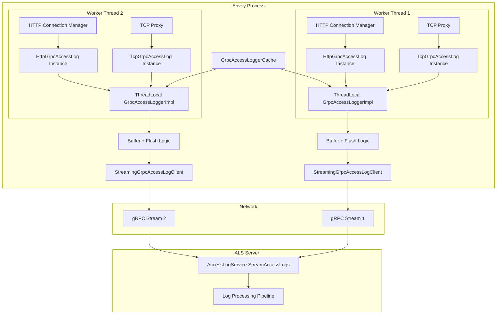
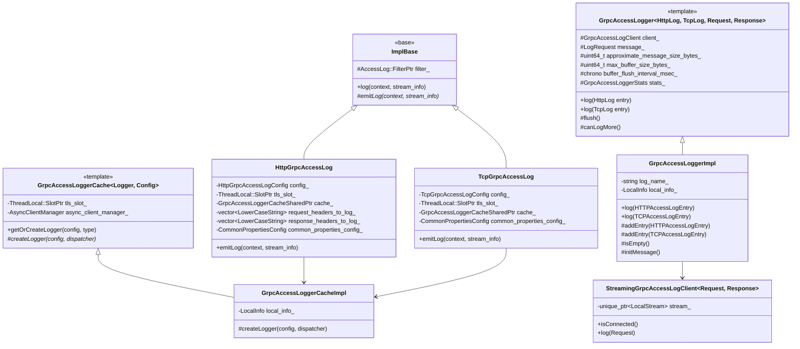
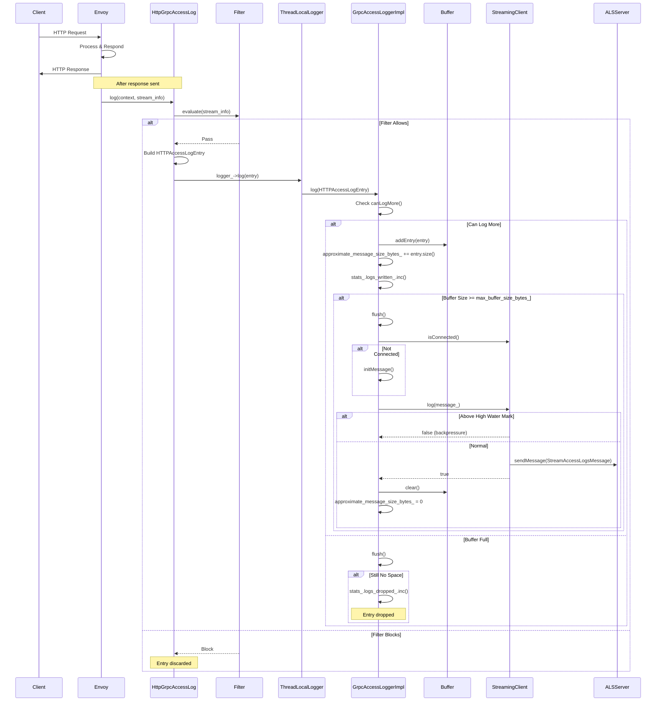
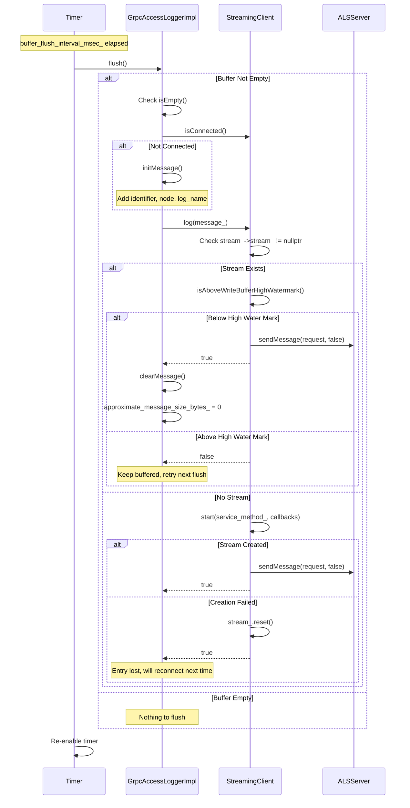
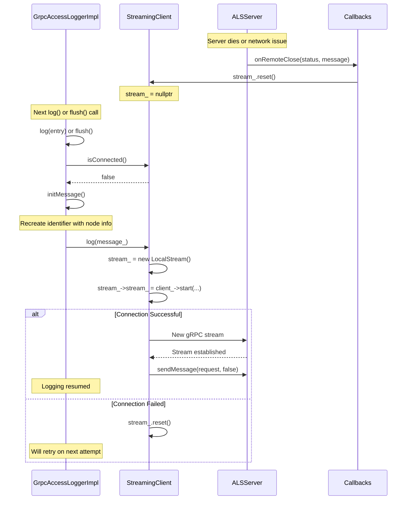
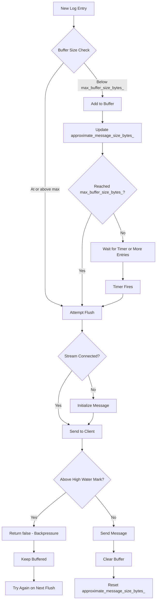
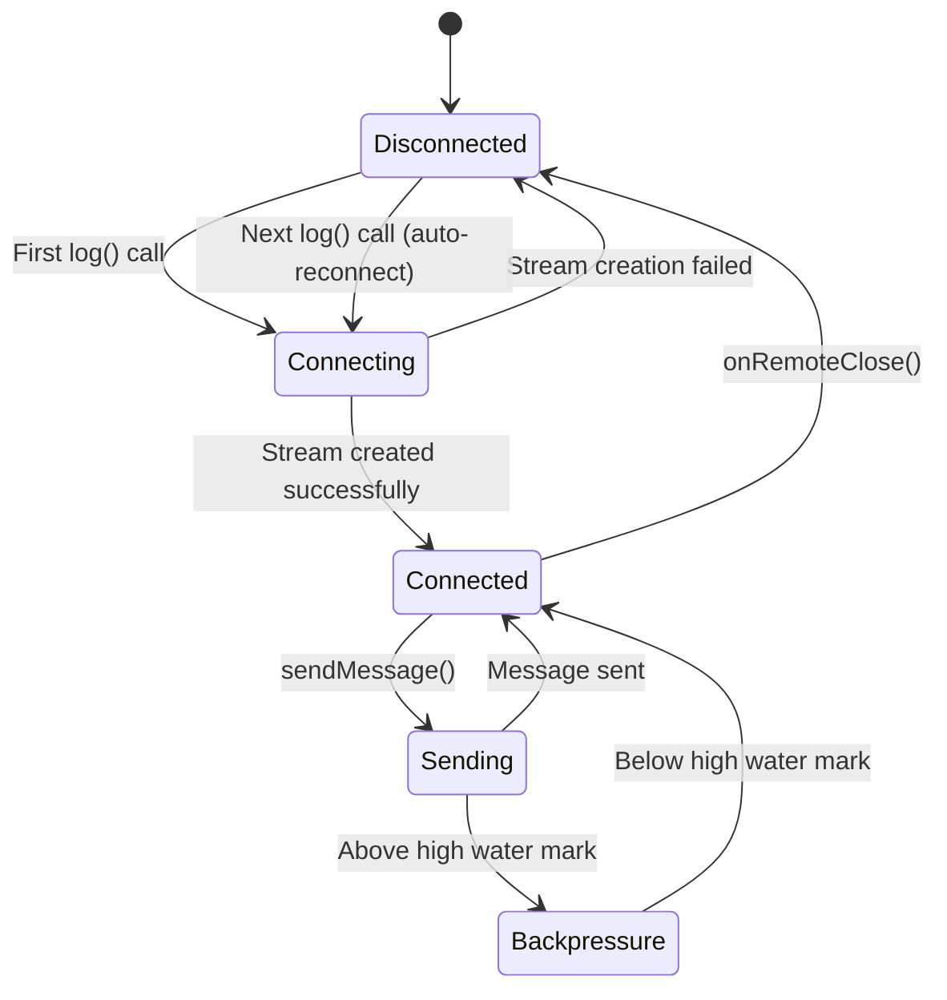

# gRPC Access Logger (Access Log Service - ALS)

## Table of Contents
1. [Introduction](#introduction)
2. [Architecture](#architecture)
3. [Component Details](#component-details)
4. [HTTP vs TCP Loggers](#http-vs-tcp-loggers)
5. [Batching and Buffering](#batching-and-buffering)
6. [Connection Management](#connection-management)
7. [Configuration](#configuration)
8. [Performance](#performance)
9. [Best Practices](#best-practices)
10. [Source Files](#source-files)

## Introduction

The gRPC Access Logger streams access log entries to a remote Access Log Service (ALS) using gRPC. This is the most complex access logger in Envoy, with 16 source files implementing sophisticated features like batching, backpressure handling, connection management, and support for both HTTP and TCP protocols.

### Key Features

- **Streaming Protocol**: Bidirectional gRPC streaming for efficient log transport
- **Batching**: Configurable batching to reduce network overhead
- **Backpressure**: Intelligent handling when log service is slow or unavailable
- **Protocol Support**: Separate implementations for HTTP and TCP access logs
- **Automatic Reconnection**: Resilient to temporary connection failures
- **Thread-Safe**: Uses thread-local storage for per-worker caching
- **Structured Data**: Protobuf messages with rich metadata

### When to Use

Use the gRPC Access Logger when:
- You need centralized log collection across multiple Envoy instances
- You want real-time access to logs for analysis or monitoring
- You're building a custom log processing pipeline
- You need structured log data (protobuf)
- You want efficient network transport with batching

Avoid when:
- Simple local file logging is sufficient
- You need OpenTelemetry correlation (use OpenTelemetry logger instead)
- Network overhead is a concern
- You need maximum throughput (consider file logger)

## Architecture

### High-Level Architecture



### Class Hierarchy



### Sequence: Log Entry Flow



### Sequence: Periodic Flush



### Sequence: Connection Recovery



## Component Details

### 1. GrpcAccessLoggerImpl

**Location**: `grpc_access_log_impl.h/cc`

Core logger implementation that handles both HTTP and TCP log entries.

**Key Responsibilities**:
- Message buffering (StreamAccessLogsMessage)
- Entry aggregation (multiple log entries per message)
- Message initialization with node identifier
- Delegation to gRPC client

**Important Methods**:

```cpp
// Add HTTP access log entry to buffer
void addEntry(envoy::data::accesslog::v3::HTTPAccessLogEntry&& entry) {
  message_.mutable_http_logs()->mutable_log_entry()->Add(std::move(entry));
}

// Add TCP access log entry to buffer
void addEntry(envoy::data::accesslog::v3::TCPAccessLogEntry&& entry) {
  message_.mutable_tcp_logs()->mutable_log_entry()->Add(std::move(entry));
}

// Check if buffer is empty
bool isEmpty() {
  return !message_.has_http_logs() && !message_.has_tcp_logs();
}

// Initialize message with node identity
void initMessage() {
  auto* identifier = message_.mutable_identifier();
  *identifier->mutable_node() = local_info_.node();
  identifier->set_log_name(log_name_);
}
```

**Message Structure**:

```protobuf
message StreamAccessLogsMessage {
  // Identifier for this Envoy node
  StreamAccessLogsMessage.Identifier identifier = 1;
  
  // Either HTTP or TCP logs
  oneof log_entries {
    StreamAccessLogsMessage.HTTPAccessLogEntries http_logs = 2;
    StreamAccessLogsMessage.TCPAccessLogEntries tcp_logs = 3;
  }
}

message Identifier {
  // Node identity (cluster, id, locality, etc.)
  config.core.v3.Node node = 1;
  
  // Log name from configuration
  string log_name = 2;
}
```

---

### 2. HttpGrpcAccessLog

**Location**: `http_grpc_access_log_impl.h/cc`

HTTP-specific access log implementation that captures HTTP request/response details.

**Key Responsibilities**:
- Extract HTTP request properties (method, path, headers, etc.)
- Extract HTTP response properties (status, headers, trailers)
- Build HTTPAccessLogEntry protobuf message
- Delegate to thread-local logger

**HTTP Data Captured**:

```cpp
// Request properties
- Scheme (http/https)
- Authority (Host header)
- Path
- User-Agent
- Referer
- X-Forwarded-For
- Request-Id
- Original path (if rewritten)
- Request headers bytes
- Request body bytes
- Request method
- Configured additional headers

// Response properties
- Response code
- Response code details
- Response headers bytes
- Response body bytes
- Configured additional response headers
- Configured additional response trailers
- Downstream/upstream byte meters
```

**Configuration Options**:

```yaml
typed_config:
  "@type": type.googleapis.com/envoy.extensions.access_loggers.grpc.v3.HttpGrpcAccessLogConfig
  common_config:
    log_name: "http_access_log"
    grpc_service:
      envoy_grpc:
        cluster_name: access_log_cluster
    buffer_size_bytes: 16384
    buffer_flush_interval: 1s
  
  # Additional headers to log beyond defaults
  additional_request_headers_to_log:
    - "x-request-id"
    - "x-trace-id"
  additional_response_headers_to_log:
    - "x-response-time"
  additional_response_trailers_to_log:
    - "grpc-status"
```

**emitLog Implementation** (Simplified):

```cpp
void HttpGrpcAccessLog::emitLog(const Formatter::Context& context,
                                const StreamInfo::StreamInfo& stream_info) {
  envoy::data::accesslog::v3::HTTPAccessLogEntry log_entry;
  
  // Extract common properties (timing, connection info, etc.)
  GrpcCommon::Utility::extractCommonAccessLogProperties(
      *log_entry.mutable_common_properties(),
      common_properties_config_,
      request_headers,
      stream_info,
      context);
  
  // Set protocol version
  if (stream_info.protocol()) {
    switch (stream_info.protocol().value()) {
      case Http::Protocol::Http10:
        log_entry.set_protocol_version(HTTPAccessLogEntry::HTTP10);
        break;
      // ... other protocols
    }
  }
  
  // Request properties
  auto* request_properties = log_entry.mutable_request();
  if (request_headers.Scheme() != nullptr) {
    request_properties->set_scheme(request_headers.getSchemeValue());
  }
  // ... extract other request fields
  
  // Response properties
  auto* response_properties = log_entry.mutable_response();
  if (stream_info.responseCode()) {
    response_properties->mutable_response_code()->set_value(
        stream_info.responseCode().value());
  }
  // ... extract other response fields
  
  // Send to logger
  tls_slot_->getTyped<ThreadLocalLogger>().logger_->log(std::move(log_entry));
}
```

---

### 3. TcpGrpcAccessLog

**Location**: `tcp_grpc_access_log_impl.h/cc`

TCP-specific access log implementation for TCP proxy connections.

**Key Responsibilities**:
- Extract TCP connection properties
- Build TCPAccessLogEntry protobuf message
- Delegate to thread-local logger

**TCP Data Captured**:

```cpp
// Connection properties
- Connection ID
- Bytes sent
- Bytes received
- Duration
- Connection properties (source/destination addresses)
```

**Configuration**:

```yaml
typed_config:
  "@type": type.googleapis.com/envoy.extensions.access_loggers.grpc.v3.TcpGrpcAccessLogConfig
  common_config:
    log_name: "tcp_access_log"
    grpc_service:
      envoy_grpc:
        cluster_name: access_log_cluster
```

---

### 4. GrpcAccessLogger (Base Template)

**Location**: `source/extensions/access_loggers/common/grpc_access_logger.h`

Template base class providing batching, buffering, and flush logic.

**Template Parameters**:
- `HttpLogProto`: HTTP log entry type (e.g., HTTPAccessLogEntry)
- `TcpLogProto`: TCP log entry type (e.g., TCPAccessLogEntry)
- `LogRequest`: gRPC request message type (e.g., StreamAccessLogsMessage)
- `LogResponse`: gRPC response message type (e.g., StreamAccessLogsResponse)

**Key Features**:

```cpp
// Buffering configuration
const uint64_t max_buffer_size_bytes_;        // Max buffer before forced flush
const chrono buffer_flush_interval_msec_;     // Periodic flush interval
uint64_t approximate_message_size_bytes_;     // Current buffer size estimate

// Log entry with buffering
void log(HttpLogProto&& entry) override {
  if (!canLogMore()) {
    return;  // Backpressure or buffer full
  }
  
  approximate_message_size_bytes_ += entry.ByteSizeLong();
  addEntry(std::move(entry));
  
  if (approximate_message_size_bytes_ >= max_buffer_size_bytes_) {
    flush();  // Buffer full, flush immediately
  }
}

// Periodic flush via timer
flush_timer_ = dispatcher.createTimer([this]() {
  flush();
  flush_timer_->enableTimer(buffer_flush_interval_msec_);
});
```

**Stats Tracking**:

```cpp
struct GrpcAccessLoggerStats {
  Counter logs_written_;   // Successfully buffered logs
  Counter logs_dropped_;   // Dropped due to backpressure
};
```

---

### 5. StreamingGrpcAccessLogClient

**Location**: `source/extensions/access_loggers/common/grpc_access_logger_clients.h`

Manages the bidirectional gRPC stream for log transport.

**Key Features**:
- Lazy stream creation (on first log)
- Automatic stream recreation on failure
- Backpressure detection (write buffer high water mark)
- Retry policy support

**Stream Lifecycle**:

```cpp
bool log(const LogRequest& request) override {
  // Create stream wrapper if needed
  if (!stream_) {
    stream_ = std::make_unique<LocalStream>(*this);
  }
  
  // Start gRPC stream if not connected
  if (stream_->stream_ == nullptr) {
    stream_->stream_ = client_->start(service_method_, *stream_, opts_);
  }
  
  // Send message if stream is ready
  if (stream_->stream_ != nullptr) {
    if (stream_->stream_->isAboveWriteBufferHighWatermark()) {
      return false;  // Backpressure - don't send
    }
    stream_->stream_->sendMessage(request, false);
  } else {
    // Stream creation failed, reset and retry later
    stream_.reset();
  }
  
  return true;
}

// Check if connected
bool isConnected() override {
  return stream_ != nullptr && stream_->stream_ != nullptr;
}
```

**Callback Handling**:

```cpp
struct LocalStream : public Grpc::AsyncStreamCallbacks<LogResponse> {
  // Called when stream closes (server close or network error)
  void onRemoteClose(Grpc::Status::GrpcStatus, const std::string&) override {
    if (parent_.stream_->stream_ != nullptr) {
      parent_.stream_.reset();  // Clean up, will reconnect on next log
    }
  }
  
  // Other callbacks (unused for streaming logger)
  void onReceiveMessage(std::unique_ptr<LogResponse>&&) override {}
  // ...
};
```

---

### 6. GrpcAccessLoggerCache

**Location**: `source/extensions/access_loggers/common/grpc_access_logger.h`

Thread-local cache for sharing logger instances across access log configurations.

**Key Responsibilities**:
- Deduplicate loggers with same configuration
- Provide thread-local storage for thread safety
- Lazy logger creation
- Lifecycle management

**Cache Implementation**:

```cpp
template <typename GrpcAccessLogger, typename ConfigProto>
class GrpcAccessLoggerCache {
  typename GrpcAccessLogger::SharedPtr
  getOrCreateLogger(const ConfigProto& config, GrpcAccessLoggerType logger_type) {
    auto& cache = tls_slot_->getTyped<ThreadLocalCache>();
    
    // Create cache key from config hash and logger type
    const auto cache_key = std::make_pair(MessageUtil::hash(config), logger_type);
    
    // Return existing logger if cached
    const auto it = cache.access_loggers_.find(cache_key);
    if (it != cache.access_loggers_.end()) {
      return it->second;
    }
    
    // Create new logger and cache it
    const auto logger = createLogger(config, cache.dispatcher_);
    cache.access_loggers_.emplace(cache_key, logger);
    return logger;
  }

private:
  struct ThreadLocalCache {
    Event::Dispatcher& dispatcher_;
    // Map of (config_hash, logger_type) -> logger
    absl::flat_hash_map<
        std::pair<std::size_t, GrpcAccessLoggerType>,
        typename GrpcAccessLogger::SharedPtr> access_loggers_;
  };
  
  ThreadLocal::SlotPtr tls_slot_;
};
```

**Why Thread-Local?**
- Each worker thread needs its own gRPC stream
- Eliminates lock contention
- Ensures thread-safe access to gRPC clients
- Allows independent flushing per thread

---

### 7. Config Utilities

**Location**: `config_utils.h/cc`, `grpc_access_log_utils.h/cc`

Helper functions for configuration parsing and common property extraction.

**Key Functions**:

```cpp
// Extract common access log properties (shared by HTTP and TCP)
void extractCommonAccessLogProperties(
    CommonAccessLogProperties& properties,
    const CommonPropertiesConfig& config,
    const Http::RequestHeaderMap& request_headers,
    const StreamInfo::StreamInfo& stream_info,
    const Formatter::Context& context);

// Parse retry policy from config
OptRef<const envoy::config::core::v3::RetryPolicy>
optionalRetryPolicy(const CommonGrpcAccessLogConfig& config);
```

**Common Properties** (shared by HTTP and TCP):

```protobuf
message CommonAccessLogProperties {
  // Downstream connection
  Address downstream_remote_address = 1;
  Address downstream_local_address = 2;
  
  // TLS properties
  TLSProperties tls_properties = 3;
  
  // Timing
  google.protobuf.Timestamp start_time = 4;
  google.protobuf.Duration time_to_last_rx_byte = 5;
  google.protobuf.Duration time_to_first_upstream_tx_byte = 6;
  google.protobuf.Duration time_to_last_upstream_tx_byte = 7;
  google.protobuf.Duration time_to_first_upstream_rx_byte = 8;
  google.protobuf.Duration time_to_last_upstream_rx_byte = 9;
  google.protobuf.Duration time_to_first_downstream_tx_byte = 10;
  google.protobuf.Duration time_to_last_downstream_tx_byte = 11;
  
  // Upstream info
  Address upstream_remote_address = 12;
  Address upstream_local_address = 13;
  string upstream_cluster = 14;
  
  // Response flags
  ResponseFlags response_flags = 15;
  
  // Metadata
  Metadata metadata = 16;
  
  // Upstream transport failure reason
  string upstream_transport_failure_reason = 17;
  
  // Route name
  string route_name = 18;
  
  // Dynamic state
  map<string, google.protobuf.Any> filter_state_objects = 19;
  
  // Custom tags
  map<string, string> custom_tags = 20;
  
  // Connection ID
  uint64 downstream_connection_id = 21;
}
```

---

### 8. Proto Descriptors

**Location**: `grpc_access_log_proto_descriptors.h/cc`

Proto descriptor utilities for dynamic message handling (used in some deployment scenarios).

## HTTP vs TCP Loggers

### HTTP Logger (HttpGrpcAccessLog)

**Use Case**: Logging HTTP/gRPC requests

**Captured Data**:
- HTTP method, path, scheme, authority
- Request/response headers (configurable)
- Protocol version (HTTP/1.0, HTTP/1.1, HTTP/2, HTTP/3)
- Status codes and details
- User-Agent, Referer, X-Forwarded-For
- Request-Id
- Byte counts (headers, body, separate for downstream/upstream)
- Timing information

**Protobuf Message**: `envoy::data::accesslog::v3::HTTPAccessLogEntry`

**Configuration**:

```yaml
name: envoy.access_loggers.http_grpc
typed_config:
  "@type": type.googleapis.com/envoy.extensions.access_loggers.grpc.v3.HttpGrpcAccessLogConfig
  common_config:
    log_name: "http_logs"
    grpc_service:
      envoy_grpc:
        cluster_name: als_cluster
    buffer_size_bytes: 32768
    buffer_flush_interval: 2s
  additional_request_headers_to_log:
    - "x-custom-header"
  additional_response_headers_to_log:
    - "x-response-header"
```

---

### TCP Logger (TcpGrpcAccessLog)

**Use Case**: Logging TCP proxy connections

**Captured Data**:
- Connection duration
- Bytes sent/received
- Source/destination addresses
- TLS properties
- Upstream cluster
- Connection ID
- Timing information

**Protobuf Message**: `envoy::data::accesslog::v3::TCPAccessLogEntry`

**Configuration**:

```yaml
name: envoy.access_loggers.tcp_grpc
typed_config:
  "@type": type.googleapis.com/envoy.extensions.access_loggers.grpc.v3.TcpGrpcAccessLogConfig
  common_config:
    log_name: "tcp_logs"
    grpc_service:
      envoy_grpc:
        cluster_name: als_cluster
```

---

### Comparison

| Feature | HTTP Logger | TCP Logger |
|---------|-------------|------------|
| **Protocol** | HTTP/1.x, HTTP/2, HTTP/3 | TCP |
| **Request Details** | Method, path, headers | N/A |
| **Response Details** | Status code, headers, trailers | N/A |
| **Connection Details** | Both | Both |
| **Byte Metrics** | Separate header/body | Total only |
| **Timing** | Detailed (12+ metrics) | Basic |
| **Use Cases** | API gateways, HTTP proxies | TCP proxies, TLS termination |

## Batching and Buffering

### Why Batching?

Without batching, each access log entry would require a separate gRPC message, creating significant overhead:
- Network round-trips
- Serialization overhead
- CPU context switches
- Memory allocations

Batching combines multiple log entries into a single gRPC message, dramatically improving efficiency.

### Batching Strategy



### Configuration Parameters

```yaml
common_config:
  # Maximum buffer size in bytes before forced flush
  # Larger = better batching, more memory
  # Smaller = lower latency, less efficient
  buffer_size_bytes: 16384  # 16KB default
  
  # Flush interval
  # Longer = better batching
  # Shorter = lower latency
  buffer_flush_interval: 1s  # 1 second default
```

### Buffer Size Selection

| Traffic Pattern | buffer_size_bytes | buffer_flush_interval | Rationale |
|-----------------|-------------------|----------------------|-----------|
| Low traffic (<100 req/s) | 8192 (8KB) | 1s | Quick flushing, low memory |
| Medium traffic (100-1000 req/s) | 16384 (16KB) | 1-2s | Balanced |
| High traffic (1000-10000 req/s) | 32768-65536 (32-64KB) | 2-5s | Maximum batching |
| Bursty traffic | 32768 (32KB) | 1s | Handle bursts, flush quickly |

### Backpressure Handling

When the ALS server is slow or unavailable, backpressure prevents unbounded buffering:

```cpp
bool canLogMore() {
  // Check if buffer has space
  if (approximate_message_size_bytes_ < max_buffer_size_bytes_) {
    incLogsWrittenStats();
    return true;
  }
  
  // Buffer full, try to flush
  flush();
  
  // Check again after flush
  if (approximate_message_size_bytes_ < max_buffer_size_bytes_) {
    incLogsWrittenStats();
    return true;
  }
  
  // Still no space, drop the log
  incLogsDroppedStats();
  return false;
}
```

**Backpressure Indicators**:
1. `stats_.logs_dropped_` counter increases
2. `stream_->isAboveWriteBufferHighWatermark()` returns true
3. Buffer repeatedly reaches max_buffer_size_bytes_

**Mitigation Strategies**:
- Increase buffer_size_bytes (more memory, longer retention)
- Decrease buffer_flush_interval (flush more frequently)
- Scale ALS server capacity
- Use sampling/filtering to reduce log volume
- Monitor ALS server health

## Connection Management

### Connection Lifecycle



### Automatic Reconnection

The gRPC logger automatically handles connection failures:

```cpp
// Check connection status
bool isConnected() {
  return stream_ != nullptr && stream_->stream_ != nullptr;
}

// In log() or flush()
if (!client_->isConnected()) {
  initMessage();  // Recreate identifier with node info
}

if (client_->log(message_)) {
  // Success - message sent or buffered
} else {
  // Failed - will retry on next flush
}
```

**Reconnection Triggers**:
1. Server closes stream (onRemoteClose callback)
2. Network failure
3. First log after initialization
4. Stream creation failure (automatic retry)

### Retry Policy

Optional retry policy for transient failures:

```yaml
common_config:
  grpc_service:
    envoy_grpc:
      cluster_name: als_cluster
  # Optional retry policy
  grpc_stream_retry_policy:
    retry_back_off:
      base_interval: 1s
      max_interval: 30s
    num_retries: 3
```

### Thread Safety

Each worker thread has its own:
- GrpcAccessLogger instance (via ThreadLocalCache)
- gRPC stream connection
- Buffer
- Flush timer

This eliminates lock contention and ensures thread-safe operation.

## Configuration

### Complete HTTP Example

```yaml
access_log:
  - name: envoy.access_loggers.http_grpc
    # Optional filter
    filter:
      or_filter:
        filters:
          # Log all errors
          - status_code_filter:
              comparison:
                op: GE
                value:
                  default_value: 400
          # Log slow requests
          - duration_filter:
              comparison:
                op: GE
                value:
                  default_value: 1000  # > 1 second
          # Sample 1% of other requests
          - runtime_filter:
              runtime_key: access_log.sample_rate
              percent_sampled:
                numerator: 1
    
    typed_config:
      "@type": type.googleapis.com/envoy.extensions.access_loggers.grpc.v3.HttpGrpcAccessLogConfig
      
      common_config:
        # Logical name for this log stream
        log_name: "production_http_logs"
        
        # gRPC service configuration
        grpc_service:
          # Use Envoy's gRPC client (recommended)
          envoy_grpc:
            cluster_name: access_log_service_cluster
          
          # Alternative: use external gRPC client
          # google_grpc:
          #   target_uri: "als.example.com:9001"
          #   stat_prefix: als_grpc
        
        # API version
        transport_api_version: V3
        
        # Buffering configuration
        buffer_size_bytes: 32768      # 32KB buffer
        buffer_flush_interval: 2s      # Flush every 2 seconds
        
        # Optional retry policy
        grpc_stream_retry_policy:
          retry_back_off:
            base_interval: 1s
            max_interval: 30s
          num_retries: 5
      
      # Additional headers to log
      additional_request_headers_to_log:
        - "x-request-id"
        - "x-trace-id"
        - "user-agent"
        - "authorization"  # Be careful with sensitive data!
      
      additional_response_headers_to_log:
        - "x-response-time"
        - "x-cache-status"
      
      additional_response_trailers_to_log:
        - "grpc-status"
        - "grpc-message"

# Define the ALS cluster
clusters:
  - name: access_log_service_cluster
    type: STRICT_DNS
    connect_timeout: 1s
    http2_protocol_options: {}  # Required for gRPC
    load_assignment:
      cluster_name: access_log_service_cluster
      endpoints:
        - lb_endpoints:
            - endpoint:
                address:
                  socket_address:
                    address: als.example.com
                    port_value: 9001
```

### Complete TCP Example

```yaml
access_log:
  - name: envoy.access_loggers.tcp_grpc
    typed_config:
      "@type": type.googleapis.com/envoy.extensions.access_loggers.grpc.v3.TcpGrpcAccessLogConfig
      
      common_config:
        log_name: "tcp_logs"
        grpc_service:
          envoy_grpc:
            cluster_name: access_log_service_cluster
        buffer_size_bytes: 16384
        buffer_flush_interval: 1s
```

### Multi-Cluster Example

Different logs to different ALS servers:

```yaml
access_log:
  # Production logs
  - name: envoy.access_loggers.http_grpc
    filter:
      not_health_check_filter: {}
    typed_config:
      "@type": type.googleapis.com/envoy.extensions.access_loggers.grpc.v3.HttpGrpcAccessLogConfig
      common_config:
        log_name: "production_logs"
        grpc_service:
          envoy_grpc:
            cluster_name: production_als_cluster
  
  # Audit logs (all requests, separate destination)
  - name: envoy.access_loggers.http_grpc
    typed_config:
      "@type": type.googleapis.com/envoy.extensions.access_loggers.grpc.v3.HttpGrpcAccessLogConfig
      common_config:
        log_name: "audit_logs"
        grpc_service:
          envoy_grpc:
            cluster_name: audit_als_cluster

clusters:
  - name: production_als_cluster
    # ... production ALS config ...
  - name: audit_als_cluster
    # ... audit ALS config ...
```

## Performance

### Latency Impact

Access logging occurs **after** the response is sent, so it doesn't directly affect request latency. However:

**Indirect Impacts**:
- Buffer allocation and copying: ~1-5μs per log
- Protobuf serialization: ~10-50μs per entry
- gRPC send (amortized with batching): ~1-10μs per entry
- Total overhead: ~10-100μs per request (depending on configuration)

**CPU Overhead** (approximate):
- Low traffic: <0.5% CPU
- Medium traffic (1000 req/s): 1-2% CPU
- High traffic (10000 req/s): 3-5% CPU

### Memory Usage

**Per-Thread Memory**:
```
Base overhead: ~1-2 KB (GrpcAccessLoggerImpl object)
Buffer: buffer_size_bytes (default 16KB)
gRPC stream: ~4-8 KB
Total per thread: ~20-30 KB
```

**Total Memory** = (Workers × Memory-per-thread)

Example: 8 workers × 30KB = ~240KB total

### Network Bandwidth

**Estimated bandwidth**:
```
Bandwidth = (Log entries/sec) × (Avg entry size) / (Compression ratio)

Example (10000 req/s, 500 bytes/entry, compression 3:1):
= 10000 × 500 / 3
= ~1.67 MB/s
= ~13.3 Mbps
```

**Bandwidth optimization**:
- Use filtering to reduce entry count
- Increase batching (larger buffer, longer interval)
- Limit additional headers logged
- gRPC automatically compresses with HTTP/2

### Throughput Limits

Typical limits:
- **Single thread**: 50,000-100,000 req/s
- **Multi-threaded**: Limited by ALS server capacity, not client

### Optimization Tips

1. **Tune Buffer Settings**:
```yaml
common_config:
  buffer_size_bytes: 65536    # Larger = better batching
  buffer_flush_interval: 5s    # Longer = less frequent flushes
```

2. **Use Aggressive Filtering**:
```yaml
filter:
  and_filter:
    filters:
      - status_code_filter:  # Only errors
          comparison:
            op: GE
            value: 400
      - runtime_filter:       # Sample 10%
          percent_sampled:
            numerator: 10
```

3. **Limit Logged Headers**:
```yaml
# Only log essential headers
additional_request_headers_to_log:
  - "x-request-id"  # Minimal set
```

4. **Monitor Stats**:
```
access_logs.grpc_access_log.logs_written  # Should be steady
access_logs.grpc_access_log.logs_dropped  # Should be 0 or low
```

## Best Practices

### 1. Always Configure Filters

Don't log everything:

```yaml
filter:
  or_filter:
    filters:
      - status_code_filter:
          comparison:
            op: GE
            value: 400
      - duration_filter:
          comparison:
            op: GE
            value:
              default_value: 1000
```

### 2. Use Meaningful log_name

Helps identify logs on ALS server:

```yaml
common_config:
  log_name: "envoy-prod-us-west-2-http"  # Include environment, region, type
```

### 3. Configure Appropriate Buffers

Balance latency vs. efficiency:

```yaml
# High traffic, efficiency priority
buffer_size_bytes: 65536
buffer_flush_interval: 5s

# Low latency priority
buffer_size_bytes: 8192
buffer_flush_interval: 500ms
```

### 4. Monitor Dropped Logs

Alert on non-zero logs_dropped:

```
access_logs.grpc_access_log.logs_dropped > 0
```

Indicates:
- ALS server is slow/overloaded
- Network issues
- Buffer too small

### 5. Use Health Checks

Ensure ALS cluster is healthy:

```yaml
clusters:
  - name: access_log_service_cluster
    health_checks:
      - timeout: 1s
        interval: 10s
        unhealthy_threshold: 2
        healthy_threshold: 1
        grpc_health_check: {}
```

### 6. Secure Sensitive Data

Avoid logging auth tokens:

```yaml
# DON'T log these headers
additional_request_headers_to_log:
  # - "authorization"     # Contains credentials
  # - "cookie"            # Contains session tokens
  - "x-request-id"        # Safe to log
```

### 7. Plan for ALS Failures

What happens when ALS is down?

```yaml
# Option 1: Fail open (drop logs)
# Default behavior - logs dropped when buffer full

# Option 2: Dual logging (ALS + local file)
access_log:
  - name: envoy.access_loggers.http_grpc
    # ... gRPC config ...
  - name: envoy.access_loggers.file
    typed_config:
      path: /var/log/envoy/backup.log
```

### 8. Test Backpressure

In staging:
1. Intentionally slow down/stop ALS server
2. Generate load
3. Verify:
   - Logs are buffered appropriately
   - Stats show logs_dropped increasing
   - Envoy remains stable
   - Recovery works when ALS returns

### 9. Version Your ALS Protocol

Use transport_api_version consistently:

```yaml
common_config:
  transport_api_version: V3  # Explicit version
```

### 10. Document Your Setup

```yaml
# Purpose: Production access logs for HTTP traffic
# Owner: SRE team (sre@example.com)
# ALS Server: als.prod.example.com:9001
# Retention: 30 days in ALS backend
# Sampling: 100% errors, 1% success
access_log:
  - name: envoy.access_loggers.http_grpc
    # ... config ...
```

## Source Files

All source files in `source/extensions/access_loggers/grpc/`:

### Core Implementation (6 files)
1. **grpc_access_log_impl.h/cc** - Base GrpcAccessLoggerImpl class
2. **http_grpc_access_log_impl.h/cc** - HTTP-specific logger
3. **tcp_grpc_access_log_impl.h/cc** - TCP-specific logger

### Configuration (4 files)
4. **http_config.h/cc** - HTTP logger factory
5. **tcp_config.h/cc** - TCP logger factory

### Utilities (6 files)
6. **config_utils.h/cc** - Configuration helpers
7. **grpc_access_log_utils.h/cc** - Common property extraction
8. **grpc_access_log_proto_descriptors.h/cc** - Proto descriptor utilities

### Common Framework Files
9. **source/extensions/access_loggers/common/grpc_access_logger.h** - Template base class
10. **source/extensions/access_loggers/common/grpc_access_logger_clients.h** - gRPC client wrappers
11. **source/extensions/access_loggers/common/grpc_access_logger_utils.h/cc** - Shared utilities

## Related Documentation

- [ACCESS_LOGGERS_OVERVIEW.md](../ACCESS_LOGGERS_OVERVIEW.md) - Overview of all loggers
- [ACCESS_LOGGER_COMMON.md](../common/ACCESS_LOGGER_COMMON.md) - Common framework details
- [OPENTELEMETRY_ACCESS_LOGGER.md](../open_telemetry/OPENTELEMETRY_ACCESS_LOGGER.md) - Similar architecture
- [ACCESS_LOG_FILTERS.md](../filters/ACCESS_LOG_FILTERS.md) - Filter configuration

## Summary

The gRPC Access Logger is Envoy's most sophisticated access logging solution, offering:

**Strengths**:
- Centralized log collection across multiple Envoy instances
- Efficient batching and buffering
- Automatic reconnection and retry
- Backpressure handling
- Structured protobuf data
- Separate HTTP and TCP implementations

**Complexity**:
- 16 source files
- Template-based architecture
- Thread-local caching
- gRPC stream management

**Best For**:
- Large-scale deployments
- Centralized observability
- Custom log processing pipelines
- Real-time log analysis

**Consider Alternatives When**:
- OpenTelemetry integration needed (use OpenTelemetry logger)
- Simple local logging sufficient (use file/stream logger)
- Maximum throughput required (use file logger)
