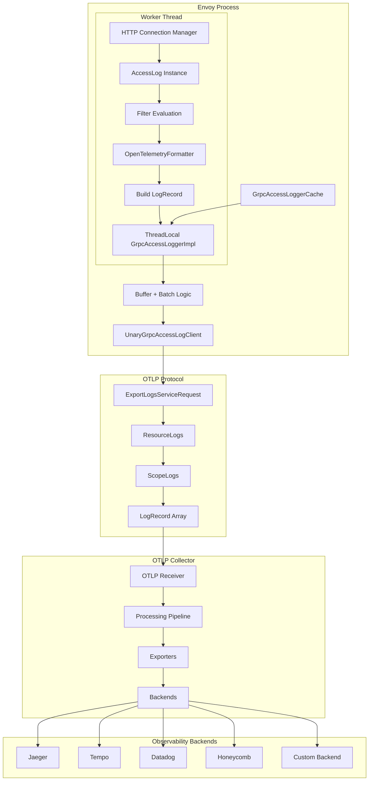
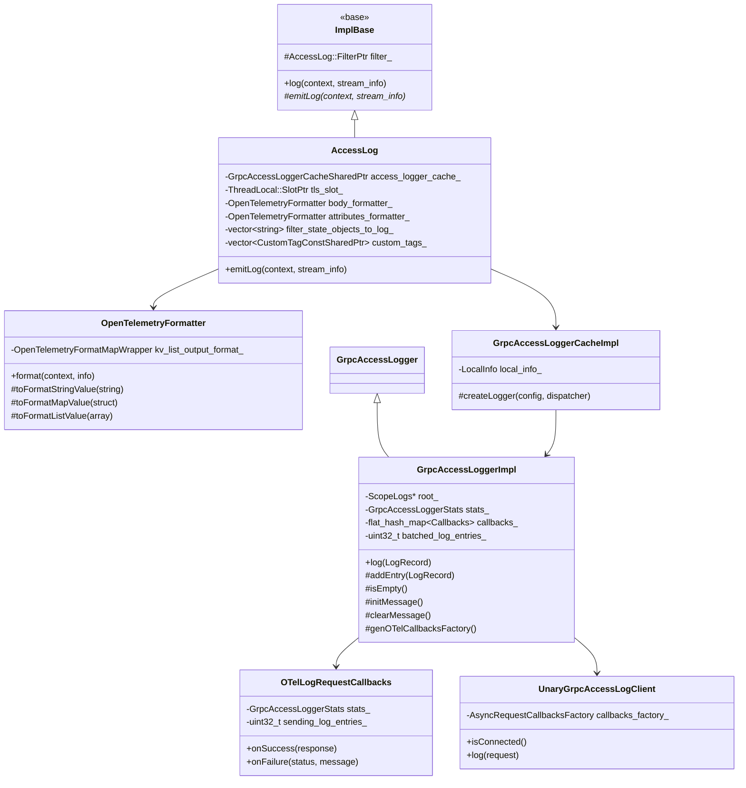
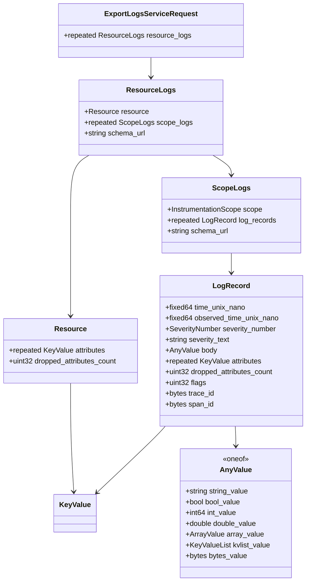
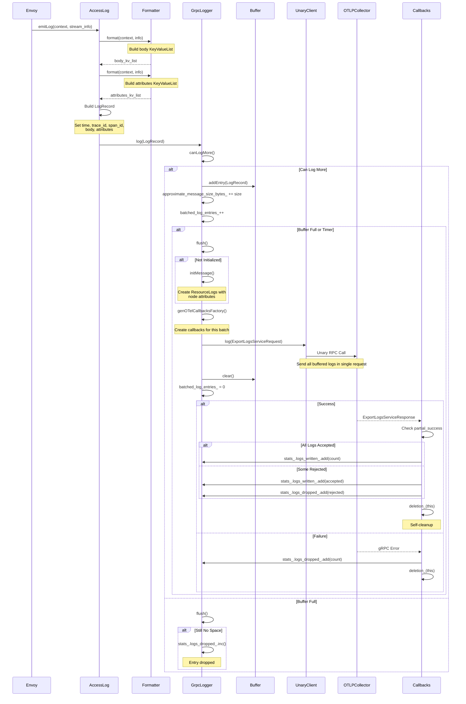
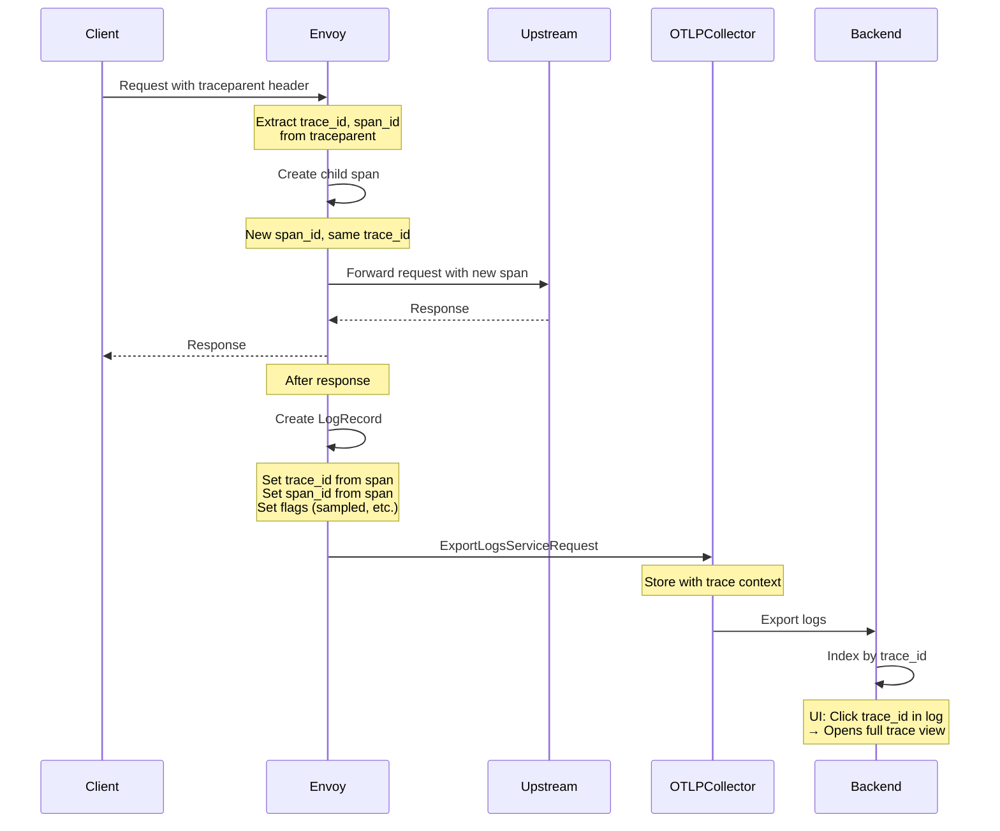

# OpenTelemetry Access Logger

## Table of Contents
1. [Introduction](#introduction)
2. [Architecture](#architecture)
3. [OTLP Protocol](#otlp-protocol)
4. [Component Details](#component-details)
5. [Trace Correlation](#trace-correlation)
6. [Resource Attributes](#resource-attributes)
7. [Configuration](#configuration)
8. [Performance](#performance)
9. [Best Practices](#best-practices)
10. [Source Files](#source-files)

## Introduction

The OpenTelemetry Access Logger exports access logs using the OpenTelemetry Protocol (OTLP), enabling seamless integration with modern observability platforms. It's the recommended choice for cloud-native deployments that use OpenTelemetry for distributed tracing and metrics.

### Key Features

- **OTLP Native**: Uses standard OpenTelemetry log format
- **Trace Correlation**: Automatic correlation with distributed traces
- **Resource Attributes**: Rich metadata about the Envoy instance
- **Flexible Formatting**: Custom attribute mapping with substitution
- **Batching**: Efficient batch export
- **Unary gRPC**: Uses unary RPC instead of streaming (unlike gRPC logger)
- **Unified Observability**: Single protocol for logs, metrics, and traces

### When to Use

Use the OpenTelemetry Access Logger when:
- You're using OpenTelemetry for observability
- You need trace/log correlation
- You want to use OTLP-native backends (Jaeger, Tempo, Datadog, etc.)
- You need standardized log format
- You're in a cloud-native environment

Avoid when:
- You need custom protobuf format (use gRPC logger)
- You don't need trace correlation
- Simple file logging is sufficient (use file logger)
- You have existing Fluentd infrastructure (use Fluentd logger)

## Architecture

### High-Level Architecture



### Class Hierarchy



### OTLP Message Structure



### Sequence: Log Export Flow



## OTLP Protocol

### What is OTLP?

OpenTelemetry Protocol (OTLP) is a vendor-neutral protocol for telemetry data export. It defines:
- Data model for logs, metrics, and traces
- Wire format (protobuf or JSON)
- Transport (gRPC or HTTP)

### OTLP Log Data Model

#### LogRecord Structure

```protobuf
message LogRecord {
  // Time when the event occurred (nanoseconds since Unix epoch)
  fixed64 time_unix_nano = 1;
  
  // Time when the event was observed (nanoseconds since Unix epoch)
  fixed64 observed_time_unix_nano = 11;
  
  // Severity number (1-24, based on SysLog)
  SeverityNumber severity_number = 2;
  
  // Severity text (e.g., "INFO", "ERROR")
  string severity_text = 3;
  
  // Log body (the actual log message/data)
  opentelemetry.proto.common.v1.AnyValue body = 5;
  
  // Additional attributes
  repeated opentelemetry.proto.common.v1.KeyValue attributes = 6;
  
  // Trace context (for correlation)
  bytes trace_id = 21;
  bytes span_id = 22;
  
  // Flags (bit field)
  uint32 flags = 23;
}
```

#### Severity Numbers

```go
const (
  SEVERITY_NUMBER_UNSPECIFIED = 0
  SEVERITY_NUMBER_TRACE = 1     // TRACE
  SEVERITY_NUMBER_DEBUG = 5     // DEBUG
  SEVERITY_NUMBER_INFO = 9      // INFO
  SEVERITY_NUMBER_WARN = 13     // WARN
  SEVERITY_NUMBER_ERROR = 17    // ERROR
  SEVERITY_NUMBER_FATAL = 21    // FATAL
)
```

#### Resource Attributes

Resources represent the entity that produced the logs (e.g., this Envoy instance):

```protobuf
message Resource {
  // Attributes describing the resource
  repeated KeyValue attributes = 1;
  
  // Examples:
  // - service.name = "envoy"
  // - service.version = "1.28.0"
  // - service.instance.id = "envoy-pod-123"
  // - deployment.environment = "production"
  // - k8s.pod.name = "envoy-abc123"
  // - k8s.namespace.name = "default"
}
```

### Unary vs Streaming

**Key Difference from gRPC Logger**:

| Feature | OpenTelemetry Logger | gRPC Logger |
|---------|---------------------|-------------|
| **RPC Type** | Unary | Streaming |
| **Connection** | New per batch | Long-lived stream |
| **Batching** | Per request | Continuous |
| **Backpressure** | gRPC level | Application level |
| **Retry** | gRPC built-in | Manual |
| **Complexity** | Lower | Higher |

**Unary RPC Flow**:
```
1. Buffer logs
2. Flush triggers
3. Create ExportLogsServiceRequest
4. Send unary RPC
5. Wait for ExportLogsServiceResponse
6. Process result (partial success)
7. Cleanup
```

**Advantages of Unary**:
- Simpler implementation
- gRPC handles retries
- Better load balancing
- Easier backpressure handling

**Disadvantages of Unary**:
- Connection overhead per batch
- No persistent connection
- Higher latency for small batches

## Component Details

### 1. AccessLog (Main Implementation)

**Location**: `access_log_impl.h/cc`

Main access log implementation that bridges Envoy's access log framework with OTLP.

**Key Responsibilities**:
- Build LogRecord from StreamInfo
- Format body and attributes using OpenTelemetryFormatter
- Extract trace context (trace_id, span_id)
- Handle filter state objects and custom tags
- Delegate to thread-local logger

**emitLog Implementation** (Simplified):

```cpp
void AccessLog::emitLog(const Formatter::Context& context,
                        const StreamInfo::StreamInfo& stream_info) {
  opentelemetry::proto::logs::v1::LogRecord log_entry;
  
  // Set timestamps
  auto timestamp = stream_info.startTime();
  log_entry.set_time_unix_nano(
      std::chrono::duration_cast<std::chrono::nanoseconds>(
          timestamp.time_since_epoch()).count());
  log_entry.set_observed_time_unix_nano(
      std::chrono::duration_cast<std::chrono::nanoseconds>(
          std::chrono::system_clock::now().time_since_epoch()).count());
  
  // Set severity (default INFO)
  log_entry.set_severity_number(
      opentelemetry::proto::logs::v1::SEVERITY_NUMBER_INFO);
  
  // Format body (main log content)
  if (body_formatter_) {
    *log_entry.mutable_body()->mutable_kvlist_value() =
        body_formatter_->format(context, stream_info);
  }
  
  // Format attributes (additional metadata)
  if (attributes_formatter_) {
    auto formatted_attributes = attributes_formatter_->format(context, stream_info);
    for (const auto& kv : formatted_attributes.values()) {
      *log_entry.add_attributes() = kv;
    }
  }
  
  // Add filter state objects
  for (const auto& key : filter_state_objects_to_log_) {
    const auto* value = stream_info.filterState()->getDataReadOnly<FilterState::Object>(key);
    if (value) {
      // Serialize and add to attributes
    }
  }
  
  // Add custom tags
  for (const auto& tag : custom_tags_) {
    const auto tag_value = tag->value(context, stream_info);
    if (tag_value) {
      auto* attribute = log_entry.add_attributes();
      attribute->set_key(tag->tag());
      attribute->mutable_value()->set_string_value(*tag_value);
    }
  }
  
  // Trace correlation
  if (stream_info.traceId()) {
    log_entry.set_trace_id(stream_info.traceId()->trace_id);
    log_entry.set_span_id(stream_info.traceId()->span_id);
    log_entry.set_flags(stream_info.traceId()->trace_flags);
  }
  
  // Send to logger
  tls_slot_->getTyped<ThreadLocalLogger>().logger_->log(std::move(log_entry));
}
```

---

### 2. GrpcAccessLoggerImpl

**Location**: `grpc_access_log_impl.h/cc`

Core logger that handles batching and OTLP message construction.

**Key Differences from gRPC Logger**:
- Uses **Unary** gRPC client (not streaming)
- Single LogRecord type for both HTTP and TCP
- Callback management for unary RPCs
- Partial success handling

**Message Initialization**:

```cpp
void GrpcAccessLoggerImpl::initMessage() {
  // Create ResourceLogs with node information
  auto* resource_logs = message_.add_resource_logs();
  
  // Set resource attributes (Envoy node identity)
  auto* resource = resource_logs->mutable_resource();
  const auto& node = local_info_.node();
  
  // Add service.name
  auto* attr = resource->add_attributes();
  attr->set_key("service.name");
  attr->mutable_value()->set_string_value(node.cluster());
  
  // Add service.instance.id
  attr = resource->add_attributes();
  attr->set_key("service.instance.id");
  attr->mutable_value()->set_string_value(node.id());
  
  // Add other node metadata...
  
  // Create ScopeLogs (instrumentation scope)
  root_ = resource_logs->add_scope_logs();
  root_->mutable_scope()->set_name("envoy.access_loggers.open_telemetry");
  root_->mutable_scope()->set_version("1.0.0");
}

void GrpcAccessLoggerImpl::addEntry(LogRecord&& entry) {
  root_->mutable_log_records()->Add(std::move(entry));
  batched_log_entries_++;
}

bool GrpcAccessLoggerImpl::isEmpty() {
  return root_ == nullptr || root_->log_records().empty();
}
```

**Callback Management**:

```cpp
std::function<OTelLogRequestCallbacks&()> 
GrpcAccessLoggerImpl::genOTelCallbacksFactory() {
  return [this]() -> OTelLogRequestCallbacks& {
    auto callback = std::make_unique<OTelLogRequestCallbacks>(
        stats_,
        batched_log_entries_,
        [this](OTelLogRequestCallbacks* cb) {
          // Deletion lambda - remove callback when done
          callbacks_.erase(cb);
        });
    
    auto* callback_ptr = callback.get();
    callbacks_.emplace(callback_ptr, std::move(callback));
    return *callback_ptr;
  };
}
```

**Partial Success Handling**:

```cpp
void OTelLogRequestCallbacks::onSuccess(
    Grpc::ResponsePtr<ExportLogsServiceResponse>&& resp,
    Tracing::Span&) {
  // Check if some logs were rejected
  const uint32_t rejected = 
      (resp && resp->has_partial_success()) 
          ? resp->partial_success().rejected_log_records()
          : 0;
  
  if (sending_log_entries_ < rejected) {
    // Unexpected: more rejected than sent
    stats_.logs_dropped_.add(sending_log_entries_);
  } else {
    // Normal case: some accepted, some rejected
    stats_.logs_dropped_.add(rejected);
    stats_.logs_written_.add(sending_log_entries_ - rejected);
  }
  
  // Clean up this callback
  deletion_(this);
}

void OTelLogRequestCallbacks::onFailure(
    Grpc::Status::GrpcStatus status, 
    const std::string& message,
    Tracing::Span&) {
  // Complete failure - all logs dropped
  stats_.logs_dropped_.add(sending_log_entries_);
  deletion_(this);
}
```

---

### 3. OpenTelemetryFormatter

**Location**: `substitution_formatter.h/cc`

Powerful formatter that converts Envoy command strings into OTLP KeyValueList.

**Key Features**:
- Nested structure support (maps and arrays)
- Type preservation (string, int, double, bool)
- Command substitution (e.g., %REQ(:METHOD)%, %RESP_CODE%)
- Custom commands via CommandParser

**Format Structure**:

```cpp
class OpenTelemetryFormatter {
  // Input: KeyValueList proto (configuration)
  // Output: KeyValueList proto (formatted)
  
  KeyValueList format(const Formatter::Context& context,
                      const StreamInfo::StreamInfo& info) const;

private:
  // Internal representation
  using OpenTelemetryFormatMap = std::list<std::pair<string, OpenTelemetryFormatValue>>;
  using OpenTelemetryFormatValue = variant<
      vector<FormatterProviderPtr>,       // String value with substitution
      OpenTelemetryFormatMapWrapper,      // Nested map
      OpenTelemetryFormatListWrapper      // Array
  >;
};
```

**Usage Example**:

Configuration:
```yaml
body:
  values:
    - key: "method"
      value:
        string_value: "%REQ(:METHOD)%"
    - key: "path"
      value:
        string_value: "%REQ(X-ENVOY-ORIGINAL-PATH?:PATH)%"
    - key: "status"
      value:
        int_value: "%RESPONSE_CODE%"
```

Result (LogRecord.body):
```json
{
  "method": "GET",
  "path": "/api/users",
  "status": 200
}
```

**Nested Structures**:

Configuration:
```yaml
body:
  values:
    - key: "request"
      value:
        kvlist_value:
          values:
            - key: "method"
              value:
                string_value: "%REQ(:METHOD)%"
            - key: "headers"
              value:
                array_value:
                  values:
                    - string_value: "%REQ(USER-AGENT)%"
                    - string_value: "%REQ(X-REQUEST-ID)%"
```

Result:
```json
{
  "request": {
    "method": "GET",
    "headers": ["Mozilla/5.0", "abc-123"]
  }
}
```

---

### 4. UnaryGrpcAccessLogClient

**Location**: `source/extensions/access_loggers/common/grpc_access_logger_clients.h`

Simplified gRPC client for unary RPC calls.

```cpp
template <typename LogRequest, typename LogResponse>
class UnaryGrpcAccessLogClient : public GrpcAccessLogClient<LogRequest, LogResponse> {
  // Always returns false (no persistent connection)
  bool isConnected() override { return false; }
  
  // Send unary RPC
  bool log(const LogRequest& request) override {
    client_->send(
        service_method_,
        request,
        callbacks_factory_(),  // Get callback for this request
        Tracing::NullSpan::instance(),
        opts_);
    return true;
  }

private:
  AsyncRequestCallbacksFactory callbacks_factory_;
};
```

**Simpler than Streaming**:
- No stream lifecycle management
- No connection state tracking
- No backpressure detection (handled by gRPC)
- Automatic retries (if configured)

## Trace Correlation

### Why Trace Correlation?

Correlating logs with traces enables:
- Jump from log to trace in observability UI
- See full request context for a log entry
- Understand causal relationships
- Debug distributed systems

### How It Works



### Trace Context in LogRecord

```protobuf
message LogRecord {
  // ... other fields ...
  
  // Trace ID (16 bytes)
  bytes trace_id = 21;
  
  // Span ID (8 bytes)
  bytes span_id = 22;
  
  // Trace flags (bit field)
  // Bit 0: Sampled (1 = sampled, 0 = not sampled)
  uint32 flags = 23;
}
```

### Configuration

Trace correlation is automatic if:
1. Envoy has tracing configured
2. Request has trace context (traceparent or x-b3-traceid headers)
3. Tracing is enabled for the request

No additional configuration needed!

### Example

**Trace created**:
```
Trace ID: 4bf92f3577b34da6a3ce929d0e0e4736
Span ID: 00f067aa0ba902b7
Flags: 01 (sampled)
```

**LogRecord**:
```protobuf
log_record {
  trace_id: "\x4b\xf9\x2f\x35\x77\xb3\x4d\xa6\xa3\xce\x92\x9d\x0e\x0e\x47\x36"
  span_id: "\x00\xf0\x67\xaa\x0b\xa9\x02\xb7"
  flags: 1
  body {
    kvlist_value {
      values {
        key: "method"
        value { string_value: "GET" }
      }
      values {
        key: "path"
        value { string_value: "/api/users" }
      }
    }
  }
}
```

**In Jaeger UI**:
- View trace: Shows all spans for trace_id
- Click span: Shows logs with matching span_id
- Click log: Shows full log entry with context

## Resource Attributes

### What are Resource Attributes?

Resource attributes describe the entity producing the logs (this Envoy instance). They're attached once per batch, not per log entry, making them efficient for metadata.

### Standard Attributes

Based on OpenTelemetry Semantic Conventions:

```yaml
resource:
  attributes:
    # Service identification
    - key: "service.name"
      value: { string_value: "envoy" }
    - key: "service.version"
      value: { string_value: "1.28.0" }
    - key: "service.instance.id"
      value: { string_value: "envoy-pod-abc123" }
    
    # Deployment environment
    - key: "deployment.environment"
      value: { string_value: "production" }
    
    # Cloud provider (if applicable)
    - key: "cloud.provider"
      value: { string_value: "aws" }
    - key: "cloud.region"
      value: { string_value: "us-west-2" }
    - key: "cloud.availability_zone"
      value: { string_value: "us-west-2a" }
    
    # Kubernetes (if applicable)
    - key: "k8s.namespace.name"
      value: { string_value: "default" }
    - key: "k8s.pod.name"
      value: { string_value: "envoy-abc123" }
    - key: "k8s.pod.uid"
      value: { string_value: "12345678-1234-1234-1234-123456789abc" }
    - key: "k8s.deployment.name"
      value: { string_value: "envoy" }
    
    # Container (if applicable)
    - key: "container.name"
      value: { string_value: "envoy" }
    - key: "container.id"
      value: { string_value: "abc123..." }
    - key: "container.image.name"
      value: { string_value: "envoyproxy/envoy" }
    - key: "container.image.tag"
      value: { string_value: "v1.28.0" }
    
    # Host
    - key: "host.name"
      value: { string_value: "ip-10-0-1-42" }
    - key: "host.id"
      value: { string_value: "i-1234567890abcdef0" }
```

### How Envoy Populates Resources

Resources are automatically populated from:
1. **LocalInfo**: Envoy's node identity (cluster, id, locality)
2. **Bootstrap Config**: Node metadata
3. **Environment**: K8s downward API, EC2 metadata service

**Example** (from LocalInfo):

```cpp
void GrpcAccessLoggerImpl::initMessage() {
  auto* resource_logs = message_.add_resource_logs();
  auto* resource = resource_logs->mutable_resource();
  
  const auto& node = local_info_.node();
  
  // service.name = node.cluster
  addAttribute(resource, "service.name", node.cluster());
  
  // service.instance.id = node.id
  addAttribute(resource, "service.instance.id", node.id());
  
  // Locality
  if (node.has_locality()) {
    addAttribute(resource, "region", node.locality().region());
    addAttribute(resource, "zone", node.locality().zone());
    addAttribute(resource, "sub_zone", node.locality().sub_zone());
  }
  
  // Custom metadata
  for (const auto& [key, value] : node.metadata().fields()) {
    addAttribute(resource, key, value);
  }
}
```

### Querying by Resource Attributes

In backends (e.g., Jaeger, Datadog):

```
# Find all logs from production
resource.deployment.environment = "production"

# Find logs from specific pod
resource.k8s.pod.name = "envoy-abc123"

# Find logs from region
resource.cloud.region = "us-west-2"

# Combine with log attributes
resource.service.name = "envoy" AND attributes.status >= 500
```

## Configuration

### Basic Configuration

```yaml
access_log:
  - name: envoy.access_loggers.open_telemetry
    typed_config:
      "@type": type.googleapis.com/envoy.extensions.access_loggers.open_telemetry.v3.OpenTelemetryAccessLogConfig
      
      # Common gRPC configuration
      common_config:
        log_name: "envoy_access_log"
        transport_api_version: V3
        
        # gRPC service (OTLP collector)
        grpc_service:
          envoy_grpc:
            cluster_name: otel_collector
        
        # Buffering
        buffer_size_bytes: 16384
        buffer_flush_interval: 1s
      
      # Body format (main log content)
      body:
        values:
          - key: "method"
            value:
              string_value: "%REQ(:METHOD)%"
          - key: "path"
            value:
              string_value: "%REQ(X-ENVOY-ORIGINAL-PATH?:PATH)%"
          - key: "status"
            value:
              string_value: "%RESPONSE_CODE%"
          - key: "duration_ms"
            value:
              string_value: "%DURATION%"
      
      # Attributes (additional metadata)
      attributes:
        values:
          - key: "upstream_cluster"
            value:
              string_value: "%UPSTREAM_CLUSTER%"
          - key: "response_flags"
            value:
              string_value: "%RESPONSE_FLAGS%"

# Define OTLP collector cluster
clusters:
  - name: otel_collector
    type: STRICT_DNS
    connect_timeout: 1s
    http2_protocol_options: {}  # Required for gRPC
    load_assignment:
      cluster_name: otel_collector
      endpoints:
        - lb_endpoints:
            - endpoint:
                address:
                  socket_address:
                    address: otel-collector.observability.svc.cluster.local
                    port_value: 4317  # OTLP gRPC port
```

### Advanced Configuration

```yaml
access_log:
  - name: envoy.access_loggers.open_telemetry
    # Filter to reduce volume
    filter:
      or_filter:
        filters:
          # Log all errors
          - status_code_filter:
              comparison:
                op: GE
                value:
                  default_value: 400
          # Log slow requests
          - duration_filter:
              comparison:
                op: GE
                value:
                  default_value: 1000
          # Sample 1% of success
          - and_filter:
              filters:
                - status_code_filter:
                    comparison:
                      op: LT
                      value:
                        default_value: 400
                - runtime_filter:
                    percent_sampled:
                      numerator: 1
    
    typed_config:
      "@type": type.googleapis.com/envoy.extensions.access_loggers.open_telemetry.v3.OpenTelemetryAccessLogConfig
      
      common_config:
        log_name: "production_http_logs"
        transport_api_version: V3
        grpc_service:
          envoy_grpc:
            cluster_name: otel_collector
        buffer_size_bytes: 32768
        buffer_flush_interval: 2s
        
        # Retry policy
        grpc_stream_retry_policy:
          retry_back_off:
            base_interval: 1s
            max_interval: 30s
          num_retries: 5
      
      # Rich body with nested structure
      body:
        values:
          # Request details
          - key: "request"
            value:
              kvlist_value:
                values:
                  - key: "method"
                    value:
                      string_value: "%REQ(:METHOD)%"
                  - key: "path"
                    value:
                      string_value: "%REQ(X-ENVOY-ORIGINAL-PATH?:PATH)%"
                  - key: "protocol"
                    value:
                      string_value: "%PROTOCOL%"
                  - key: "headers"
                    value:
                      kvlist_value:
                        values:
                          - key: "user_agent"
                            value:
                              string_value: "%REQ(USER-AGENT)%"
                          - key: "request_id"
                            value:
                              string_value: "%REQ(X-REQUEST-ID)%"
          
          # Response details
          - key: "response"
            value:
              kvlist_value:
                values:
                  - key: "status"
                    value:
                      string_value: "%RESPONSE_CODE%"
                  - key: "flags"
                    value:
                      string_value: "%RESPONSE_FLAGS%"
                  - key: "duration_ms"
                    value:
                      string_value: "%DURATION%"
          
          # Connection details
          - key: "connection"
            value:
              kvlist_value:
                values:
                  - key: "remote_address"
                    value:
                      string_value: "%DOWNSTREAM_REMOTE_ADDRESS%"
                  - key: "local_address"
                    value:
                      string_value: "%DOWNSTREAM_LOCAL_ADDRESS%"
      
      # Additional attributes
      attributes:
        values:
          - key: "upstream.cluster"
            value:
              string_value: "%UPSTREAM_CLUSTER%"
          - key: "upstream.host"
            value:
              string_value: "%UPSTREAM_HOST%"
          - key: "bytes_sent"
            value:
              string_value: "%BYTES_SENT%"
          - key: "bytes_received"
            value:
              string_value: "%BYTES_RECEIVED%"
      
      # Custom tags (from tracing config)
      # Reuses tags defined in tracing configuration
      
      # Filter state objects to log
      # Objects stored in filter state that should be logged
      # filter_state_objects_to_log:
      #   - "my_custom_state"
```

### OTLP Collector Configuration

Example OpenTelemetry Collector config to receive logs:

```yaml
receivers:
  otlp:
    protocols:
      grpc:
        endpoint: 0.0.0.0:4317

processors:
  batch:
    timeout: 10s
    send_batch_size: 1024
  
  resource:
    attributes:
      - key: collector.name
        value: otel-collector
        action: insert

exporters:
  # Export to Jaeger
  jaeger:
    endpoint: jaeger:14250
    tls:
      insecure: true
  
  # Export to Prometheus (for metrics)
  prometheus:
    endpoint: "0.0.0.0:8889"
  
  # Export to file (debugging)
  file:
    path: /var/log/otel/logs.json
  
  # Export to Datadog
  datadog:
    api:
      key: ${DD_API_KEY}

service:
  pipelines:
    logs:
      receivers: [otlp]
      processors: [batch, resource]
      exporters: [jaeger, file, datadog]
```

## Performance

### Latency Impact

Similar to gRPC logger:
- Protobuf serialization: ~10-50μs per entry
- Formatter processing: ~5-20μs per entry
- gRPC send (amortized): ~1-10μs per entry
- **Total**: ~15-80μs per request

**Lower than streaming gRPC logger** because:
- No stream state management
- No backpressure checks
- Simpler callback handling

### CPU Overhead

- Low traffic: <0.5% CPU
- Medium (1000 req/s): 0.5-1.5% CPU
- High (10000 req/s): 2-4% CPU

**~25% less CPU than streaming gRPC logger** due to simpler implementation.

### Memory Usage

Per-thread:
```
Base: ~1-2 KB
Buffer: buffer_size_bytes (default 16KB)
Callbacks: ~1 KB per in-flight batch
Total: ~18-20 KB per thread
```

### Network Bandwidth

Same calculation as gRPC logger:
```
Bandwidth = (Entries/sec) × (Avg size) / (Compression)
Example: 10000 × 500 / 3 = ~1.67 MB/s
```

OTLP uses HTTP/2 compression, so actual bandwidth is ~30-50% of uncompressed size.

## Best Practices

### 1. Structure Your Body

Use nested structures for clarity:

```yaml
body:
  values:
    - key: "request"
      value:
        kvlist_value:
          values:
            - key: "method"
              value: { string_value: "%REQ(:METHOD)%" }
    - key: "response"
      value:
        kvlist_value:
          values:
            - key: "status"
              value: { string_value: "%RESPONSE_CODE%" }
```

**Better than flat**:
```yaml
body:
  values:
    - key: "request_method"
      value: { string_value: "%REQ(:METHOD)%" }
    - key: "response_status"
      value: { string_value: "%RESPONSE_CODE%" }
```

### 2. Use Attributes for Metadata

Body = what happened
Attributes = context about what happened

```yaml
body:
  # Core log message
  values:
    - key: "message"
      value: { string_value: "Request completed" }
    - key: "status"
      value: { string_value: "%RESPONSE_CODE%" }

attributes:
  # Contextual metadata
  values:
    - key: "upstream.cluster"
      value: { string_value: "%UPSTREAM_CLUSTER%" }
    - key: "response.flags"
      value: { string_value: "%RESPONSE_FLAGS%" }
```

### 3. Leverage Trace Correlation

Ensure tracing is enabled:

```yaml
tracing:
  http:
    name: envoy.tracers.opentelemetry
    typed_config:
      "@type": type.googleapis.com/envoy.config.trace.v3.OpenTelemetryConfig
      grpc_service:
        envoy_grpc:
          cluster_name: otel_collector
      service_name: envoy
```

Logs will automatically include trace_id and span_id.

### 4. Monitor Partial Success

Check for rejected logs:

```
access_logs.open_telemetry.logs_dropped > 0
```

Indicates collector is rejecting some logs (quotas, validation, etc.).

### 5. Use Semantic Conventions

Follow OpenTelemetry semantic conventions for attribute names:
- https://opentelemetry.io/docs/specs/semconv/http/
- Use standard names like `http.method`, `http.status_code`, `http.url`

```yaml
body:
  values:
    - key: "http.method"  # Standard convention
      value: { string_value: "%REQ(:METHOD)%" }
    - key: "http.status_code"  # Standard convention
      value: { string_value: "%RESPONSE_CODE%" }
    - key: "http.url"  # Standard convention
      value: { string_value: "%REQ(X-ENVOY-ORIGINAL-PATH?:PATH)%" }
```

### 6. Configure Resource Attributes

Set meaningful node metadata in bootstrap:

```yaml
node:
  cluster: envoy-prod
  id: envoy-abc123
  locality:
    region: us-west-2
    zone: us-west-2a
  metadata:
    deployment.environment: production
    team: platform
    version: 1.28.0
```

These become resource attributes in OTLP.

### 7. Test Your Format

Use file logger to test format before deploying:

```yaml
access_log:
  - name: envoy.access_loggers.file
    typed_config:
      path: /dev/stdout
      log_format:
        json_format:
          # Same structure as OTLP body
          method: "%REQ(:METHOD)%"
          path: "%REQ(X-ENVOY-ORIGINAL-PATH?:PATH)%"
          status: "%RESPONSE_CODE%"
```

### 8. Batch Appropriately

Balance latency vs efficiency:

```yaml
# High traffic (efficiency priority)
buffer_size_bytes: 65536
buffer_flush_interval: 5s

# Low latency priority
buffer_size_bytes: 8192
buffer_flush_interval: 500ms
```

### 9. Health Check Your Collector

```yaml
clusters:
  - name: otel_collector
    health_checks:
      - timeout: 1s
        interval: 10s
        grpc_health_check:
          service_name: "opentelemetry.proto.collector.logs.v1.LogsService"
```

### 10. Consider Multi-Backend

Send to multiple backends via OTLP collector:

```yaml
# Envoy sends to collector
access_log:
  - name: envoy.access_loggers.open_telemetry
    typed_config:
      grpc_service:
        envoy_grpc:
          cluster_name: otel_collector

# Collector fans out to multiple backends
# (See OTLP Collector Configuration above)
```

## Source Files

All source files in `source/extensions/access_loggers/open_telemetry/`:

### Core Implementation (6 files)
1. **access_log_impl.h/cc** - Main AccessLog class
2. **grpc_access_log_impl.h/cc** - GrpcAccessLoggerImpl (batching, OTLP)
3. **config.h/cc** - Factory and configuration

### Formatters (2 files)
4. **substitution_formatter.h/cc** - OpenTelemetryFormatter

### Utilities (2 files)
5. **otlp_log_utils.h/cc** - OTLP utility functions

### Proto Descriptors (2 files)
6. **access_log_proto_descriptors.h/cc** - Proto descriptor utilities

### HTTP-Specific (2 files)
7. **http_access_log_impl.h/cc** - HTTP access log (if separate from main)

**Total**: 14 source files

## Related Documentation

- [ACCESS_LOGGERS_OVERVIEW.md](../ACCESS_LOGGERS_OVERVIEW.md) - Overview of all loggers
- [GRPC_ACCESS_LOGGER.md](GRPC_ACCESS_LOGGER.md) - Similar architecture (streaming)
- [ACCESS_LOGGER_COMMON.md](../common/ACCESS_LOGGER_COMMON.md) - Common framework
- [ACCESS_LOG_FILTERS.md](../filters/ACCESS_LOG_FILTERS.md) - Filter configuration

## Summary

The OpenTelemetry Access Logger is the recommended choice for modern observability:

**Strengths**:
- Standard OTLP format
- Automatic trace correlation
- Rich resource attributes
- Flexible formatting
- Simpler than streaming gRPC logger
- Wide backend support

**Best For**:
- OpenTelemetry-native environments
- Trace/log correlation
- Cloud-native deployments
- Multi-signal observability (logs + metrics + traces)

**Consider Alternatives When**:
- Custom protobuf format needed (use gRPC logger)
- No trace correlation needed (use file/stream logger)
- Legacy infrastructure (use Fluentd logger)
