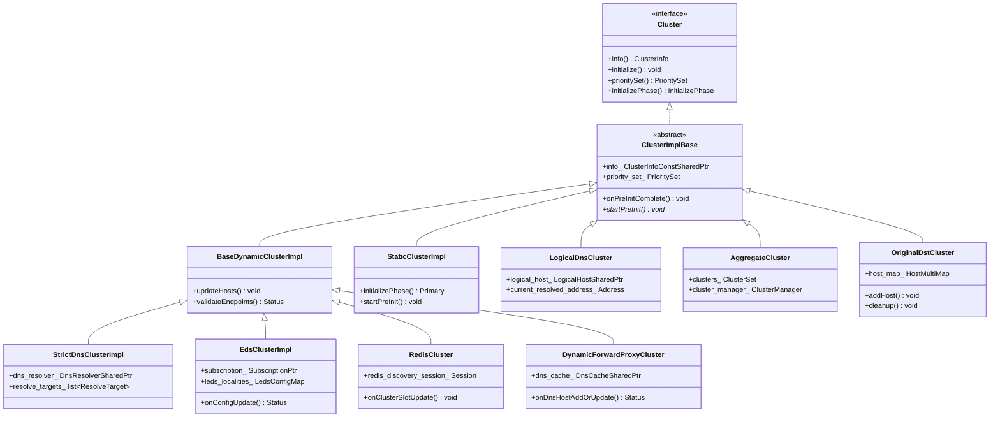
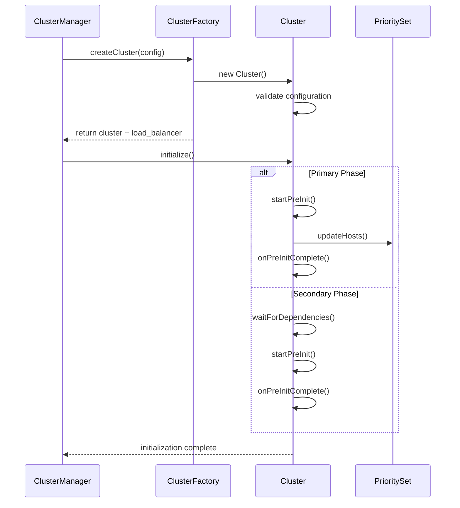
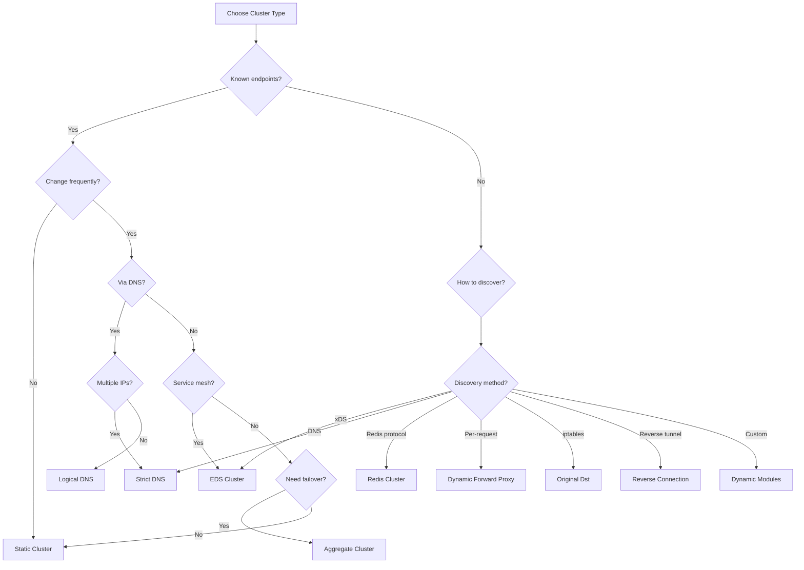
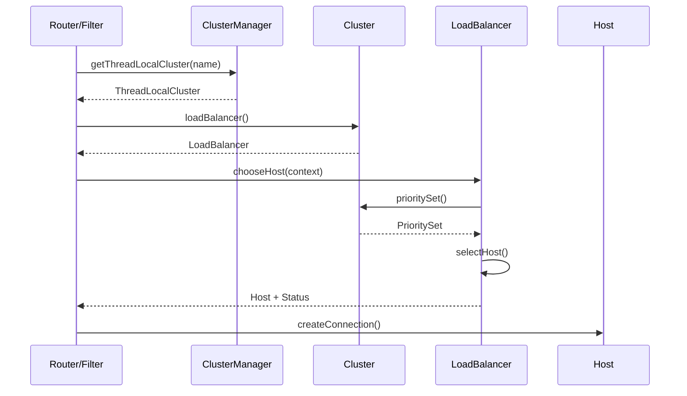

# Envoy Clusters Extension Overview

## Table of Contents
- [Introduction](#introduction)
- [Cluster Architecture](#cluster-architecture)
- [Cluster Types Overview](#cluster-types-overview)
- [Cluster Type Comparison](#cluster-type-comparison)
- [Discovery Mechanisms](#discovery-mechanisms)
- [Cluster Selection Guide](#cluster-selection-guide)
- [Common Patterns](#common-patterns)
- [Integration with Envoy Core](#integration-with-envoy-core)
- [Performance Considerations](#performance-considerations)
- [Best Practices](#best-practices)

## Introduction

The Envoy clusters extension provides various cluster implementations that determine how Envoy discovers and manages upstream endpoints. A cluster is a logical grouping of similar upstream hosts that Envoy connects to when routing requests. The cluster type determines how endpoints are discovered, updated, and selected for traffic routing.

This directory (`source/extensions/clusters/`) contains all cluster type implementations supported by Envoy. Each cluster type has different characteristics, use cases, and operational behaviors.

### Core Concepts

- **Cluster**: A logical group of similar upstream hosts
- **Endpoint**: An individual upstream host address (IP:port)
- **Host**: Envoy's internal representation of an endpoint with metadata
- **Priority Set**: Collection of hosts organized by priority levels
- **Locality**: Geographic grouping of endpoints (region/zone/sub-zone)
- **Discovery**: The mechanism by which endpoints are identified and updated

## Cluster Architecture

### Class Hierarchy



### Cluster Initialization Phases

Envoy clusters initialize in two phases:

1. **Primary Phase**: Clusters that do not depend on other clusters (static, DNS, original_dst)
2. **Secondary Phase**: Clusters that depend on primary clusters (EDS, aggregate, composite)



## Cluster Types Overview

### 1. Static Cluster (`static/`)
**Factory Name**: `envoy.cluster.static`

- **Purpose**: Fixed set of endpoints defined in configuration
- **Use Cases**: Known backend IPs, testing, development
- **Discovery**: Configuration file
- **Updates**: Only via configuration reload
- **Initialization**: Primary phase

### 2. Strict DNS Cluster (`strict_dns/`)
**Factory Name**: `envoy.cluster.strict_dns`

- **Purpose**: DNS-based endpoint discovery with multiple IPs
- **Use Cases**: Kubernetes headless services, DNS round-robin
- **Discovery**: Periodic DNS resolution
- **Updates**: Based on DNS TTL or configured refresh rate
- **Initialization**: Primary phase

### 3. Logical DNS Cluster (`logical_dns/`)
**Factory Name**: `envoy.cluster.logical_dns`

- **Purpose**: Single logical endpoint backed by DNS
- **Use Cases**: External HTTP services, CDNs
- **Discovery**: Periodic DNS resolution (single IP selection)
- **Updates**: DNS changes don't invalidate existing connections
- **Initialization**: Primary phase

### 4. EDS Cluster (`eds/`)
**Factory Name**: `envoy.cluster.eds`

- **Purpose**: Dynamic endpoint discovery via xDS protocol
- **Use Cases**: Service mesh (Istio, Consul Connect), cloud-native applications
- **Discovery**: Endpoint Discovery Service (xDS gRPC stream)
- **Updates**: Real-time via xDS protocol
- **Initialization**: Secondary phase (depends on xDS connection)
- **Features**: LEDS (Locality Endpoint Discovery Service), priority-based routing

### 5. Aggregate Cluster (`aggregate/`)
**Factory Name**: `envoy.clusters.aggregate`

- **Purpose**: Combines multiple clusters with priority/failover
- **Use Cases**: Multi-region failover, canary deployments, disaster recovery
- **Discovery**: Delegates to underlying clusters
- **Updates**: Reacts to changes in member clusters
- **Initialization**: Secondary phase

### 6. Composite Cluster (`composite/`)
**Factory Name**: `envoy.clusters.composite`

- **Purpose**: Per-request cluster selection based on context
- **Use Cases**: Retry to different cluster, request-specific routing
- **Discovery**: Delegates to underlying clusters
- **Updates**: Based on selected cluster
- **Initialization**: Secondary phase

### 7. Redis Cluster (`redis/`)
**Factory Name**: `envoy.clusters.redis`

- **Purpose**: Redis cluster protocol support with hash slot routing
- **Use Cases**: Redis cluster mode, distributed caching
- **Discovery**: Redis CLUSTER SLOTS command
- **Updates**: Periodic topology refresh, redirect-triggered updates
- **Initialization**: Primary phase
- **Features**: CRC16 hash slot calculation, replica routing, zone-aware routing

### 8. Dynamic Forward Proxy Cluster (`dynamic_forward_proxy/`)
**Factory Name**: `envoy.clusters.dynamic_forward_proxy`

- **Purpose**: On-demand host creation for forward proxy
- **Use Cases**: Egress gateway, HTTP forward proxy
- **Discovery**: Per-request DNS resolution
- **Updates**: DNS TTL-based caching
- **Initialization**: Primary phase

### 9. Original Destination Cluster (`original_dst/`)
**Factory Name**: `envoy.cluster.original_dst`

- **Purpose**: Route to original destination from iptables redirect
- **Use Cases**: Transparent proxy, iptables-based service mesh
- **Discovery**: SO_ORIGINAL_DST socket option
- **Updates**: Per-connection host creation
- **Initialization**: Primary phase

### 10. MCP Multicluster (`mcp_multicluster/`)
**Factory Name**: `envoy.clusters.mcp_multicluster`

- **Purpose**: Multi-cluster communication via MCP protocol
- **Use Cases**: Service mesh multi-cluster federation
- **Discovery**: Mesh Configuration Protocol
- **Updates**: Via MCP stream
- **Initialization**: Secondary phase

### 11. Reverse Connection Cluster (`reverse_connection/`)
**Factory Name**: `envoy.clusters.reverse_connection`

- **Purpose**: Server-initiated reverse tunnel connections
- **Use Cases**: NAT traversal, private network access
- **Discovery**: Dynamic based on reverse tunnel registrations
- **Updates**: Per-connection host creation
- **Initialization**: Primary phase

### 12. Dynamic Modules Cluster (`dynamic_modules/`)
**Factory Name**: `envoy.clusters.dynamic_modules`

- **Purpose**: Custom cluster implementation via dynamic shared libraries
- **Use Cases**: Proprietary discovery protocols, custom load balancing
- **Discovery**: Module-defined
- **Updates**: Module-controlled
- **Initialization**: Primary phase

## Cluster Type Comparison

### Comparison Table

| Cluster Type | Discovery Method | Dynamic Updates | Use Case | Complexity | Performance |
|--------------|-----------------|-----------------|----------|------------|-------------|
| **Static** | Configuration | No | Fixed backends | Low | High |
| **Strict DNS** | DNS A/AAAA records | Yes (periodic) | Kubernetes services | Low | Medium |
| **Logical DNS** | DNS (single IP) | Yes (non-disruptive) | External HTTP APIs | Low | High |
| **EDS** | xDS gRPC stream | Yes (real-time) | Service mesh | Medium | High |
| **Aggregate** | Delegates | Yes (reactive) | Multi-region failover | Medium | Medium |
| **Composite** | Delegates | Yes (per-request) | Retry routing | Medium | Medium |
| **Redis** | CLUSTER SLOTS | Yes (periodic/redirect) | Redis cluster | High | High |
| **Dynamic Forward Proxy** | Per-request DNS | Yes (on-demand) | Egress gateway | Medium | Medium |
| **Original Dst** | Socket option | Yes (per-connection) | Transparent proxy | Low | High |
| **MCP Multicluster** | MCP stream | Yes (real-time) | Multi-cluster mesh | High | Medium |
| **Reverse Connection** | Reverse tunnels | Yes (dynamic) | NAT traversal | High | Medium |
| **Dynamic Modules** | Custom module | Module-defined | Custom protocols | Very High | Variable |

### When to Use Each Cluster Type

#### Use Static Cluster When:
- Backend IPs are known and rarely change
- Simple testing or development setup
- Configuration-based deployments
- Performance is critical (no discovery overhead)

#### Use Strict DNS Cluster When:
- Endpoints are managed via DNS
- Multiple IPs per DNS name (round-robin)
- Kubernetes headless services
- DNS changes should propagate to all connections

#### Use Logical DNS Cluster When:
- Single logical endpoint (like external API)
- DNS changes shouldn't disrupt existing connections
- Long-lived connection pools
- CDN or third-party service integration

#### Use EDS Cluster When:
- Running in a service mesh (Istio, Consul, Linkerd)
- Real-time endpoint updates required
- Complex routing (locality, priority, metadata)
- Cloud-native microservices architecture

#### Use Aggregate Cluster When:
- Multi-region failover required
- Primary/secondary cluster pattern
- Gradual migration between clusters
- Canary deployments across clusters

#### Use Composite Cluster When:
- Per-request cluster selection
- Retry to different cluster types
- Request-specific routing logic

#### Use Redis Cluster When:
- Redis cluster mode (16384 hash slots)
- Distributed caching with Redis
- Need replica read support
- Zone-aware Redis routing

#### Use Dynamic Forward Proxy When:
- HTTP forward proxy use case
- Egress gateway pattern
- Dynamic hostname resolution
- DNS caching for many unique hosts

#### Use Original Dst Cluster When:
- Transparent proxy with iptables
- SO_ORIGINAL_DST support required
- Legacy application integration
- Non-intrusive service mesh

#### Use MCP Multicluster When:
- Multi-cluster service mesh
- Cross-cluster service discovery
- Mesh Configuration Protocol integration

#### Use Reverse Connection Cluster When:
- NAT traversal required
- Private network access
- Server-initiated connections
- Reverse tunnel pattern

#### Use Dynamic Modules Cluster When:
- Custom discovery protocol
- Proprietary load balancing
- Special integration requirements
- Performance-critical custom logic

## Discovery Mechanisms

### Static Discovery
```yaml
clusters:
- name: my_cluster
  type: STATIC
  load_assignment:
    cluster_name: my_cluster
    endpoints:
    - lb_endpoints:
      - endpoint:
          address:
            socket_address:
              address: 127.0.0.1
              port_value: 8080
```

### DNS Discovery
```yaml
clusters:
- name: dns_cluster
  type: STRICT_DNS
  load_assignment:
    cluster_name: dns_cluster
    endpoints:
    - lb_endpoints:
      - endpoint:
          address:
            socket_address:
              address: service.example.com
              port_value: 80
  dns_refresh_rate: 5s
```

### EDS Discovery
```yaml
clusters:
- name: eds_cluster
  type: EDS
  eds_cluster_config:
    eds_config:
      resource_api_version: V3
      api_config_source:
        api_type: GRPC
        grpc_services:
        - envoy_grpc:
            cluster_name: xds_cluster
```

### Dynamic Discovery
Dynamic Forward Proxy, Original Dst, and Reverse Connection clusters discover endpoints on-demand based on request context or connection metadata.

## Cluster Selection Guide

### Decision Tree



### Requirements Checklist

Use this checklist to determine the appropriate cluster type:

**Endpoint Discovery:**
- [ ] Endpoints are static → Static Cluster
- [ ] Endpoints from DNS with multiple IPs → Strict DNS
- [ ] Endpoints from DNS (single logical) → Logical DNS
- [ ] Endpoints from xDS (service mesh) → EDS Cluster
- [ ] Endpoints from Redis protocol → Redis Cluster
- [ ] Endpoints per-request (forward proxy) → Dynamic Forward Proxy
- [ ] Endpoints from iptables redirect → Original Dst
- [ ] Endpoints from reverse tunnels → Reverse Connection

**Multi-Cluster Requirements:**
- [ ] Need failover between clusters → Aggregate Cluster
- [ ] Need per-request cluster selection → Composite Cluster
- [ ] Need multi-cluster mesh → MCP Multicluster

**Custom Requirements:**
- [ ] Custom discovery protocol → Dynamic Modules

## Common Patterns

### Pattern 1: Multi-Region Failover with Aggregate Cluster

```yaml
clusters:
- name: aggregate_service
  type: CLUSTER_PROVIDED
  cluster_type:
    name: envoy.clusters.aggregate
    typed_config:
      "@type": type.googleapis.com/envoy.extensions.clusters.aggregate.v3.ClusterConfig
      clusters:
      - us_east_service    # Priority 0
      - us_west_service    # Priority 1
      - eu_west_service    # Priority 2

- name: us_east_service
  type: EDS
  eds_cluster_config:
    eds_config:
      resource_api_version: V3
      ads: {}

- name: us_west_service
  type: EDS
  eds_cluster_config:
    eds_config:
      resource_api_version: V3
      ads: {}
```

**How it works**: Aggregate cluster linearizes priorities from all member clusters. Traffic goes to us_east first, failing over to us_west, then eu_west.

### Pattern 2: EDS with Locality-Aware Routing

```yaml
clusters:
- name: my_service
  type: EDS
  eds_cluster_config:
    eds_config:
      resource_api_version: V3
      ads: {}
  common_lb_config:
    locality_weighted_lb_config: {}
    zone_aware_lb_config:
      routing_enabled:
        default: 100
      min_cluster_size: 3
```

**How it works**: EDS cluster receives endpoints with locality information (region/zone). Traffic is routed to same-zone endpoints when possible.

### Pattern 3: DNS Service Discovery

```yaml
clusters:
- name: kubernetes_service
  type: STRICT_DNS
  dns_lookup_family: V4_ONLY
  load_assignment:
    cluster_name: kubernetes_service
    endpoints:
    - lb_endpoints:
      - endpoint:
          address:
            socket_address:
              address: my-service.default.svc.cluster.local
              port_value: 8080
  dns_refresh_rate: 10s
  dns_failure_refresh_rate:
    base_interval: 1s
    max_interval: 10s
  respect_dns_ttl: true
```

**How it works**: Envoy periodically resolves DNS and updates the endpoint list based on A/AAAA records.

### Pattern 4: Forward Proxy with Dynamic DNS

```yaml
clusters:
- name: dynamic_forward_proxy_cluster
  type: CLUSTER_PROVIDED
  cluster_type:
    name: envoy.clusters.dynamic_forward_proxy
    typed_config:
      "@type": type.googleapis.com/envoy.extensions.clusters.dynamic_forward_proxy.v3.ClusterConfig
      dns_cache_config:
        name: dynamic_forward_proxy_cache_config
        dns_lookup_family: V4_ONLY
        max_hosts: 1024
        dns_min_refresh_rate: 20s
```

**How it works**: Hosts are created on-demand as requests arrive. DNS results are cached with configurable TTL.

### Pattern 5: Redis Cluster with Topology Discovery

```yaml
clusters:
- name: redis_cluster
  type: CLUSTER_PROVIDED
  cluster_type:
    name: envoy.clusters.redis
    typed_config:
      "@type": type.googleapis.com/envoy.extensions.clusters.redis.v3.RedisClusterConfig
      cluster_refresh_rate: 5s
      cluster_refresh_timeout: 3s
      redirect_refresh_interval: 5s
      redirect_refresh_threshold: 5
  load_assignment:
    cluster_name: redis_cluster
    endpoints:
    - lb_endpoints:
      - endpoint:
          address:
            socket_address:
              address: redis-0.example.com
              port_value: 6379
```

**How it works**: Envoy queries Redis CLUSTER SLOTS to build topology map, routes commands to correct shard based on CRC16 hash.

## Integration with Envoy Core

### ClusterManager Integration



### PrioritySet Structure

Each cluster maintains a PrioritySet that organizes hosts by priority levels:

```
PrioritySet
├── Priority 0 (highest)
│   ├── Locality A: [Host1, Host2]
│   └── Locality B: [Host3, Host4]
├── Priority 1
│   ├── Locality A: [Host5, Host6]
│   └── Locality C: [Host7, Host8]
└── Priority 2 (lowest)
    └── Locality A: [Host9, Host10]
```

**Load balancing rules:**
1. Select priority level based on health and overprovisioning
2. Within priority, select locality (zone-aware, weighted, etc.)
3. Within locality, select host (round robin, random, least request, etc.)

### Health Checking Integration

All cluster types support health checking:

```yaml
clusters:
- name: my_cluster
  # ... cluster config ...
  health_checks:
  - timeout: 1s
    interval: 10s
    unhealthy_threshold: 3
    healthy_threshold: 2
    http_health_check:
      path: /healthz
      expected_statuses:
      - start: 200
        end: 300
```

Health check results affect host selection in the load balancer.

### Outlier Detection Integration

Clusters can enable outlier detection to temporarily eject unhealthy hosts:

```yaml
clusters:
- name: my_cluster
  # ... cluster config ...
  outlier_detection:
    consecutive_5xx: 5
    interval: 30s
    base_ejection_time: 30s
    max_ejection_percent: 50
    enforcing_consecutive_5xx: 100
```

## Performance Considerations

### Memory Usage

| Cluster Type | Memory per Host | Memory Overhead | Notes |
|--------------|-----------------|-----------------|-------|
| Static | ~1-2 KB | Low | Fixed allocation |
| Strict DNS | ~1-2 KB | Low | Plus DNS cache |
| Logical DNS | ~1-2 KB | Very Low | Single host |
| EDS | ~1-2 KB | Medium | xDS subscription state |
| Aggregate | Negligible | Low | References only |
| Redis | ~2-3 KB | Medium | Slot array + topology |
| Dynamic Forward Proxy | ~1-2 KB | High | DNS cache per host |
| Original Dst | ~1-2 KB | Medium | Dynamic host map |

**Memory optimization tips:**
- Use aggregate clusters to avoid duplicating common configuration
- Configure `max_hosts` limits for dynamic clusters
- Set appropriate cleanup intervals for dynamic clusters
- Use LEDS for large EDS deployments to reduce memory

### CPU Usage

**Discovery overhead:**
- **Static**: None (only at initialization)
- **DNS**: Periodic DNS queries (configurable rate)
- **EDS**: xDS stream processing (minimal when stable)
- **Redis**: CLUSTER SLOTS command (periodic)
- **Dynamic**: Per-request DNS resolution (with caching)

**Load balancing overhead:**
- **Simple selection** (Static, DNS): O(1) - negligible
- **Priority selection** (EDS, Aggregate): O(priorities) - very low
- **Hash-based** (Redis): O(1) CRC16 calculation - low
- **Dynamic lookup** (Original Dst, Dynamic Forward Proxy): O(log n) map lookup - low

### Network Overhead

- **EDS**: Maintains gRPC stream to control plane (~1 connection)
- **DNS**: Periodic DNS queries (UDP, minimal)
- **Redis**: Periodic CLUSTER SLOTS command
- **Others**: No additional network overhead

### Latency Impact

- **Static/DNS/EDS**: No request latency impact (pre-resolved)
- **Dynamic Forward Proxy**: First request incurs DNS resolution latency
- **Original Dst**: Negligible (socket option read)
- **Redis**: Hash calculation is microseconds

## Best Practices

### General Best Practices

1. **Choose the Right Cluster Type**
   - Use the simplest cluster type that meets your requirements
   - Avoid over-engineering (static is fine for fixed backends)

2. **Configure Health Checks**
   - Always enable health checks for dynamic endpoints
   - Use passive health checks (outlier detection) for efficiency
   - Set appropriate thresholds to avoid flapping

3. **Set Resource Limits**
   - Configure `max_requests_per_connection` to avoid connection leaks
   - Set `max_connections` for circuit breaking
   - Configure connection timeouts

4. **Monitor Cluster Health**
   - Monitor `cluster.<name>.membership_total` stat
   - Track `cluster.<name>.membership_healthy` stat
   - Alert on `cluster.<name>.upstream_cx_connect_fail`

5. **Use Circuit Breakers**
   ```yaml
   circuit_breakers:
     thresholds:
     - priority: DEFAULT
       max_connections: 1000
       max_requests: 1000
       max_pending_requests: 1000
       max_retries: 3
   ```

### EDS Cluster Best Practices

1. **Use ADS for Multiple Resources**
   ```yaml
   ads_config:
     api_type: GRPC
     grpc_services:
     - envoy_grpc:
         cluster_name: xds_cluster
   ```

2. **Configure Warming Timeout**
   ```yaml
   eds_cluster_config:
     eds_config:
       ads: {}
     service_name: my-service
   cluster_warming_timeout: 30s
   ```

3. **Use LEDS for Large Deployments**
   - Reduces memory usage in large clusters
   - Enables locality-scoped endpoint discovery

### DNS Cluster Best Practices

1. **Respect DNS TTL**
   ```yaml
   respect_dns_ttl: true
   dns_refresh_rate: 30s  # Fallback when TTL not available
   ```

2. **Configure Failure Backoff**
   ```yaml
   dns_failure_refresh_rate:
     base_interval: 1s
     max_interval: 10s
   ```

3. **Choose Appropriate Lookup Family**
   ```yaml
   dns_lookup_family: V4_PREFERRED  # or V4_ONLY, V6_ONLY, V6_PREFERRED, ALL
   ```

### Aggregate Cluster Best Practices

1. **Order Clusters by Priority**
   - First cluster has highest priority
   - Traffic fails over to next cluster

2. **Use with EDS for Multi-Region**
   - Each region is a separate EDS cluster
   - Aggregate provides failover logic

3. **Monitor Member Cluster Health**
   - Aggregate cluster health depends on members
   - Track health of all member clusters

### Redis Cluster Best Practices

1. **Configure Refresh Rates**
   ```yaml
   cluster_refresh_rate: 5s        # Periodic refresh
   cluster_refresh_timeout: 3s     # Timeout for CLUSTER SLOTS
   redirect_refresh_interval: 5s   # Time between redirect-triggered updates
   redirect_refresh_threshold: 5   # Number of redirects to trigger update
   ```

2. **Enable Read from Replicas**
   ```yaml
   # In redis_proxy filter config
   settings:
     enable_redirection: true
     enable_command_stats: true
   ```

3. **Use Authentication**
   ```yaml
   # Provide auth via typed_extension_protocol_options
   ```

### Dynamic Forward Proxy Best Practices

1. **Configure DNS Cache Size**
   ```yaml
   dns_cache_config:
     max_hosts: 1024  # Limit memory usage
   ```

2. **Set Appropriate TTL**
   ```yaml
   dns_cache_config:
     dns_min_refresh_rate: 20s
     dns_max_refresh_rate: 60s
   ```

3. **Use with HTTP Filter**
   - Always pair with `envoy.filters.http.dynamic_forward_proxy` filter

### Original Dst Cluster Best Practices

1. **Configure Cleanup Interval**
   ```yaml
   cleanup_interval: 60s  # Remove unused hosts
   ```

2. **Use with Listener Filter**
   - Pair with `envoy.filters.listener.original_dst` or `envoy.filters.listener.original_src`

3. **Consider Connection Limits**
   - Dynamic host creation can consume memory
   - Monitor host count and configure circuit breakers

### Common Pitfalls to Avoid

1. **Using wrong cluster type for use case**
   - Don't use Static when endpoints change frequently
   - Don't use EDS without xDS infrastructure

2. **Not configuring health checks**
   - Dynamic endpoints can fail without detection

3. **Ignoring DNS TTL**
   - Can cause stale endpoint information

4. **Not setting connection limits**
   - Can lead to connection exhaustion

5. **Misunderstanding aggregate cluster priorities**
   - First cluster in list has highest priority (not lowest)

6. **Not monitoring cluster statistics**
   - Many issues are visible in metrics before causing user impact

7. **Overusing dynamic clusters**
   - Dynamic host creation has overhead
   - Use static/DNS when possible

---

## Related Documentation

- [EDS Cluster](eds/EDS_CLUSTER.md) - Endpoint Discovery Service implementation
- [Redis Cluster](redis/REDIS_CLUSTER.md) - Redis cluster protocol support
- [Aggregate Cluster](aggregate/AGGREGATE_CLUSTER.md) - Multi-cluster aggregation
- [Static Cluster](static/STATIC_CLUSTER.md) - Fixed endpoint configuration
- [Strict DNS Cluster](strict_dns/STRICT_DNS_CLUSTER.md) - DNS-based discovery
- [Dynamic Forward Proxy](dynamic_forward_proxy/DYNAMIC_FORWARD_PROXY_CLUSTER.md) - On-demand host creation

## Upstream Documentation

- [Envoy Cluster Documentation](https://www.envoyproxy.io/docs/envoy/latest/intro/arch_overview/upstream/cluster_manager)
- [xDS Protocol Documentation](https://www.envoyproxy.io/docs/envoy/latest/api-docs/xds_protocol)
- [Load Balancing Documentation](https://www.envoyproxy.io/docs/envoy/latest/intro/arch_overview/upstream/load_balancing/load_balancing)
