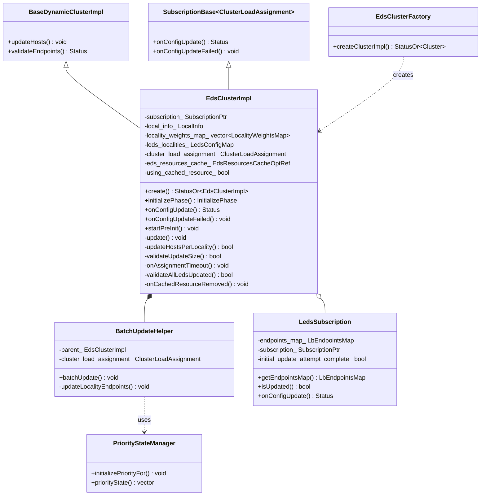
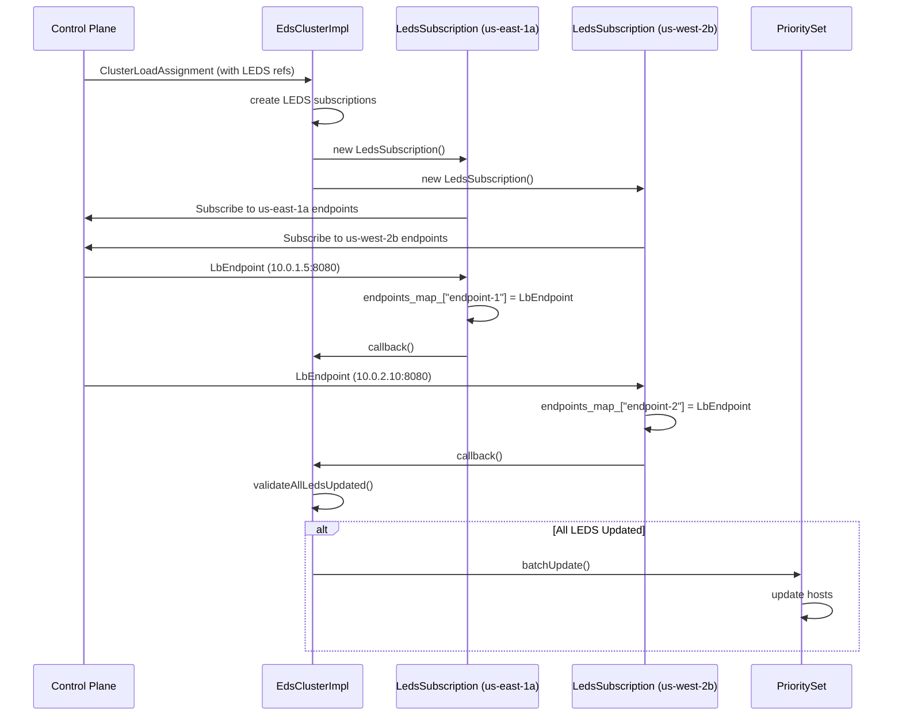
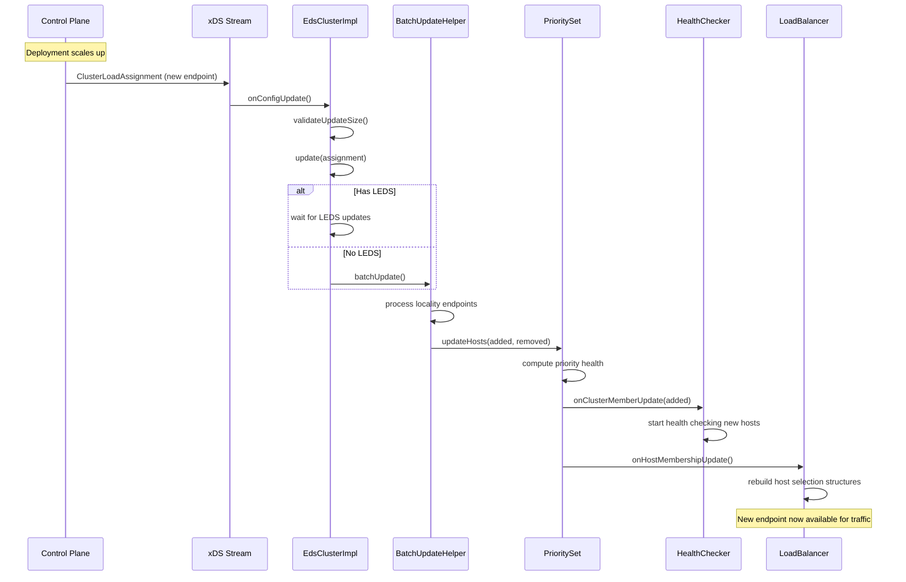
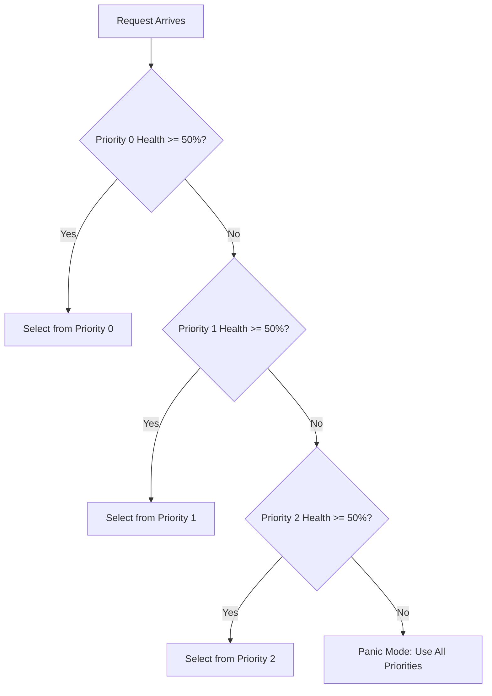

# EDS Cluster - Endpoint Discovery Service

## Table of Contents
- [Overview](#overview)
- [Architecture](#architecture)
- [Implementation Details](#implementation-details)
- [LEDS - Locality Endpoint Discovery Service](#leds---locality-endpoint-discovery-service)
- [Configuration](#configuration)
- [Endpoint Update Flow](#endpoint-update-flow)
- [Priority and Locality](#priority-and-locality)
- [Health Checking Integration](#health-checking-integration)
- [Load Balancing](#load-balancing)
- [Performance and Scaling](#performance-and-scaling)
- [Use Cases and Examples](#use-cases-and-examples)
- [Troubleshooting](#troubleshooting)
- [Best Practices](#best-practices)

## Overview

The EDS (Endpoint Discovery Service) cluster is the most commonly used cluster type in modern service mesh deployments (Istio, Consul Connect, Linkerd). It provides dynamic endpoint discovery via the xDS protocol, enabling real-time updates to backend endpoints without configuration reloads.

### Key Features

- **Real-time Updates**: Endpoints are updated via gRPC streams from the control plane
- **Priority-based Routing**: Organize endpoints into multiple priority levels for failover
- **Locality-aware Routing**: Route traffic to endpoints in the same zone/region for reduced latency
- **LEDS Support**: Locality Endpoint Discovery Service for large-scale deployments
- **Graceful Updates**: Smooth transitions during endpoint changes
- **Metadata Support**: Rich endpoint metadata for advanced routing decisions
- **Resource Caching**: Optional EDS resource caching for warming timeouts

### When to Use EDS Cluster

Use EDS cluster when:
- Deploying in a service mesh (Istio, Consul, Linkerd)
- Endpoints change frequently and need real-time updates
- Need advanced routing (priority, locality, metadata-based)
- Running cloud-native microservices with dynamic scaling
- Require gradual endpoint updates for canary deployments

## Architecture

### Class Diagram



### Component Interactions

```mermaid
sequenceDiagram
    participant CM as ClusterManager
    participant EDS as EdsClusterImpl
    participant Sub as Subscription
    participant CP as Control Plane (xDS)
    participant LEDS as LedsSubscription
    participant PS as PrioritySet
    
    CM->>EDS: create(config)
    EDS->>Sub: subscriptionFromConfigSource()
    EDS->>CM: return cluster
    
    CM->>EDS: initialize()
    EDS->>EDS: startPreInit()
    EDS->>Sub: start({service_name})
    Sub->>CP: StreamAggregatedResources
    
    CP->>Sub: ClusterLoadAssignment
    Sub->>EDS: onConfigUpdate(resources)
    
    alt Has LEDS Localities
        EDS->>LEDS: create subscriptions
        LEDS->>CP: Request locality endpoints
        CP->>LEDS: LbEndpoint updates
        LEDS->>EDS: callback()
        EDS->>EDS: validateAllLedsUpdated()
    end
    
    EDS->>EDS: update(assignment)
    EDS->>PS: batchUpdate()
    PS->>PS: updateHosts()
    EDS->>EDS: onPreInitComplete()
    EDS->>CM: initialization complete
```



## Implementation Details

### EdsClusterImpl Class

Located in `source/extensions/clusters/eds/eds.h` and `eds.cc`.

**Key Members:**

```cpp
class EdsClusterImpl : public BaseDynamicClusterImpl,
                       Envoy::Config::SubscriptionBase<ClusterLoadAssignment> {
private:
  // xDS subscription for receiving endpoint updates
  Config::SubscriptionPtr subscription_;
  
  // Local datacenter information for zone-aware routing
  const LocalInfo::LocalInfo& local_info_;
  
  // Per-priority locality weights
  std::vector<LocalityWeightsMap> locality_weights_map_;
  
  // Timer for warming timeout
  Event::TimerPtr assignment_timeout_;
  
  // Initialization phase (Primary or Secondary)
  InitializePhase initialize_phase_;
  
  // LEDS locality subscriptions (ConfigSource -> Subscription)
  LedsConfigMap leds_localities_;
  
  // Stored cluster load assignment (required for LEDS)
  std::unique_ptr<ClusterLoadAssignment> cluster_load_assignment_;
  
  // Optional EDS resource cache
  Config::EdsResourcesCacheOptRef eds_resources_cache_;
  
  // Whether using cached resource
  bool using_cached_resource_{false};
};
```

### Initialization Process

```cpp
EdsClusterImpl::EdsClusterImpl(
    const envoy::config::cluster::v3::Cluster& cluster,
    ClusterFactoryContext& cluster_context,
    absl::Status& creation_status)
    : BaseDynamicClusterImpl(cluster, cluster_context, creation_status),
      local_info_(cluster_context.serverFactoryContext().localInfo()) {
  
  // Create assignment timeout timer
  assignment_timeout_ = dispatcher.createTimer([this]() { onAssignmentTimeout(); });
  
  // Determine initialization phase
  const auto& eds_config = cluster.eds_cluster_config().eds_config();
  if (isPathBasedConfigSource(eds_config)) {
    initialize_phase_ = InitializePhase::Primary;
  } else {
    initialize_phase_ = InitializePhase::Secondary;  // Depends on xDS connection
  }
  
  // Get optional EDS resource cache
  eds_resources_cache_ = 
      cluster_context.serverFactoryContext().clusterManager().edsResourcesCache();
  
  // Create xDS subscription
  subscription_ = cluster_context.serverFactoryContext()
                      .clusterManager()
                      .subscriptionFactory()
                      .subscriptionFromConfigSource(
                          eds_config,
                          Grpc::Common::typeUrl(resource_name),
                          info_->statsScope(),
                          *this,
                          resource_decoder_,
                          {});
}

void EdsClusterImpl::startPreInit() {
  // Start xDS subscription with service name
  subscription_->start({edsServiceName()});
}
```

### Configuration Update Handling

When the control plane sends a `ClusterLoadAssignment` update:

```cpp
absl::Status EdsClusterImpl::onConfigUpdate(
    const std::vector<Config::DecodedResourceRef>& resources,
    const std::string& version_info) {
  
  // Validate update size (should be 1 resource)
  if (!validateUpdateSize(resources.size())) {
    return absl::InvalidArgumentError("Expected exactly one EDS resource");
  }
  
  // Extract ClusterLoadAssignment
  const auto& cluster_load_assignment = 
      dynamic_cast<const envoy::config::endpoint::v3::ClusterLoadAssignment&>(
          resources[0].get().resource());
  
  // Update internal state
  update(std::move(cluster_load_assignment));
  
  return absl::OkStatus();
}

void EdsClusterImpl::update(ClusterLoadAssignment&& assignment) {
  // Store assignment for LEDS localities
  cluster_load_assignment_ = 
      std::make_unique<ClusterLoadAssignment>(std::move(assignment));
  
  // Check if LEDS is configured
  bool has_leds = false;
  for (const auto& locality_lb_endpoint : cluster_load_assignment_->endpoints()) {
    if (locality_lb_endpoint.has_leds_cluster_locality_config()) {
      has_leds = true;
      const auto& leds_config = locality_lb_endpoint.leds_cluster_locality_config();
      
      // Create LEDS subscription if not exists
      if (leds_localities_.find(leds_config) == leds_localities_.end()) {
        auto leds_subscription = std::make_unique<LedsSubscription>(
            leds_config,
            info_->name(),
            factory_context_,
            info_->statsScope(),
            [this]() { 
              // Callback when LEDS locality is updated
              if (validateAllLedsUpdated()) {
                performBatchUpdate();
              }
            });
        leds_localities_[leds_config] = std::move(leds_subscription);
      }
    }
  }
  
  // If no LEDS, perform immediate batch update
  if (!has_leds || validateAllLedsUpdated()) {
    performBatchUpdate();
  }
}
```

### Batch Update Process

The `BatchUpdateHelper` orchestrates the host update process:

```cpp
class BatchUpdateHelper : public PrioritySet::BatchUpdateCb {
public:
  void batchUpdate(PrioritySet::HostUpdateCb& host_update_cb) override {
    absl::flat_hash_set<std::string> all_new_hosts;
    PriorityStateManager priority_state_manager(parent_, parent_.local_info_, 
                                                 &host_update_cb);
    
    // Process each locality endpoint
    for (const auto& locality_lb_endpoint : cluster_load_assignment_.endpoints()) {
      priority_state_manager.initializePriorityFor(locality_lb_endpoint);
      
      if (locality_lb_endpoint.has_leds_cluster_locality_config()) {
        // Get endpoints from LEDS subscription
        const auto& leds_config = locality_lb_endpoint.leds_cluster_locality_config();
        const auto it = parent_.leds_localities_.find(leds_config);
        ASSERT(it != parent_.leds_localities_.end() && it->second->isUpdated());
        
        for (const auto& [_, lb_endpoint] : it->second->getEndpointsMap()) {
          updateLocalityEndpoints(lb_endpoint, locality_lb_endpoint, 
                                  priority_state_manager, all_new_hosts);
        }
      } else {
        // Direct endpoints (not LEDS)
        for (const auto& lb_endpoint : locality_lb_endpoint.lb_endpoints()) {
          updateLocalityEndpoints(lb_endpoint, locality_lb_endpoint,
                                  priority_state_manager, all_new_hosts);
        }
      }
    }
    
    // Update hosts for each priority level
    const uint32_t overprovisioning_factor = 
        cluster_load_assignment_.policy().overprovisioning_factor();
    const bool weighted_priority_health = 
        cluster_load_assignment_.policy().weighted_priority_health();
    
    auto& priority_state = priority_state_manager.priorityState();
    for (size_t i = 0; i < priority_state.size(); ++i) {
      if (priority_state[i].first != nullptr) {
        parent_.updateHostsPerLocality(
            i, weighted_priority_health, overprovisioning_factor,
            *priority_state[i].first,
            parent_.locality_weights_map_[i],
            priority_state[i].second,
            priority_state_manager,
            *all_hosts,
            all_new_hosts);
      }
    }
  }
};
```

### Host Creation

```cpp
void BatchUpdateHelper::updateLocalityEndpoints(
    const LbEndpoint& lb_endpoint,
    const LocalityLbEndpoints& locality_lb_endpoint,
    PriorityStateManager& priority_state_manager,
    absl::flat_hash_set<std::string>& all_new_hosts) {
  
  // Extract endpoint address
  const auto& endpoint = lb_endpoint.endpoint();
  const auto& socket_address = endpoint.address().socket_address();
  
  // Create or find existing host
  auto address = Network::Utility::parseInternetAddress(
      socket_address.address(), socket_address.port_value());
  
  HostSharedPtr host;
  if (existing_host_map.find(address->asString()) != existing_host_map.end()) {
    // Reuse existing host
    host = existing_host_map[address->asString()];
  } else {
    // Create new host
    host = std::make_shared<HostImpl>(
        parent_.info(),
        endpoint.hostname(),
        address,
        std::make_shared<Metadata>(lb_endpoint.metadata()),
        std::make_shared<Metadata>(locality_lb_endpoint.metadata()),
        lb_endpoint.load_balancing_weight().value(),
        std::make_shared<Locality>(locality_lb_endpoint.locality()),
        endpoint.health_check_config(),
        locality_lb_endpoint.priority(),
        lb_endpoint.health_status());
    
    all_new_hosts.insert(address->asString());
  }
  
  // Add to priority state manager
  priority_state_manager.registerHostForPriority(host, locality_lb_endpoint);
}
```

## LEDS - Locality Endpoint Discovery Service

LEDS (Locality Endpoint Discovery Service) is an optimization for large EDS deployments. Instead of sending all endpoints in a single `ClusterLoadAssignment`, endpoints are grouped by locality and fetched via separate subscriptions.

### Why LEDS?

**Problem**: In a large global deployment with thousands of endpoints across many regions, sending all endpoints to every proxy wastes bandwidth and memory.

**Solution**: LEDS allows endpoints to be fetched per-locality. Each proxy only subscribes to localities it needs (e.g., same region + failover regions).

### LEDS Architecture


### LEDS Configuration Example

**Control Plane sends ClusterLoadAssignment with LEDS references:**

```protobuf
cluster_name: "my-service"
endpoints:
- locality:
    region: "us-east-1"
    zone: "us-east-1a"
  leds_cluster_locality_config:
    leds_config:
      api_config_source:
        api_type: GRPC
        grpc_services:
        - envoy_grpc:
            cluster_name: xds_cluster
    leds_collection_name: "xdstp://authority/envoy.config.endpoint.v3.LbEndpoint/my-service/us-east-1a"
  priority: 0
  load_balancing_weight: 100

- locality:
    region: "us-west-2"
    zone: "us-west-2b"
  leds_cluster_locality_config:
    leds_config:
      api_config_source:
        api_type: GRPC
        grpc_services:
        - envoy_grpc:
            cluster_name: xds_cluster
    leds_collection_name: "xdstp://authority/envoy.config.endpoint.v3.LbEndpoint/my-service/us-west-2b"
  priority: 1
  load_balancing_weight: 50
```

**Control Plane then sends individual LbEndpoint resources:**

```protobuf
# Resource name: "xdstp://authority/envoy.config.endpoint.v3.LbEndpoint/my-service/us-east-1a/endpoint-1"
endpoint:
  address:
    socket_address:
      address: "10.0.1.5"
      port_value: 8080
health_status: HEALTHY
load_balancing_weight: 1
```

### LedsSubscription Class

```cpp
class LedsSubscription : private SubscriptionBase<LbEndpoint> {
public:
  using LbEndpointsMap = absl::flat_hash_map<std::string, LbEndpoint>;
  using UpdateCb = std::function<void()>;
  
  LedsSubscription(
      const LedsClusterLocalityConfig& leds_config,
      const std::string& cluster_name,
      Server::Configuration::TransportSocketFactoryContext& factory_context,
      Stats::Scope& stats_scope,
      const UpdateCb& callback);
  
  // Get all endpoints for this locality
  const LbEndpointsMap& getEndpointsMap() const { return endpoints_map_; }
  
  // Check if initial update received
  bool isUpdated() const { return initial_update_attempt_complete_; }
  
private:
  absl::Status onConfigUpdate(
      const std::vector<Config::DecodedResourceRef>& added_resources,
      const Protobuf::RepeatedPtrField<std::string>& removed_resources,
      const std::string&) override {
    
    // Add new endpoints
    for (const auto& resource : added_resources) {
      const auto& lb_endpoint = 
          dynamic_cast<const LbEndpoint&>(resource.get().resource());
      endpoints_map_[resource.get().name()] = lb_endpoint;
    }
    
    // Remove old endpoints
    for (const auto& removed : removed_resources) {
      endpoints_map_.erase(removed);
    }
    
    initial_update_attempt_complete_ = true;
    
    // Notify parent cluster
    callback_();
    
    return absl::OkStatus();
  }
  
  LbEndpointsMap endpoints_map_;
  const UpdateCb callback_;
  bool initial_update_attempt_complete_{false};
  Config::SubscriptionPtr subscription_;
};
```

### LEDS Update Flow



## Configuration

### Basic EDS Configuration

```yaml
clusters:
- name: my_service
  type: EDS
  connect_timeout: 1s
  
  # EDS configuration
  eds_cluster_config:
    # Service name for EDS (defaults to cluster name)
    service_name: my-service-v1
    
    # EDS config source
    eds_config:
      resource_api_version: V3
      api_config_source:
        api_type: GRPC
        transport_api_version: V3
        grpc_services:
        - envoy_grpc:
            cluster_name: xds_cluster
        set_node_on_first_message_only: true
  
  # Warming timeout (how long to wait for initial endpoints)
  cluster_warming_timeout: 30s
```

### EDS with ADS (Aggregated Discovery Service)

```yaml
clusters:
- name: my_service
  type: EDS
  eds_cluster_config:
    eds_config:
      resource_api_version: V3
      ads: {}  # Use Aggregated Discovery Service
```

ADS multiplexes multiple xDS resource types over a single gRPC stream, reducing connections to the control plane.

### EDS with Locality-Aware Routing

```yaml
clusters:
- name: my_service
  type: EDS
  eds_cluster_config:
    eds_config:
      ads: {}
  
  # Locality-weighted load balancing
  common_lb_config:
    locality_weighted_lb_config: {}
    
    # Zone-aware routing (prefer same zone)
    zone_aware_lb_config:
      # Enable when >= 3 hosts in local zone
      routing_enabled:
        default: 100
        runtime_key: routing.zone_aware_routing_enabled
      min_cluster_size: 3
      
      # Percentage of requests to fail over to other zones
      fail_traffic_on_panic: true
```

### EDS with Priority-Based Routing

Priority-based routing is configured via the `ClusterLoadAssignment` from the control plane:

```protobuf
cluster_name: "my-service"
endpoints:
- locality:
    region: "us-east-1"
  priority: 0  # Highest priority
  lb_endpoints:
  - endpoint:
      address:
        socket_address:
          address: "10.0.1.5"
          port_value: 8080
    health_status: HEALTHY

- locality:
    region: "us-west-2"
  priority: 1  # Failover
  lb_endpoints:
  - endpoint:
      address:
        socket_address:
          address: "10.0.2.10"
          port_value: 8080
    health_status: HEALTHY

policy:
  overprovisioning_factor: 140  # 40% overprovisioning
  weighted_priority_health: true
```

### EDS with Overprovisioning Factor

The `overprovisioning_factor` determines how much extra capacity a priority level should have before failing over to the next priority:

```
Effective Priority Health = (Healthy Hosts / Total Hosts) * (overprovisioning_factor / 100)
```

Example:
- Priority 0 has 7 healthy out of 10 hosts
- overprovisioning_factor = 140 (140%)
- Effective health = (7/10) * (140/100) = 0.98 (98%)
- If 98% >= healthy_panic_threshold (default 50%), traffic stays in priority 0

### EDS with Endpoint Metadata

Endpoints can have metadata for advanced routing:

```protobuf
lb_endpoints:
- endpoint:
    address:
      socket_address:
        address: "10.0.1.5"
        port_value: 8080
  metadata:
    filter_metadata:
      envoy.lb:
        version: "v2"
        canary: true
  load_balancing_weight: 10
```

This metadata can be used by:
- Subset load balancing
- Custom load balancer implementations
- Filter logic (match, rate limit, etc.)

## Endpoint Update Flow

### Real-time Update Sequence



### Graceful Host Addition

1. **New Host Added**: Control plane sends updated `ClusterLoadAssignment`
2. **Batch Update**: Envoy processes all changes in a batch
3. **Health Check**: New host is health checked before receiving traffic
4. **Load Balancer Update**: Host is added to load balancer rotation
5. **Traffic Ramp-up**: Gradual traffic increase based on load balancing algorithm

### Graceful Host Removal

1. **Host Removed**: Control plane removes endpoint from `ClusterLoadAssignment`
2. **Batch Update**: Envoy marks host for removal
3. **Connection Draining**: Existing connections are allowed to complete
4. **Load Balancer Update**: Host is removed from selection pool
5. **Health Check Cleanup**: Health checking stops

### Handling Configuration Failures

```cpp
void EdsClusterImpl::onConfigUpdateFailed(
    Envoy::Config::ConfigUpdateFailureReason reason,
    const EnvoyException* e) {
  
  ENVOY_LOG(warn, "EDS config update failed: {} for cluster {}",
            reason, info_->name());
  
  // Check if we have a cached resource
  if (eds_resources_cache_.has_value() && !using_cached_resource_) {
    auto cached = eds_resources_cache_->getResource(edsServiceName());
    if (cached.has_value()) {
      ENVOY_LOG(info, "Using cached EDS resource for cluster {}", info_->name());
      update(std::move(cached.value()));
      using_cached_resource_ = true;
      return;
    }
  }
  
  // No cached resource available, remain with current endpoints
  info_->configUpdateStats().update_failure_.inc();
}
```

## Priority and Locality

### Priority Levels

Envoy supports multiple priority levels (0 = highest, increasing numbers = lower priority). Traffic is routed to the highest healthy priority level.

**Priority Selection Algorithm:**
1. Calculate health percentage for each priority: `(healthy_hosts / total_hosts) * overprovisioning_factor`
2. If health >= `healthy_panic_threshold` (default 50%), use this priority
3. Otherwise, fail over to next priority
4. If all priorities panic, distribute traffic across all priorities (panic mode)



### Locality-Aware Routing

Locality-aware routing reduces cross-zone/region latency by preferring endpoints in the same locality.

**Locality Structure:**
```protobuf
message Locality {
  string region = 1;     // e.g., "us-east-1"
  string zone = 2;       // e.g., "us-east-1a"
  string sub_zone = 3;   // e.g., "rack-5"
}
```

**Zone-Aware Routing Algorithm:**
1. If local zone has >= `min_cluster_size` healthy hosts, prefer local zone
2. Route `routing_enabled` percentage of traffic to local zone
3. Route remaining traffic to other zones (weighted by zone health)

**Example:**
- Local zone: us-east-1a (5 healthy hosts out of 10 total)
- Remote zone: us-east-1b (8 healthy hosts out of 10 total)
- `routing_enabled` = 80%
- `min_cluster_size` = 3

Result:
- 80% of traffic goes to us-east-1a (local)
- 20% of traffic goes to us-east-1b (remote)

### Weighted Locality Load Balancing

```protobuf
endpoints:
- locality:
    region: "us-east-1"
    zone: "us-east-1a"
  load_balancing_weight: 100
  lb_endpoints: [...]

- locality:
    region: "us-east-1"
    zone: "us-east-1b"
  load_balancing_weight: 50
  lb_endpoints: [...]
```

Traffic is distributed proportionally:
- us-east-1a: 100/(100+50) = 66.7% of traffic
- us-east-1b: 50/(100+50) = 33.3% of traffic

## Health Checking Integration

EDS clusters fully support active and passive health checking.

### Active Health Checking

```yaml
clusters:
- name: my_service
  type: EDS
  eds_cluster_config:
    eds_config:
      ads: {}
  
  # Active health checks
  health_checks:
  - timeout: 1s
    interval: 10s
    unhealthy_threshold: 3
    healthy_threshold: 2
    http_health_check:
      path: /healthz
      expected_statuses:
      - start: 200
        end: 300
```

**Health Check Flow:**
1. EDS updates add/remove hosts
2. Health checker starts checking new hosts
3. Host health status affects load balancer selection
4. Unhealthy hosts are removed from rotation (but not from priority set)

### Passive Health Checking (Outlier Detection)

```yaml
clusters:
- name: my_service
  type: EDS
  eds_cluster_config:
    eds_config:
      ads: {}
  
  # Outlier detection (passive health checking)
  outlier_detection:
    consecutive_5xx: 5
    interval: 30s
    base_ejection_time: 30s
    max_ejection_percent: 50
    enforcing_consecutive_5xx: 100
```

**Outlier Detection Flow:**
1. Host returns 5 consecutive 5xx errors
2. Host is ejected for `base_ejection_time`
3. Ejection time increases exponentially for repeated ejections
4. At most `max_ejection_percent` of hosts can be ejected

### EDS Health Status

The control plane can set health status in the `ClusterLoadAssignment`:

```protobuf
lb_endpoints:
- endpoint:
    address:
      socket_address:
        address: "10.0.1.5"
        port_value: 8080
  health_status: DEGRADED  # UNKNOWN, HEALTHY, UNHEALTHY, DRAINING, TIMEOUT, DEGRADED
```

**Health Status Semantics:**
- `HEALTHY`: Host is healthy and receives traffic
- `UNHEALTHY`: Host is unhealthy, no traffic
- `DEGRADED`: Host is partially degraded, reduced traffic
- `DRAINING`: Host is being drained, no new connections
- `TIMEOUT`: Health check timed out
- `UNKNOWN`: Health status unknown (treated as healthy by default)

## Load Balancing

EDS clusters support all Envoy load balancing algorithms:

### Round Robin (default)

```yaml
clusters:
- name: my_service
  type: EDS
  lb_policy: ROUND_ROBIN
```

### Least Request

```yaml
clusters:
- name: my_service
  type: EDS
  lb_policy: LEAST_REQUEST
  least_request_lb_config:
    choice_count: 2  # P2C (Power of 2 Choices)
    active_request_bias:
      runtime_key: least_request.active_request_bias
      default_value: 1.0
```

### Ring Hash (Consistent Hashing)

```yaml
clusters:
- name: my_service
  type: EDS
  lb_policy: RING_HASH
  ring_hash_lb_config:
    minimum_ring_size: 1024
    maximum_ring_size: 8192
    hash_function: XX_HASH
```

### Maglev (Consistent Hashing)

```yaml
clusters:
- name: my_service
  type: EDS
  lb_policy: MAGLEV
  maglev_lb_config:
    table_size: 65537
```

### Random

```yaml
clusters:
- name: my_service
  type: EDS
  lb_policy: RANDOM
```

### Subset Load Balancing

Route to specific subsets based on metadata:

```yaml
clusters:
- name: my_service
  type: EDS
  lb_policy: ROUND_ROBIN
  lb_subset_config:
    fallback_policy: ANY_ENDPOINT
    subset_selectors:
    - keys:
      - version
    - keys:
      - version
      - stage
```

**Route to subset:**
```yaml
routes:
- match:
    prefix: "/v2/"
  route:
    cluster: my_service
    metadata_match:
      filter_metadata:
        envoy.lb:
          version: "v2"
```

## Performance and Scaling

### Memory Usage

**Per-Host Memory:**
- Host object: ~1-2 KB
- Metadata: Variable (typically 100-500 bytes)
- Health check state: ~100 bytes
- Load balancer state: ~50 bytes per LB algorithm

**Total for 1000 hosts:** ~1.5-2.5 MB

### LEDS Memory Benefits

**Without LEDS** (10,000 endpoints, 10 regions):
- Each Envoy receives all 10,000 endpoints
- Memory per Envoy: ~20 MB

**With LEDS** (same scenario, but only local + 1 failover region):
- Each Envoy receives ~2,000 endpoints (local + failover)
- Memory per Envoy: ~4 MB
- **80% memory reduction**

### xDS Stream Efficiency

**Update Frequency:**
- Typical: 1-10 updates/minute during normal operation
- Scale events: 10-100 updates/minute
- Stream overhead: ~1 KB/update for average ClusterLoadAssignment

**Bandwidth:**
- Normal: ~10-100 KB/minute
- Scale event: ~1-10 MB/minute (burst)

### CPU Usage

**Update Processing:**
- Parse ClusterLoadAssignment: ~0.1-1 ms (depends on size)
- Batch update: ~0.1-0.5 ms per 1000 hosts
- Load balancer rebuild: ~0.1-1 ms

**Request Path:**
- Load balancer host selection: ~100-500 ns (O(1) for most algorithms)
- Priority/locality selection: ~50-200 ns

## Use Cases and Examples

### Use Case 1: Istio Service Mesh

```yaml
clusters:
- name: outbound|8080||my-service.default.svc.cluster.local
  type: EDS
  eds_cluster_config:
    service_name: outbound|8080||my-service.default.svc.cluster.local
    eds_config:
      ads: {}
  
  # Istio typically uses locality-weighted LB
  common_lb_config:
    locality_weighted_lb_config: {}
  
  # Circuit breaker
  circuit_breakers:
    thresholds:
    - max_connections: 1024
      max_requests: 1024
```

**Control Plane sends:**
```protobuf
cluster_name: "outbound|8080||my-service.default.svc.cluster.local"
endpoints:
- locality:
    region: "us-east-1"
    zone: "us-east-1a"
  lb_endpoints:
  - endpoint:
      address:
        socket_address:
          address: "10.244.1.5"
          port_value: 8080
    metadata:
      filter_metadata:
        istio:
          workload: "my-service-v1"
```

### Use Case 2: Multi-Region Failover

```yaml
clusters:
- name: api_service
  type: EDS
  eds_cluster_config:
    eds_config:
      ads: {}
  
  # Panic threshold - fail over if < 30% healthy
  common_lb_config:
    healthy_panic_threshold:
      value: 30.0
```

**Control Plane configuration:**
```protobuf
cluster_name: "api_service"
endpoints:
- locality:
    region: "us-east-1"
  priority: 0  # Primary
  lb_endpoints: [10 endpoints in us-east-1]

- locality:
    region: "us-west-2"
  priority: 1  # Failover
  lb_endpoints: [10 endpoints in us-west-2]

policy:
  overprovisioning_factor: 140
```

**Behavior:**
- Normal: All traffic to us-east-1
- 6+ hosts unhealthy in us-east-1: Fail over to us-west-2
- All us-east-1 hosts unhealthy: 100% traffic to us-west-2

### Use Case 3: Canary Deployment

```yaml
clusters:
- name: my_service
  type: EDS
  eds_cluster_config:
    eds_config:
      ads: {}
  lb_subset_config:
    fallback_policy: NO_FALLBACK
    subset_selectors:
    - keys: ["version"]
```

**Route configuration:**
```yaml
routes:
# 95% to stable
- match:
    prefix: "/"
    headers:
    - name: "x-canary"
      present_match: false
  route:
    cluster: my_service
    metadata_match:
      filter_metadata:
        envoy.lb:
          version: "stable"

# 5% to canary
- match:
    prefix: "/"
    headers:
    - name: "x-canary"
      string_match:
        exact: "true"
  route:
    cluster: my_service
    metadata_match:
      filter_metadata:
        envoy.lb:
          version: "canary"
```

**Control Plane:**
```protobuf
cluster_name: "my_service"
endpoints:
- lb_endpoints:
  - endpoint: {address: "10.0.1.1:8080"}
    metadata:
      filter_metadata:
        envoy.lb:
          version: "stable"
  - endpoint: {address: "10.0.1.2:8080"}
    metadata:
      filter_metadata:
        envoy.lb:
          version: "canary"
```

## Troubleshooting

### Issue: Cluster not receiving endpoints

**Symptoms:**
- `cluster.<name>.membership_total` stat is 0
- `cluster.<name>.upstream_cx_total` is 0
- Requests fail with 503 Service Unavailable

**Debug steps:**

1. Check if xDS stream is connected:
```bash
curl localhost:15000/stats | grep "control_plane.connected_state"
# Should be 1
```

2. Check EDS subscription status:
```bash
curl localhost:15000/config_dump | jq '.configs[] | select(.["@type"]=="type.googleapis.com/envoy.admin.v3.ClustersConfigDump") | .dynamic_active_clusters'
```

3. Check control plane logs for EDS resource generation

4. Verify `service_name` matches what control plane is sending

**Solutions:**
- Ensure control plane is running and accessible
- Verify `eds_cluster_config.service_name` is correct
- Check network connectivity to xDS cluster
- Increase `cluster_warming_timeout` if initial endpoints are slow

### Issue: Endpoints not updating

**Symptoms:**
- Old endpoints still receive traffic after scale-down
- New endpoints not receiving traffic after scale-up
- `cluster.<name>.update_success` stat not incrementing

**Debug steps:**

1. Check xDS stream status:
```bash
curl localhost:15000/stats | grep "cluster.<xds_cluster>.upstream_cx_active"
# Should be > 0
```

2. Check for configuration errors:
```bash
curl localhost:15000/stats | grep "cluster.<name>.update_rejected"
# Should be 0
```

3. Verify control plane is sending updates:
- Check control plane logs
- Use control plane debug endpoints

**Solutions:**
- Check control plane health
- Verify xDS stream hasn't disconnected
- Look for validation errors in Envoy logs
- Ensure EDS resource version is incrementing

### Issue: Uneven traffic distribution

**Symptoms:**
- Some endpoints receive no traffic
- Other endpoints are overloaded
- Locality-aware routing not working

**Debug steps:**

1. Check endpoint health:
```bash
curl localhost:15000/clusters | grep "my_service"
# Look for health flags
```

2. Verify load balancing configuration:
```bash
curl localhost:15000/config_dump | jq '.configs[] | select(.["@type"]=="type.googleapis.com/envoy.admin.v3.ClustersConfigDump") | .dynamic_active_clusters[] | select(.cluster.name=="my_service") | .cluster.lb_policy'
```

3. Check locality weights:
```bash
curl localhost:15000/config_dump | jq '.configs[] | select(.["@type"]=="type.googleapis.com/envoy.admin.v3.EndpointsConfigDump")'
```

**Solutions:**
- Verify all endpoints are healthy
- Check `load_balancing_weight` in ClusterLoadAssignment
- Ensure locality weights are set correctly
- Review load balancing algorithm (ROUND_ROBIN vs LEAST_REQUEST)

### Issue: High memory usage

**Symptoms:**
- Envoy memory usage grows over time
- OOM kills in production

**Debug steps:**

1. Count total endpoints:
```bash
curl localhost:15000/stats | grep "cluster.*.membership_total"
```

2. Check for duplicate hosts:
```bash
curl localhost:15000/clusters | wc -l
```

**Solutions:**
- Enable LEDS for large deployments
- Reduce number of clusters
- Use aggregate clusters to share endpoints
- Configure `max_hosts` limits

### Issue: LEDS localities not updating

**Symptoms:**
- `cluster.<name>.leds.<locality>.update_empty` incrementing
- Missing endpoints from specific localities

**Debug steps:**

1. Check LEDS subscription status:
```bash
curl localhost:15000/stats | grep "cluster.<name>.leds"
```

2. Verify LEDS collection names:
```bash
curl localhost:15000/config_dump | jq '.configs[] | select(.["@type"]=="type.googleapis.com/envoy.admin.v3.EndpointsConfigDump")'
```

**Solutions:**
- Verify LEDS collection names are correct
- Check control plane LEDS implementation
- Ensure xDS stream is healthy
- Validate `leds_cluster_locality_config` in ClusterLoadAssignment

## Best Practices

### 1. Use ADS when possible

**Why:** Reduces number of gRPC streams to control plane, improves consistency.

```yaml
eds_cluster_config:
  eds_config:
    ads: {}  # Use Aggregated Discovery Service
```

### 2. Set appropriate warming timeout

**Why:** Allows time for initial endpoint discovery without blocking cluster initialization.

```yaml
cluster_warming_timeout: 30s  # Adjust based on control plane latency
```

### 3. Enable zone-aware routing

**Why:** Reduces cross-zone traffic, improves latency and cost.

```yaml
common_lb_config:
  zone_aware_lb_config:
    routing_enabled:
      default: 100
    min_cluster_size: 3
```

### 4. Configure health checks

**Why:** Prevents traffic to unhealthy endpoints.

```yaml
health_checks:
- timeout: 1s
  interval: 10s
  unhealthy_threshold: 3
  healthy_threshold: 2
  http_health_check:
    path: /healthz
```

### 5. Use LEDS for large deployments

**Why:** Reduces memory usage and xDS bandwidth.

**When:** 1000+ endpoints, multi-region deployment

### 6. Set circuit breakers

**Why:** Protects upstream services from overload.

```yaml
circuit_breakers:
  thresholds:
  - max_connections: 1024
    max_requests: 1024
    max_pending_requests: 1024
```

### 7. Configure appropriate priorities

**Why:** Enables graceful failover between regions/datacenters.

```yaml
policy:
  overprovisioning_factor: 140
  weighted_priority_health: true
```

### 8. Monitor EDS statistics

**Key metrics:**
- `cluster.<name>.membership_total`
- `cluster.<name>.membership_healthy`
- `cluster.<name>.update_success`
- `cluster.<name>.update_rejected`
- `cluster.<name>.update_failure`

### 9. Use outlier detection

**Why:** Automatically ejects unhealthy hosts without explicit health checks.

```yaml
outlier_detection:
  consecutive_5xx: 5
  interval: 30s
  base_ejection_time: 30s
```

### 10. Tune overprovisioning factor

**Why:** Controls failover behavior.

- **Low (100-110):** Aggressive failover, better availability
- **High (140-200):** Conservative failover, reduced cross-region traffic

### 11. Use weighted_priority_health

**Why:** Considers both healthy percentage and overprovisioning.

```yaml
policy:
  weighted_priority_health: true
```

### 12. Configure proper lb_policy

**Why:** Different workloads need different load balancing.

- **ROUND_ROBIN**: General purpose
- **LEAST_REQUEST**: Variable request latency
- **RING_HASH/MAGLEV**: Session affinity, caching

---

## Related Documentation

- [Cluster Overview](../CLUSTERS_OVERVIEW.md)
- [LEDS Implementation](leds.h)
- [Upstream Envoy EDS Documentation](https://www.envoyproxy.io/docs/envoy/latest/intro/arch_overview/upstream/service_discovery#endpoint-discovery-service-eds)
- [xDS Protocol](https://www.envoyproxy.io/docs/envoy/latest/api-docs/xds_protocol)

## Source Files

- `source/extensions/clusters/eds/eds.h` - EdsClusterImpl header
- `source/extensions/clusters/eds/eds.cc` - EdsClusterImpl implementation
- `source/extensions/clusters/eds/leds.h` - LedsSubscription header
- `source/extensions/clusters/eds/leds.cc` - LedsSubscription implementation
