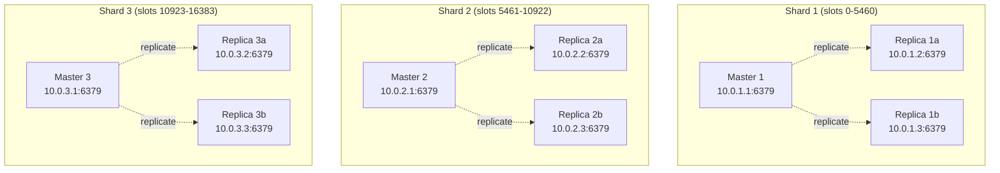
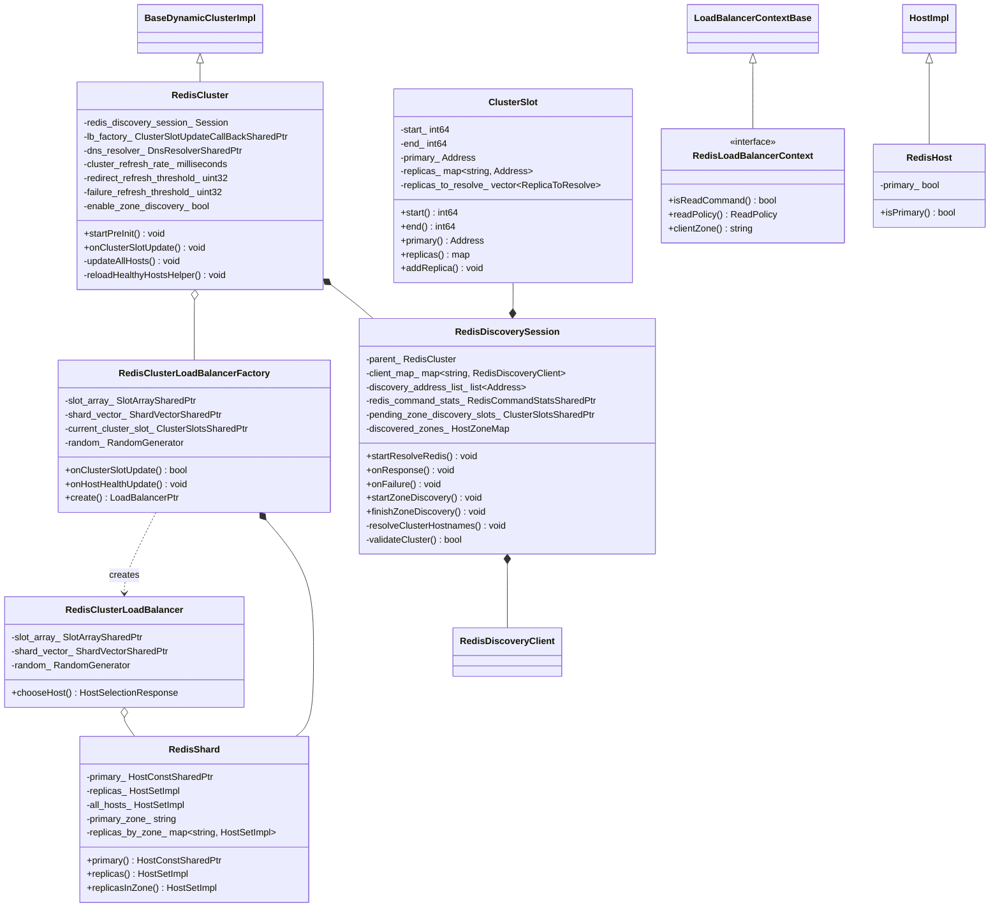
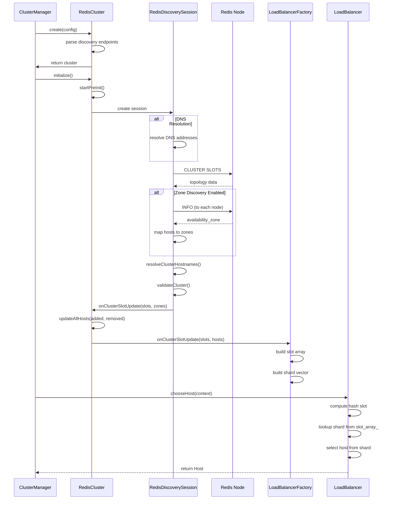
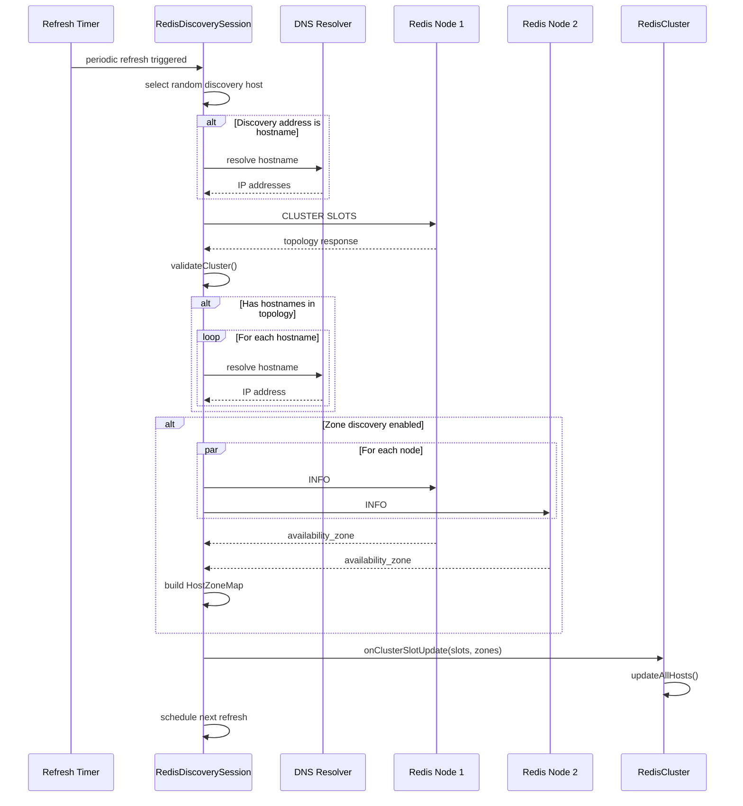
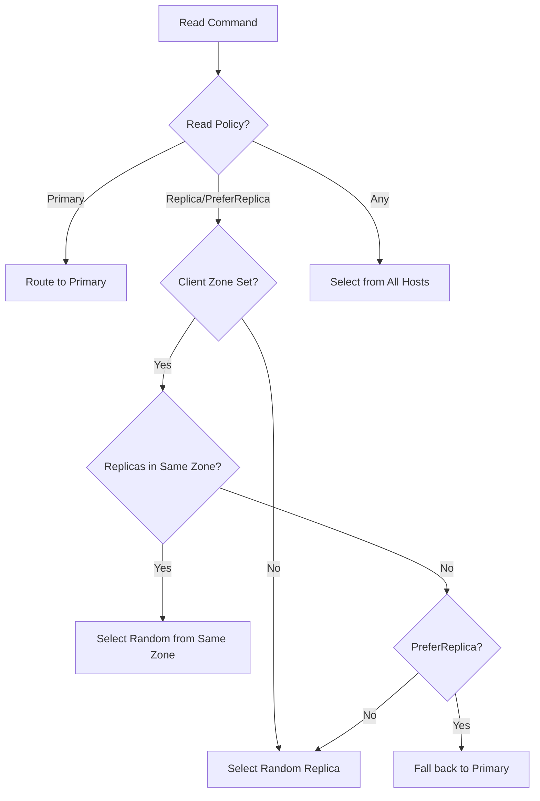

# Redis Cluster Support

## Table of Contents
- [Overview](#overview)
- [Redis Cluster Protocol](#redis-cluster-protocol)
- [Architecture](#architecture)
- [Implementation Details](#implementation-details)
- [Topology Discovery](#topology-discovery)
- [Hash Slot Routing](#hash-slot-routing)
- [Load Balancing](#load-balancing)
- [Zone-Aware Routing](#zone-aware-routing)
- [Connection Management](#connection-management)
- [Configuration](#configuration)
- [Failover and Redirects](#failover-and-redirects)
- [Performance](#performance)
- [Use Cases and Examples](#use-cases-and-examples)
- [Troubleshooting](#troubleshooting)
- [Best Practices](#best-practices)

## Overview

The Redis Cluster extension provides native support for Redis Cluster mode, which distributes data across multiple Redis nodes using consistent hashing with 16384 hash slots. This implementation handles topology discovery, command routing, replica reads, and failover transparently.

### Key Features

- **Topology Discovery**: Automatic discovery via `CLUSTER SLOTS` command
- **Hash Slot Routing**: CRC16-based command routing to correct shard
- **Replica Reads**: Support for read commands from replicas
- **Zone-Aware Routing**: Route reads to replicas in the same availability zone
- **Redirect Handling**: Automatic handling of MOVED and ASK redirects
- **Automatic Refresh**: Periodic and redirect-triggered topology updates
- **Connection Pooling**: Efficient connection management per shard
- **Failover Support**: Automatic failover to replicas

### When to Use Redis Cluster

Use Redis Cluster extension when:
- Running Redis in cluster mode (16384 hash slots)
- Need automatic sharding across multiple Redis nodes
- Require high availability with replica failover
- Want to scale Redis horizontally
- Need zone-aware replica routing for reduced latency

## Redis Cluster Protocol

### Data Distribution

Redis Cluster distributes keys across 16384 hash slots:

```
Hash Slot = CRC16(key) % 16384
```

Each Redis master node is responsible for a subset of hash slots:

```
Node A: slots 0-5460     (5461 slots)
Node B: slots 5461-10922 (5462 slots)
Node C: slots 10923-16383(5461 slots)
```

### Hash Tags

Hash tags allow related keys to be stored in the same slot:

```
{user:1000}.profile   -> Hash on "user:1000"
{user:1000}.settings  -> Hash on "user:1000"
user:1000.cart        -> Hash on entire key
```

Format: `{...}` - only content inside braces is hashed.

### Cluster Topology



### CLUSTER SLOTS Command

Envoy queries Redis using `CLUSTER SLOTS` to discover topology:

```
> CLUSTER SLOTS
1) 1) (integer) 0           # Start slot
   2) (integer) 5460        # End slot
   3) 1) "10.0.1.1"         # Master IP
      2) (integer) 6379     # Master port
      3) "master-id-1"      # Master node ID
   4) 1) "10.0.1.2"         # Replica IP
      2) (integer) 6379     # Replica port
      3) "replica-id-1a"    # Replica node ID
   5) 1) "10.0.1.3"
      2) (integer) 6379
      3) "replica-id-1b"
```

### Redirects

Redis responds with redirects when a key is on a different node:

**MOVED**: Permanent redirect (topology changed)
```
-MOVED 3999 10.0.2.1:6379
```

**ASK**: Temporary redirect (migration in progress)
```
-ASK 3999 10.0.2.1:6379
```

## Architecture

### Class Diagram



### Component Interaction



## Implementation Details

### RedisCluster Class

Located in `source/extensions/clusters/redis/redis_cluster.h` and `redis_cluster.cc`.

**Key Members:**

```cpp
class RedisCluster : public BaseDynamicClusterImpl {
private:
  // Cluster manager for host management
  Upstream::ClusterManager& cluster_manager_;
  
  // Refresh intervals
  const std::chrono::milliseconds cluster_refresh_rate_;
  const std::chrono::milliseconds cluster_refresh_timeout_;
  const std::chrono::milliseconds redirect_refresh_interval_;
  
  // Refresh thresholds
  const uint32_t redirect_refresh_threshold_;
  const uint32_t failure_refresh_threshold_;
  const uint32_t host_degraded_refresh_threshold_;
  
  // DNS resolver for discovery endpoints
  Network::DnsResolverSharedPtr dns_resolver_;
  
  // Discovery session
  std::shared_ptr<RedisDiscoverySession> redis_discovery_session_;
  
  // Load balancer factory (receives topology updates)
  const ClusterSlotUpdateCallBackSharedPtr lb_factory_;
  
  // Current hosts
  Upstream::HostVector hosts_;
  
  // Authentication
  const std::string auth_username_;
  const std::string auth_password_;
  
  // Zone discovery flag
  const bool enable_zone_discovery_;
};
```

### Initialization

```cpp
RedisCluster::RedisCluster(
    const envoy::config::cluster::v3::Cluster& cluster,
    const RedisClusterConfig& redis_cluster,
    ClusterFactoryContext& context,
    NetworkFilters::Common::Redis::Client::ClientFactory& client_factory,
    Network::DnsResolverSharedPtr dns_resolver,
    ClusterSlotUpdateCallBackSharedPtr factory,
    absl::Status& creation_status)
    : BaseDynamicClusterImpl(cluster, context, creation_status),
      cluster_manager_(context.serverFactoryContext().clusterManager()),
      cluster_refresh_rate_(
          PROTOBUF_GET_MS_OR_DEFAULT(redis_cluster, cluster_refresh_rate, 5000)),
      cluster_refresh_timeout_(
          PROTOBUF_GET_MS_OR_DEFAULT(redis_cluster, cluster_refresh_timeout, 3000)),
      redirect_refresh_interval_(
          PROTOBUF_GET_MS_OR_DEFAULT(redis_cluster, redirect_refresh_interval, 5000)),
      redirect_refresh_threshold_(
          PROTOBUF_GET_WRAPPED_OR_DEFAULT(redis_cluster, redirect_refresh_threshold, 5)),
      dns_resolver_(std::move(dns_resolver)),
      lb_factory_(std::move(factory)),
      enable_zone_discovery_(redis_cluster.enable_zone_discovery()) {
  
  // Parse discovery endpoints from load_assignment
  for (const auto& locality_lb_endpoint : load_assignment_.endpoints()) {
    for (const auto& lb_endpoint : locality_lb_endpoint.lb_endpoints()) {
      const auto& socket_address = lb_endpoint.endpoint().address().socket_address();
      
      // Create DNS discovery targets
      auto target = std::make_unique<DnsDiscoveryResolveTarget>(
          *this, socket_address.address(), socket_address.port_value());
      dns_discovery_resolve_targets_.push_back(std::move(target));
    }
  }
  
  // Create discovery session
  redis_discovery_session_ = std::make_shared<RedisDiscoverySession>(
      *this, client_factory);
}

void RedisCluster::startPreInit() {
  // Start DNS resolution for discovery endpoints
  for (auto& target : dns_discovery_resolve_targets_) {
    target->startResolveDns();
  }
}
```

### RedisDiscoverySession

Manages topology discovery and updates:

```cpp
struct RedisDiscoverySession : 
    public NetworkFilters::Common::Redis::Client::Config,
    public NetworkFilters::Common::Redis::Client::ClientCallbacks {
  
  // Parent cluster
  RedisCluster& parent_;
  
  // Dispatcher for timers
  Event::Dispatcher& dispatcher_;
  
  // Current discovery host
  std::string current_host_address_;
  
  // Active request
  Extensions::NetworkFilters::Common::Redis::Client::PoolRequest* current_request_{};
  
  // Redis clients (one per discovered node)
  absl::node_hash_map<std::string, RedisDiscoveryClientPtr> client_map_;
  
  // Discovery addresses from DNS
  std::list<Network::Address::InstanceConstSharedPtr> discovery_address_list_;
  
  // Periodic refresh timer
  Event::TimerPtr resolve_timer_;
  
  // Client factory
  NetworkFilters::Common::Redis::Client::ClientFactory& client_factory_;
  
  // Zone discovery state
  ClusterSlotsSharedPtr pending_zone_discovery_slots_;
  std::atomic<uint32_t> pending_zone_requests_{0};
  absl::node_hash_map<std::string, ZoneDiscoveryCallbackPtr> zone_callbacks_;
  HostZoneMap discovered_zones_;
};
```

## Topology Discovery

### Discovery Process



### CLUSTER SLOTS Processing

```cpp
void RedisDiscoverySession::onResponse(
    NetworkFilters::Common::Redis::RespValuePtr&& value) {
  
  // Validate response
  if (!validateCluster(*value)) {
    onFailure();
    return;
  }
  
  // Parse CLUSTER SLOTS response
  auto slots = std::make_shared<std::vector<ClusterSlot>>();
  auto hostname_resolution_required = std::make_shared<uint64_t>(0);
  
  for (const auto& slot_array : value->asArray()) {
    const auto& slot_info = slot_array.asArray();
    
    // Extract slot range
    int64_t start_slot = slot_info[0].asInteger();
    int64_t end_slot = slot_info[1].asInteger();
    
    // Extract primary address
    const auto& primary_array = slot_info[2].asArray();
    std::string primary_host = primary_array[0].asString();
    uint16_t primary_port = primary_array[1].asInteger();
    
    // Try to parse as IP address
    Network::Address::InstanceConstSharedPtr primary_address;
    try {
      primary_address = 
          Network::Utility::parseInternetAddress(primary_host, primary_port);
    } catch (const EnvoyException&) {
      // Hostname - needs resolution
      (*hostname_resolution_required)++;
    }
    
    ClusterSlot slot(start_slot, end_slot, primary_address);
    if (!primary_address) {
      slot.primary_hostname_ = primary_host;
      slot.primary_port_ = primary_port;
    }
    
    // Extract replicas
    for (size_t i = 3; i < slot_info.size(); ++i) {
      const auto& replica_array = slot_info[i].asArray();
      std::string replica_host = replica_array[0].asString();
      uint16_t replica_port = replica_array[1].asInteger();
      
      try {
        auto replica_address = 
            Network::Utility::parseInternetAddress(replica_host, replica_port);
        slot.addReplica(replica_address);
      } catch (const EnvoyException&) {
        // Hostname - needs resolution
        slot.addReplicaToResolve(replica_host, replica_port);
        (*hostname_resolution_required)++;
      }
    }
    
    slots->push_back(std::move(slot));
  }
  
  // Resolve any hostnames
  if (*hostname_resolution_required > 0) {
    resolveClusterHostnames(std::move(slots), hostname_resolution_required);
  } else {
    finishClusterHostnameResolution(std::move(slots));
  }
}
```

### Hostname Resolution

```cpp
void RedisDiscoverySession::resolveClusterHostnames(
    ClusterSlotsSharedPtr&& slots,
    std::shared_ptr<std::uint64_t> hostname_resolution_required_cnt) {
  
  for (size_t i = 0; i < slots->size(); ++i) {
    auto& slot = (*slots)[i];
    
    // Resolve primary hostname if needed
    if (!slot.primary_hostname_.empty()) {
      auto dns_callback = [this, slots, i, hostname_resolution_required_cnt](
          Network::DnsResolver::ResolutionStatus status,
          std::list<Network::DnsResponse>&& response) {
        
        if (status == Network::DnsResolver::ResolutionStatus::Success && 
            !response.empty()) {
          // Use first resolved IP
          (*slots)[i].setPrimary(response.front().addrInfo().address_);
        }
        
        // Decrement counter
        if (--(*hostname_resolution_required_cnt) == 0) {
          finishClusterHostnameResolution(std::move(slots));
        }
      };
      
      parent_.dns_resolver_->resolve(
          slot.primary_hostname_,
          parent_.dns_lookup_family_,
          dns_callback);
    }
    
    // Resolve replica hostnames
    for (const auto& [host, port] : slot.replicas_to_resolve_) {
      resolveReplicas(slots, i, hostname_resolution_required_cnt);
    }
  }
}
```

### Zone Discovery

When `enable_zone_discovery` is true, Envoy queries each node's availability zone:

```cpp
void RedisDiscoverySession::startZoneDiscovery(ClusterSlotsSharedPtr slots) {
  pending_zone_discovery_slots_ = slots;
  discovered_zones_.clear();
  
  // Collect all unique node addresses (primaries + replicas)
  absl::flat_hash_set<std::string> node_addresses;
  for (const auto& slot : *slots) {
    if (slot.primary()) {
      node_addresses.insert(slot.primary()->asString());
    }
    for (const auto& [addr_str, replica_addr] : slot.replicas()) {
      node_addresses.insert(addr_str);
    }
  }
  
  pending_zone_requests_ = node_addresses.size();
  
  // Send INFO command to each node
  for (const auto& address_str : node_addresses) {
    auto callback = std::make_unique<ZoneDiscoveryCallback>(
        *this, address_str, /* is_primary */ false);
    
    auto& client = getOrCreateClient(address_str);
    auto request = client.client_->makeRequest(
        InfoRequest::instance_, *callback);
    
    if (request) {
      zone_requests_[address_str] = request;
      zone_callbacks_[address_str] = std::move(callback);
    } else {
      pending_zone_requests_--;
    }
  }
  
  // Check if all completed synchronously
  if (pending_zone_requests_ == 0) {
    finishZoneDiscovery();
  }
}

void ZoneDiscoveryCallback::onResponse(
    NetworkFilters::Common::Redis::RespValuePtr&& value) {
  
  // Parse INFO response to extract availability_zone
  std::string info_response = value->asString();
  std::string zone = parent_.parent_.parseAvailabilityZone(info_response);
  
  if (!zone.empty()) {
    parent_.discovered_zones_[address_] = zone;
  }
  
  parent_.onZoneDiscoveryFailure(address_, is_primary_);
}

const std::string RedisCluster::parseAvailabilityZone(
    const std::string& info_response) {
  
  // Look for "availability_zone:" in INFO response
  const std::string key = "availability_zone:";
  size_t pos = info_response.find(key);
  if (pos == std::string::npos) {
    return "";
  }
  
  // Extract value until newline
  pos += key.length();
  size_t end = info_response.find('\n', pos);
  if (end == std::string::npos) {
    end = info_response.length();
  }
  
  std::string zone = info_response.substr(pos, end - pos);
  // Trim whitespace
  zone.erase(zone.find_last_not_of(" \t\r\n") + 1);
  
  return zone;
}
```

## Hash Slot Routing

### CRC16 Implementation

Located in `source/extensions/clusters/redis/crc16.h` and `crc16.cc`:

```cpp
// CRC16 algorithm as per Redis Cluster specification
uint16_t crc16(const char* buf, size_t len) {
  uint16_t crc = 0;
  
  for (size_t i = 0; i < len; ++i) {
    crc = (crc << 8) ^ crc16_table[(crc >> 8) ^ buf[i]];
  }
  
  return crc;
}

// CRC16 lookup table
const uint16_t crc16_table[256] = {
    0x0000, 0x1021, 0x2042, 0x3063, 0x4084, 0x50A5, 0x60C6, 0x70E7,
    0x8108, 0x9129, 0xA14A, 0xB16B, 0xC18C, 0xD1AD, 0xE1CE, 0xF1EF,
    // ... (full table in crc16.cc)
};
```

### Hash Tag Extraction

```cpp
absl::string_view RedisLoadBalancerContextImpl::hashtag(
    absl::string_view key, bool enabled) {
  
  if (!enabled) {
    return key;
  }
  
  // Find hash tag: {content}
  size_t start = key.find('{');
  if (start == absl::string_view::npos) {
    return key;  // No hash tag
  }
  
  size_t end = key.find('}', start + 1);
  if (end == absl::string_view::npos || end == start + 1) {
    return key;  // Invalid hash tag
  }
  
  // Return content between braces
  return key.substr(start + 1, end - start - 1);
}
```

### Slot Calculation

```cpp
class RedisLoadBalancerContextImpl : public RedisLoadBalancerContext {
public:
  RedisLoadBalancerContextImpl(
      const std::string& key,
      bool enabled_hashtagging,
      bool is_redis_cluster,
      const NetworkFilters::Common::Redis::RespValue& request,
      NetworkFilters::Common::Redis::Client::ReadPolicy read_policy,
      const std::string& client_zone)
      : is_read_(isReadRequest(request)),
        read_policy_(read_policy),
        client_zone_(client_zone) {
    
    // Extract hash tag if enabled
    absl::string_view hash_key = hashtag(key, enabled_hashtagging);
    
    if (is_redis_cluster) {
      // Compute CRC16 hash slot
      uint16_t crc = crc16(hash_key.data(), hash_key.size());
      hash_key_ = crc % MaxSlot;  // MaxSlot = 16384
    } else {
      // Use std::hash for non-cluster mode
      hash_key_ = std::hash<absl::string_view>{}(hash_key);
    }
  }
  
  absl::optional<uint64_t> computeHashKey() override {
    return hash_key_;
  }

private:
  static bool isReadRequest(
      const NetworkFilters::Common::Redis::RespValue& request) {
    
    const auto& command_array = request.asArray();
    if (command_array.empty()) {
      return false;
    }
    
    const std::string& command = command_array[0].asString();
    
    // Check if command is a read command
    return NetworkFilters::Common::Redis::SupportedCommands::isReadCommand(
        command);
  }
  
  const absl::optional<uint64_t> hash_key_;
  const bool is_read_;
  const NetworkFilters::Common::Redis::Client::ReadPolicy read_policy_;
  const std::string client_zone_;
};
```

## Load Balancing

### RedisClusterLoadBalancerFactory

Receives topology updates and builds load balancing structures:

```cpp
class RedisClusterLoadBalancerFactory : 
    public ClusterSlotUpdateCallBack,
    public Upstream::LoadBalancerFactory {
  
public:
  bool onClusterSlotUpdate(
      ClusterSlotsSharedPtr&& slots,
      Upstream::HostMap& all_hosts) override {
    
    absl::MutexLock lock(&mutex_);
    
    // Check if topology changed
    if (current_cluster_slot_ && *current_cluster_slot_ == *slots) {
      return false;  // No change
    }
    
    current_cluster_slot_ = slots;
    
    // Build slot array (maps slot number to shard index)
    auto new_slot_array = std::make_shared<SlotArray>();
    new_slot_array->fill(0);  // Initialize all to shard 0
    
    // Build shard vector
    auto new_shard_vector = std::make_shared<std::vector<RedisShardSharedPtr>>();
    
    for (const auto& slot : *slots) {
      // Create shard
      auto primary = all_hosts[slot.primary()->asString()];
      
      auto replicas = std::make_shared<Upstream::HostVector>();
      for (const auto& [addr_str, replica_addr] : slot.replicas()) {
        if (all_hosts.find(addr_str) != all_hosts.end()) {
          replicas->push_back(all_hosts[addr_str]);
        }
      }
      
      auto all_hosts_vec = std::make_shared<Upstream::HostVector>();
      all_hosts_vec->push_back(primary);
      all_hosts_vec->insert(all_hosts_vec->end(), 
                            replicas->begin(), replicas->end());
      
      auto shard = std::make_shared<RedisShard>(
          primary, replicas, all_hosts_vec, random_);
      
      uint64_t shard_index = new_shard_vector->size();
      new_shard_vector->push_back(shard);
      
      // Fill slot array for this shard's slot range
      for (int64_t i = slot.start(); i <= slot.end(); ++i) {
        (*new_slot_array)[i] = shard_index;
      }
    }
    
    // Atomically update structures
    slot_array_ = new_slot_array;
    shard_vector_ = new_shard_vector;
    
    return true;  // Topology changed
  }
  
  Upstream::LoadBalancerPtr create(Upstream::LoadBalancerParams) override {
    absl::MutexLock lock(&mutex_);
    return std::make_unique<RedisClusterLoadBalancer>(
        slot_array_, shard_vector_, random_);
  }

private:
  absl::Mutex mutex_;
  SlotArraySharedPtr slot_array_ ABSL_GUARDED_BY(mutex_);
  ShardVectorSharedPtr shard_vector_ ABSL_GUARDED_BY(mutex_);
  ClusterSlotsSharedPtr current_cluster_slot_;
  Random::RandomGenerator& random_;
};
```

### RedisShard Structure

```cpp
class RedisShard {
public:
  RedisShard(
      Upstream::HostConstSharedPtr primary,
      Upstream::HostVectorConstSharedPtr replicas,
      Upstream::HostVectorConstSharedPtr all_hosts,
      Random::RandomGenerator& random)
      : primary_(std::move(primary)) {
    
    // Extract primary zone from host's locality
    primary_zone_ = primary_->locality().zone();
    
    // Initialize replica host set
    replicas_.updateHosts(
        Upstream::HostSetImpl::partitionHosts(
            std::move(replicas),
            Upstream::HostsPerLocalityImpl::empty()),
        nullptr, {}, {}, random.random());
    
    // Initialize all hosts (primary + replicas)
    all_hosts_.updateHosts(
        Upstream::HostSetImpl::partitionHosts(
            std::move(all_hosts),
            Upstream::HostsPerLocalityImpl::empty()),
        nullptr, {}, {}, random.random());
    
    // Group replicas by zone for zone-aware routing
    absl::flat_hash_map<std::string, Upstream::HostVector> zone_hosts;
    for (const auto& host : replicas_.hosts()) {
      const std::string& zone = host->locality().zone();
      if (!zone.empty()) {
        zone_hosts[zone].push_back(host);
      }
    }
    
    // Convert to HostSetImpl per zone
    for (auto& [zone, hosts] : zone_hosts) {
      auto host_set = std::make_unique<Upstream::HostSetImpl>(
          0, absl::nullopt, absl::nullopt);
      auto hosts_ptr = std::make_shared<Upstream::HostVector>(std::move(hosts));
      host_set->updateHosts(
          Upstream::HostSetImpl::partitionHosts(
              std::move(hosts_ptr),
              Upstream::HostsPerLocalityImpl::empty()),
          nullptr, {}, {}, random.random());
      replicas_by_zone_[zone] = std::move(host_set);
    }
  }
  
  const Upstream::HostConstSharedPtr primary() const { return primary_; }
  const Upstream::HostSetImpl& replicas() const { return replicas_; }
  const std::string& primaryZone() const { return primary_zone_; }
  
  const std::unique_ptr<Upstream::HostSetImpl>& 
  replicasInZone(const std::string& zone) const {
    static const std::unique_ptr<Upstream::HostSetImpl> null_ptr;
    if (zone.empty()) {
      return null_ptr;
    }
    auto it = replicas_by_zone_.find(zone);
    return (it != replicas_by_zone_.end()) ? it->second : null_ptr;
  }

private:
  const Upstream::HostConstSharedPtr primary_;
  Upstream::HostSetImpl replicas_{0, absl::nullopt, absl::nullopt};
  Upstream::HostSetImpl all_hosts_{0, absl::nullopt, absl::nullopt};
  std::string primary_zone_;
  absl::flat_hash_map<std::string, std::unique_ptr<Upstream::HostSetImpl>> 
      replicas_by_zone_;
};
```

### RedisClusterLoadBalancer

```cpp
class RedisClusterLoadBalancer : public Upstream::LoadBalancer {
public:
  RedisClusterLoadBalancer(
      SlotArraySharedPtr slot_array,
      ShardVectorSharedPtr shard_vector,
      Random::RandomGenerator& random)
      : slot_array_(std::move(slot_array)),
        shard_vector_(std::move(shard_vector)),
        random_(random) {}
  
  Upstream::HostSelectionResponse chooseHost(
      Upstream::LoadBalancerContext* context) override {
    
    if (!context) {
      return {nullptr, Upstream::HostSelectionStatus::NoHost};
    }
    
    // Get hash key (slot number) from context
    auto hash_key = context->computeHashKey();
    if (!hash_key.has_value()) {
      return {nullptr, Upstream::HostSelectionStatus::NoHost};
    }
    
    uint64_t slot = hash_key.value() % MaxSlot;
    
    // Lookup shard index from slot array
    uint64_t shard_index = (*slot_array_)[slot];
    if (shard_index >= shard_vector_->size()) {
      return {nullptr, Upstream::HostSelectionStatus::NoHost};
    }
    
    const auto& shard = (*shard_vector_)[shard_index];
    
    // Cast to Redis-specific context
    auto* redis_context = dynamic_cast<RedisLoadBalancerContext*>(context);
    if (!redis_context) {
      // Fallback: use primary
      return {shard->primary(), Upstream::HostSelectionStatus::Success};
    }
    
    // Check if this is a read command
    if (!redis_context->isReadCommand()) {
      // Write command: always goes to primary
      return {shard->primary(), Upstream::HostSelectionStatus::Success};
    }
    
    // Read command: use read policy
    auto read_policy = redis_context->readPolicy();
    switch (read_policy) {
      case NetworkFilters::Common::Redis::Client::ReadPolicy::Primary:
        return {shard->primary(), Upstream::HostSelectionStatus::Success};
      
      case NetworkFilters::Common::Redis::Client::ReadPolicy::PreferPrimary: {
        // Try primary first, fall back to replicas
        if (shard->primary()->health() == Upstream::Host::Health::Healthy) {
          return {shard->primary(), Upstream::HostSelectionStatus::Success};
        }
        // Fall through to replica selection
      }
      
      case NetworkFilters::Common::Redis::Client::ReadPolicy::Replica:
      case NetworkFilters::Common::Redis::Client::ReadPolicy::PreferReplica: {
        // Zone-aware replica selection
        const std::string& client_zone = redis_context->clientZone();
        if (!client_zone.empty()) {
          const auto& zone_replicas = shard->replicasInZone(client_zone);
          if (zone_replicas && !zone_replicas->healthyHosts().empty()) {
            // Select random replica from same zone
            return selectRandomHost(*zone_replicas);
          }
        }
        
        // No zone match or zone-aware routing disabled: select any replica
        if (!shard->replicas().healthyHosts().empty()) {
          return selectRandomHost(shard->replicas());
        }
        
        // No healthy replicas
        if (read_policy == 
            NetworkFilters::Common::Redis::Client::ReadPolicy::PreferReplica) {
          // Fall back to primary
          return {shard->primary(), Upstream::HostSelectionStatus::Success};
        }
        
        return {nullptr, Upstream::HostSelectionStatus::NoHost};
      }
      
      case NetworkFilters::Common::Redis::Client::ReadPolicy::Any: {
        // Select from all hosts (primary + replicas)
        return selectRandomHost(shard->allHosts());
      }
    }
    
    return {nullptr, Upstream::HostSelectionStatus::NoHost};
  }

private:
  Upstream::HostSelectionResponse selectRandomHost(
      const Upstream::HostSetImpl& host_set) {
    
    const auto& healthy_hosts = host_set.healthyHosts();
    if (healthy_hosts.empty()) {
      return {nullptr, Upstream::HostSelectionStatus::NoHost};
    }
    
    uint64_t index = random_.random() % healthy_hosts.size();
    return {healthy_hosts[index], Upstream::HostSelectionStatus::Success};
  }
  
  const SlotArraySharedPtr slot_array_;
  const ShardVectorSharedPtr shard_vector_;
  Random::RandomGenerator& random_;
};
```

## Zone-Aware Routing

Zone-aware routing reduces cross-zone latency by routing read commands to replicas in the same availability zone as the client.

### Configuration

```yaml
clusters:
- name: redis_cluster
  type: CLUSTER_PROVIDED
  cluster_type:
    name: envoy.clusters.redis
    typed_config:
      "@type": type.googleapis.com/envoy.extensions.clusters.redis.v3.RedisClusterConfig
      cluster_refresh_rate: 5s
      enable_zone_discovery: true  # Enable zone discovery
```

### Redis Configuration

Redis nodes must be configured with availability zone information:

```
# redis.conf
availability-zone us-east-1a
```

### Zone Routing Algorithm



### Example

**Topology:**
```
Shard 1:
  Primary:   10.0.1.1  (us-east-1a)
  Replica 1: 10.0.1.2  (us-east-1a)
  Replica 2: 10.0.1.3  (us-east-1b)

Shard 2:
  Primary:   10.0.2.1  (us-east-1b)
  Replica 1: 10.0.2.2  (us-east-1a)
  Replica 2: 10.0.2.3  (us-east-1b)
```

**Client in us-east-1a with ReadPolicy::Replica:**
- Read for key in Shard 1 → Route to 10.0.1.2 (us-east-1a replica)
- Read for key in Shard 2 → Route to 10.0.2.2 (us-east-1a replica)

**Result:** All reads stay within the same zone, reducing latency and cross-zone bandwidth.

## Connection Management

### Connection Pooling

Envoy maintains connection pools per Redis node:

```cpp
class RedisDiscoveryClient : public Network::ConnectionCallbacks {
public:
  RedisDiscoveryClient(RedisDiscoverySession& parent) : parent_(parent) {}
  
  // Network::ConnectionCallbacks
  void onEvent(Network::ConnectionEvent event) override {
    if (event == Network::ConnectionEvent::RemoteClose ||
        event == Network::ConnectionEvent::LocalClose) {
      // Connection closed - will be recreated on next use
      client_.reset();
    }
  }
  
  RedisDiscoverySession& parent_;
  std::string host_;
  Extensions::NetworkFilters::Common::Redis::Client::ClientPtr client_;
};
```

### Connection Limits

Configure connection limits via circuit breakers:

```yaml
clusters:
- name: redis_cluster
  type: CLUSTER_PROVIDED
  cluster_type:
    name: envoy.clusters.redis
    typed_config:
      "@type": type.googleapis.com/envoy.extensions.clusters.redis.v3.RedisClusterConfig
  circuit_breakers:
    thresholds:
    - max_connections: 100  # Per host
      max_requests: 1000    # Concurrent requests
```

## Configuration

### Basic Configuration

```yaml
clusters:
- name: redis_cluster
  connect_timeout: 1s
  type: CLUSTER_PROVIDED
  lb_policy: CLUSTER_PROVIDED
  
  cluster_type:
    name: envoy.clusters.redis
    typed_config:
      "@type": type.googleapis.com/envoy.extensions.clusters.redis.v3.RedisClusterConfig
      
      # Topology refresh rate
      cluster_refresh_rate: 5s
      
      # Timeout for CLUSTER SLOTS command
      cluster_refresh_timeout: 3s
      
      # Redirect-triggered refresh settings
      redirect_refresh_interval: 5s
      redirect_refresh_threshold: 5
      
      # Failure-triggered refresh settings
      failure_refresh_threshold: 3
      
      # Host degraded refresh settings
      host_degraded_refresh_threshold: 2
  
  # Initial discovery endpoints
  load_assignment:
    cluster_name: redis_cluster
    endpoints:
    - lb_endpoints:
      - endpoint:
          address:
            socket_address:
              address: redis-0.example.com
              port_value: 6379
      - endpoint:
          address:
            socket_address:
              address: redis-1.example.com
              port_value: 6379
```

### With Zone Discovery

```yaml
clusters:
- name: redis_cluster
  type: CLUSTER_PROVIDED
  cluster_type:
    name: envoy.clusters.redis
    typed_config:
      "@type": type.googleapis.com/envoy.extensions.clusters.redis.v3.RedisClusterConfig
      cluster_refresh_rate: 5s
      enable_zone_discovery: true  # Enable INFO-based zone discovery
```

### With Authentication

```yaml
clusters:
- name: redis_cluster
  type: CLUSTER_PROVIDED
  cluster_type:
    name: envoy.clusters.redis
    typed_config:
      "@type": type.googleapis.com/envoy.extensions.clusters.redis.v3.RedisClusterConfig
      
      # Authentication (via typed_extension_protocol_options)
  typed_extension_protocol_options:
    envoy.filters.network.redis_proxy:
      "@type": type.googleapis.com/envoy.extensions.filters.network.redis_proxy.v3.RedisProtocolOptions
      auth_password:
        inline_string: "my-redis-password"
      auth_username:
        inline_string: "my-redis-username"
```

### Redis Proxy Filter Configuration

```yaml
filter_chains:
- filters:
  - name: envoy.filters.network.redis_proxy
    typed_config:
      "@type": type.googleapis.com/envoy.extensions.filters.network.redis_proxy.v3.RedisProxy
      stat_prefix: redis
      
      # Cluster settings
      settings:
        op_timeout: 5s
        enable_redirection: true
        enable_command_stats: true
        enable_hashtagging: true
        
        # Read policy
        read_policy: REPLICA  # PRIMARY, REPLICA, PREFER_PRIMARY, PREFER_REPLICA, ANY
      
      # Route to cluster
      prefix_routes:
        routes:
        - prefix: "/"
          cluster: redis_cluster
```

## Failover and Redirects

### Redirect Types

**MOVED** - Permanent redirect:
```
> GET mykey
-MOVED 3999 10.0.2.1:6379
```

Indicates the slot has permanently moved. Envoy updates topology.

**ASK** - Temporary redirect:
```
> GET mykey
-ASK 3999 10.0.2.1:6379
```

Indicates slot is being migrated. Envoy retries with ASKING command.

### Redirect Handling

```cpp
// In redis_proxy filter
void RedisProxyFilter::onRedirect(
    NetworkFilters::Common::Redis::RespValuePtr&& value,
    const std::string& host_address,
    bool ask_redirection) {
  
  if (ask_redirection) {
    // ASK redirect: send ASKING + retry command
    auto client = cluster_->getClientForAddress(host_address);
    client->makeRequest(AskingRequest::instance_, *this);
    // Then retry original command
    client->makeRequest(original_request_, *this);
  } else {
    // MOVED redirect: trigger topology refresh
    cluster_->incrementRedirectCount();
    
    // If redirect threshold reached, refresh now
    if (cluster_->shouldRefreshTopology()) {
      cluster_->startTopologyRefresh();
    }
    
    // Retry original command (will use new topology)
    retry();
  }
}
```

### Automatic Topology Refresh

Topology is refreshed when:

1. **Periodic** - Every `cluster_refresh_rate`
2. **Redirect threshold** - After `redirect_refresh_threshold` MOVED redirects
3. **Failure threshold** - After `failure_refresh_threshold` connection failures
4. **Host degraded** - After `host_degraded_refresh_threshold` hosts become unhealthy

```cpp
void RedisCluster::onRedirect() {
  redirect_count_++;
  
  if (redirect_count_ >= redirect_refresh_threshold_) {
    auto now = time_source_.monotonicTime();
    if (now - last_redirect_refresh_ >= redirect_refresh_interval_) {
      redis_discovery_session_->startResolveRedis();
      last_redirect_refresh_ = now;
      redirect_count_ = 0;
    }
  }
}
```

## Performance

### Memory Usage

**Per-Cluster:**
- Slot array: 16384 * 8 bytes = 128 KB
- Shard vector: ~1 KB per shard (typical: 3-30 shards = 3-30 KB)
- Topology data: ~10-50 KB
- **Total**: ~150-250 KB per cluster

**Per-Host:**
- Host object: ~1-2 KB
- Redis client: ~5-10 KB (connection pool)
- **Total**: ~6-12 KB per host

**Example** (6-node cluster with 2 replicas per shard):
- 3 shards * 3 hosts = 18 hosts
- Memory: 150 KB + (18 * 8 KB) = ~300 KB

### CPU Usage

**Topology Discovery:**
- CLUSTER SLOTS parsing: ~0.5-2 ms (depending on cluster size)
- Slot array rebuild: ~0.1-0.5 ms
- Hostname resolution: Async (no blocking)

**Request Path:**
- CRC16 hash: ~50-200 ns
- Slot lookup: O(1) - ~10-50 ns
- Host selection: ~50-200 ns
- **Total overhead**: ~100-500 ns per request

### Latency

**Added Latency:**
- Hash computation: < 1 µs
- Load balancer selection: < 1 µs
- **Total added latency**: < 2 µs (negligible)

**Network Latency:**
- Same-zone replica read: ~0.1-0.5 ms
- Cross-zone replica read: ~1-5 ms
- Cross-region primary write: ~10-50+ ms

**Benefit of zone-aware routing:**
- Reduces read latency by 10-50x when routing to same-zone replicas

### Throughput

Envoy can handle:
- **Small commands** (GET/SET): 100k-500k ops/sec per worker
- **Pipeline batches**: 1M+ ops/sec per worker
- **Large values** (> 1MB): 1-10k ops/sec per worker (bandwidth-limited)

## Use Cases and Examples

### Use Case 1: High-Availability Redis Cluster

```yaml
clusters:
- name: redis_ha
  type: CLUSTER_PROVIDED
  cluster_type:
    name: envoy.clusters.redis
    typed_config:
      "@type": type.googleapis.com/envoy.extensions.clusters.redis.v3.RedisClusterConfig
      cluster_refresh_rate: 5s
      cluster_refresh_timeout: 3s
      redirect_refresh_interval: 5s
      redirect_refresh_threshold: 5
  
  # Discovery endpoints (3 masters)
  load_assignment:
    cluster_name: redis_ha
    endpoints:
    - lb_endpoints:
      - endpoint:
          address:
            socket_address:
              address: redis-master-0.example.com
              port_value: 6379
      - endpoint:
          address:
            socket_address:
              address: redis-master-1.example.com
              port_value: 6379
      - endpoint:
          address:
            socket_address:
              address: redis-master-2.example.com
              port_value: 6379
  
  # Health checks
  health_checks:
  - timeout: 1s
    interval: 10s
    unhealthy_threshold: 2
    healthy_threshold: 2
    custom_health_check:
      name: redis_health_check
      typed_config:
        "@type": type.googleapis.com/envoy.extensions.health_checkers.redis.v3.Redis
        key: "health"
```

### Use Case 2: Read-Heavy Workload with Replicas

```yaml
# Redis proxy filter with replica reads
filters:
- name: envoy.filters.network.redis_proxy
  typed_config:
    "@type": type.googleapis.com/envoy.extensions.filters.network.redis_proxy.v3.RedisProxy
    stat_prefix: redis
    settings:
      op_timeout: 5s
      enable_redirection: true
      enable_hashtagging: true
      
      # Route reads to replicas
      read_policy: PREFER_REPLICA  # Try replica first, fall back to primary
    
    prefix_routes:
      routes:
      - prefix: "/"
        cluster: redis_ha
```

**Behavior:**
- Write commands (SET, DEL, etc.) → Primary
- Read commands (GET, MGET, etc.) → Replicas (if available), otherwise Primary

### Use Case 3: Multi-Zone Deployment with Zone-Aware Routing

```yaml
clusters:
- name: redis_multizone
  type: CLUSTER_PROVIDED
  cluster_type:
    name: envoy.clusters.redis
    typed_config:
      "@type": type.googleapis.com/envoy.extensions.clusters.redis.v3.RedisClusterConfig
      cluster_refresh_rate: 10s
      enable_zone_discovery: true  # Query INFO for zones
  
  load_assignment:
    cluster_name: redis_multizone
    endpoints:
    - lb_endpoints:
      - endpoint:
          address:
            socket_address:
              address: redis-0.us-east-1a.example.com
              port_value: 6379
      - endpoint:
          address:
            socket_address:
              address: redis-0.us-east-1b.example.com
              port_value: 6379
```

**Behavior:**
- Envoy in us-east-1a routes reads to replicas in us-east-1a
- Envoy in us-east-1b routes reads to replicas in us-east-1b
- Reduces cross-zone traffic and latency

### Use Case 4: Caching Layer with Hash Tags

```yaml
# Application code
# Related keys use hash tags to ensure same shard
user_profile = redis.get("{user:1000}:profile")
user_settings = redis.get("{user:1000}:settings")
user_cart = redis.get("{user:1000}:cart")

# All keys hash to same slot based on "user:1000"
# Allows multi-key operations if needed
```

## Troubleshooting

### Issue: Topology not discovered

**Symptoms:**
- `cluster.redis_cluster.membership_total` is 0
- No traffic to Redis
- Logs show connection failures

**Debug:**

1. Check discovery endpoints are reachable:
```bash
curl localhost:15000/clusters | grep redis_cluster
```

2. Check DNS resolution:
```bash
curl localhost:15000/stats | grep "dns"
```

3. Verify Redis is responding to CLUSTER SLOTS:
```bash
redis-cli -h redis-0.example.com CLUSTER SLOTS
```

**Solutions:**
- Verify discovery endpoint addresses
- Check network connectivity to Redis nodes
- Ensure Redis Cluster mode is enabled (`cluster-enabled yes` in redis.conf)

### Issue: Commands fail with MOVED redirects

**Symptoms:**
- High `cluster.redis_cluster.upstream_rq_redirect_moved` stat
- Requests fail or have high latency
- Topology seems stale

**Debug:**

1. Check redirect count:
```bash
curl localhost:15000/stats | grep redirect
```

2. Check last topology update:
```bash
curl localhost:15000/clusters | grep redis_cluster
```

3. Verify cluster topology:
```bash
redis-cli -c -h redis-0.example.com CLUSTER SLOTS
```

**Solutions:**
- Reduce `cluster_refresh_rate` for more frequent updates
- Lower `redirect_refresh_threshold` to trigger updates sooner
- Check if Redis cluster is in middle of rebalancing

### Issue: Uneven traffic distribution

**Symptoms:**
- Some Redis nodes overloaded, others idle
- Latency varies significantly

**Debug:**

1. Check host selection:
```bash
curl localhost:15000/clusters | grep redis_cluster | grep "::cx_"
```

2. Verify slot distribution:
```bash
redis-cli -h redis-0.example.com CLUSTER SLOTS
```

3. Check hash slot calculation:
```bash
# In Envoy logs, enable trace logging
# Look for "computed hash slot" messages
```

**Solutions:**
- Verify Redis cluster is balanced (each node has similar slot count)
- Ensure hash tags are used correctly for related keys
- Check if specific keys are hot (high traffic)

### Issue: Zone-aware routing not working

**Symptoms:**
- `cluster.redis_cluster.leds.*.zone_routing_failed` incrementing
- Cross-zone traffic remains high

**Debug:**

1. Check if zone discovery succeeded:
```bash
curl localhost:15000/config_dump | jq '.configs[] | select(.["@type"]=="type.googleapis.com/envoy.admin.v3.ClustersConfigDump") | .dynamic_active_clusters[] | select(.cluster.name=="redis_cluster")'
```

2. Verify Redis nodes have zone configured:
```bash
redis-cli -h redis-0.example.com INFO | grep availability_zone
```

3. Check Envoy's local zone:
```bash
curl localhost:15000/server_info | jq '.node.locality'
```

**Solutions:**
- Ensure `enable_zone_discovery: true` in config
- Configure `availability-zone` in redis.conf
- Verify Envoy knows its own zone (set via --service-zone)

### Issue: High memory usage

**Symptoms:**
- Envoy memory grows over time
- OOM kills in production

**Debug:**

1. Count total hosts:
```bash
curl localhost:15000/stats | grep "cluster.redis_cluster.membership_total"
```

2. Check for host leaks:
```bash
# Host count should stabilize after initial discovery
# If growing, check for cleanup issues
```

**Solutions:**
- This is expected for large clusters (6-12 KB per host)
- Use fewer replicas if memory is constrained
- Monitor and alert on unexpected host count growth

## Best Practices

### 1. Use Multiple Discovery Endpoints

**Why:** Ensures discovery succeeds even if one node is down.

```yaml
load_assignment:
  endpoints:
  - lb_endpoints:
    - endpoint: {address: {socket_address: {address: redis-0.example.com, port_value: 6379}}}
    - endpoint: {address: {socket_address: {address: redis-1.example.com, port_value: 6379}}}
    - endpoint: {address: {socket_address: {address: redis-2.example.com, port_value: 6379}}}
```

### 2. Configure Appropriate Refresh Rate

**Why:** Balance between staleness and overhead.

```yaml
cluster_refresh_rate: 5s  # Good default
# High churn: 2-3s
# Stable topology: 10-30s
```

### 3. Enable Redirect-Triggered Refresh

**Why:** Quickly adapt to topology changes.

```yaml
redirect_refresh_threshold: 5
redirect_refresh_interval: 5s
```

### 4. Use Hash Tags for Related Keys

**Why:** Ensures related keys go to same shard, enabling multi-key operations.

```python
# Good: All keys for user 1000 on same shard
redis.set("{user:1000}:profile", data)
redis.set("{user:1000}:settings", data)
redis.get(["{user:1000}:profile", "{user:1000}:settings"])  # Works!

# Bad: Keys may be on different shards
redis.set("user:1000:profile", data)
redis.set("user:1000:settings", data)
redis.get(["user:1000:profile", "user:1000::settings"])  # May fail!
```

### 5. Enable Zone-Aware Routing

**Why:** Reduces latency and cross-zone costs.

```yaml
enable_zone_discovery: true
```

### 6. Use Replica Reads for Read-Heavy Workloads

**Why:** Scales read capacity, reduces primary load.

```yaml
# In redis_proxy filter
read_policy: PREFER_REPLICA
```

### 7. Configure Health Checks

**Why:** Detects failed nodes, prevents routing to unhealthy hosts.

```yaml
health_checks:
- timeout: 1s
  interval: 10s
  custom_health_check:
    name: redis_health_check
    typed_config:
      "@type": type.googleapis.com/envoy.extensions.health_checkers.redis.v3.Redis
```

### 8. Set Appropriate Timeouts

**Why:** Prevents slow queries from blocking connections.

```yaml
# In redis_proxy filter
settings:
  op_timeout: 5s  # Command timeout
cluster_refresh_timeout: 3s  # CLUSTER SLOTS timeout
```

### 9. Enable Command Stats

**Why:** Understand command distribution and performance.

```yaml
settings:
  enable_command_stats: true
```

Monitor: `cluster.redis_cluster.command.<command>.total`

### 10. Monitor Key Metrics

**Key Stats:**
- `cluster.redis_cluster.membership_total` - Total hosts
- `cluster.redis_cluster.membership_healthy` - Healthy hosts
- `cluster.redis_cluster.upstream_rq_total` - Total requests
- `cluster.redis_cluster.upstream_rq_redirect_moved` - Topology changes
- `cluster.redis_cluster.upstream_rq_redirect_ask` - Migrations
- `cluster.redis_cluster.upstream_cx_connect_fail` - Connection failures

---

## Related Documentation

- [Cluster Overview](../CLUSTERS_OVERVIEW.md)
- [CRC16 Implementation](crc16.h)
- [Redis Cluster Load Balancer](redis_cluster_lb.h)
- [Upstream Envoy Redis Proxy Documentation](https://www.envoyproxy.io/docs/envoy/latest/configuration/listeners/network_filters/redis_proxy_filter)
- [Redis Cluster Specification](https://redis.io/topics/cluster-spec)

## Source Files

- `source/extensions/clusters/redis/redis_cluster.h` - RedisCluster header
- `source/extensions/clusters/redis/redis_cluster.cc` - RedisCluster implementation
- `source/extensions/clusters/redis/redis_cluster_lb.h` - Load balancer header
- `source/extensions/clusters/redis/redis_cluster_lb.cc` - Load balancer implementation
- `source/extensions/clusters/redis/crc16.h` - CRC16 hash header
- `source/extensions/clusters/redis/crc16.cc` - CRC16 hash implementation
