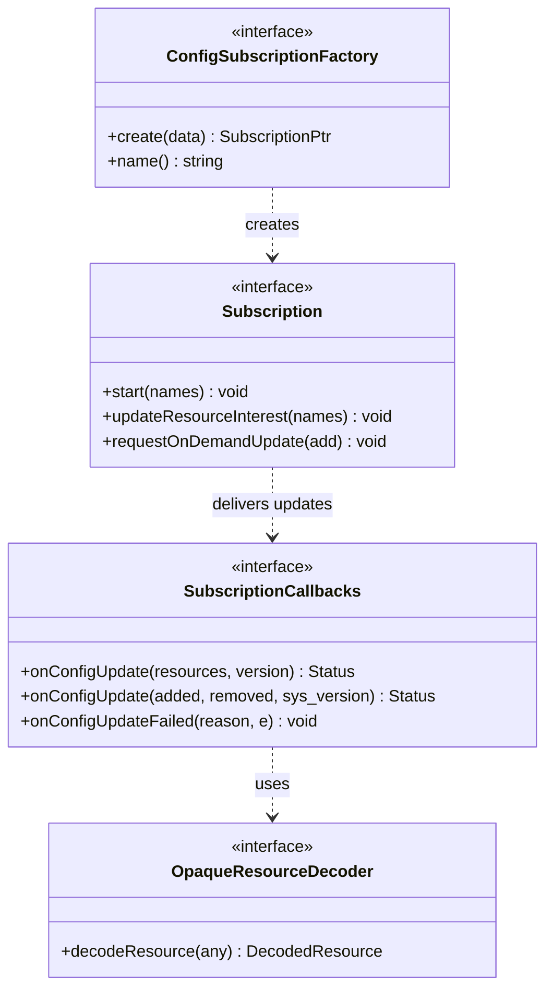
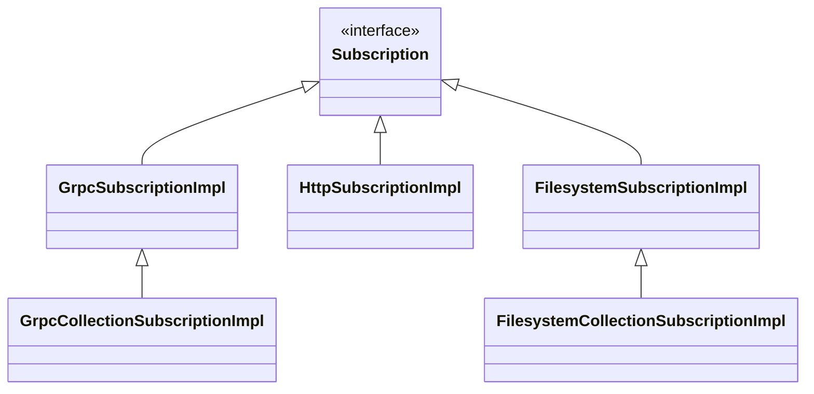
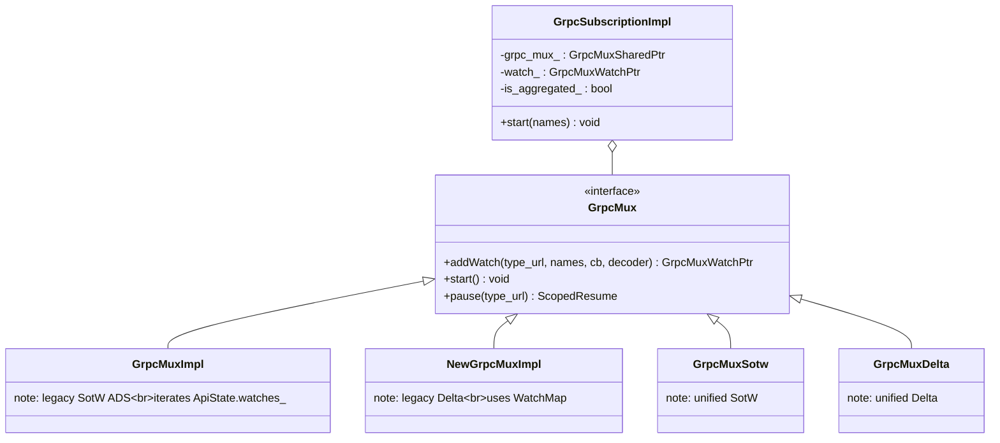
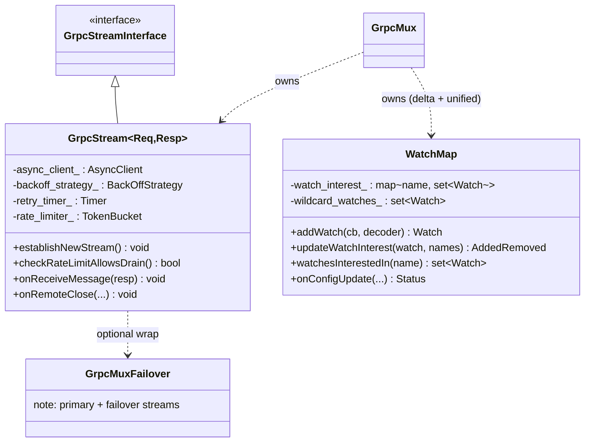
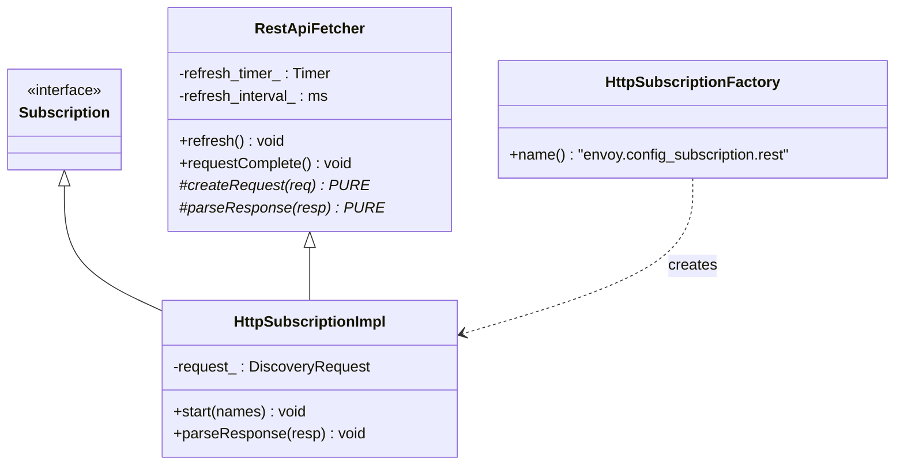
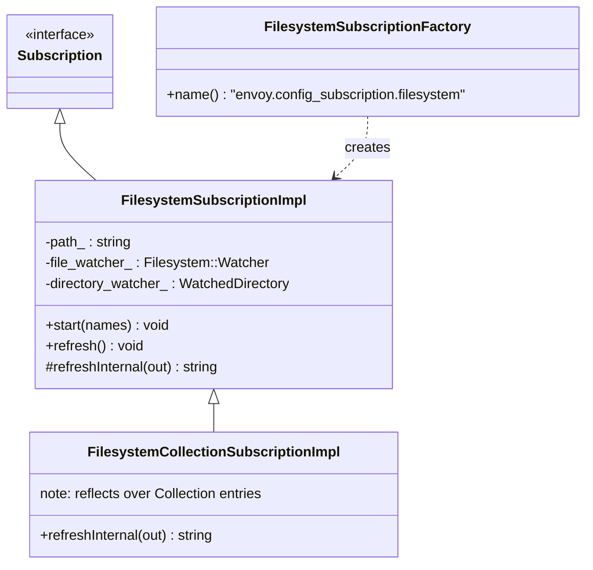
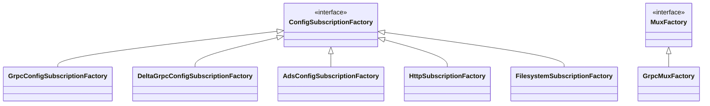

# Config Subscription — Class Hierarchy

UML-style class diagrams for the xDS config subscription extensions. Documentation aids, not
exhaustive.

## 1. Core interfaces

## 2. The transport implementations

## 3. gRPC class layering

## 4. gRPC stream and watch map

## 5. REST classes

## 6. Filesystem classes

## 7. Factory registry summary

`ConfigSubscriptionFactory` instances are selected by `SubscriptionFactoryImpl` from the config
source type; `GrpcMuxFactory` (a separate `MuxFactory` registry) builds the cluster manager's
shared ADS mux.
