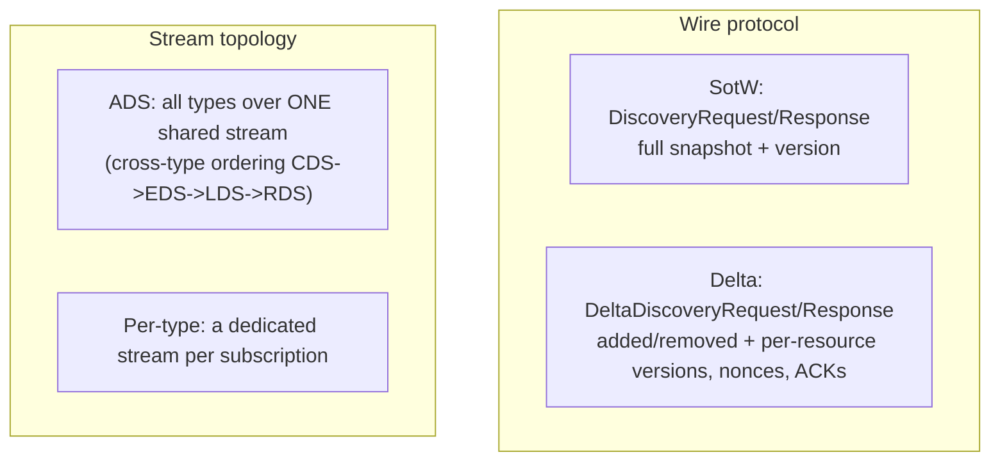
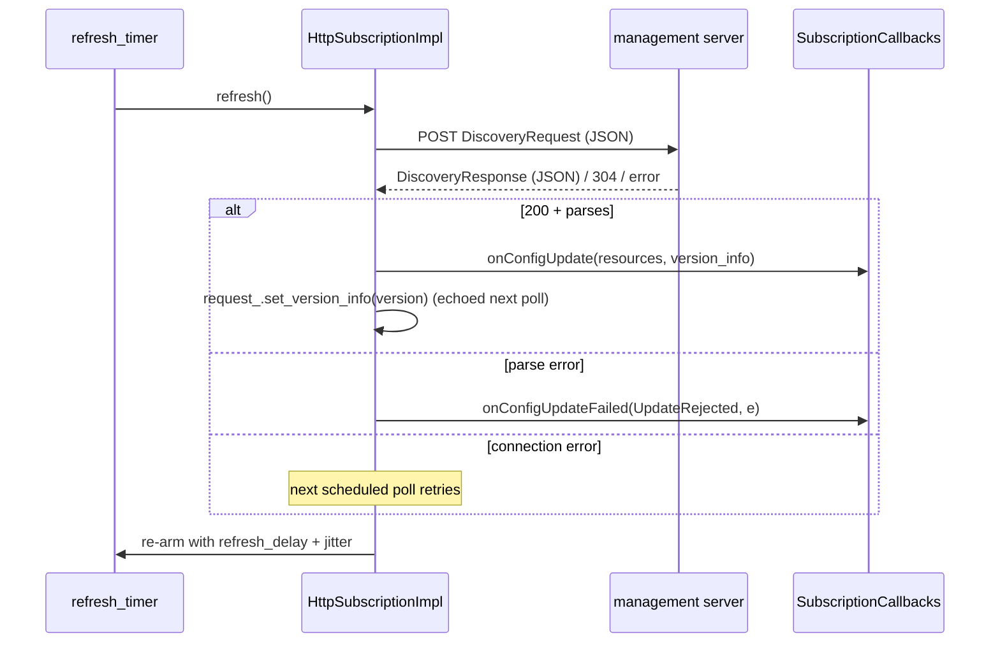
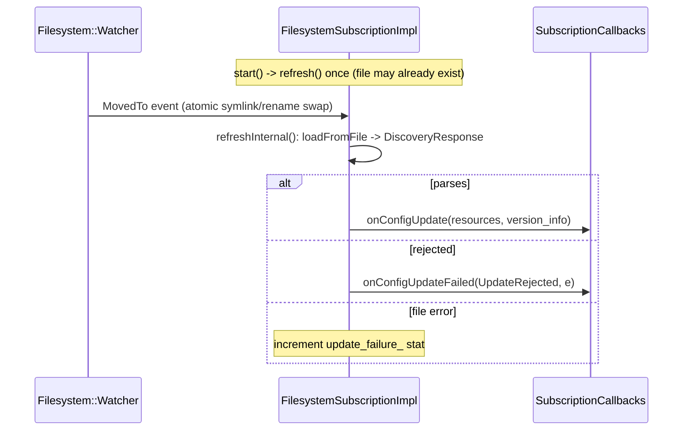

# Config Subscription — Overview

This document covers the subscription/callbacks/factory model, the SotW-vs-Delta and
ADS-vs-per-type distinctions, and a tour of all three transports (REST and filesystem in full;
gRPC summarized here and detailed in `grpc_mux.md`).

## 1. The subscription model

### `Config::Subscription`

Everything here implements one interface (`envoy/config/subscription.h`):

```cpp
class Subscription {
  virtual void start(const absl::flat_hash_set<std::string>& resource_names) PURE;
  virtual void updateResourceInterest(const absl::flat_hash_set<std::string>& names) PURE;
  virtual void requestOnDemandUpdate(const absl::flat_hash_set<std::string>& add) PURE;
};
```

- `start()` — begin fetching, called once.
- `updateResourceInterest()` — narrow/widen the set of resource names of interest.
- `requestOnDemandUpdate()` — only meaningful for delta gRPC (on-demand VHDS etc.); REST and
  filesystem `ENVOY_BUG` on it.

### `SubscriptionCallbacks` — the SotW/Delta split

Results are delivered to a consumer-owned callback interface with **two `onConfigUpdate`
overloads** — this is the SotW-vs-Delta distinction at the type level:

```cpp
class SubscriptionCallbacks {
  // State-of-the-World (filesystem, REST, non-delta gRPC):
  virtual absl::Status onConfigUpdate(const std::vector<DecodedResourceRef>& resources,
                                      const std::string& version_info) PURE;
  // Delta (incremental gRPC):
  virtual absl::Status onConfigUpdate(const std::vector<DecodedResourceRef>& added,
                                      const Protobuf::RepeatedPtrField<std::string>& removed,
                                      const std::string& system_version_info) PURE;
  virtual void onConfigUpdateFailed(ConfigUpdateFailureReason reason, const EnvoyException* e) PURE;
};
```

`ConfigUpdateFailureReason` is `ConnectionFailure | FetchTimedout | UpdateRejected`. An
`OpaqueResourceDecoder` supplied by each consumer turns the wire `Any` into a `DecodedResource`
(`{name, aliases, version, resource(), ttl, metadata}`), keeping the transport machinery
type-agnostic.

### Registration & central dispatch

Each transport registers a `ConfigSubscriptionFactory` (keyed by a string name). The central
`SubscriptionFactoryImpl::subscriptionFromConfigSource` maps the config source to a factory name:

| Config source | Factory name |
|---------------|--------------|
| `ApiConfigSource.api_type = GRPC` | `envoy.config_subscription.grpc` |
| `ApiConfigSource.api_type = DELTA_GRPC` | `envoy.config_subscription.delta_grpc` |
| `ApiConfigSource.api_type = REST` | `envoy.config_subscription.rest` |
| `ConfigSource.ads` | `envoy.config_subscription.ads` |
| `ConfigSource.path` / `path_config_source` | `envoy.config_subscription.filesystem` |

Aggregation is expressed via the `ConfigSource.ads` oneof (routing to the shared cluster-manager
ADS mux), **not** via an `AGGREGATED_GRPC` api_type — that value is explicitly rejected.

## 2. SotW vs Delta, ADS vs per-type



These are orthogonal: gRPC supports SotW or Delta, each either aggregated (ADS) or not. The same
mux classes implement both ADS and non-ADS — the only difference is whether the `GrpcMux` is
**shared** (ADS, `cm_.adsMux()`) or **created fresh** per subscription, and whether `is_aggregated`
is set (which controls who calls `start()`).

## 3. gRPC transport (summary)

The `grpc/` subfolder is the largest and is detailed in `grpc_mux.md`. The layering:

```
GrpcSubscriptionImpl   (per-resource-type Subscription adapter)
   -> GrpcMux           (multiplexes resource types over one stream)
        -> GrpcStream   (resilient bidi stream: retries, backoff, rate limit)
        -> WatchMap     (resource-name -> interested watches fan-out)
```

Factories registered: `envoy.config_subscription.grpc` (SotW), `.delta_grpc` (Delta), `.ads`
(reuses the shared ADS mux), plus collection variants. A separate `MuxFactory`
(`envoy.config_mux.grpc_mux_factory`) builds the cluster manager's shared ADS mux. The mux
implementation is chosen by the `envoy.reloadable_features.unified_mux` runtime flag (legacy
`GrpcMuxImpl`/`NewGrpcMuxImpl` vs unified `XdsMux::GrpcMuxSotw`/`GrpcMuxDelta`).

## 4. REST transport (`rest/`)

`HttpSubscriptionImpl` is REST-JSON **polling** — always SotW (REST has no delta). It is both a
`Http::RestApiFetcher` and a `Config::Subscription`.



The update path (`parseResponse`): load JSON into a `DiscoveryResponse`, decode resources, call
`callbacks_.onConfigUpdate(refvec, version_info)`, and record the version to echo on the next
request. `updateResourceInterest()` just swaps the sorted name list for the next poll. The factory
(`envoy.config_subscription.rest`) requires `refresh_delay` and defaults `request_timeout` to 1s,
using `restMethod(type_url)` and the first cluster name as the upstream.

## 5. Filesystem transport (`filesystem/`)

`FilesystemSubscriptionImpl` reads the whole config from a file — every resource in the file *is*
the full state, so it's always SotW and `updateResourceInterest()` is a no-op.



It watches the path for `MovedTo` events — which is exactly the atomic-swap pattern Kubernetes
ConfigMaps and similar deploys use (write a new file, rename/symlink it over the old one). A
`watched_directory` variant uses a `WatchedDirectory` instead. `FilesystemCollectionSubscriptionImpl`
handles xdstp:// collections by reflecting over a `Collection` message's entries. Factories:
`envoy.config_subscription.filesystem` and `.filesystem_collection`; both handle the legacy
`kPath` and newer `kPathConfigSource` oneof cases.

## 6. Transport comparison

| Transport | Config source | SotW/Delta | Topology | Subscription class | Factory name |
|-----------|---------------|------------|----------|--------------------|--------------|
| gRPC | `ApiConfigSource GRPC` | SotW | dedicated | `GrpcSubscriptionImpl` | `envoy.config_subscription.grpc` |
| Delta gRPC | `ApiConfigSource DELTA_GRPC` | Delta | dedicated | `GrpcSubscriptionImpl` | `envoy.config_subscription.delta_grpc` |
| ADS | `ConfigSource.ads` | SotW or Delta | shared stream | `GrpcSubscriptionImpl` (aggregated) | `envoy.config_subscription.ads` |
| REST | `ApiConfigSource REST` | SotW (poll) | HTTP poll | `HttpSubscriptionImpl` | `envoy.config_subscription.rest` |
| Filesystem | `path` / `path_config_source` | SotW | file watch | `FilesystemSubscriptionImpl` | `envoy.config_subscription.filesystem` |

See `grpc_mux.md` for the gRPC internals.
