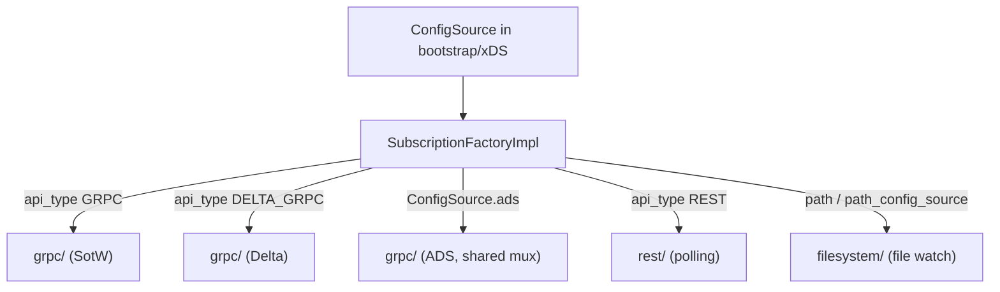

# Config Subscription (xDS Transports)

> Documentation for Envoy's xDS config subscription extensions.
> Source lives in `source/extensions/config_subscription/`: `grpc/` (incl. `grpc/xds_mux/`),
> `rest/`, `filesystem/`. The core interfaces are in `envoy/config/subscription.h` and
> `source/common/config/`.

This folder implements **how Envoy fetches dynamic configuration** — the transport layer beneath
all of xDS. When CDS, LDS, RDS, EDS, or SDS need their resources, they create a `Subscription`,
and one of these extensions does the actual fetching: a streaming gRPC connection, REST polling,
or watching a file on disk.

## The one interface, three transports

Every transport is an implementation of `Config::Subscription`, registered as a
`ConfigSubscriptionFactory`. The central `SubscriptionFactoryImpl` maps a config source to the
right factory:

## Two orthogonal axes

xDS variants come from combining two independent choices:

| Axis | Options | Meaning |
|------|---------|---------|
| **Wire protocol** | SotW vs Delta | State-of-the-World sends the *entire* resource set each time; Delta sends only added/removed resources with per-resource versions |
| **Stream topology** | ADS vs per-type | ADS multiplexes *all* resource types over one shared gRPC stream (cross-type ordering); per-type uses a dedicated stream per subscription |

gRPC supports all four combinations; REST and filesystem are always SotW.

## Documentation map

| Document | Contents |
|----------|----------|
| `OVERVIEW.md` | The subscription/callbacks/factory model, SotW-vs-Delta and ADS-vs-per-type, and a tour of all three transports with the REST and filesystem update paths. |
| `grpc_mux.md` | Deep dive on the gRPC machinery: `GrpcSubscriptionImpl`, the mux family, `GrpcStream` (retries/backoff/rate-limit), `WatchMap`, and the response-dispatch path. |
| `CLASS_HIERARCHY.md` | UML diagrams for the interfaces, the gRPC class layering, and the REST/filesystem implementations. |

## One-paragraph mental model

A consumer (say CDS) asks the `SubscriptionFactory` for a `Subscription` given a `ConfigSource`.
The factory selects a transport extension by the config source's type. The `Subscription` calls
`start()` and begins delivering updates to the consumer's `SubscriptionCallbacks` —
`onConfigUpdate(resources, version)` for SotW or the added/removed overload for Delta. For gRPC,
the heavy lifting is a `GrpcMux` that multiplexes one or more resource types over a resilient
bidirectional stream and fans responses out to the right watches; for REST it's a polling timer;
for filesystem it's a file watcher that re-parses on change. All three converge on the same
callback contract, so the xDS consumers don't care which transport delivered their config.
