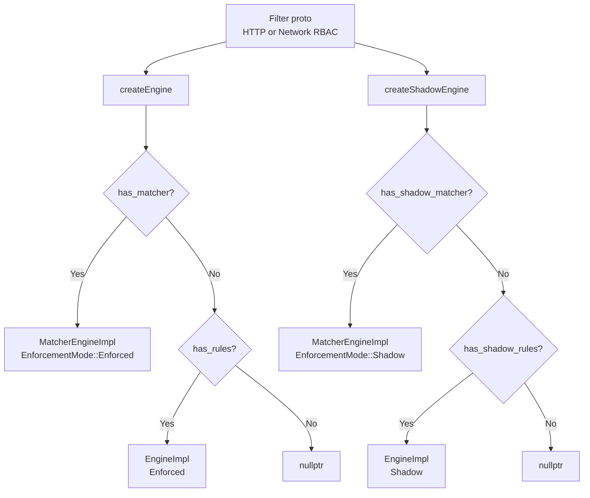
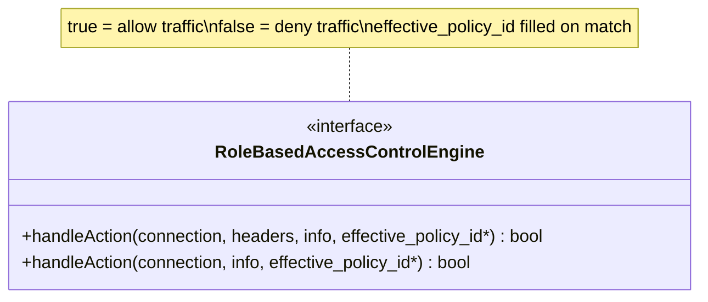
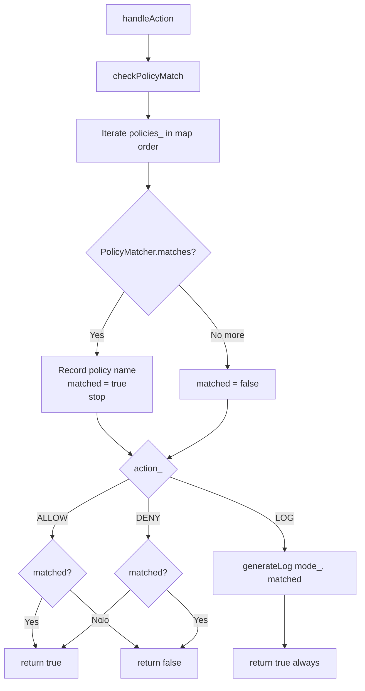
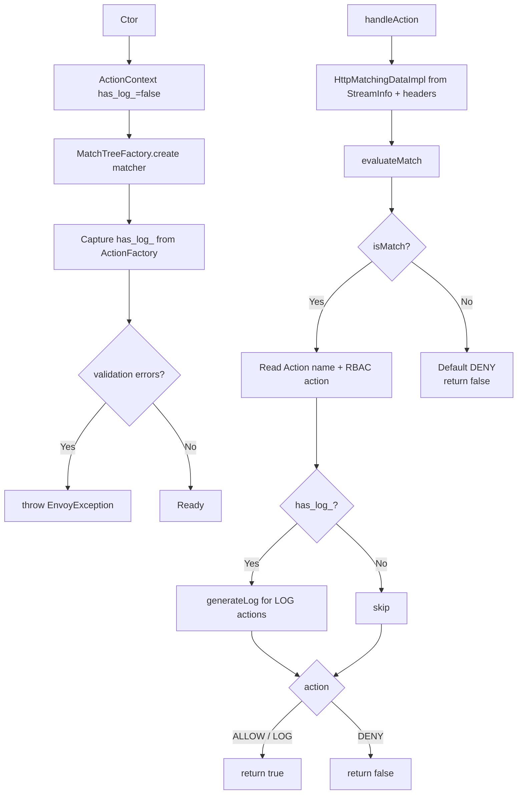
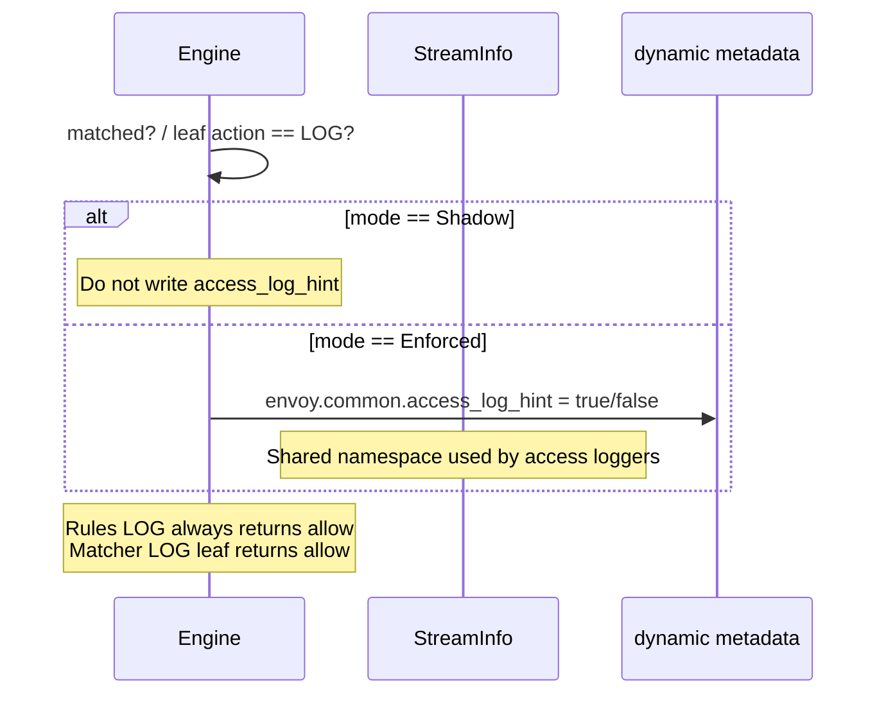
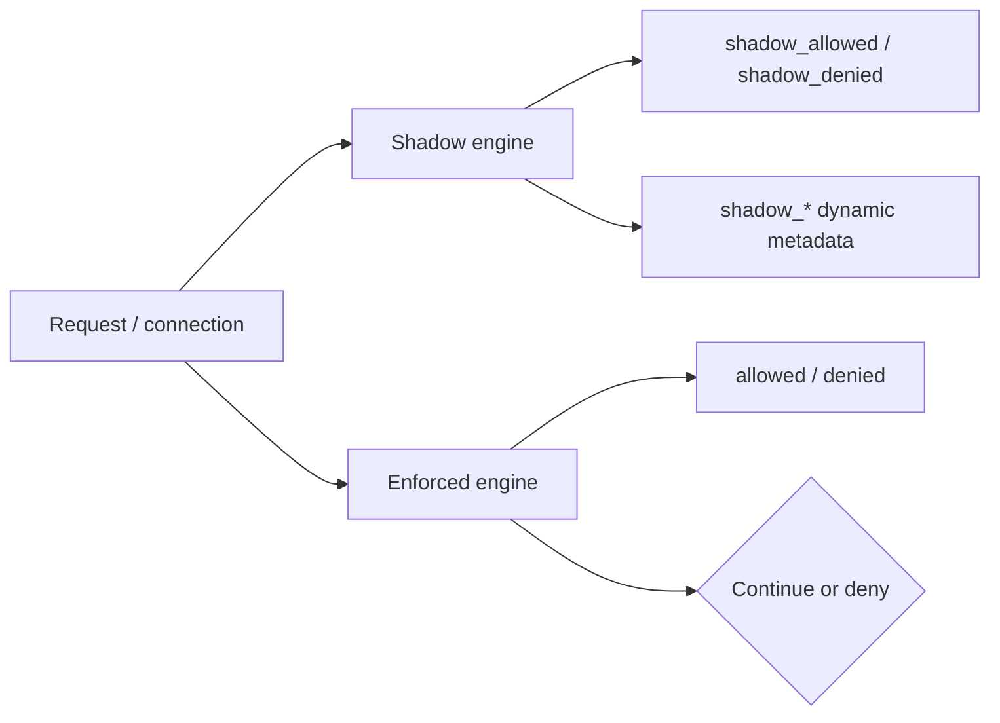

# 01 — RBAC engines

Part of the [shared RBAC docs](README.md). This page covers construction (`createEngine` / `createShadowEngine`), the two concrete engines, ALLOW/DENY/LOG semantics, shadow mode, and dynamic metadata.

## Construction



Rules from `utility.h`:

- If both `matcher` and `rules` are set → **matcher wins**, rules ignored with a warn (same for shadow).
- Returned `nullptr` means “no engine”; filters treat that as allow-by-default.

`ActionValidationVisitor` (alias of `MatchTreeValidationVisitor<HttpMatchingData>`) is passed into matcher-engine construction so each filter can restrict which matcher **inputs** are legal (network filter allow-lists L4 inputs only).

## Interface



Header-less overload always forwards to the header overload with `Http::StaticEmptyHeaders::request_headers` (`engine_impl.cc`).

`EnforcementMode { Enforced, Shadow }` is stored on each engine and only affects `generateLog` (shadow skips writing `access_log_hint`).

## Legacy rules engine (`RoleBasedAccessControlEngineImpl`)

Built from `envoy.config.rbac.v3.RBAC`:

1. Optionally create a shared CEL arena builder if any policy has `condition` **without** `cel_config` (compat optimization).
2. For each `policies` map entry → one `PolicyMatcher`.
3. Store global `action_` (`ALLOW` / `DENY` / `LOG`).

### Evaluation



`checkPolicyMatch` (`engine_impl.cc`): first matching policy wins; lexicographic map order of policy names.

### Policy match (see also [02 — Matchers](02_matchers.md))

A `PolicyMatcher` matches iff:

```text
permissions_ (OR of Permission)  AND
principals_  (OR of Principal)   AND
(CEL condition if present)
```

Empty `rules` with `ALLOW` → no policy can match → deny everyone. Absent rules (no engine) is different from empty rules.

## Matcher-tree engine (`RoleBasedAccessControlMatcherEngineImpl`)

Built from `xds.type.matcher.v3.Matcher` via `MatchTreeFactory<HttpMatchingData, ActionContext>`.



Differences from the rules engine:

| | Rules engine | Matcher engine |
|---|---|---|
| Match unit | Named `Policy` | Matcher-tree leaf `Action` |
| Global action | One `rules.action` for all policies | Per-leaf ALLOW/DENY/LOG |
| No match | Depends on global action | **Always deny** |
| Inputs | Permission/Principal fields | `HttpMatchingData` inputs (validated per filter) |

`ActionFactory` (`envoy.filters.rbac.action`) builds `Action(name, action)` and sets `ActionContext::has_log_` if any leaf is `LOG`.

## LOG action and `generateLog`



Keys (`DynamicMetadataKeys`):

| Constant | Value |
|---|---|
| `AccessLogKey` | `access_log_hint` |
| `CommonNamespace` | `envoy.common` |
| `ShadowEffectivePolicyIdField` | `shadow_effective_policy_id` |
| `ShadowEngineResultField` | `shadow_engine_result` |
| `EngineResultAllowed` / `Denied` | `allowed` / `denied` |

Shadow effective-policy / result fields are written by the **filters**, not by the shared engine.

## Shadow vs enforced



| | Enforced | Shadow |
|---|---|---|
| Affects traffic | Yes | No |
| Stats | `allowed` / `denied` | `shadow_allowed` / `shadow_denied` |
| `access_log_hint` | Yes (on LOG) | Never |
| Typical use | Production policy | Dry-run candidate policy |

## CEL conditions (rules engine only)

When a policy has `condition`:

- With `cel_config` → use cached CEL builder from factory context.
- Without `cel_config` → share one arena-backed `BuilderInstance` across those policies (`ExprBuilderWithArena`).
- Compile failure → `Expr::CelException` at engine construction.

`PolicyMatcher::matches` evaluates `expr_->matches(info, headers)` as the third conjunct.

## Failure modes

| Phase | Failure | Effect |
|---|---|---|
| Ctor (rules) | Bad CIDR / port range / CEL | Throw / status error — config NACK |
| Ctor (matcher) | Input validation errors | `EnvoyException` with first error |
| Runtime | Pipe / missing address | IP matchers return `false` |
| Runtime | No route + ROUTE metadata | Metadata matcher returns `false` |
| Runtime | Corrupt enum | `PANIC_DUE_TO_CORRUPT_ENUM` |

## Next

- Matcher tree details → [02 — Matchers](02_matchers.md)
- Stats, plugins, consumers → [03 — Extensions & utility](03_extensions_and_utility.md)
