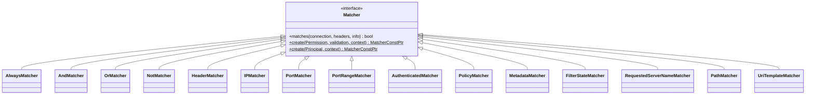
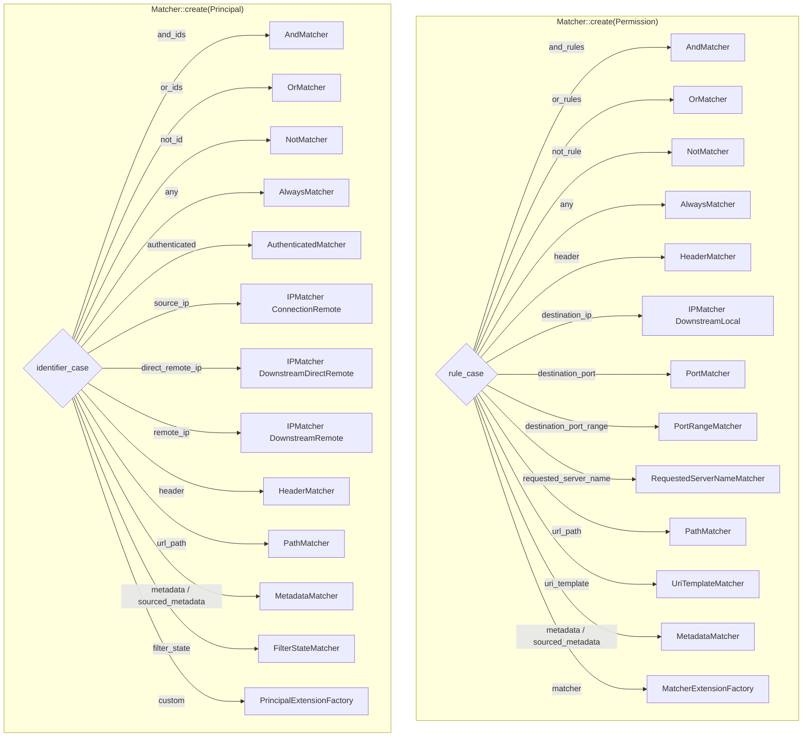
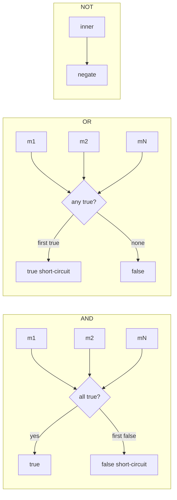
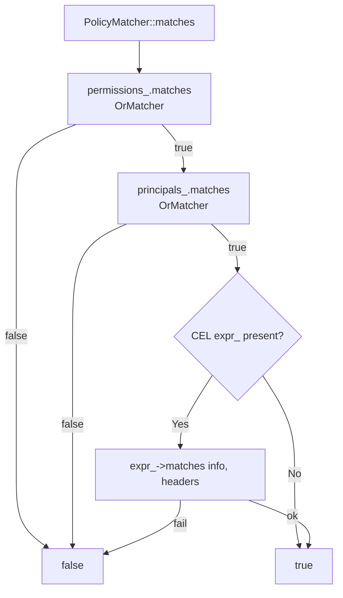
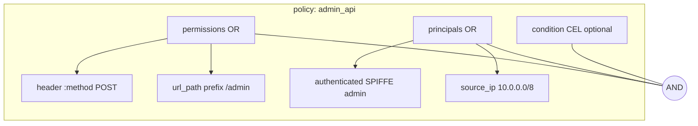
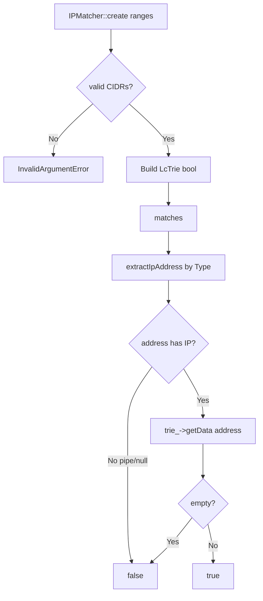

# 02 — RBAC matchers

Part of the [shared RBAC docs](README.md). This page covers the `Matcher` interface, how `Permission` / `Principal` protos become matcher trees, `PolicyMatcher`, and each built-in matcher type.

## Matcher interface



`matches(...)` is pure and side-effect free (aside from logging in some extensions). Empty headers are used for L4 evaluation.

## Factory dispatch



Unset oneof → `PANIC_DUE_TO_CORRUPT_ENUM` (should be caught by proto validation earlier).

## Composite matchers



- `AndMatcher` / `OrMatcher` recurse via `Matcher::create` for each child.
- Policy lists use **OR** semantics: `Policy.permissions` and `Policy.principals` are wrapped in `OrMatcher`.

## PolicyMatcher



Constructor compiles `policy.condition()` when present (see [01 — Engines](01_engines.md#cel-conditions-rules-engine-only)).

Example logical shape:



## IPMatcher (LC Trie)



| `IPMatcher::Type` | Address source | Proto field |
|---|---|---|
| `ConnectionRemote` | `connection.remoteAddress()` | `Principal.source_ip` |
| `DownstreamLocal` | `downstreamAddressProvider.localAddress()` | `Permission.destination_ip` |
| `DownstreamDirectRemote` | `directRemoteAddress()` | `Principal.direct_remote_ip` |
| `DownstreamRemote` | `remoteAddress()` | `Principal.remote_ip` |

Performance: LC Trie → roughly O(log n) over configured prefixes.

## Port matchers

| Class | Proto | Match |
|---|---|---|
| `PortMatcher` | `destination_port` | Local IP port == exact value |
| `PortRangeMatcher` | `destination_port_range` | `start <= port < end` (half-open); ctor validates `0…65536` and `start < end` |

Both read `downstreamAddressProvider().localAddress()`; non-IP → `false`.

## AuthenticatedMatcher (principal)

```mermaid
flowchart TD
    A[matches] --> S{connection.ssl()?}
    S -->|No| F[false]
    S -->|Yes| M{principal_name matcher set?}
    M -->|No| T[true — any authenticated peer]
    M -->|Yes| U[Try URI SANs]
    U -->|hit| T
    U -->|miss| D[Try DNS SANs]
    D -->|hit| T
    D -->|miss| Sub[Match subject DN]
    Sub --> Out[true/false]
```

This is the classic SPIFFE / SAN principal. For “must be validated mTLS”, prefer the [`MtlsAuthenticated`](03_extensions_and_utility.md#mtlsauthenticatedmatcher) extension.

## HeaderMatcher

- Built from `envoy.config.route.v3.HeaderMatcher`.
- Always fails on connections without usable headers (L4 empty map).
- Runtime flag `envoy.reloadable_features.rbac_match_headers_individually` chooses `matchesHeadersIndividually` vs `matchesHeaders` at construction.

Network RBAC rejects header permissions/principals at filter-config time so they never reach the engine there.

## Path & URI template

| Matcher | Input | Notes |
|---|---|---|
| `PathMatcher` | `:path` | Query/fragment stripped by path matcher helper; missing Path → false |
| `UriTemplateMatcher` | path value | Via `Router::PathMatcherFactory` from `uri_template` typed config |

## Metadata & filter state

```mermaid
flowchart TD
    MD[MetadataMatcher] --> SRC{metadata_source}
    SRC -->|DYNAMIC default| DM[info.dynamicMetadata]
    SRC -->|ROUTE| RT{info.route()?}
    RT -->|Yes| RM[route->metadata]
    RT -->|No| F[false]

    FS[FilterStateMatcher] --> FS2[info.filterState]
```

`sourced_metadata` selects source explicitly; legacy `metadata` field always uses `DYNAMIC`.

## RequestedServerNameMatcher

Matches `connection.requestedServerName()` (typically TLS SNI) with a `StringMatcher`.

## AlwaysMatcher

`any: true` → always `true`. Used for “any permission” / “any principal” wildcards.

## HTTP-only vs L4-safe

| Matcher | HTTP | Network L4 |
|---|---|---|
| Header / Path / UriTemplate | Yes | No (empty headers / config-rejected) |
| IP / Port / SNI / Authenticated / FilterState / Metadata | Yes | Yes |
| Upstream IP/port extension | After upstream chosen | Same (needs filter state) |

## Next

- Engines / actions → [01 — Engines](01_engines.md)
- Extensions, stats, consumers → [03 — Extensions & utility](03_extensions_and_utility.md)
