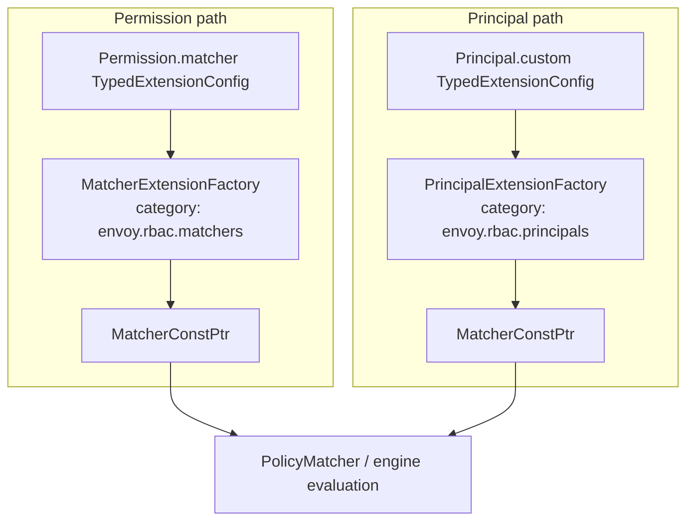
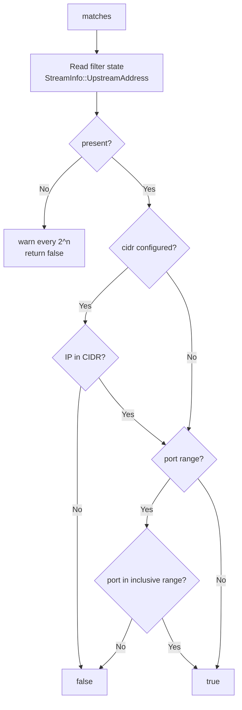
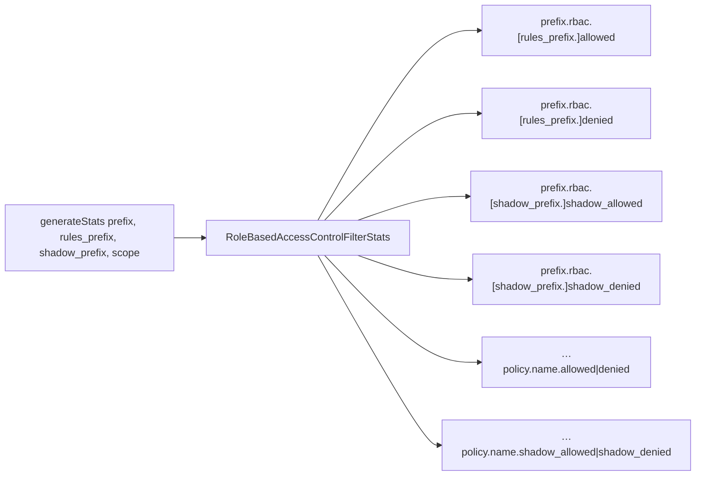
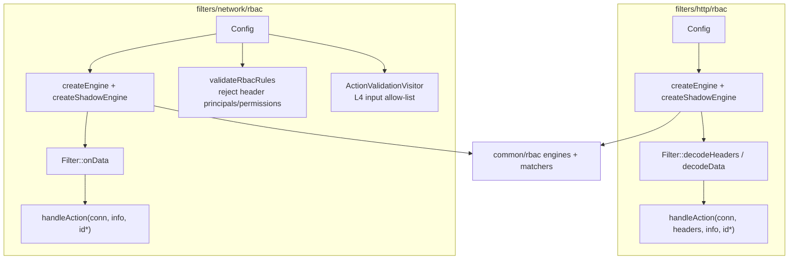

# 03 — Extensions, utility, and consumers

Part of the [shared RBAC docs](README.md). This page covers plugin factories, built-in extensions, stats helpers, deny detail strings, and how HTTP/network filters wire the shared library.

## Extension model



Both factory types ultimately produce a `Matcher` — permissions and principals share the same evaluation interface.

### `MatcherExtensionFactory`

```cpp
// matcher_extension.h
class MatcherExtensionFactory : public Config::TypedFactory {
  virtual MatcherConstPtr create(const Protobuf::Message& config,
                                 ProtobufMessage::ValidationVisitor&) PURE;
  std::string category() const override { return "envoy.rbac.matchers"; }
};
```

`BaseMatcherExtensionFactory<M, P>` downcasts to `TypedExtensionConfig`, unpacks `P`, returns `std::make_unique<M>(proto)`.

### `PrincipalExtensionFactory`

```cpp
// principal_extension.h
class PrincipalExtensionFactory : public Config::TypedFactory {
  virtual MatcherConstPtr create(const TypedExtensionConfig&,
                                 CommonFactoryContext&) PURE;
  std::string category() const override { return "envoy.rbac.principals"; }
};
```

`BasePrincipalExtensionFactory<PrincipalType, ConfigProto>` unpacks + validates and constructs `PrincipalType(config, context)`.

Filters must **link** the extension libraries (e.g. `upstream_ip_port`, `mtls_authenticated`) so `REGISTER_FACTORY` runs; otherwise config referring to them fails factory lookup.

## Built-in: UpstreamIpPortMatcher

**Name:** `envoy.rbac.matchers.upstream_ip_port`  
**Role:** Permission matcher against the **resolved upstream** address after LB.



Ctor requires at least one of `upstream_ip` or `upstream_port_range`. Needs a prior filter that populates `UpstreamAddress` filter state.

## Built-in: MtlsAuthenticatedMatcher

**Name:** `envoy.rbac.principals.mtls_authenticated`  
**Role:** Principal that requires a **validated** peer certificate (stronger than plain `authenticated`).

```mermaid
flowchart TD
    A[matches] --> S{ssl()?}
    S -->|No| F[false]
    S -->|Yes| V{peerCertificateValidated?}
    V -->|No| F
    V -->|Yes| M{san_matcher?}
    M -->|No| T[true — any validated client cert]
    M -->|Yes| SAN[peerCertificateSanMatches]
    SAN --> Out[true/false]
```

Ctor throws if neither `san_matcher` nor `any_validated_client_certificate` is set.

## Stats (`utility`)



`RoleBasedAccessControlFilterStats` holds the four aggregate counters plus helpers:

- `incPolicyAllowed(name)` / `incPolicyDenied(name)`
- `incPolicyShadowAllowed(name)` / `incPolicyShadowDenied(name)`

Per-policy names are dynamic (`StatNameDynamicPool`). Whether a filter increments per-policy counters is up to that filter (HTTP does more of this; network currently uses aggregates).

Typical network call:

```cpp
generateStats(proto.stat_prefix(), "", proto.shadow_rules_stat_prefix(), scope);
// → <stat_prefix>.rbac.{allowed,denied}
// → <stat_prefix>.rbac.<shadow_rules_stat_prefix>.{shadow_allowed,shadow_denied}
```

## `responseDetail`

```cpp
responseDetail(policy_id)
// → "rbac_access_denied_matched_policy[<sanitized_id>]"
```

Whitespace in the policy id is replaced with `_` so access-log tokenization stays stable. Filters set this on deny (connection termination details / response code details). Unmatched denials often pass `"none"`.

## Consumer wiring



| Concern | HTTP filter | Network filter |
|---|---|---|
| When evaluated | Per request (headers) | On data (first byte or continuous) |
| Headers | Real | Empty |
| Matcher inputs | Broad HTTP set | L4 allow-list only |
| Deny behavior | Local reply 403 | Close connection (+ optional delay) |
| Shadow metadata | Yes | Yes (`envoy.filters.network.rbac`) |

See also:

- [`../../network/rbac/README.md`](../../network/rbac/README.md)
- HTTP filter sources under `source/extensions/filters/http/rbac/`

## Adding a custom permission matcher

1. Define a proto under `envoy.extensions.rbac.matchers…`.
2. Implement `class MyMatcher : public RBAC::Matcher`.
3. `class Factory : public BaseMatcherExtensionFactory<MyMatcher, MyProto>` with a unique `name()`.
4. `REGISTER_FACTORY(Factory, MatcherExtensionFactory)`.
5. Add the library as a `deps` entry of filters that should load it.
6. Reference via `Permission.matcher` typed extension config.

Custom principals mirror that with `PrincipalExtensionFactory` and `Principal.custom`.

## Quick reference

| Symbol | Header | Purpose |
|---|---|---|
| `createEngine` / `createShadowEngine` | `utility.h` | Build engines from filter proto |
| `generateStats` | `utility.h` | Aggregate + per-policy counter prefixes |
| `responseDetail` | `utility.h` | Deny detail string |
| `generateLog` | `engine_impl.h` | Write `access_log_hint` |
| `DynamicMetadataKeys` | `engine_impl.h` | Shared metadata key names |
| `Matcher::create` | `matcher_interface.h` | Permission/Principal → matcher |
| `MatcherExtensionFactory` | `matcher_extension.h` | Permission plugins |
| `PrincipalExtensionFactory` | `principal_extension.h` | Principal plugins |

## Doc index

- Overview → [README.md](README.md)
- Engines → [01_engines.md](01_engines.md)
- Matchers → [02_matchers.md](02_matchers.md)
