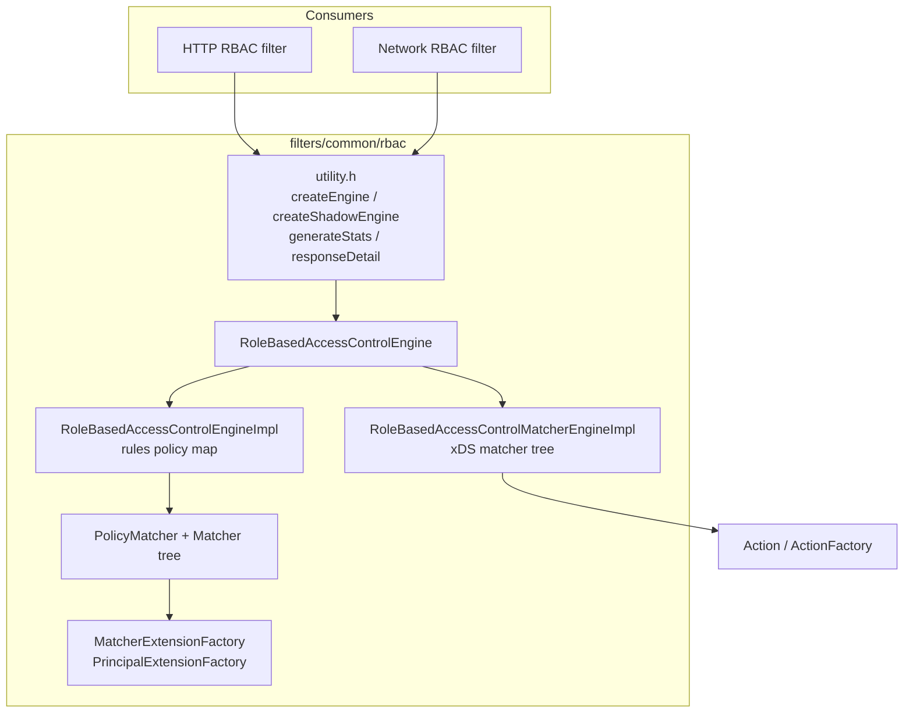
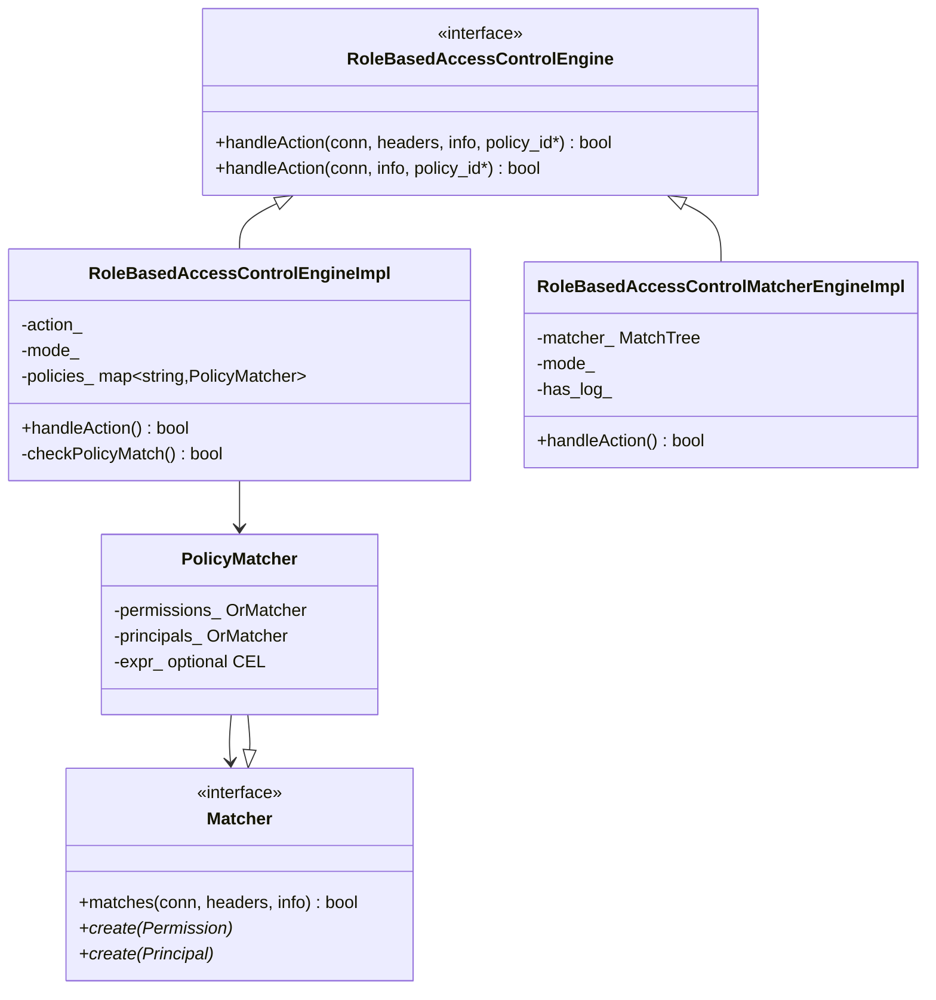
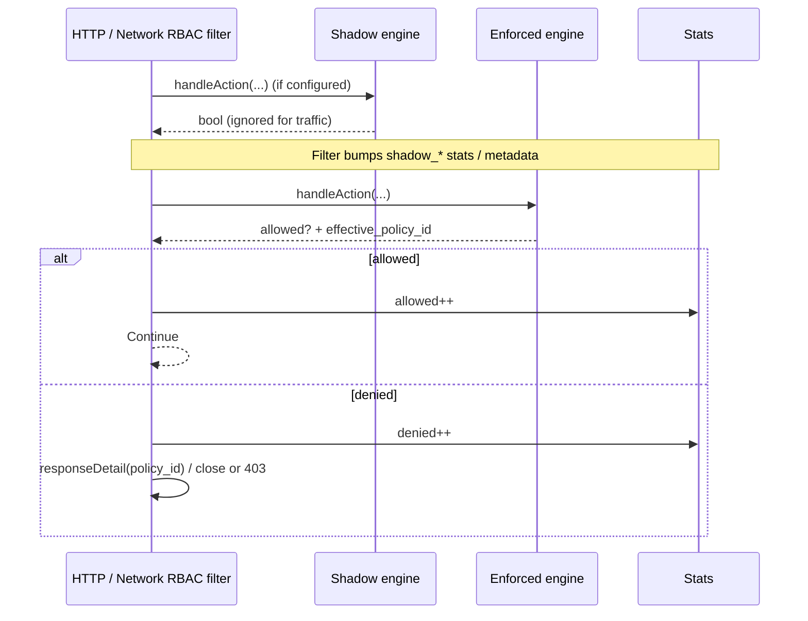
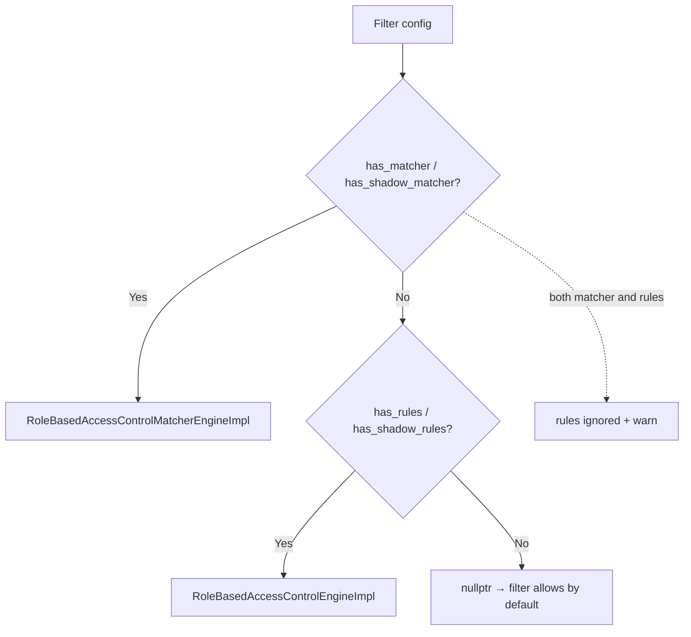

# RBAC shared filter infrastructure

Shared authorization engine used by both:

- [HTTP RBAC filter](../../http/rbac/) (`envoy.filters.http.rbac`)
- [Network RBAC filter](../../network/rbac/) (`envoy.filters.network.rbac`)

It compiles an `envoy.config.rbac.v3.RBAC` policy map **or** an `xds.type.matcher.v3.Matcher` tree into evaluators, then answers a single question per call: **is this connection/request allowed?** (`handleAction` → `bool`), optionally filling the matched policy/action name.

Extension points:

- `MatcherExtensionFactory` — custom **permissions** (`envoy.rbac.matchers`)
- `PrincipalExtensionFactory` — custom **principals** (`envoy.rbac.principals`)

## Doc map

| Doc | Covers |
|---|---|
| [This overview](README.md) | Architecture, files, consumers, quick reference |
| [01 — Engines](01_engines.md) | `createEngine`, rules vs matcher engines, ALLOW/DENY/LOG, shadow mode |
| [02 — Matchers](02_matchers.md) | Permission/principal tree, `PolicyMatcher`, IP/header/TLS/path matchers |
| [03 — Extensions & utility](03_extensions_and_utility.md) | Plugins, stats, `responseDetail`, consumer wiring |

Proto: `envoy.config.rbac.v3.RBAC` (rules) and `xds.type.matcher.v3.Matcher` (matcher tree).
Filter wrappers: `envoy.extensions.filters.{http,network}.rbac.v3.RBAC`.

## Architecture

## End-to-end evaluation (consumer view)

Shadow never changes the request outcome; only the enforced engine does. See [01 — Engines](01_engines.md#shadow-vs-enforced).

## Files

| Path | Role |
|---|---|
| `engine.h` | Abstract `RoleBasedAccessControlEngine` |
| `engine_impl.h/cc` | Rules + matcher engines, `Action`/`ActionFactory`, `generateLog`, `DynamicMetadataKeys` |
| `matcher_interface.h` | `Matcher` base + static `create(Permission\|Principal)` |
| `matchers.h/cc` | Built-in permission/principal matchers + `PolicyMatcher` |
| `matcher_extension.h` | `MatcherExtensionFactory` / `BaseMatcherExtensionFactory` |
| `principal_extension.h` | `PrincipalExtensionFactory` / `BasePrincipalExtensionFactory` |
| `utility.h/cc` | Stats, `createEngine`/`createShadowEngine`, `responseDetail` |
| `matchers/upstream_ip_port.*` | Built-in permission: upstream IP/port |
| `principals/mtls_authenticated.*` | Built-in principal: validated mTLS |

## Engine selection (quick)

Templates live in `utility.h` (`createEngine` / `createShadowEngine`).

## HTTP vs network overload

| Caller | Overload used | Headers |
|---|---|---|
| HTTP RBAC | `handleAction(conn, headers, info, id*)` | Real request headers |
| Network RBAC | `handleAction(conn, info, id*)` | Substitutes empty static headers |

Header / path / URI-template principals and permissions only work meaningfully on the HTTP path. The network filter rejects header rules at config time.

## Action semantics (rules engine)

| `rules.action` | Match | No match |
|---|---|---|
| `ALLOW` (default) | allow | deny |
| `DENY` | deny | allow |
| `LOG` | set `envoy.common.access_log_hint=true`, **always allow** | set hint `false`, **always allow** |

Matcher-tree engine: matched leaf `Action` decides; **no match defaults to deny**. Details in [01 — Engines](01_engines.md).

## Related

- Network filter deep-dive: [`../../network/rbac/README.md`](../../network/rbac/README.md)
- API: `envoy.config.rbac.v3.RBAC`, `envoy.config.rbac.v3.Permission`, `envoy.config.rbac.v3.Principal`
