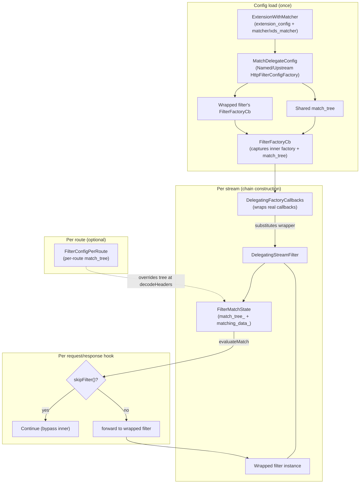
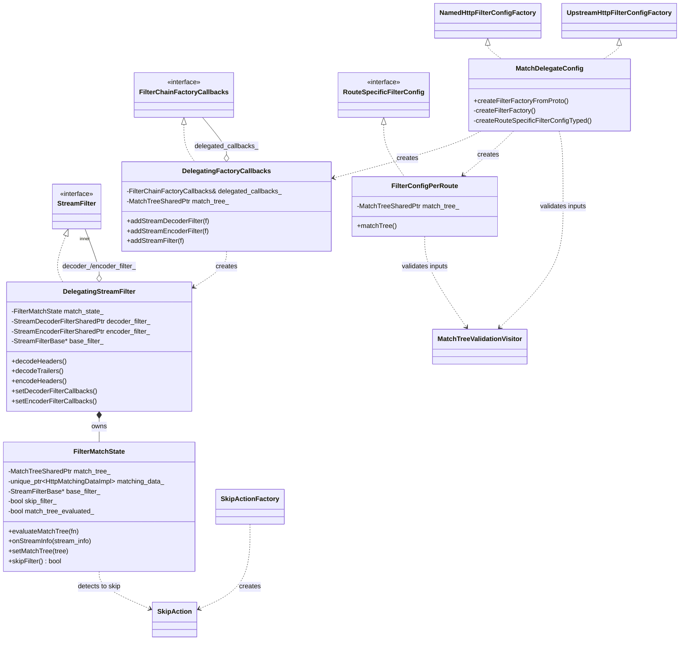
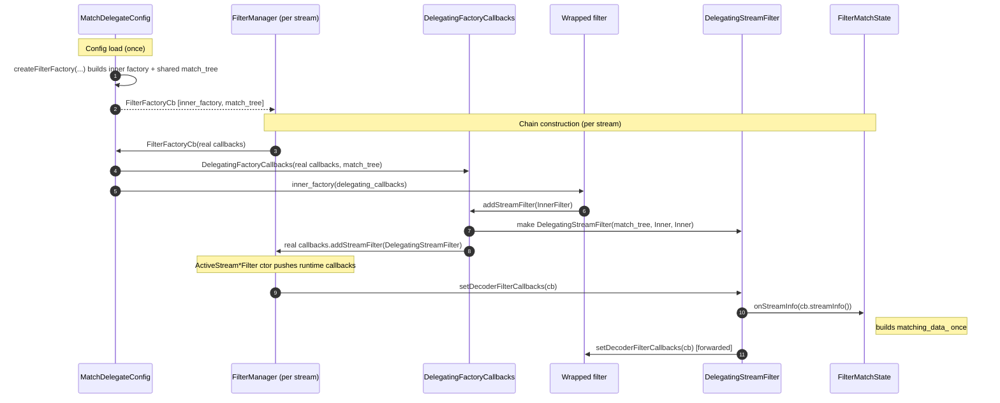
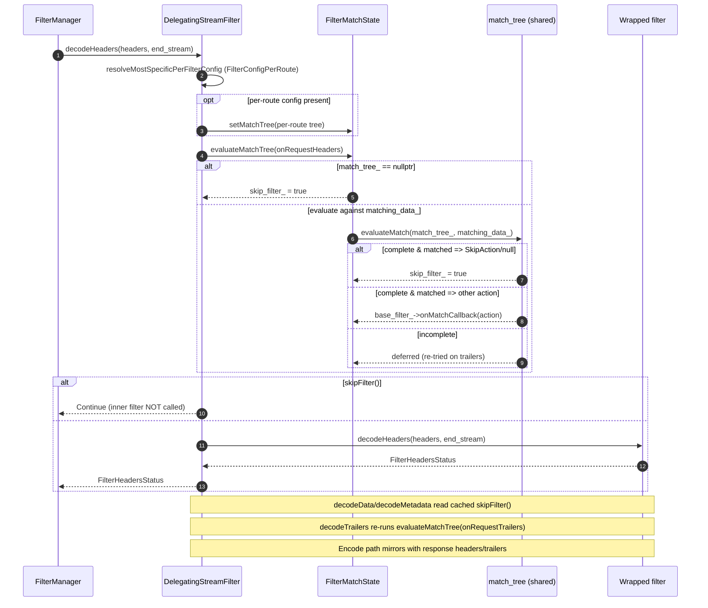

# Match Delegate (`envoy.filters.http.match_delegate`)

Wraps an arbitrary underlying HTTP filter and evaluates a match tree against request/response
matching data; when the match tree resolves to a `SkipFilter` action (or no match tree is present),
the wrapped filter's decode/encode callbacks are bypassed for that stream while otherwise being
transparently delegated. This is the generic "conditionally apply a filter" mechanism used by
Envoy's matcher API.

Proto: `envoy.extensions.common.matching.v3.ExtensionWithMatcher` (and `ExtensionWithMatcherPerRoute`).

## Files
- `config.h/cc` — `DelegatingStreamFilter`, `FilterMatchState`, `SkipAction`, `SkipActionFactory`,
  `DelegatingFactoryCallbacks`, `MatchDelegateConfig` (downstream + upstream), `FilterConfigPerRoute`,
  `MatchTreeValidationVisitor`.

## Diagrams

> A more detailed per-phase walkthrough (including a regular-filter comparison) lives in
> [`FILTER_SEQUENCE.md`](FILTER_SEQUENCE.md).

### Block diagram (components)

### Class diagram

### Sequence: config load + chain construction

### Sequence: request decode

## Lifecycle
- `MatchDelegateConfig::createFilterFactoryFromProto(...)` (`config.cc:242`, `config.cc:260`) builds
  the wrapped filter's factory via `Config::Utility::getAndCheckFactory<...>` and constructs a
  match tree from either `xds_matcher` or legacy `matcher` (`config.cc:298-302`). The returned
  `FilterFactoryCb` wraps the downstream factory callbacks in `DelegatingFactoryCallbacks`
  (`config.cc:316-319`), which intercepts `addStreamDecoderFilter` / `addStreamEncoderFilter` /
  `addStreamFilter` and substitutes a `DelegatingStreamFilter` around each inserted filter
  (`config.h:92-103`).
- `DelegatingStreamFilter` implements the full `Envoy::Http::StreamFilter` interface; every
  decode/encode hook first calls `FilterMatchState::evaluateMatchTree` (when fresh matching data is
  available) and then either short-circuits with `Continue` if `skipFilter()` is true or forwards
  to the wrapped `decoder_filter_` / `encoder_filter_`.
- `setDecoderFilterCallbacks` / `setEncoderFilterCallbacks` (`config.cc:175`, `config.cc:235`) both
  call `match_state_.onStreamInfo(callbacks.streamInfo())` so the matching data can be built once
  `StreamInfo` is available, then forward the callbacks to the wrapped filter.
- `FilterMatchState::evaluateMatchTree` (`config.cc:72-102`):
  - returns immediately if already evaluated.
  - if `match_tree_ == nullptr` (no tree), sets `skip_filter_ = true` and marks complete
    (`config.cc:79-83`) — matches the "no matcher ⇒ skip" contract.
  - otherwise, updates the `HttpMatchingDataImpl` via the passed `MatchDataUpdateFunc` and runs
    `Matcher::evaluateMatch` (`config.cc:88-89`).
  - if the match result is complete and matched, dispatches: if the action is `SkipAction` or
    null, sets `skip_filter_ = true`; else calls `base_filter_->onMatchCallback(result)`
    (`config.cc:93-101`).

## Decode path (`config.cc:119-180`)
- `decodeHeaders` (`config.cc:119`): resolves `FilterConfigPerRoute` via
  `Http::Utility::resolveMostSpecificPerFilterConfig<FilterConfigPerRoute>` and, if present,
  overrides the match tree with the per-route tree (`config.cc:121-131`); populates matching data
  from request headers and evaluates; on skip returns `Continue`, else forwards to
  `decoder_filter_->decodeHeaders`.
- `decodeData` (`config.cc:142`): no re-evaluation; skip ⇒ `Continue`, else forward.
- `decodeTrailers` (`config.cc:149`): updates matching data with request trailers and re-evaluates
  (useful if the tree needs trailer inputs), then skip-or-forward.
- `decodeMetadata` / `decodeComplete` / `setDecoderFilterCallbacks`: forward unless skipped.

## Encode path (`config.cc:182-240`)
- `encode1xxHeaders`, `encodeData`, `encodeMetadata`, `encodeComplete`: skip-or-forward, no
  re-evaluation.
- `encodeHeaders` (`config.cc:190`): updates matching data with response headers, re-evaluates,
  then skip-or-forward.
- `encodeTrailers` (`config.cc:209`): updates matching data with response trailers, re-evaluates.
- Note: `encodeMetadata` at `config.cc:221` forwards to `decoder_filter_->decodeMetadata` — this
  mirrors how the wrapper preserves one underlying object for dual-direction filters.

## Decision / logic
- Match data lazily constructed from `streamInfo()` in `FilterMatchState::onStreamInfo`
  (`config.h:31-35`); matching is idempotent via `match_tree_evaluated_` guard.
- `SkipAction` type identity is the signal to bypass: `SkipAction().typeUrl() == result->typeUrl()`
  (`config.cc:95`).
- `MatchTreeValidationVisitor` (`config.cc:40-68`) enforces the filter-declared data-input
  allowlist (from `factory.matchingRequirements()`) and surfaces any violation as an
  `InvalidArgumentError` from `createFilterFactory` (`config.cc:304-308`).

## Configuration
- Top-level: `extension_config` (the wrapped filter) plus one of `xds_matcher` / `matcher`.
- `FilterConfigPerRoute` (`config.h:144-153`, `config.cc:330-359`) builds a per-route tree from
  `ExtensionWithMatcherPerRoute.xds_matcher` with a fixed data-input allowlist for
  `HttpRequestHeaderMatchInput`, `HttpResponseHeaderMatchInput`, `HttpResponseTrailerMatchInput`,
  and xDS `HttpAttributesCelMatchInput`. Per-route tree overrides the filter-config tree
  (`config.cc:125-126`).

## Factory
- `MatchDelegateConfig` registered as both `NamedHttpFilterConfigFactory` and
  `UpstreamHttpFilterConfigFactory` (`config.cc:367-369`); name `envoy.filters.http.match_delegate`
  (`config.h:122`). `UpstreamMatchDelegateConfig` is a type alias.
- `SkipActionFactory` registered under action-factory registry as name `skip` (`config.cc:37-38`).

## Stats
- None emitted by this filter. Any counters/gauges are the responsibility of the wrapped filter.
