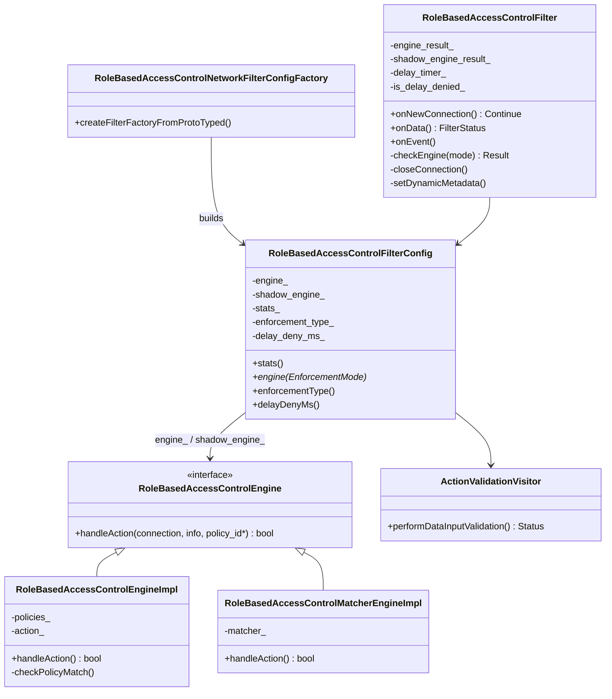
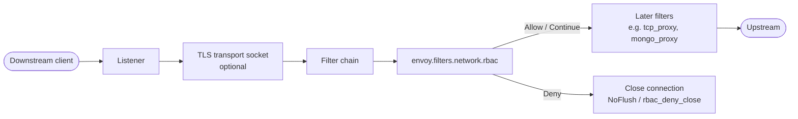
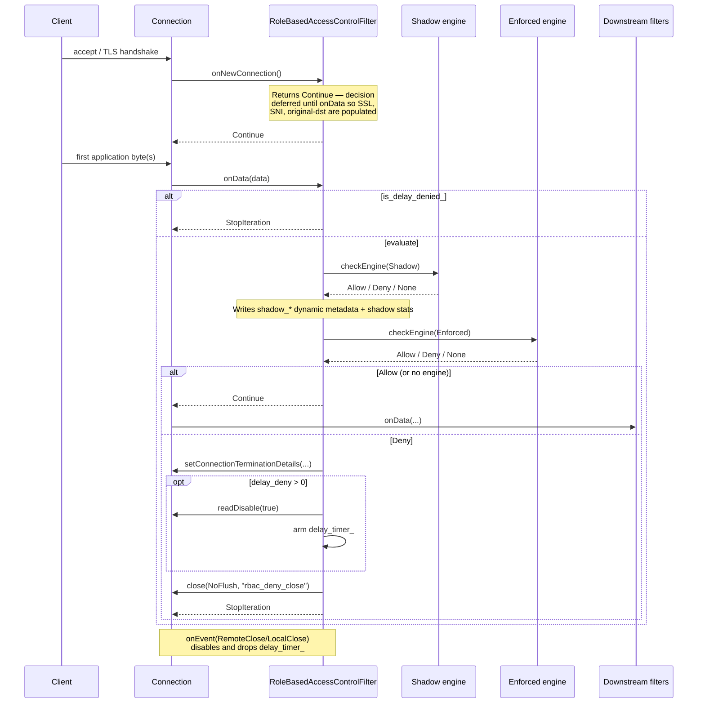
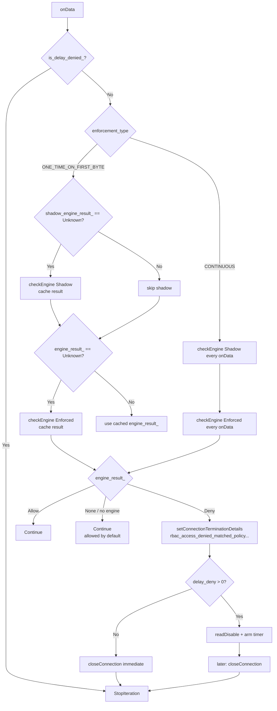
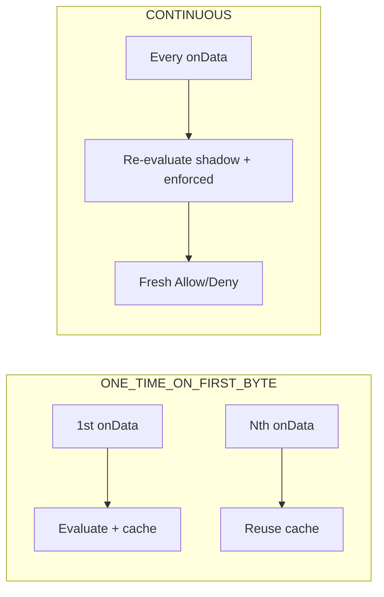
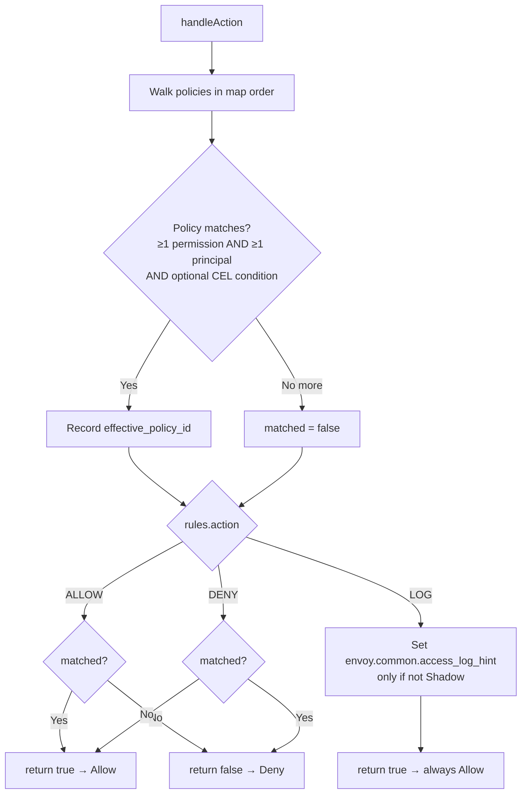
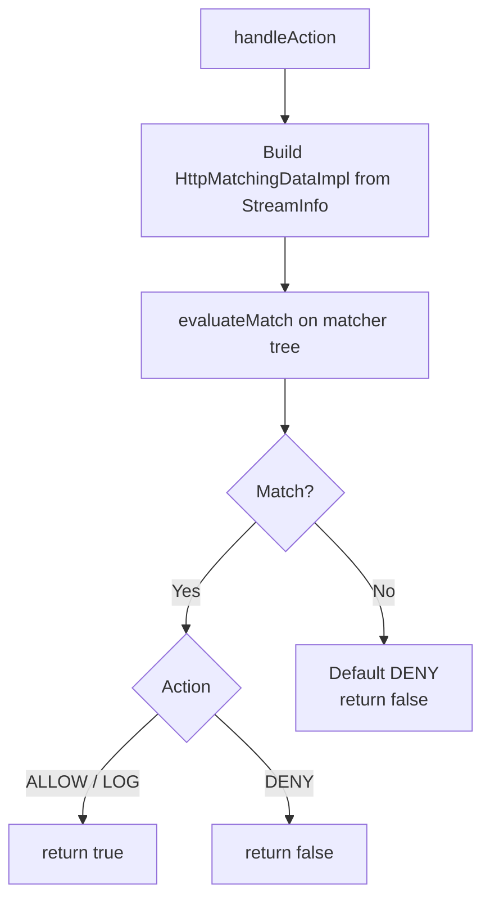
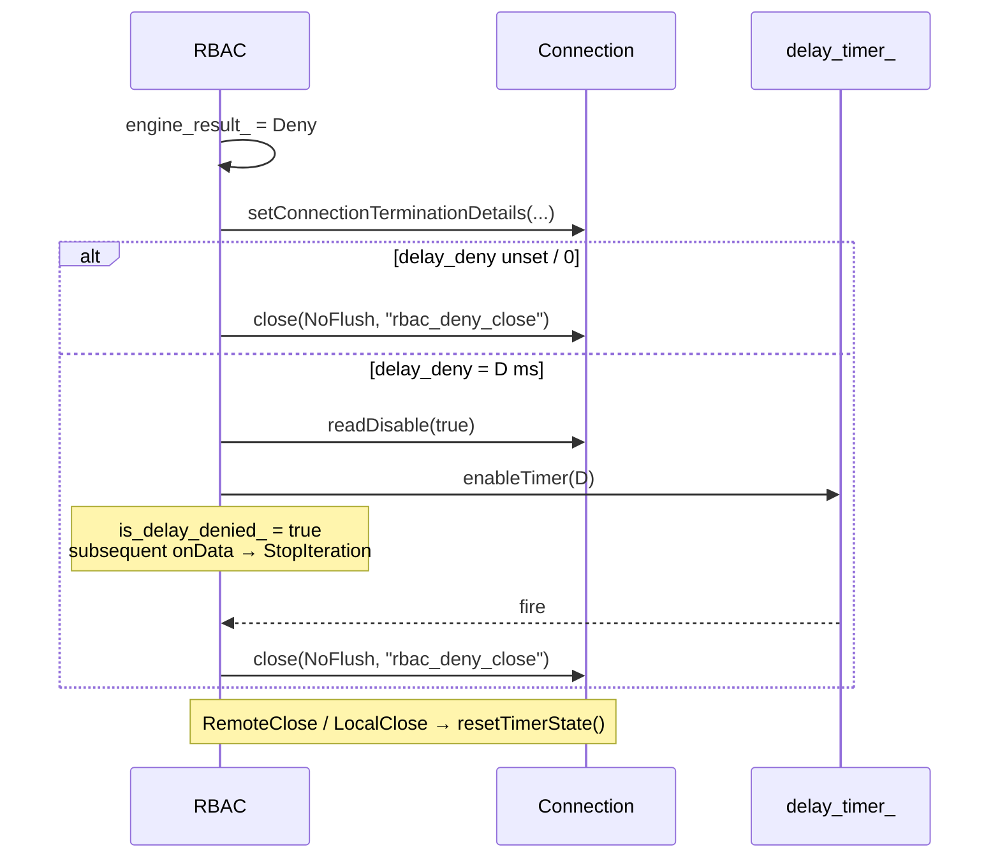
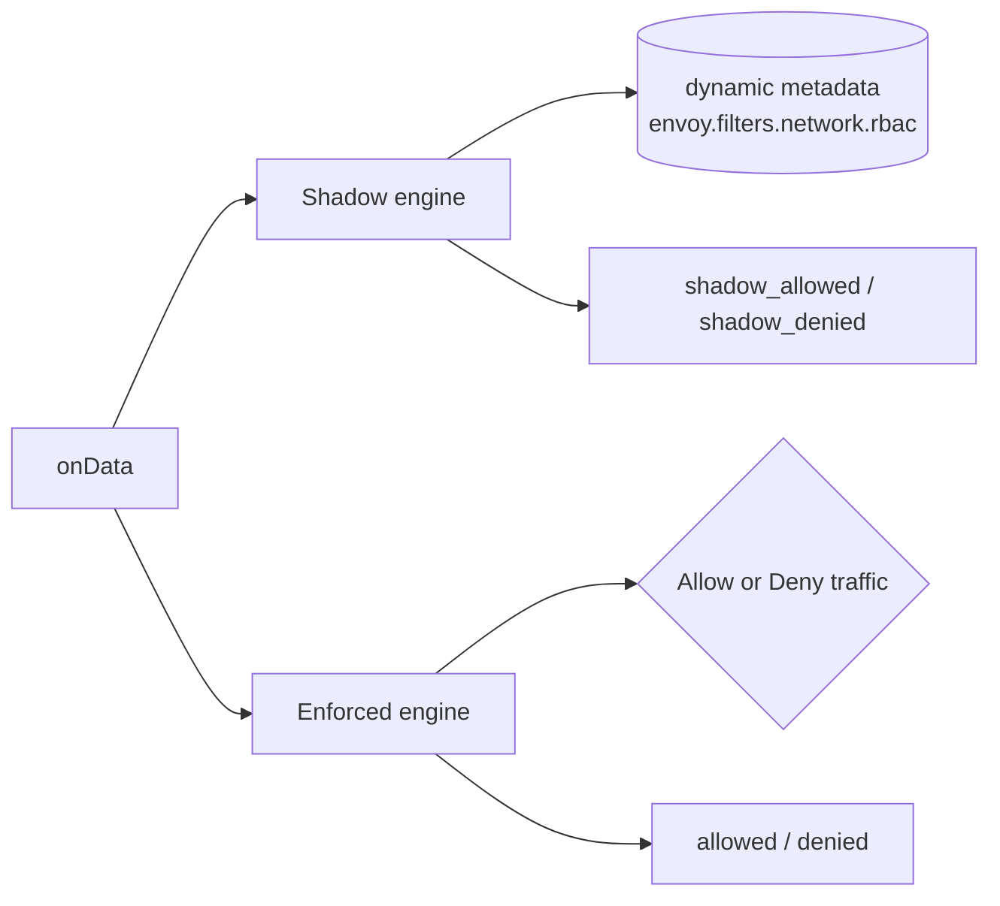
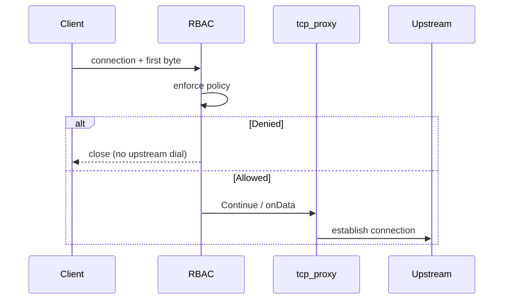

# RBAC Network Filter (`envoy.filters.network.rbac`)

Connection-level (L4) role-based access control. Evaluates the shared RBAC engine — either a policy map (`rules`) or an xDS matcher tree (`matcher`) — against connection attributes (source/destination IP and port, SNI, network namespace, SSL peer identity, filter state, dynamic metadata). Allowed connections continue through the filter chain; denied connections are closed (optionally after a configurable delay). A parallel shadow engine records “what would have happened” into dynamic metadata and shadow stats without affecting traffic.

Unlike the [HTTP RBAC filter](../../http/rbac/), this filter has no HTTP headers or paths. Config-time validation rejects header-based principals/permissions, and matcher inputs are restricted to an L4 allow-list.

Proto: `envoy.extensions.filters.network.rbac.v3.RBAC`.
Type URL: `type.googleapis.com/envoy.extensions.filters.network.rbac.v3.RBAC`.
Shared engine: [`source/extensions/filters/common/rbac`](../../common/rbac/README.md).

## Files

- `config.h` / `config.cc` — `RoleBasedAccessControlNetworkFilterConfigFactory`. Validates that configured `rules` / `shadow_rules` contain no HTTP-header principals/permissions (`config.cc:25-75`) and installs a `RoleBasedAccessControlFilter` read filter.
- `rbac_filter.h` / `rbac_filter.cc` — `ActionValidationVisitor` (allowed matcher input types), `RoleBasedAccessControlFilterConfig` (primary + shadow engines and stats), and the filter itself.

## Architecture



Engine selection (`Filters::Common::RBAC::createEngine` / `createShadowEngine`):

| Proto field | Engine | Notes |
|---|---|---|
| `matcher` | `RoleBasedAccessControlMatcherEngineImpl` | Prefer over `rules` if both set (rules ignored with warn) |
| `rules` | `RoleBasedAccessControlEngineImpl` | Legacy policy map |
| neither | `nullptr` | Filter allows by default |
| `shadow_matcher` / `shadow_rules` | same pairing for shadow | Never closes the connection |

## Where it sits in the listener



Place RBAC **before** filters that open upstream connections (notably `tcp_proxy`). With default TCP-proxy `IMMEDIATE` connect mode, the upstream may already be dialed before RBAC runs on the first byte — see [Usage with TCP Proxy](#usage-with-tcp-proxy).

## Lifecycle



### Hook details

- `onNewConnection()` — returns `Continue` unchanged (`rbac_filter.h:71`). L4 RBAC decides at `onData` time so downstream address info (e.g. original destination) and SSL peer certificate information are populated.
- `onData()` (`rbac_filter.cc:42-107`) — the decision point:
  1. If `is_delay_denied_`, return `StopIteration` (connection is awaiting the delay timer).
  2. Emit verbose debug line with SNI / addresses / SSL SANs / dynamic metadata (`rbac_filter.cc:47-64`).
  3. Run shadow engine, then enforced engine. Caching depends on `enforcement_type` (below).
  4. `Allow` → `Continue`; `Deny` → set termination details, optionally start delay timer, return `StopIteration`; no engine → `Continue`.
- `onEvent()` (`rbac_filter.cc:118-122`) — on close, disables and drops `delay_timer_`.

## Decision flow



### Enforcement type

| `enforcement_type` | Behavior |
|---|---|
| `ONE_TIME_ON_FIRST_BYTE` (default) | Shadow and enforced engines each run once; results cached in `shadow_engine_result_` / `engine_result_` (`Unknown` sentinel). Later `onData` calls reuse the cache. |
| `CONTINUOUS` | Both engines run on **every** `onData`. Use with protocol filters (Mongo, MySQL, Kafka, …) that emit dynamic metadata as messages are decoded so policies can react to per-message resources/ops. |



### `checkEngine()` (`rbac_filter.cc:134-168`)

1. Fetch engine for `EnforcementMode::{Enforced,Shadow}`; missing engine → `{None, "none"}`.
2. Call `engine->handleAction(connection, streamInfo, &effective_policy_id)`.
3. On allow/deny: bump `allowed`/`denied` or `shadow_allowed`/`shadow_denied`; for shadow hits also call `setDynamicMetadata()`.
4. Return `{Allow|Deny, policy_id}` (`policy_id` is `"none"` when empty).

## Policy evaluation (shared engine)

The network filter always uses the header-less `handleAction(connection, info, id*)` overload, which substitutes empty request headers.

### Legacy `rules` (`RoleBasedAccessControlEngineImpl`)



- Empty `rules` present → deny all (no policies can match under `ALLOW`; under `DENY` every connection “matches nothing” so is allowed — prefer an explicit policy).
- Absent `rules` and `matcher` → no engine → filter allows by default.

### Matcher tree (`RoleBasedAccessControlMatcherEngineImpl`)



Matcher inputs allowed by `ActionValidationVisitor` (`rbac_filter.cc:18-35`):

| Input | Purpose |
|---|---|
| `DestinationIPInput` / `DestinationPortInput` | Local/original destination |
| `SourceIPInput` / `SourcePortInput` | Peer address |
| `DirectSourceIPInput` | Direct remote (pre-proxy) address |
| `ServerNameInput` | SNI / requested server name |
| `NetworkNamespaceInput` | Network namespace |
| `UriSanInput` / `DnsSanInput` / `SubjectInput` | Peer certificate identity |
| `FilterStateInput` | Connection filter state |

Any other input type fails config with `RBAC network filter cannot match '<type_url>'`.

### L4-applicable principals / permissions

Useful at connection scope (non-exhaustive):

**Principals** — `any`, `authenticated` (SPIFFE / SAN / subject), `source_ip` / `direct_remote_ip` / `remote_ip`, `filter_state`, `metadata` / `sourced_metadata`, `and_ids` / `or_ids` / `not_id`, extension principals (e.g. `MtlsAuthenticated`).

**Permissions** — `any`, `destination_ip` / `destination_port` / port ranges, `requested_server_name`, `metadata` / `sourced_metadata`, `and_rules` / `or_rules` / `not_rule`, extension matchers (e.g. upstream IP/port).

**Rejected at config time** — any nested `header` permission or principal (`config.cc:25-75`). Prefer the HTTP RBAC filter for header/path/method rules.

## Delay deny



Purpose: blunt aggressive client reconnect loops after rejection. Close reason string is always `rbac_deny_close`.

## Shadow mode

Shadow evaluation always runs (when configured) **before** enforcement and never closes the connection.



Metadata keys (under filter name `envoy.filters.network.rbac`), optionally prefixed by `shadow_rules_stat_prefix`:

| Key | Values |
|---|---|
| `<prefix>shadow_effective_policy_id` | Matched shadow policy name (omitted if empty) |
| `<prefix>shadow_engine_result` | `allowed` or `denied` |

Use shadow rules to dry-run a new policy set in production before flipping it to `rules` / `matcher`.

## Usage with TCP Proxy

Default `tcp_proxy` dials upstream on accept (`IMMEDIATE`), which can race ahead of RBAC’s first-byte check. Delay upstream establishment:

```yaml
filter_chains:
- filters:
  - name: envoy.filters.network.rbac
    typed_config:
      "@type": type.googleapis.com/envoy.extensions.filters.network.rbac.v3.RBAC
      stat_prefix: tcp
      rules:
        action: ALLOW
        policies:
          "require-mtls":
            permissions:
            - any: true
            principals:
            - authenticated:
                principal_name:
                  exact: "spiffe://cluster.local/ns/default/sa/frontend"
  - name: envoy.filters.network.tcp_proxy
    typed_config:
      "@type": type.googleapis.com/envoy.extensions.filters.network.tcp_proxy.v3.TcpProxy
      stat_prefix: tcp
      cluster: backend
      upstream_connect_mode: ON_DOWNSTREAM_DATA
      max_early_data_bytes: 8192
```



- `ON_DOWNSTREAM_DATA` — wait for application data (RBAC runs first).
- `ON_DOWNSTREAM_TLS_HANDSHAKE` — wait for TLS completion when policies need client certs (`authenticated` principals) and the client may not send early data.
- Server-first protocols (SMTP, MySQL greeting, …) generally cannot use `ON_DOWNSTREAM_DATA`; keep `IMMEDIATE` and accept that upstream may connect before RBAC decides.

## Configuration

| Field | Role |
|---|---|
| `stat_prefix` | Required base prefix for stats. |
| `rules` | Enforced `envoy.config.rbac.v3.RBAC` policy map. Absent → no enforced engine. Present + empty → deny under typical `ALLOW` action. |
| `matcher` | Enforced xDS matcher tree (wins over `rules`). Unmatched → deny. |
| `shadow_rules` / `shadow_matcher` | Non-enforcing twin; emits metrics + dynamic metadata only. |
| `shadow_rules_stat_prefix` | Extra prefix distinguishing shadow stats/metadata when multiple RBAC filters exist. |
| `enforcement_type` | `ONE_TIME_ON_FIRST_BYTE` (default) or `CONTINUOUS`. |
| `delay_deny` | Hold a denied connection this long before close; unset/0 = immediate. |

## Stats

Generated via `Filters::Common::RBAC::generateStats(stat_prefix, "", shadow_rules_stat_prefix, scope)` → namespace `<stat_prefix>.rbac.` (shadow under `<stat_prefix>.rbac.<shadow_rules_stat_prefix>.` when set):

| Counter | Meaning |
|---|---|
| `allowed` | Enforced engine allowed the connection (or evaluation) |
| `denied` | Enforced engine denied |
| `shadow_allowed` | Shadow engine would allow |
| `shadow_denied` | Shadow engine would deny |

Per-policy dynamic counters are available through the shared stats helper (`…policy.<name>.{allowed,denied,…}`) but the network filter currently only increments the aggregate counters above.

## Dynamic metadata & access logs

| Namespace / key | When | Content |
|---|---|---|
| `envoy.filters.network.rbac` → `shadow_*` | Shadow hit | See [Shadow mode](#shadow-mode) |
| `envoy.common` → `access_log_hint` | Enforced engine action `LOG` | `true` if a policy matched, else `false` |
| Connection termination details | Enforced deny | `rbac_access_denied_matched_policy[<policy>]` (`policy` is `none` if unmatched; whitespace → `_`) |

## Factory

`RoleBasedAccessControlNetworkFilterConfigFactory` registers as a `NamedNetworkFilterConfigFactory` (`config.cc:91`). `createFilterFactoryFromProtoTyped`:

1. `validateRbacRules` on `rules` and `shadow_rules` (reject headers).
2. Build shared `RoleBasedAccessControlFilterConfig` (creates engines + stats; matcher input validation runs during matcher-engine construction).
3. Return a callback that `addReadFilter`s a per-connection `RoleBasedAccessControlFilter`.

## Related docs

- User-facing config: `docs/root/configuration/listeners/network_filters/rbac_filter.rst`
- Shared engine internals: [`../../common/rbac/README.md`](../../common/rbac/README.md)
- HTTP sibling: [`../../http/rbac/`](../../http/rbac/)
- API: `envoy.extensions.filters.network.rbac.v3.RBAC` / `envoy.config.rbac.v3.RBAC`
