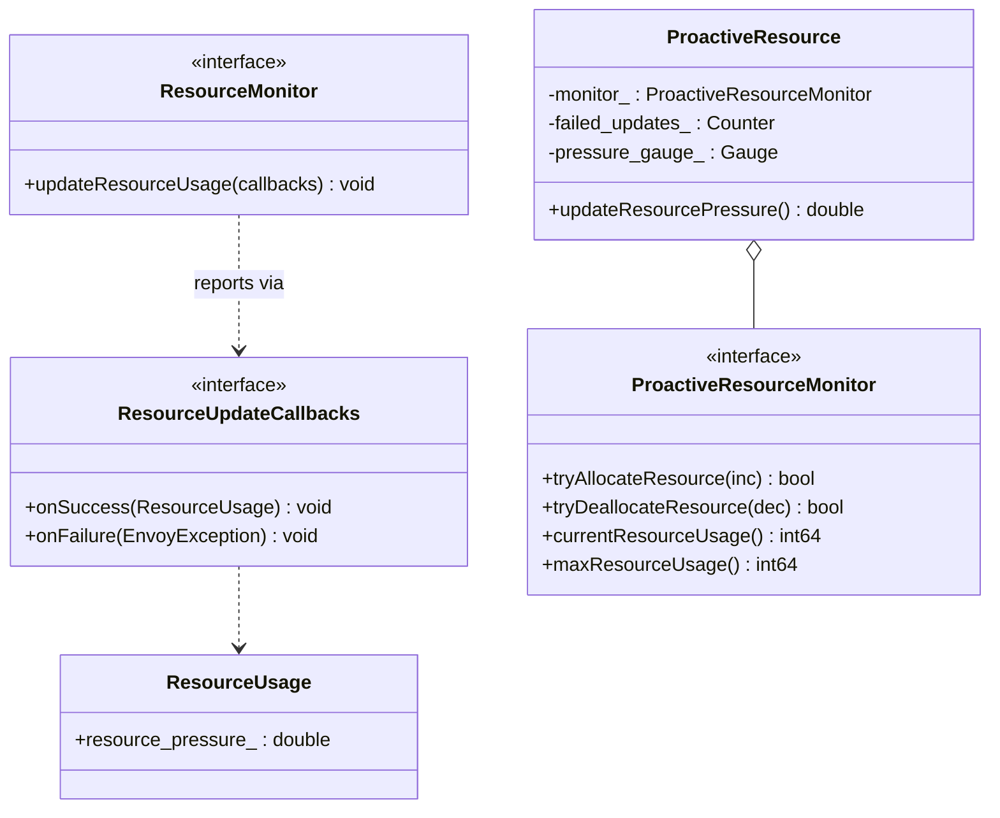
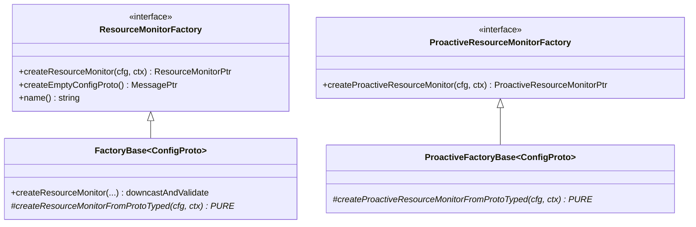
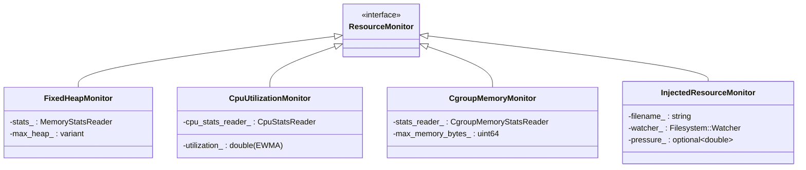
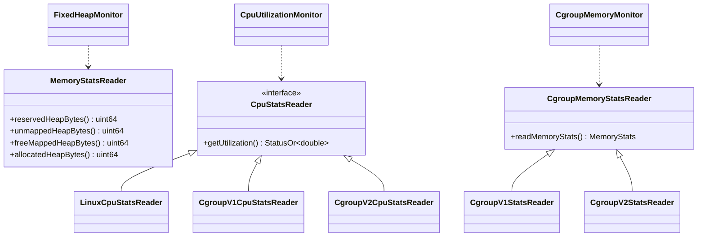
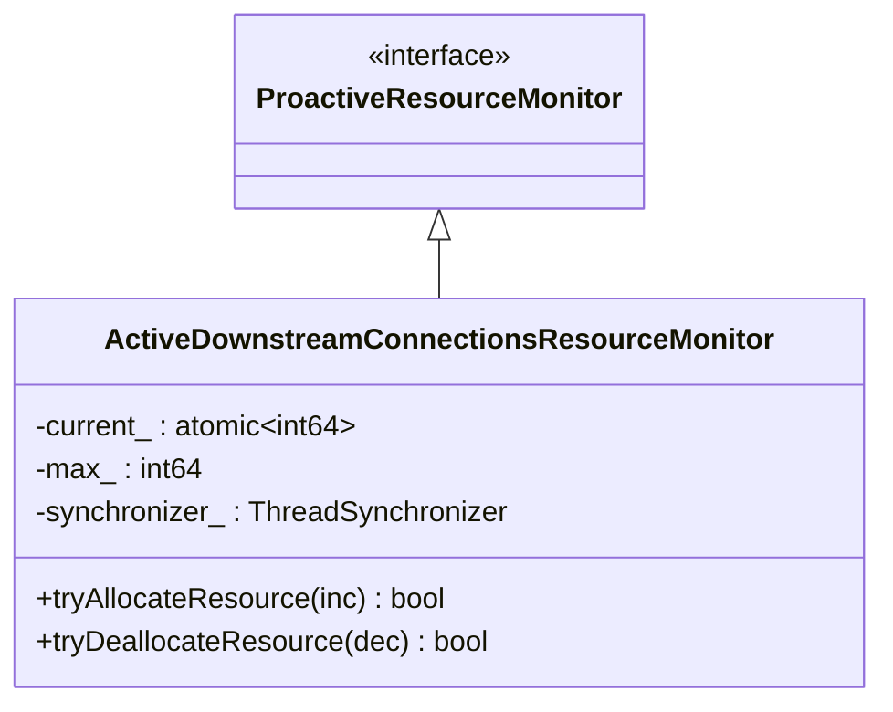
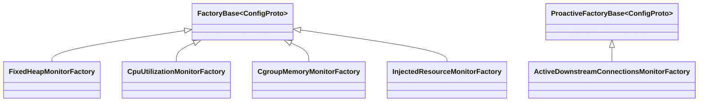

# Resource Monitors — Class Hierarchy

UML-style class diagrams for the resource monitor extensions. Documentation aids, not exhaustive.

## 1. The two interface models

## 2. Factory bases (common/)

## 3. Regular monitors

## 4. Stats-reader seams

## 5. The proactive monitor

## 6. Each monitor's factory

All regular factories register against `ResourceMonitorFactory`; the proactive one registers
against `ProactiveResourceMonitorFactory`. Category for both: `envoy.resource_monitors`.
