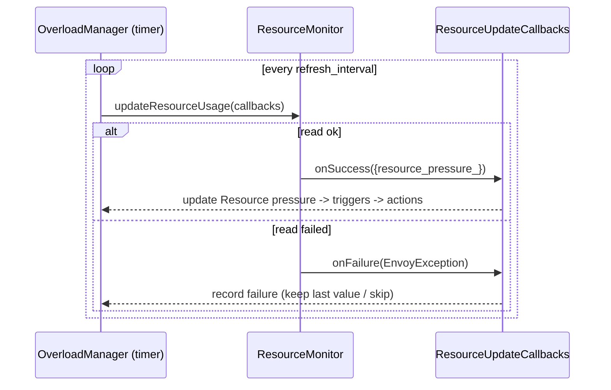
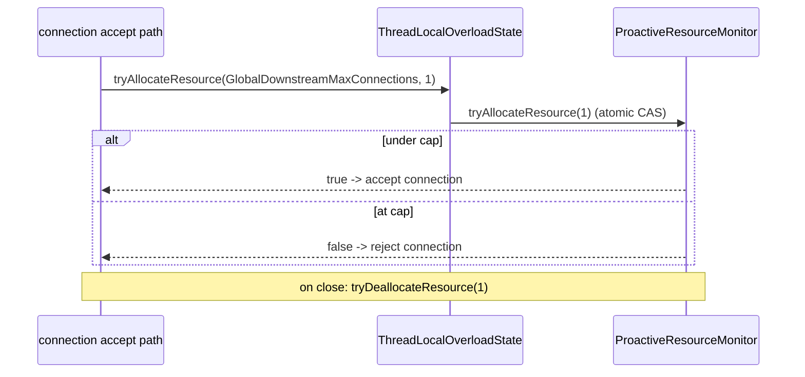
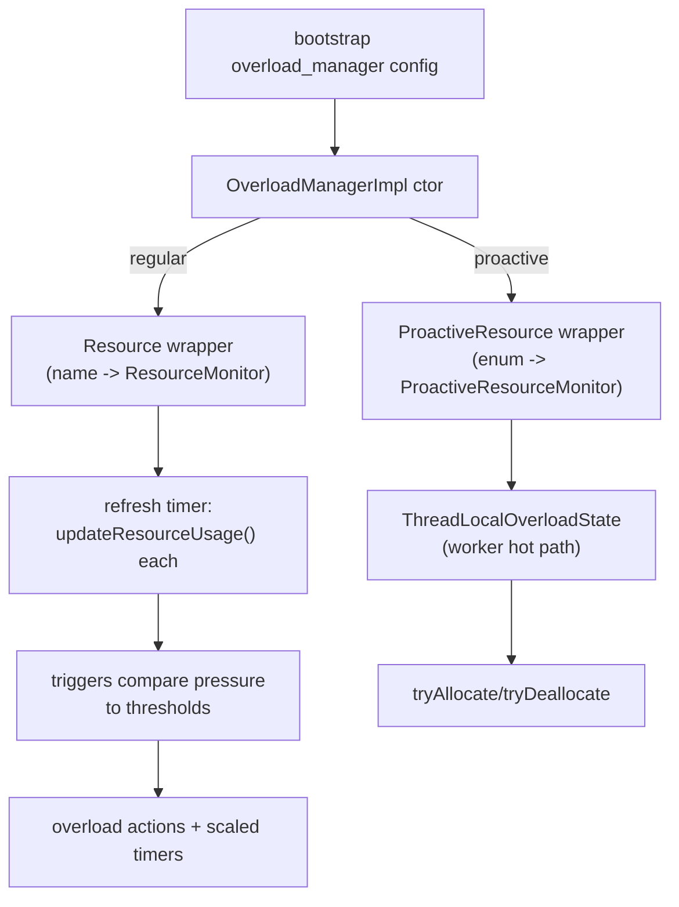

# Resource Monitors — Overview

This document covers the two interface models, the factory/registration pattern, and how the
overload manager consumes each kind of monitor.

## 1. The regular (polled) model

`Server::ResourceMonitor` (`envoy/server/resource_monitor.h`) is a pure pull interface:

```cpp
class ResourceMonitor {
  // Must be non-blocking; async work should invoke the callback when done.
  virtual void updateResourceUsage(ResourceUpdateCallbacks& callbacks) PURE;
};
```

The monitor never *returns* a value — it reports through callbacks:

```cpp
struct ResourceUsage {
  double resource_pressure_;   // (usage) / (limit), conventionally 0.0–1.0
};
class ResourceUpdateCallbacks {
  virtual void onSuccess(const ResourceUsage& usage) PURE;
  virtual void onFailure(const EnvoyException& error) PURE;
};
```

The overload manager calls `updateResourceUsage()` once per refresh interval. The callback design
exists because a monitor *may* need to do async I/O (e.g. an RPC) before it can answer — though in
practice all the in-tree monitors compute synchronously and call back inline.



## 2. The proactive (accounting) model

`Server::ProactiveResourceMonitor` (`envoy/server/proactive_resource_monitor.h`) is for hot-path
limits that can't tolerate poll latency:

```cpp
class ProactiveResourceMonitor {
  virtual bool tryAllocateResource(int64_t increment) PURE;
  virtual bool tryDeallocateResource(int64_t decrement) PURE;
  virtual int64_t currentResourceUsage() const PURE;
  virtual int64_t maxResourceUsage() const PURE;
};
```

Instead of being asked "what's your pressure?", data-path code calls `tryAllocateResource(n)`
synchronously; it returns `false` (and allocates nothing) if the increment would breach the max.
The overload manager wraps each in a `ProactiveResource` that adds a failure counter and a
pressure gauge, deriving pressure lazily:

```cpp
double updateResourcePressure() {
  const double pressure = double(monitor_->currentResourceUsage())
                        / double(monitor_->maxResourceUsage());
  pressure_gauge_.set(pressure * 100);
  return pressure;
}
```

Proactive resources are keyed by an enum and exposed to worker threads through
`ThreadLocalOverloadState::tryAllocateResource/tryDeallocateResource`. The only one defined today
is `GlobalDownstreamMaxConnections`:

```cpp
// envoy/server/overload/thread_local_overload_state.h
enum class OverloadProactiveResourceName { GlobalDownstreamMaxConnections };
const std::string GlobalDownstreamMaxConnections =
    "envoy.resource_monitors.global_downstream_max_connections";
```



## 3. The factory / registration pattern (`common/`)

Every monitor registers under the `envoy.resource_monitors` category. The shared
`common/factory_base.h` provides two CRTP-style bases that remove the proto downcast/validation
boilerplate:

```cpp
template <class ConfigProto>
class FactoryBase : public Server::Configuration::ResourceMonitorFactory {
  ResourceMonitorPtr createResourceMonitor(const Protobuf::Message& config,
                                           ResourceMonitorFactoryContext& context) override {
    return createResourceMonitorFromProtoTyped(
        MessageUtil::downcastAndValidate<const ConfigProto&>(config,
            context.messageValidationVisitor()), context);
  }
  ProtobufTypes::MessagePtr createEmptyConfigProto() override {
    return std::make_unique<ConfigProto>();
  }
  // subclass implements:
  virtual ResourceMonitorPtr createResourceMonitorFromProtoTyped(const ConfigProto&,
      ResourceMonitorFactoryContext&) PURE;
};
```

`ProactiveFactoryBase<ConfigProto>` is identical but produces a `ProactiveResourceMonitorPtr` via
`createProactiveResourceMonitor`. Each concrete factory just passes its well-known name to the
base constructor, implements the typed create method, and registers with `REGISTER_FACTORY` in its
`config.cc`. The factory receives a `ResourceMonitorFactoryContext` (see
[`../../server/factory_context/`](../../server/factory_context/OVERVIEW.md) §6) exposing
dispatcher, options, api, runtime, and validation visitor.

## 4. How the overload manager consumes them



The framework details (triggers, actions, scaled timers, thread-local publication) live in the
overload manager docs; this folder is purely the set of sensors plugged into it.

See `monitors.md` for the exact pressure computation of each concrete monitor.
