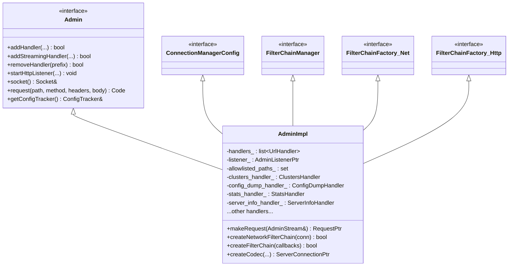
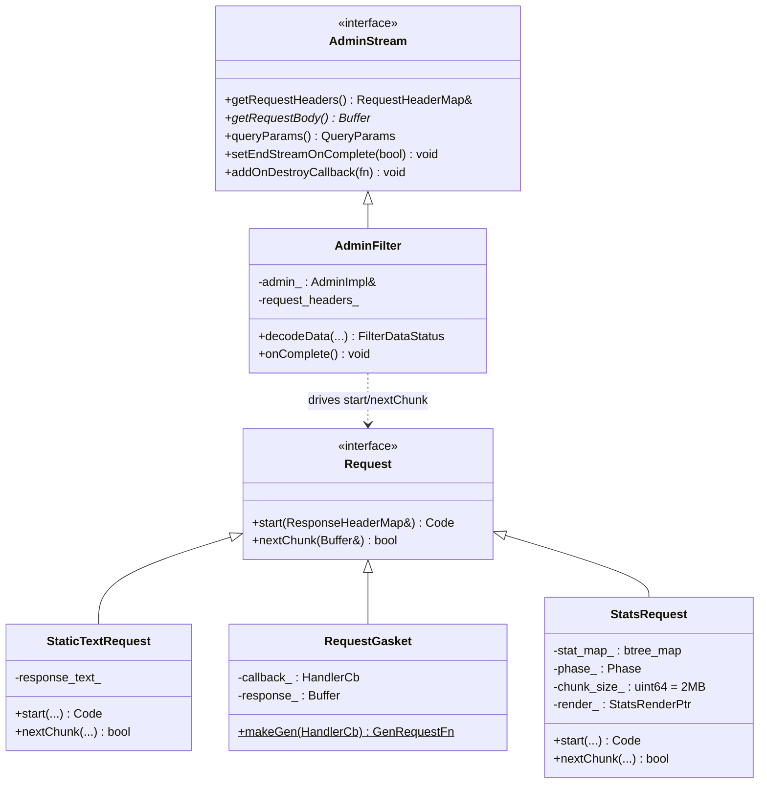
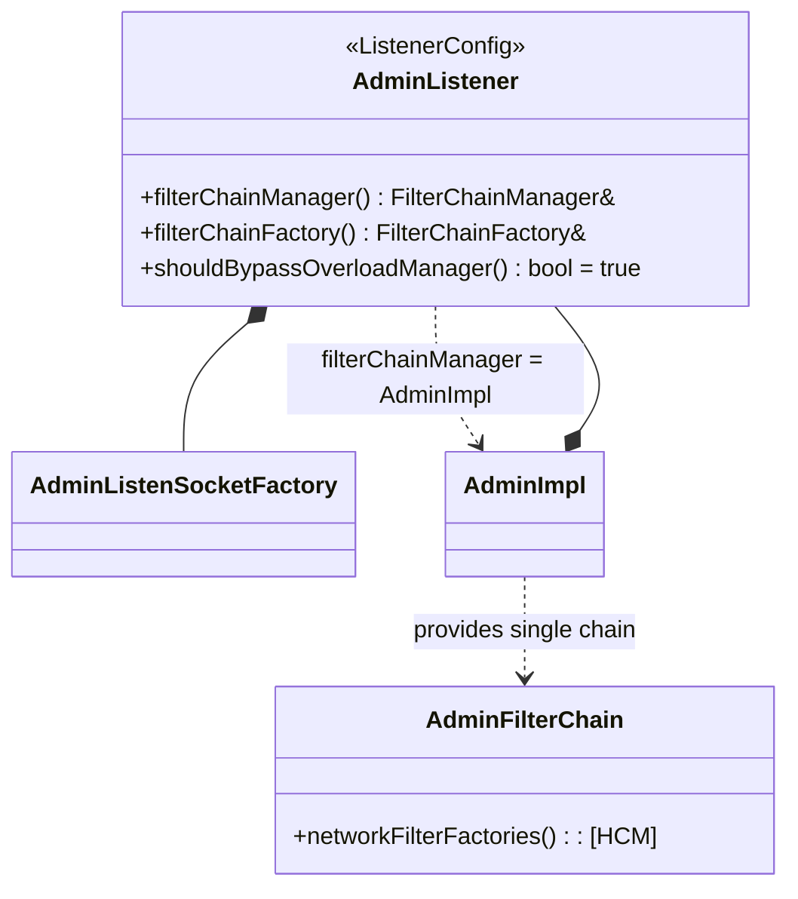
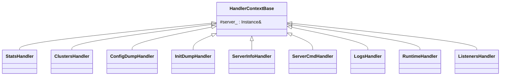
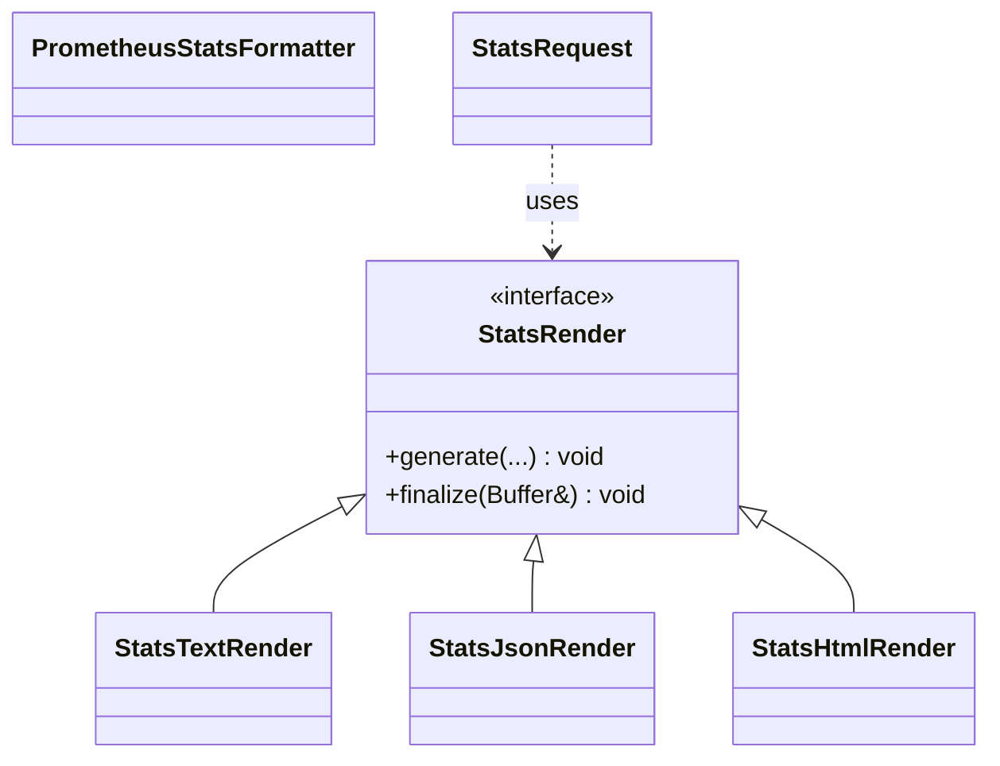
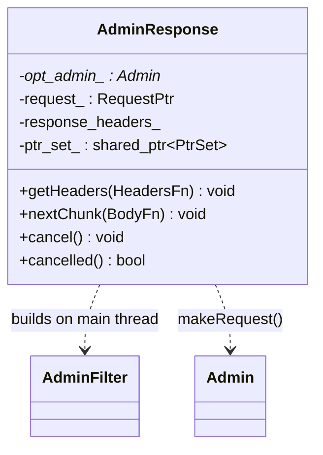

# Admin Console — Class Hierarchy

UML-style class diagrams for the admin subsystem. Documentation aids, not exhaustive.

## 1. `AdminImpl` and the interfaces it implements

## 2. The request / stream types

## 3. The listener wiring (nested in `AdminImpl`)

## 4. Handler classes

All endpoint handlers derive from `HandlerContextBase` (holds `Server::Instance& server_`)
and are owned as direct members of `AdminImpl`.

| Handler | Endpoint(s) |
|---------|-------------|
| `StatsHandler` | `/stats`, `/stats/prometheus`, `/stats/recentlookups*`, `/reset_counters`, `/contention` |
| `ClustersHandler` | `/clusters` |
| `ConfigDumpHandler` | `/config_dump` |
| `InitDumpHandler` | `/init_dump` |
| `ServerInfoHandler` | `/server_info`, `/ready`, `/certs`, `/hot_restart_version`, `/memory` |
| `ServerCmdHandler` | `/quitquitquit`, `/healthcheck/fail`, `/healthcheck/ok` (POST) |
| `LogsHandler` | `/logging` (POST), `/reopen_logs` (POST) |
| `RuntimeHandler` | `/runtime`, `/runtime_modify` (POST) |
| `ListenersHandler` | `/listeners`, `/drain_listeners` (POST) |
| `ProfilingHandler` / `TcmallocProfilingHandler` | `/cpuprofiler`, `/heapprofiler`, `/heap_dump`, `/allocprofiler` |

## 5. Stats rendering

## 6. Out-of-network responses

`AdminResponse` bridges the synchronous, main-thread admin machinery to a thread-safe,
flow-controlled, cancellable API usable from any thread. The shared `PtrSet` allows the
server to terminate all in-flight responses on shutdown.
