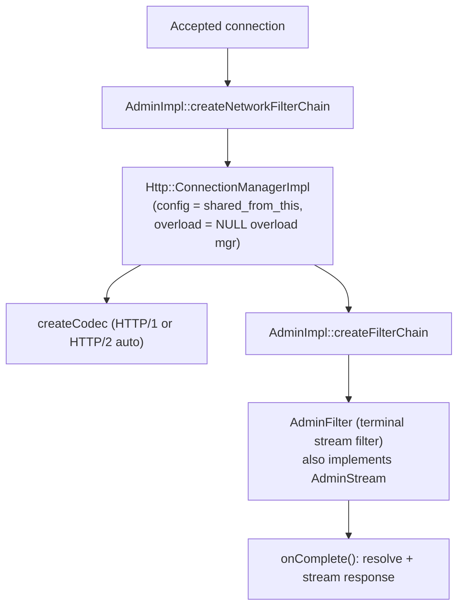
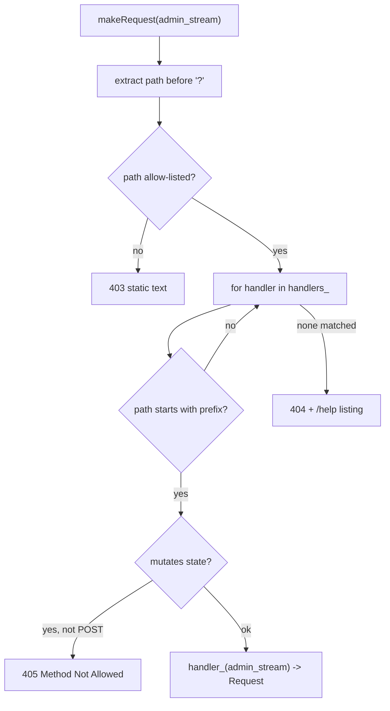
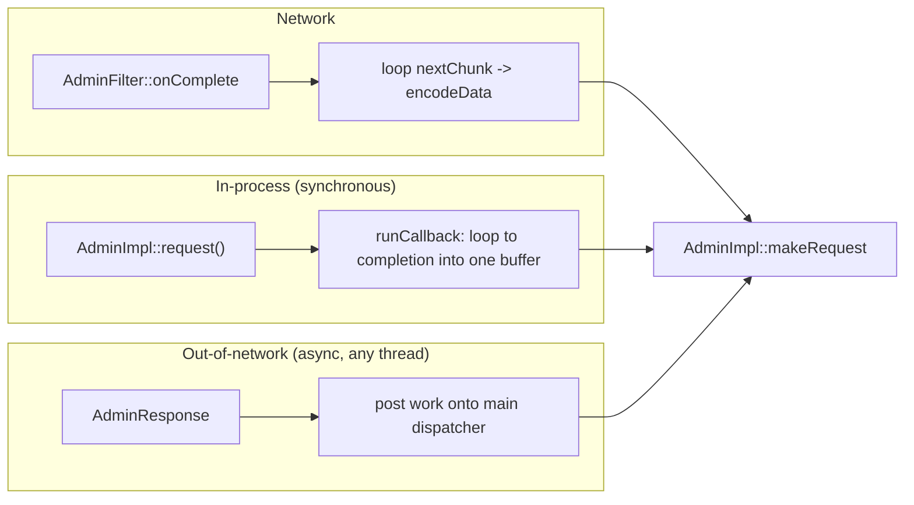

# Admin Console — Overview

This document explains how the admin server is wired, how requests are dispatched, how
responses stream, and the three different ways admin work gets executed.

## 1. Running on its own listener

`AdminImpl::startHttpListener()` creates a `TcpListenSocket`, calls `listen()`, wraps it in
an `AdminListenSocketFactory`, and builds an `AdminListener` (a `Network::ListenerConfig`).
The `AdminListener` is special:

- It returns `AdminImpl` itself as both the `FilterChainManager` and the
  `FilterChainFactory` (one hard-coded chain).
- It uses a no-op connection balancer.
- `shouldBypassOverloadManager()` returns `true` — admin ignores overload.
- It reuses the server's init manager.

The listener is wired into a worker connection handler via `addListenerToHandler()`.

## 2. The per-connection / per-request stack



`AdminFilter` always **buffers the whole request** (admin requests are not streamed in),
and on end-of-stream calls `onComplete()`.

`AdminStream` (the interface `AdminFilter` implements) is how handlers reach the request:
`getRequestHeaders()`, `getRequestBody()`, `queryParams()` (merges URL query and
form-urlencoded body), `getDecoderFilterCallbacks()`, `setEndStreamOnComplete()`, and
`addOnDestroyCallback()`.

## 3. Handler registration and dispatch

All handlers live in one ordered list, `std::list<UrlHandler> handlers_`. A `UrlHandler`
records the `prefix_`, `help_text_`, a `GenRequestFn handler_`, `removable_`,
`mutates_server_state_`, and `params_`.

Built-in endpoints are registered in the `AdminImpl` constructor via `makeHandler(...)`,
each typically using the `MAKE_ADMIN_HANDLER(fn)` macro that adapts a member function into a
`HandlerCb`. Dynamic handlers (e.g. RDS adding a debug endpoint) call the same public
`addHandler`/`addStreamingHandler` at runtime.

Dispatch is **linear, ordered, prefix-based** against the path before `?` — the first
matching handler wins, so registration order matters:



## 4. The streaming `Request` model

A `Request` is the per-request state object with two methods (`envoy/server/admin.h`):

```cpp
virtual Http::Code start(Http::ResponseHeaderMap& response_headers) PURE;  // called once
virtual bool nextChunk(Buffer::Instance& response) PURE;                    // called repeatedly
```

`start()` sets the status and headers. `nextChunk()` appends up to a chunk's worth of bytes
and returns `true` if more chunks follow. The contract is deliberately loose: a `nextChunk`
may return `true` while adding *no* bytes (so a producer can defer for flow control), and
the caller is not required to drain after each call.

Three flavors:

| Flavor | File | Behavior |
|--------|------|----------|
| `StaticTextRequest` | `admin.cc` | Wraps fixed text/buffer (errors, 404, 405); emits it all in one `nextChunk`. |
| `RequestGasket` | `admin.cc` | Adapts a legacy `HandlerCb` — runs the whole callback into a buffer in `start()`, emits in one shot. This is how non-streaming handlers participate. |
| `StatsRequest` | `stats_request.{h,cc}` | The real streaming workhorse for `/stats`. |

### Why streaming matters: `StatsRequest`

A busy Envoy can have *millions* of stats. Buffering them all before sending would risk OOM
and heap fragmentation. `StatsRequest` instead walks stats lazily:

- A default chunk size of **2 MB**.
- An alphabetically-ordered `btree_map` of candidate stats/scopes.
- Three sequential phases (TextReadouts → CountersAndGauges → Histograms) to preserve the
  historical output ordering.
- A polymorphic `StatsRender` (Text / JSON / HTML / Prometheus) so the traversal is
  format-agnostic.

`nextChunk()` renders leaf metrics into `response` until ~`chunk_size_` bytes accumulate,
then returns `true`, yielding control back to the caller (which can write the chunk to the
socket and come back for more).

## 5. Three execution paths

The same `makeRequest()` dispatch powers three different callers:



- **Network path** — normal HTTP clients hitting the admin port. `AdminFilter` drives the
  chunk loop and pushes each chunk to the codec.
- **In-process path** — `AdminImpl::request(path, method, ...)` runs a handler synchronously
  to completion into a single buffer. Runs on the main thread.
- **Out-of-network path** — `AdminResponse` (`source/exe/admin_response.*`) lets code
  outside the listener (e.g. the hot-restart parent) run an admin request and consume it
  chunk-by-chunk with cross-thread flow control. Its public API is callable from any
  thread; the actual admin work is always `post()`ed onto the server's main dispatcher, and
  callbacks are guarded by a mutex. A shared `PtrSet` lets the server force-terminate
  pending responses (with a 503) on shutdown, even if `AdminResponse` outlives the server.

## 6. Config dump tracking

`/config_dump` is fed by a registry, `ConfigTrackerImpl`. Subsystems register a callback
that produces their current config as a proto; the handler invokes all of them. Registration
uses a `shared_ptr<CbsMap>` with RAII `EntryOwner` handles, so a provider can deregister
safely when it is destroyed.

## 7. Design patterns recap

- **Streaming-first with a legacy adapter** — one pipeline (`start`/`nextChunk`); simple
  handlers retrofitted via `RequestGasket`.
- **Impersonate the HCM** — reuse Envoy's HTTP stack instead of a custom server.
- **Resilience under overload** — null overload manager + connection-limit bypass.
- **Secure registration** — XSS-hostile prefixes rejected; mutating endpoints POST-only.
- **Renderer polymorphism** — `StatsRender` abstracts Text/JSON/HTML/Prometheus.
- **Threading** — network handling on a worker; `request()` and `AdminResponse` on the main
  thread; `AdminResponse` is the only piece needing explicit mutexes (foreign-thread API).
