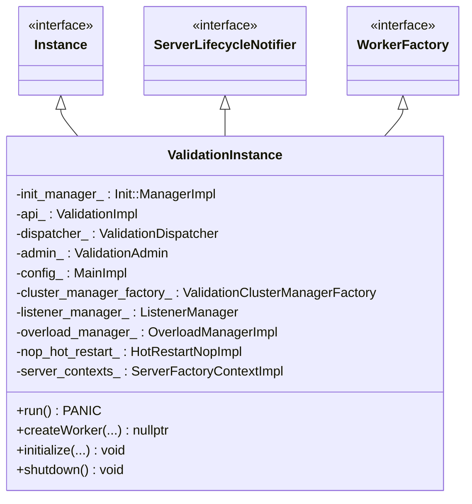
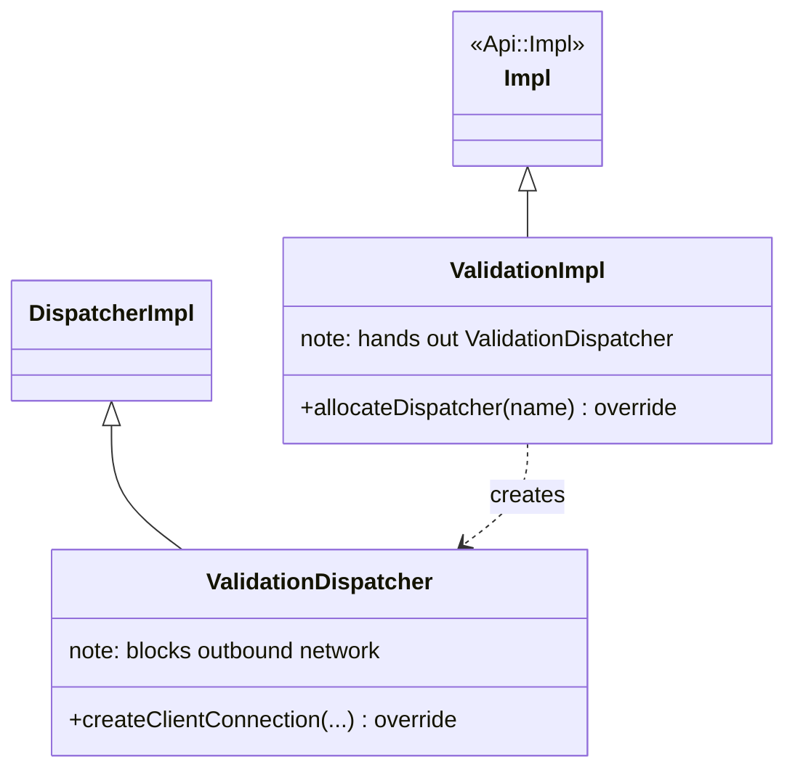
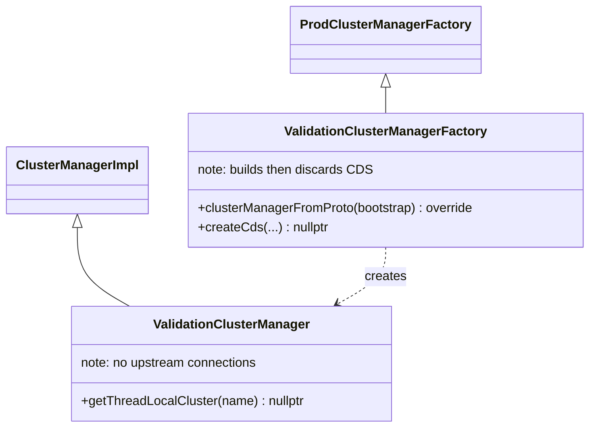
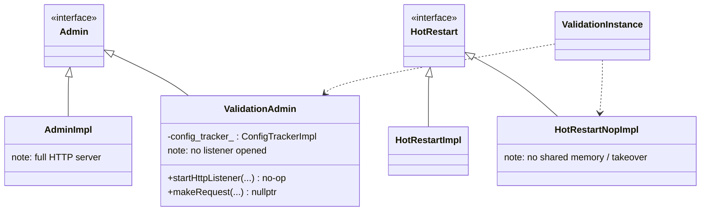
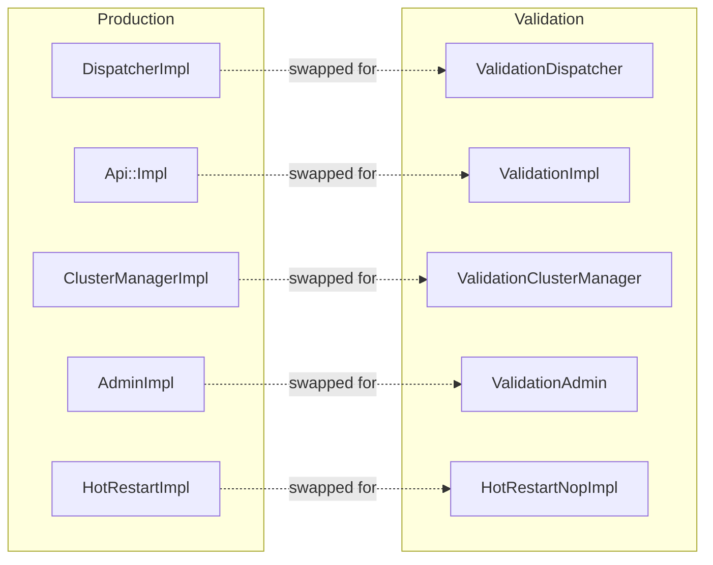

# Config Validation — Class Hierarchy

UML-style class diagrams for the validation stubs versus their production counterparts.
Documentation aids, not exhaustive.

## 1. The validation instance

`ValidationInstance` is its own `WorkerFactory` (it returns `nullptr` workers, since none run)
and its own lifecycle notifier (callbacks return `nullptr` handles).

## 2. Stub vs. production: dispatcher and API

## 3. Stub vs. production: cluster manager

## 4. Stub vs. production: admin and hot restart

## 5. The substitution map

Everything not in this map (config parsing, factories, filter-chain building, runtime,
overload manager, secret manager, SSL context manager) is the **same code** the serving server
runs — that's what gives validation its fidelity.
