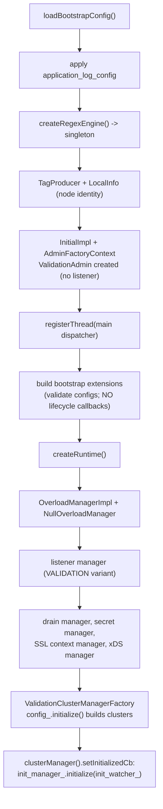

# Config Validation — Overview

This document walks through the `ValidationInstance` lifecycle, its stripped-down
`initialize()`, and how each stub prevents observable side effects.

## 1. `ValidationInstance`

`ValidationInstance` (`server.h`) implements `Server::Instance`, `ServerLifecycleNotifier`,
and `WorkerFactory`. Most of the `Instance` interface is satisfied by delegating to
validation-specific members; the methods that only matter at serving time are stubbed:

```cpp
void run() override { PANIC("not implemented"); }                 // never serves
void drainListeners(...) override {}                              // no-op
void failHealthcheck(bool) override {}                            // no-op
HotRestart& hotRestart() override { return nop_hot_restart_; }    // no-op hot restart
WorkerPtr createWorker(...) override { return nullptr; }          // no workers needed
void flushStats() override {}                                     // no stats flushing
bool isShutdown() override { return false; }
```

The member declaration order is carefully chosen (and commented in the header) so that
initialization continuation — which can happen at any time during member lifetime — always has
valid references: `init_manager_` first, then `secret_manager_` before the listener manager /
config / dispatcher that may reference it.

## 2. The stripped-down `initialize()`

`ValidationInstance::initialize()` deliberately mirrors `InstanceBase::initialize()` but runs
only the side-effect-free subset:



Two important contrasts with the real flow:

- **Bootstrap extensions are constructed but their lifecycle callbacks are NOT invoked** —
  construction validates the config; the callbacks are serving-time actions with side effects.
- The **listener manager is created via a named factory** (`VALIDATION_LISTENER`) so a
  validation-appropriate listener manager is used.

If `initialize()` throws, the constructor logs the error, calls `shutdown()`, clears the
server factory-context singleton, and rethrows — `validateConfig()` catches it and returns
`false`.

## 3. The stubs and what they suppress

### `ValidationDispatcher` (`dispatcher.h`)

Subclasses `Event::DispatcherImpl` and overrides exactly one method —
`createClientConnection()` — because that's the gateway to outbound network I/O. Everything
else (timers, posts, file events) works normally so config that schedules work can still be
exercised.

### `Api::ValidationImpl` (`api.h`)

Subclasses `Api::Impl` and overrides the `allocateDispatcher()` overloads to hand out
`ValidationDispatcher`s instead of real ones. Otherwise it's the production API.

### `ValidationClusterManager` / `ValidationClusterManagerFactory` (`cluster_manager.h`)

```cpp
ThreadLocalCluster* getThreadLocalCluster(absl::string_view) override {
  // Returning nullptr prevents any calling code from creating real outbound networking.
  return nullptr;
}
```

The factory subclasses `ProdClusterManagerFactory` (so clusters are *built* and validated) but
`createCds()` builds then **discards** the CDS API and returns `nullptr` — no live xDS
subscription. The combination means clusters are constructed and checked, but nothing connects
upstream.

### `ValidationAdmin` (`admin.h`)

Implements `Server::Admin` so components that add/remove admin handlers during config build
work, but `startHttpListener()` and `makeRequest()` are no-ops / return `nullptr` — no admin
port is opened. It still holds a real `ConfigTrackerImpl` so handler registration succeeds.

### `HotRestartNopImpl`

Used directly as `nop_hot_restart_` — no shared memory, no domain socket, no parent takeover.
See [`../hot_restart/`](../hot_restart/OVERVIEW.md) §8.

## 4. Shutdown

`ValidationInstance::shutdown()` is an abbreviated version of `InstanceBase::terminate()` —
there are no workers to stop:

```cpp
void ValidationInstance::shutdown() {
  thread_local_.shutdownGlobalThreading();
  if (config_.clusterManager() != nullptr) config_.clusterManager()->shutdown();
  thread_local_.shutdownThread();
  dispatcher_->shutdown();
}
```

## 5. Fidelity vs. safety — the design tension

The whole subsystem is a balance: **maximize fidelity** (run real init code so real errors
surface) while **guaranteeing no side effects** (don't touch the network, the filesystem
beyond reading config, or other Envoy processes). The chosen technique — subclass the
production components and override only the few methods with side effects — keeps the
validation path tracking the real path as the codebase evolves, instead of drifting like a
parallel reimplementation would.
