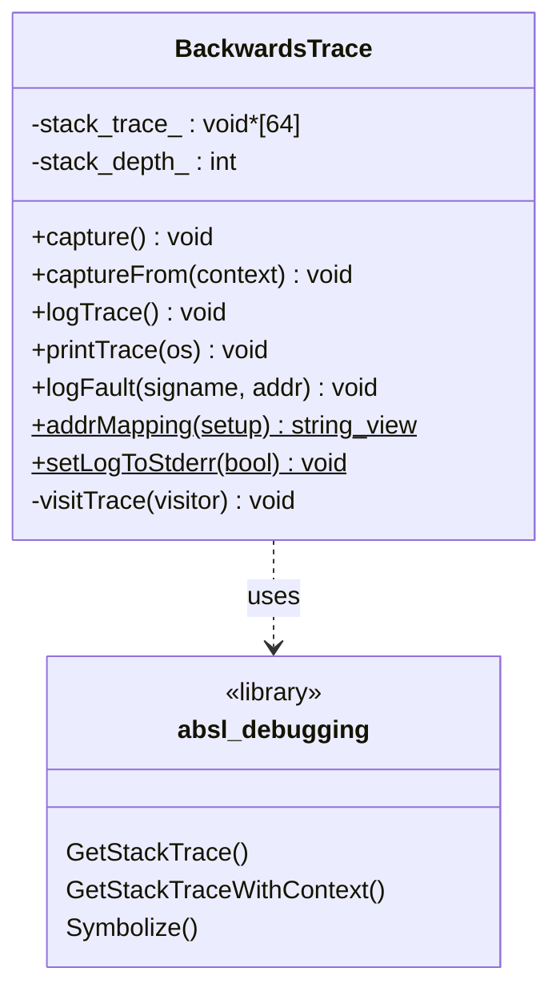
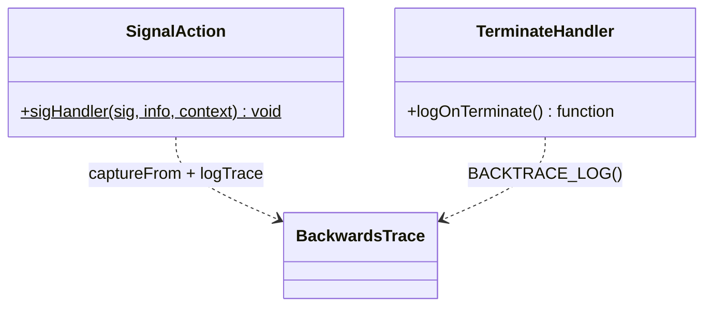
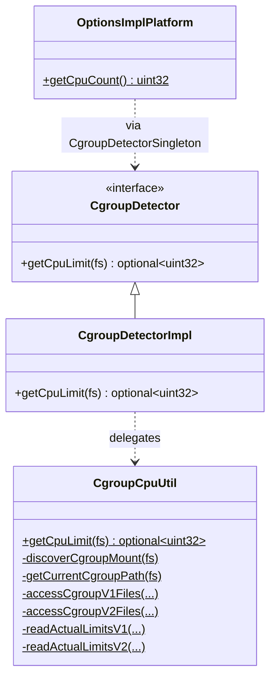
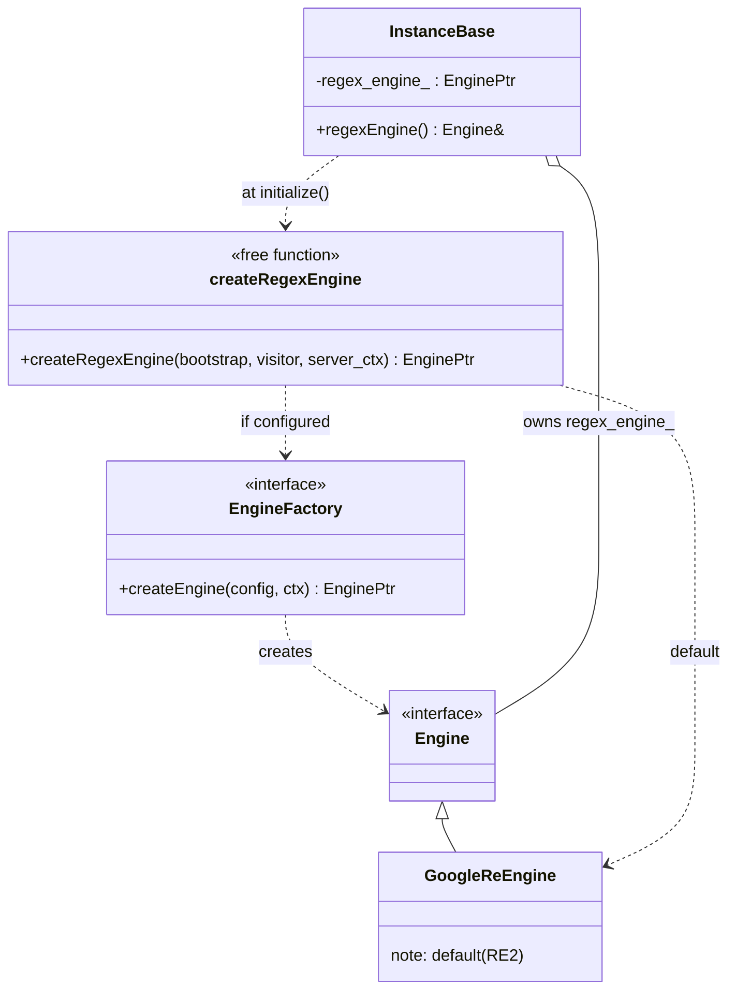
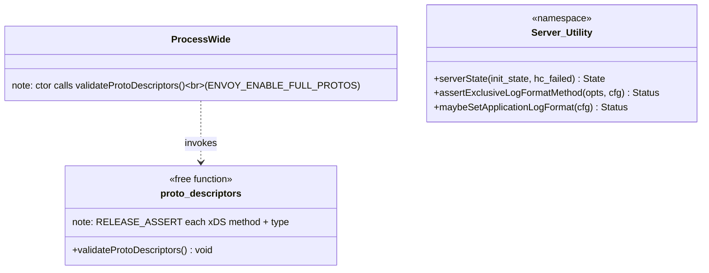

# Diagnostics & Process Support — Class Hierarchy

UML-style class diagrams for the diagnostics utilities. Documentation aids, not exhaustive.

## 1. `BackwardsTrace`

### Crash-path collaborators

## 2. cgroup CPU detection

`CgroupDetectorSingleton = ThreadSafeSingleton<CgroupDetectorImpl>`.

## 3. Regex engine wiring

## 4. Proto descriptor check & startup helpers (free functions)

These are namespaced free functions rather than classes — they hold no state, just perform a
startup check or a one-shot mapping/format operation.
