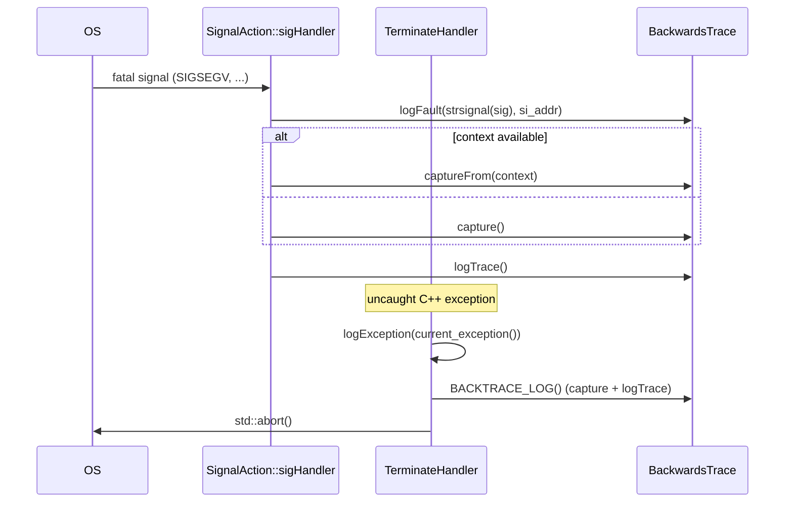
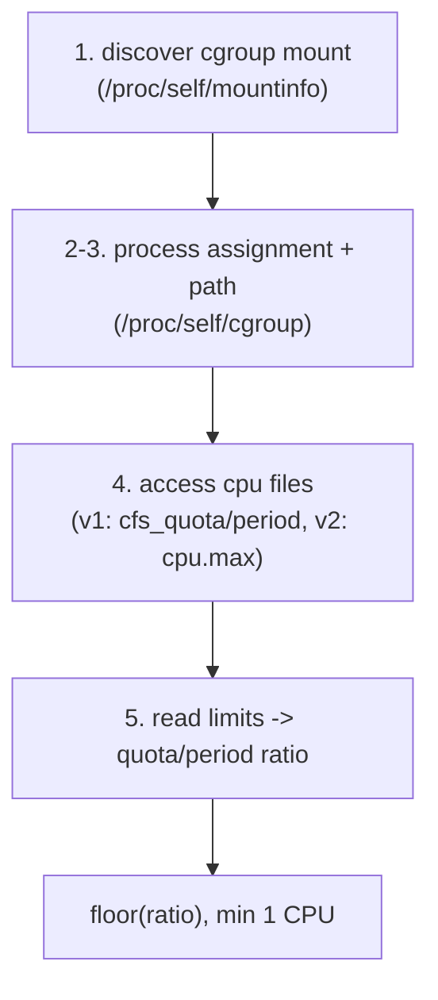

# Diagnostics & Process Support — Overview

This document covers each utility in detail.

## 1. `BackwardsTrace` — crash stack traces

`BackwardsTrace` (`backtrace.h`) captures and logs a symbolized stack trace. Despite the name,
it is built on **Abseil**'s debugging facilities (`absl::GetStackTrace`,
`absl::GetStackTraceWithContext`, `absl::Symbolize`), not the `backward-cpp` library.

### Capture and log

| Method | Purpose |
|--------|---------|
| `capture()` | Capture the current stack (skip 1 frame so `capture()` itself is excluded). |
| `captureFrom(context)` | Capture from a signal `ucontext_t` so the trace reflects the *faulting* context, not the handler. |
| `logTrace()` | Emit the trace at `critical` (or stderr), with version + ASLR address mapping. |
| `printTrace(os)` | Same, to an arbitrary stream. |
| `logFault(signame, addr)` | Log the caught signal name + faulting address before the trace. |

Storage is fixed-size: `MaxStackDepth = 64`, `void* stack_trace_[MaxStackDepth]`, and a 1024-byte
symbolization buffer on the stack — no heap allocation.

### Async-signal-safety

Crash handlers run in a constrained context where heap allocation and most libc calls are
unsafe. `BackwardsTrace` is careful:

- All buffers are stack/fixed-size.
- `addrMapping()` reads the first executable region from `/proc/self/maps` to record the ASLR
  base — but that file read is **pre-resolved at startup** via a function-local `static`, so it
  never happens inside a signal handler. The terminate handler calls
  `addrMapping(/*setup=*/true)` explicitly at startup.

### Integration with the crash path



The `BACKTRACE_LOG()` macro is the convenience one-shot: construct → `capture()` → `logTrace()`.
`logTrace()` prints `"use tools/stack_decode.py to get line numbers"` plus the `Address mapping:`
line, so raw frame addresses can be resolved offline with `addr2line`/`objdump` against the
unstripped binary even after the process is gone. (`ENVOY_BUG` / `RELEASE_ASSERT` and the QUIC
platform shim reuse this same machinery.)

## 2. `validateProtoDescriptors()` — descriptor pool check

```cpp
void validateProtoDescriptors();
```

At startup it asserts that the generated protobuf descriptor pool contains an allow-list of:

- **xDS gRPC methods** — ADS (`StreamAggregatedResources`, `DeltaAggregatedResources`), the
  `*DiscoveryService.{Fetch,Stream,Delta}*` families (CDS/EDS/LDS/RDS/HDS/runtime), and
  `RateLimitService.ShouldRateLimit`; and
- **config message types** — `Cluster`, `ClusterLoadAssignment`, `Listener`,
  `RouteConfiguration`, `VirtualHost`, the TLS `Secret`, `LbEndpoint`.

```cpp
for (const auto& method : methods) {
  RELEASE_ASSERT(generated_pool()->FindMethodByName(method) != nullptr,
                 absl::StrCat("Unable to find method descriptor for ", method));
}
```

**Why it matters:** descriptors register as a side effect of linking the generated `.pb.cc`
symbols (the `protobuf_link_hacks.h` include forces this). A binary built *without* a required
proto would silently lack the descriptor and fail later in obscure ways. This turns that into a
loud, early, fatal assertion. It's invoked from `ProcessWide`'s constructor, guarded by
`ENVOY_ENABLE_FULL_PROTOS`.

## 3. `createRegexEngine()` — the default regex engine

```cpp
Regex::EnginePtr createRegexEngine(const Bootstrap&, ValidationVisitor&, ServerFactoryContext&);
```

If `bootstrap.default_regex_engine` is set, it resolves the named `Regex::EngineFactory`,
translates the typed config, and calls `factory.createEngine(...)`. Otherwise it defaults to
Google RE2 (`Regex::GoogleReEngine`):

```cpp
if (bootstrap.has_default_regex_engine()) {
  auto& factory = Config::Utility::getAndCheckFactory<Regex::EngineFactory>(default_regex_engine);
  auto config = Config::Utility::translateAnyToFactoryConfig(...);
  regex_engine = factory.createEngine(*config, server_factory_context);
} else {
  regex_engine = std::make_shared<Regex::GoogleReEngine>();
}
```

It's created **early** in `InstanceImpl::initialize()` — before stats store init, because the
stats matcher config can contain regexes. The engine is owned by the server (`regex_engine_`)
and exposed via `ServerFactoryContext::regexEngine()`; the rest of Envoy gets it from the
factory context and calls `Regex::Utility::parseRegex(matcher, engine)`, so everyone shares one
configured engine. (The code comment about "inject to singleton" is aspirational — current code
threads it through the factory context rather than a free global.)

## 4. `CgroupCpuUtil` — container-aware CPU detection

The public entry point is `CgroupCpuUtil::getCpuLimit(fs)`, reached in production via the
`CgroupDetector` interface and `CgroupDetectorSingleton` (a `ThreadSafeSingleton`). It runs a
5-step pipeline; any failure returns `nullopt` ("no limit / unlimited"):



Details:

- **Mount discovery** prefers **cgroup v1 with a CPU controller** over v2.
- **v1** reads `cpu.cfs_quota_us` + `cpu.cfs_period_us`; `quota == -1` means unlimited.
- **v2** reads `cpu.max` (`"quota period"`); `quota == "max"` means unlimited.
- Content is validated (trailing newline enforced, matching Go's strictness) and mount paths are
  octal-unescaped.

This feeds `OptionsImplPlatform::getCpuCount()` on Linux, which takes
`min(hw_threads, affinity_count, cgroup_limit)` (gated by `ENVOY_CGROUP_CPU_DETECTION`, default
enabled). That's what makes Envoy's default worker concurrency respect container CPU limits —
see [`../options/OVERVIEW.md`](../options/OVERVIEW.md) §5.

## 5. `Server::Utility` — startup helpers

Three functions in the `Envoy::Server::Utility` namespace:

- `serverState(init_state, health_check_failed)` — maps init-manager state + health to the admin
  `ServerInfo::State` enum (`PRE_INITIALIZING` / `INITIALIZING` / `LIVE` / `DRAINING`). This is
  what `/server_info` reports.

```cpp
case Init::Manager::State::Initialized:
  return health_check_failed ? ServerInfo::DRAINING : ServerInfo::LIVE;
```

- `assertExclusiveLogFormatMethod(options, app_log_config)` — rejects setting *both* the
  `--log-format` CLI option and `ApplicationLogConfig.log_format` (returns `InvalidArgumentError`).
- `maybeSetApplicationLogFormat(app_log_config)` — applies the configured text format
  (`Logger::Registry::setLogFormat`) or JSON format (`Logger::Registry::setJsonLogFormat`).

(Note: tag-producer creation lives in `Stats::TagProducerImpl`, not here; the only
health-related logic here is the `DRAINING` branch of `serverState()`.)
