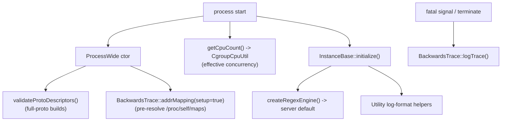

# Diagnostics & Process Support

> Documentation for the server-level diagnostics and process-support utilities.
> Source lives in `source/server/backtrace.{h,cc}`, `source/server/proto_descriptors.{h,cc}`,
> `source/server/regex_engine.{h,cc}`, `source/server/cgroup_cpu_util.{h,cc}`, and
> `source/server/utils.{h,cc}`.

These are the small, cross-cutting helpers that make the server **observable when it crashes**
and **correct when it starts**. They don't serve traffic — they make sure that if something goes
wrong you get a usable stack trace, that the binary was linked with the protos it needs, that the
default regex engine is set up, that worker concurrency respects container limits, and that
logging is configured consistently.

## The five utilities

| File | What it does |
|------|--------------|
| `backtrace.{h,cc}` | `BackwardsTrace` — capture and log a symbolized stack trace on crashes, fatal signals, and `std::terminate`, in an async-signal-safe way. |
| `proto_descriptors.{h,cc}` | `validateProtoDescriptors()` — startup assertion that required xDS gRPC methods and config message types are present in the protobuf descriptor pool. |
| `regex_engine.{h,cc}` | `createRegexEngine()` — build the process default regex engine (RE2 by default) from bootstrap config. |
| `cgroup_cpu_util.{h,cc}` | `CgroupCpuUtil` — read the CPU quota from cgroup v1/v2 so concurrency can honor container limits. |
| `utils.{h,cc}` | `Server::Utility` — server-state mapping for the admin endpoint, plus log-format validation/application. |

## When each runs

## Documentation map

| Document | Contents |
|----------|----------|
| `OVERVIEW.md` | Each utility in detail: the crash-trace machinery and async-signal-safety, the descriptor check, the regex-engine factory, the cgroup CPU detection pipeline, and the startup helpers. |
| `CLASS_HIERARCHY.md` | UML diagrams for `BackwardsTrace`, the cgroup detector, and the regex engine wiring. |

## One-paragraph mental model

At process start, `ProcessWide` runs `validateProtoDescriptors()` (so a mis-linked binary fails
loudly and early) and pre-resolves the binary's address mapping so the crash handler can
symbolize without doing signal-unsafe file I/O. Worker concurrency is computed by consulting
`CgroupCpuUtil`, which parses the cgroup CPU quota. During server init, `createRegexEngine()`
installs the default regex engine (RE2 unless overridden) and the `Server::Utility` helpers
validate and apply the configured log format. If the process later crashes, the fatal-signal
handler and the `std::terminate` handler both drive `BackwardsTrace` to emit a symbolized,
decodable stack trace.
