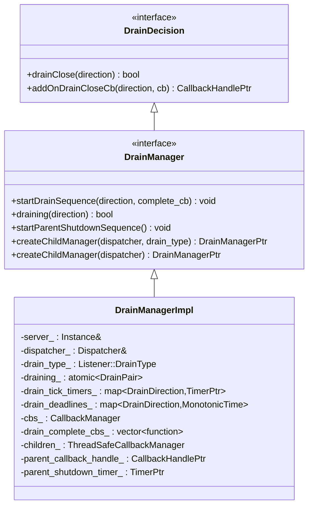
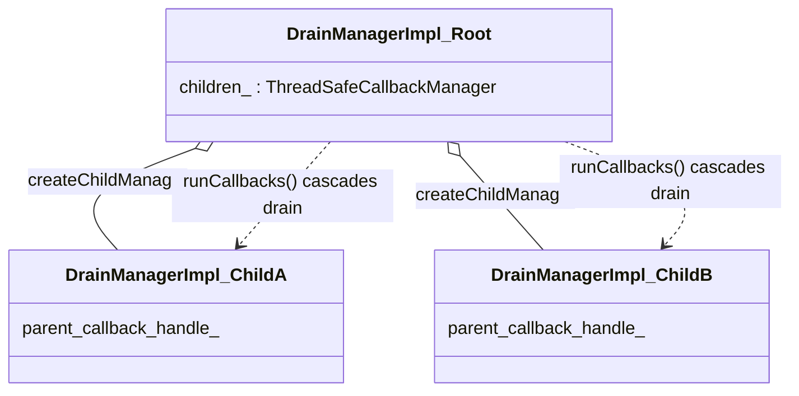
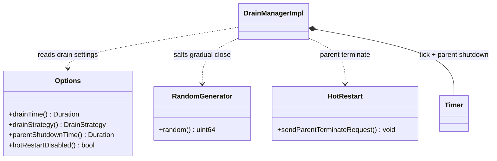
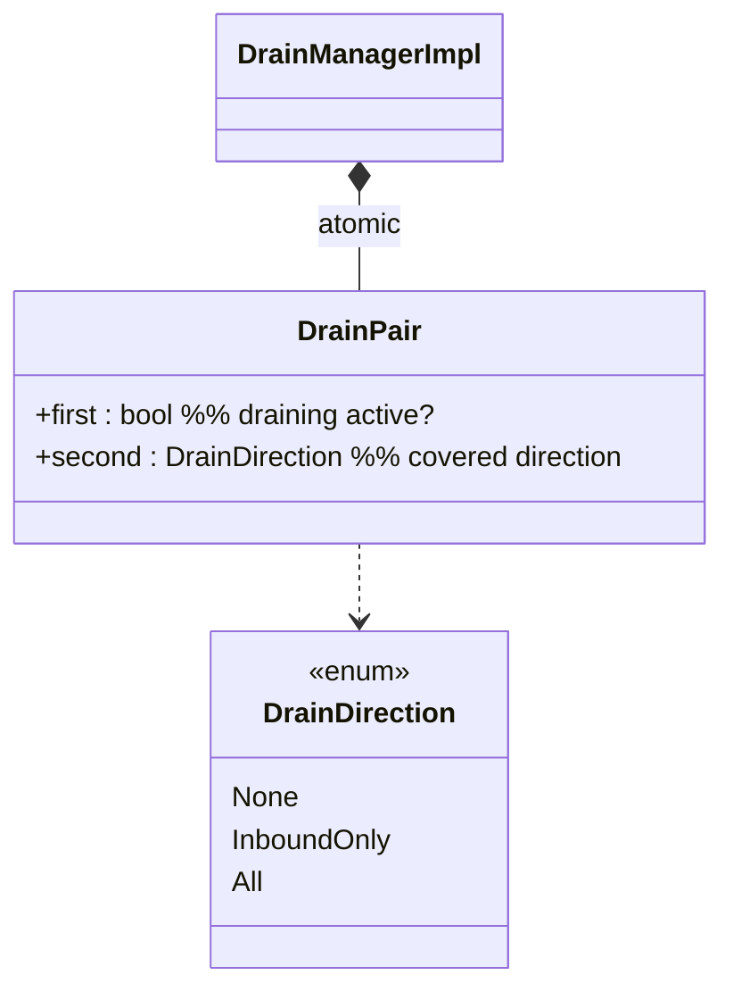

# Drain Manager — Class Hierarchy

UML-style class diagrams for the drain subsystem. Documentation aids, not exhaustive.

## 1. Interface and implementation

## 2. The drain tree

Each child registers a callback in the root's `children_` `ThreadSafeCallbackManager`; the
root's `startDrainSequence` invokes them all, starting each child's own drain sequence.

## 3. Key collaborators

## 4. `DrainPair` state

`drainClose(direction)` and `draining(direction)` both gate on `direction <= draining_.second`,
so the ordered enum encodes "is this traffic covered by the current drain?".
