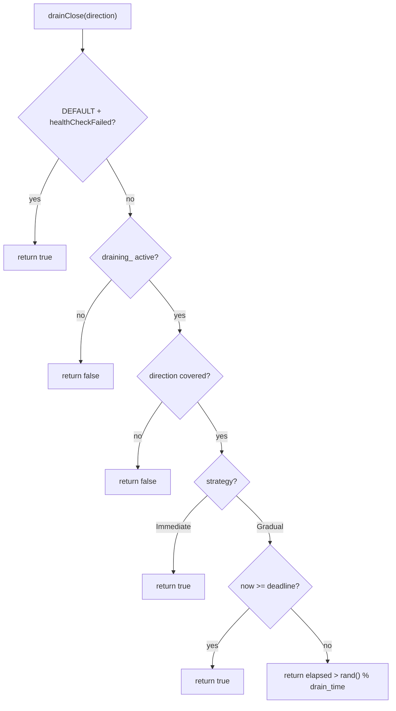
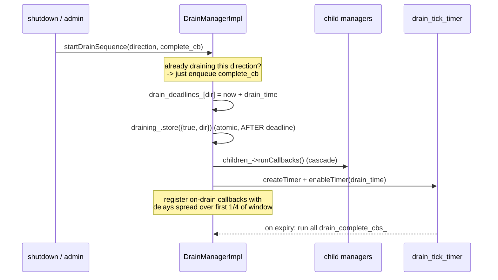

# Drain Manager — Overview

This document covers the `DrainManager` interface, the gradual-close probability, per-direction
draining, the child cascade, the drain and parent-shutdown sequences, and integration points.

## 1. The interface

`DrainManager` (`envoy/server/drain_manager.h`) extends `Network::DrainDecision`. The key
methods, as implemented by `DrainManagerImpl`:

| Method | Purpose |
|--------|---------|
| `drainClose(direction)` | Hot-path query: should this connection be closed now? |
| `addOnDrainCloseCb(direction, cb)` | Register a callback to be told to drain-close (with a delay). |
| `draining(direction)` | Is a drain in progress that covers this direction? |
| `startDrainSequence(direction, complete_cb)` | Begin draining; fire `complete_cb` at the end of the window. |
| `startParentShutdownSequence()` | (hot restart) arm the timer that terminates the parent. |
| `createChildManager(dispatcher[, drain_type])` | Create a listener-scoped child that follows this manager. |

State is held in a single atomic `draining_` pair `{bool active, DrainDirection direction}`, so
the worker hot path can read it without a lock.

## 2. Per-direction draining

Draining is scoped by `Network::DrainDirection` (`None` < `InboundOnly` < `All`). The manager
keeps **per-direction** deadlines and timers:

```cpp
std::map<Network::DrainDirection, Event::TimerPtr> drain_tick_timers_;
std::map<Network::DrainDirection, MonotonicTime> drain_deadlines_;
```

A `drainClose(direction)` only closes if the requested direction is **covered** by the active
drain: `direction <= draining_.second`. So an `InboundOnly` drain won't close `All`-scoped
traffic, but an `All` drain covers everything.

## 3. The gradual-close probability

This is the heart of graceful draining (`drainClose`):

```cpp
// Health-check failure short-circuits (for DEFAULT drain type).
if (drain_type_ == Listener::DEFAULT && server_.healthCheckFailed()) return true;

auto current = draining_.load();
if (!current.first) return false;                                  // not draining
if (direction == None || direction > current.second) return false; // not covered

if (drainStrategy() == Immediate) return true;                     // immediate: close now

// Gradual: P(close) = elapsed / drain_time
const auto now = timeSource().monotonicTime();
const auto deadline = drain_deadlines_[direction];
if (now >= deadline) return true;                                  // past the window

const auto remaining = duration_cast<seconds>(deadline - now);
const auto drain_time = drainTime();
if (drain_time.count() == 0) return true;
const auto elapsed = drain_time - remaining;
return uint64_t(elapsed.count()) > (randomGenerator().random() % drain_time.count());
```

So as `elapsed` grows toward `drain_time`, the chance of any given call returning `true`
approaches 1 — connections close at a smoothly increasing rate rather than all at once.



`addOnDrainCloseCb` is the push variant: instead of polling `drainClose`, a component registers
a callback that's invoked with a randomized delay spread across the remaining window (or zero
for immediate / past-deadline).

## 4. `startDrainSequence`



A subtle ordering rule (from issue #31457): the **deadline is written before** the atomic
`draining_` flag, because `drainClose` only reads the deadline when `draining_` is true and
C++ won't reorder a write past the atomic store. This avoids a read/write race between the main
thread (starting the drain from admin) and worker threads (calling `drainClose`).

The on-drain callbacks are intentionally spread across only the **first quarter** of the window
so draining is *initiated* early enough to leave time for graceful shutdowns.

## 5. The child cascade

`createChildManager` wires a child so the parent's drain start propagates:

```cpp
auto child_cb = children_->add(dispatcher, [this, child = child.get()] {
  if (!child->draining_.load().first) {
    child->startDrainSequence(this->draining_.load().second, [] {});
  }
});
child->parent_callback_handle_ = std::move(child_cb);
```

When the parent calls `startDrainSequence`, it runs `children_->runCallbacks()`, which kicks
each child into its own drain sequence (with the parent's direction). `children_` is a
`ThreadSafeCallbackManager`, so cascading is safe across the worker dispatchers the children
live on.

## 6. `startParentShutdownSequence`

In a hot-restart child, after the new process is up and draining its parent's listeners, it
arms the parent-terminate timer:

```cpp
void DrainManagerImpl::startParentShutdownSequence() {
  if (server_.options().hotRestartDisabled()) return;
  parent_shutdown_timer_ = server_.dispatcher().createTimer([this]() {
    ENVOY_LOG(info, "shutting down parent after drain");
    server_.hotRestart().sendParentTerminateRequest();
  });
  parent_shutdown_timer_->enableTimer(server_.options().parentShutdownTime());
}
```

This is the final step of a hot restart — see [`../hot_restart/protocol.md`](../hot_restart/protocol.md).

## 7. Integration points

| Trigger | Path |
|---------|------|
| `SIGTERM` / `shutdown()` | the server shutdown path starts the drain sequence |
| Hot restart (child up) | `startWorkers()` completion → `drain_manager_->startParentShutdownSequence()` |
| `/drain_listeners` admin | the listeners handler calls into the drain manager |
| Connection hot path | the HTTP connection manager consults `drainClose()` to decide GOAWAY / close |
| Health-check fail | `/healthcheck/fail` → `failHealthcheck(true)` → `drainClose` returns true for DEFAULT listeners |

## 8. Defaults recap

| Setting | Default | Flag |
|---------|---------|------|
| Drain time | 600 s (10 min) | `--drain-time-s` |
| Drain strategy | `Gradual` | `--drain-strategy` |
| Parent shutdown time | 900 s (15 min) | `--parent-shutdown-time-s` |
