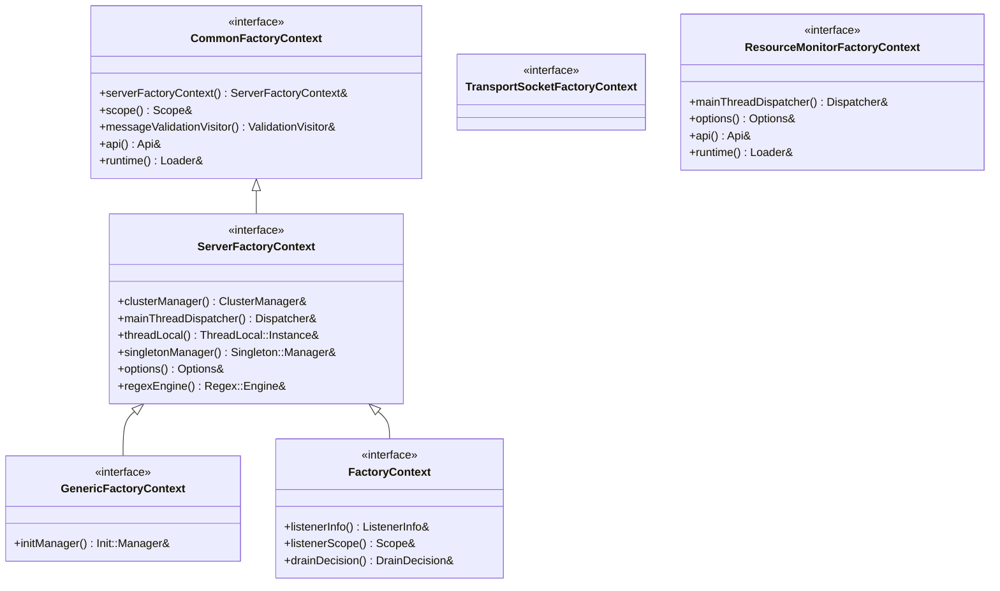
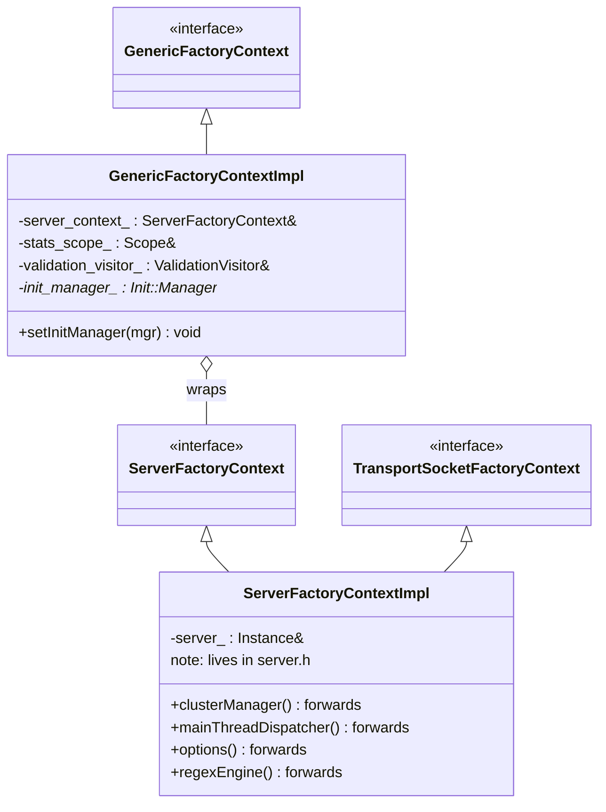
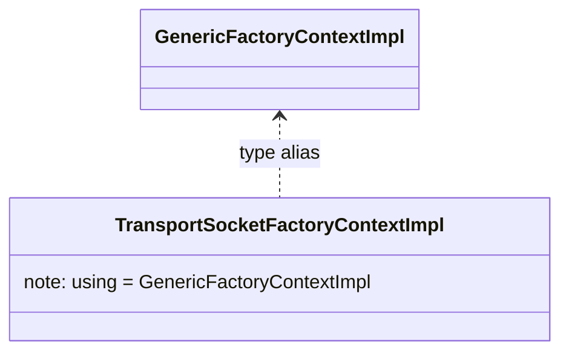
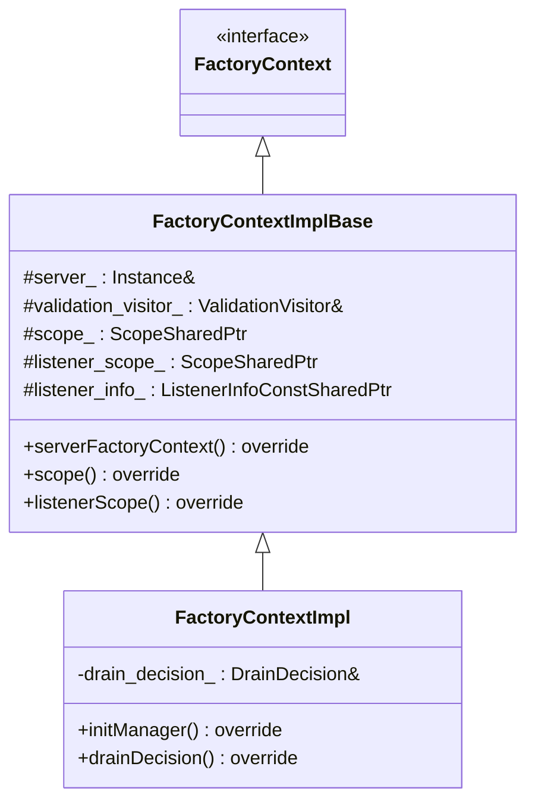
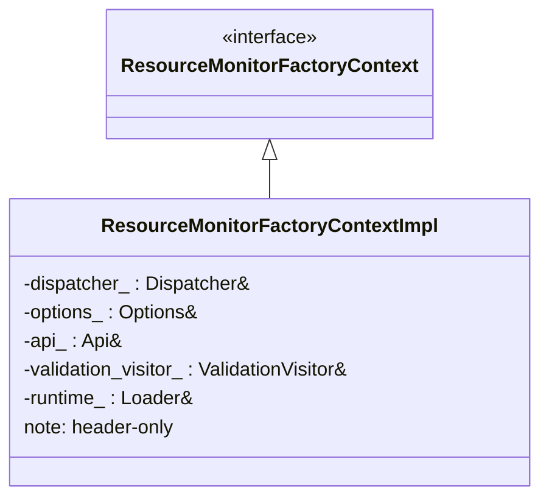
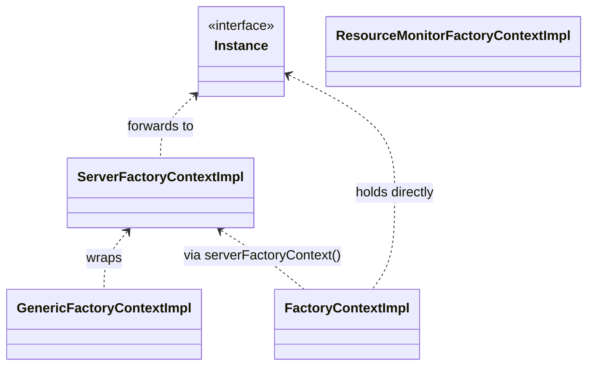

# Factory Context Layer — Class Hierarchy

UML-style class diagrams for the factory-context interfaces and implementations.
Documentation aids, not exhaustive.

## 1. Interfaces

## 2. The root adapter and generic wrapper

## 3. Transport socket context (alias)

## 4. Listener-scoped context

## 5. Resource monitor context

## 6. How they relate at runtime

Every implementation ultimately routes back to the single `ServerFactoryContextImpl` (and thus
the real `Server::Instance`), but each exposes only the slice of services its factory category
needs.
